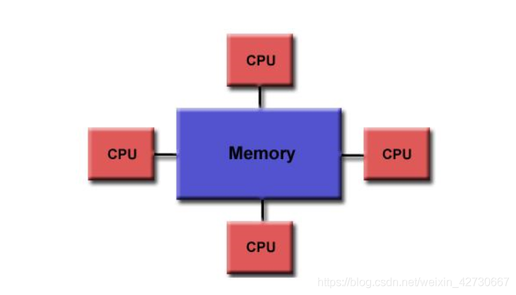
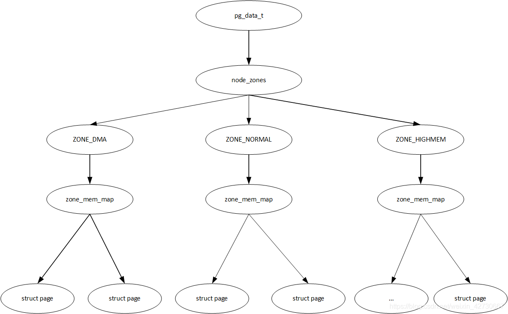

# 1. 内存模型

内存模型是从**处理器的角度**看到的**物理内存分布情况**, 内核管理不同内存模型的方式存在差异.

随着内核从32位到64位发展, 物理内存管理也不断进行技术更新, 按照历史演进共有FLATMEM、DISCONTIGMEM以及SPRARSEMEM模型. 关于三个物理内存模型社区文档有总体说明介绍: [memory-model](https://www.kernel.org/doc/html/latest/vm/memory-model.html)

(1)**平坦内存**(Flat Memory): 内存的物理地址空间是**连续**的, **没有空洞**.

(2)**不连续内存**(Discontiguous Memory): 内存的物理地址空间**存在空洞**, 这种模型可以高效地处理空洞.

(3)**稀疏内存**(Sparse Memory): 内存的物理地址空间**存在空洞**. 如果要**支持内存热插拔**, 只能选择稀疏内存模型.

什么情况会出现内存的物理地址空间存在空洞？系统包含**多块物理内存**, 两块内存的物理地址空间之间存在**空洞**. **一块内存**的物理地址空间也可能存在**空洞**, 可以查看处理器的参考手册获取分配给内存的物理地址空间.

如果内存的物理地址空间是连续的, 不连续内存模型会产生额外的开销, 降低性能, 所以平坦内存模型是更好的选择.

如果内存的物理地址空间存在空洞, 应该选择哪种内存模型？**平坦内存模型**会为**空洞**分配 **page 结构体**, 浪费内存；而**不连续内存模型**对空洞做了优化处理, 不会为空洞分配page结构体. 和平坦内存模型相比, 不连续内存模型是更好的选择.

linux 物理内存模型是内核源码中为数不多的能够保存三个模型源码代码的模块, 在使用过程中用户可以根据需要配置内核选择相应的模型, 目前SPRARSEMEM使用较多.

# 2. FLAT MEM

在理解内存管理模型中, 需要理解一些基本内存概念会在讲解过程中进行穿插讲解.

## 2.1. FLATMEM 模型

flat 中文意思就是水平、平坦的, 按照字面意思理解该模型即位平坦模型, 它是linux最早的模型管理, 一直在早期支撑了linux发展, 其他两种内存管理模型也是在该模型基础上进化, 所以要理解linux 内存管理, 必须要了解此模型, 包括很多概念比如 pfn, 页等都是在该模型概念基础上进行提出的.

flat物理模型其实质就是将整块物理内存划分到一个数组中进行管理, **整个物理内存**划分到**一个数组 mem_map 数组**中实现一个平滑管理.

划分 `mem_map` 数组过程中, 基于空间和效率来讲, 内核整个物理内存划分成一页即 page 为单位进行管理, `mem_map` 数组单位为 `struct page`, 物理内存管理的最小颗粒度即为页, 如下图所示:


上图中有一块物理内存, 物理地址空间为 `0x00000000 ~ 0xxxxxxxxx`, 内核按照页将整个物理内存进行划分, mem_map 为以 struct page 为单位的数组, 首地址指向物理内存的第一页地址.

>物理内存: 即CPU通过总线写入到物理内存的总线地址, 操作系统和程序员的视角是无法看到物理地址, 和我们通常malloc申请到的内存不一样, malloc内存申请的为一个虚拟地址即程序员和操作系统看到的地址 .
>
>由于物理内存管理是从32位系统开始的, 首先以32位系统讲解开始, 64位内存管理思路和32位差不多, 只是空间划分有区别
>
>flat模型在大多数版本中都存在, 为了方便分析该模型排除其他模型干扰, 选取了2.4.22内核源码为标准, 主要是《understanding the linux virtual memory manager》(中文《深入理解Linux虚拟内存管理》)这本书以该版本为主, 后续可以方便进行持续深入.

## 2.2. 层次划分

FLATMEM物理内存模型按照层次进行如下划分:


* `mem_map`: **整个物理内存**被按照页划分到mem_map全局数组中方便查找.
* `ZONE`: 将mem_map整个物理内存按照使用用途划分为ZONE_DMA,ZONE_NORMAL、ZONE_HIGHMEM三个区域
* `struct page`: page是物理内存管理的最小单位, 32位系统下大小位4K

整个内存按照上述三个划分层次进行管理.


# 3. DISCONTIG MEM

## 3.1. UMA VS NUMA

> 见前一节

DISCONTIGMEM 模型是在FLATMEM模型基础上进行了进一步技术演进, 主要是为了解决NUMA架构内存管理问题, 在上世纪末随着NUMA架构的推进, 越来越多的设备都采用了NUMA架构.

UMA架构:



`FLAT MEM` 物理内存就是针对此架构设计, 只需要将**所有物理内存**组织成一个 `mem_map` 数组即可.

NUMA架构:


由于NUMA架构中CPU访问自己的内存速率最快, 所以申请内存时优先从本地内存中申请, 本地内存不足时再从从其他CPU的内存中进行申请.

## 3.2. DISCONTIGMEM模型

了解物理内存模型要从技术演进整体来开, 为了解决什么问题而做出的改进. DISCONTIGMEM 在 FLATMEM 模型基础上引进了 `pg_data_t` 结构, 该结构位于 ZONE 结构之上, 主要是为了管理各个节点, 整体管理架构如下:



与FLATMEM相比以下显著变化:

* pg_data_t: 引入 pg_data 结构用于管理NUMA各个CPU内的本地内存.
* zone 区域划分: 每个CPU的节点内的物理内存都按照DMA、NRORMAL、HIGHMEM三个区域各自划分, 即每个节点内都有上述三个区域
* mem_map: 由于各个节点内都有自己的内存, mem_map的全局数组就演变成一个虚拟的数组, 各自ZONE区域内有自己的local mem map相当于将 mem_map 进行了更加细粒度的控制
* page: 物理内存函数按照页管理, 并没有变化

## 3.3. pg_data_t 结构

pg_data_t 结构实质上为一个单链表结构, 用于管理该CPU内的本地内存信息, 并用一个单向链接将其他节点的 pg_data_t 结构链接起来, 结构定义在linux 2.4.22版本中定义如下:

```cpp

typedef struct pglist_data {
	zone_t node_zones[MAX_NR_ZONES];
	zonelist_t node_zonelists[GFP_ZONEMASK+1];
	int nr_zones;
	struct page *node_mem_map;
	unsigned long *valid_addr_bitmap;
	struct bootmem_data *bdata;
	unsigned long node_start_paddr;
	unsigned long node_start_mapnr;
	unsigned long node_size;
	int node_id;
	struct pglist_data *node_next;
} pg_data_t;
```

该结构主要成员如下:

* node_zones: 该节点内的物理内存zone划分
* node_zonelists: 申请物理内存时从哪个zone区域获取到内存, 该数据通过zone区域的排布, 决定优先从哪个zone获取到内存
* nr_zones: 该节点的zone划分数目
* node_mem_map: 该节点的物理内存的第一个page即memp_map指向的第一个物理page.
* valid_addr_bitmap: 用于描述节点中空洞位图,只有在sparc和sparc64才有效.
* `struct bootmem_data *bdata`:  内存引导区分配的数据内存情况
* `unsigned long node_start_paddr`: 该节点物理内存开始地址
* `unsigned long node_start_mapnr`: 该节点物理内存在mem_map的偏移
* `node_size`: 该节点物理内存page数目
* `node_id`: 该节点id
* `struct pglist_data *node_next`: 指向下一个palist_data, 为一个单向链接结构

### 3.3.1. NUMA 和 UMA pg_data_t

UMA 可以认为是 NUMA 的一种特殊形式即只有一个节点, 这样 NUMA 和 UMA 很多代码处理能实现共用, 这也是 linux 设计原则之一, 尽量将相同的功能抽象成一种公共机制. UMA 的 pg_data_t 实际上就是一个 contig_page_data 结构, 可以查看 `mm/numa.c` 文件:

```cpp
static bootmem_data_t contig_bootmem_data;
pg_data_t contig_page_data = { bdata: &contig_bootmem_data };
```

代码初始化为:

```cpp
void __init free_area_init_node(int nid, pg_data_t *pgdat, struct page *pmap,
	unsigned long *zones_size, unsigned long zone_start_paddr,
	unsigned long *zholes_size)
{
	free_area_init_core(0, &contig_page_data, &mem_map, zones_size,
				zone_start_paddr, zholes_size, pmap);
}
```

即只初始化0号节点.

NUMA的初始化由于有多个节点:

```cpp
void __init free_area_init_node(int nid, pg_data_t *pgdat, struct page *pmap,
	unsigned long *zones_size, unsigned long zone_start_paddr,
	unsigned long *zholes_size)
{
	int i, size = 0;
	struct page *discard;

	if (mem_map == (mem_map_t *)NULL)
		mem_map = (mem_map_t *)PAGE_OFFSET;

	free_area_init_core(nid, pgdat, &discard, zones_size, zone_start_paddr,
					zholes_size, pmap);
	pgdat->node_id = nid;

	/*
	 * Get space for the valid bitmap.
	 */
	for (i = 0; i < MAX_NR_ZONES; i++)
		size += zones_size[i];
	size = LONG_ALIGN((size + 7) >> 3);
	pgdat->valid_addr_bitmap = (unsigned long *)alloc_bootmem_node(pgdat, size);
	memset(pgdat->valid_addr_bitmap, 0, size);
}
```

入参:

* nid: 所初始化的node id
* pgdat: 所初始化的pa_data_t
* struct page *pmap: 所初始化节点的mem_map,如果为0, 则说明是由本函数来申请相应的mem_map内存
* zone_size: 为该节点zone区域划分各个区域的zone大小
* zone_start_paddr: 该节点起始物理地址
* zholes:size: 该节点每个zone的空洞大小.

该函数为初始化一个节点的pg_data_t以及zone等物理内存管理信息, 关键点:

1. mem_map数组问题, 由于在NUMA的结构中物理节点间的内存不再连续, 所以mem_map实际上成为了一个以PAGE_OFFSET为起始地点的虚拟数组, 不在占用实际物理内存, 实际的mem_map数组被下发到zone中的mem_map中
2. 最终初始化调用的和UMA函数一样都是free_area_init_core初始化.
3. 用于计算valid_addr_bitmap.

## 3.4. pfn 与page相互转换

由于不同的节点由不同的物理内存, 所以在pfn与page相互转换的过程与UMA不同, 必须要查到该页所属的节点号, 根据节点内的mem_map查找到物理内存或者pfn:

由于不同的芯片架构其实现稍有不一样, 以x86-64说明两者之间的转换思路:

### 3.4.1. pfn_to_page

pfn_to_page 宏实现位于 `include\asm-x86_64\mmzone.h` 文件中:

```cpp
#define pfn_to_page(pfn)	virt_to_page(__va((unsigned long)(pfn) << PAGE_SHIFT))
```

上述该宏会调用 `virt_to_page()`, 首先要将传入的物理页帧号 pfn 转换成虚拟地址, 注意此时的页帧号是一个全局的概念即从 PAGE_OFFSET 开始的第几页即基于全局 mem_map, 转成成物理地址即 PAGE_OFFSET 的offset :(unsigned long)(pfn) << PAGE_SHIFT) 偏移即可:

```cpp
(unsigned long)(pfn) << PAGE_SHIFT)
```

`__va` 宏为将物理地址转换成虚拟地址加上PAGE_OFFSET基指即可:

```cpp
#define __va(x)            ((void *)((unsigned long)(x)+PAGE_OFFSET))
```

virt_to_page 宏实现如下:

```cpp
#define virt_to_page(kaddr) \
	({ struct page *lmemmap; \
	   unsigned long lpfn = paddr_to_local_pfn(__pa(kaddr),&lmemmap,0); \
	   lmemmap + lpfn;  })
```

传入的 kaddr 为 kernel 地址即虚拟地址, 需要查找到对应的 node 以及 node 中的 mem_map 还有在该 node 中的 lpfn(local page number 即在该node中的物理页帧号) , 最后根据 lmemap 和 lpfn 查找到真正的物理页

`__pa` 为将kernel的虚拟地址转换成物理地址, 定义如下:

```cpp
#define __pa(x)			(((unsigned long)(x)>=__START_KERNEL_map)?(unsigned long)(x) - (unsigned long)__START_KERNEL_map:(unsigned long)(x) - PAGE_OFFSET)
```

调用 `paddr_to_local_pfn` 根据物理地址查找到对应的 locl 帧号以及 local mem map:

```cpp
static inline unsigned long
paddr_to_local_pfn(unsigned long phys_addr, struct page **mem_map, int check)
{
	unsigned long nid;
	if (check) { /* we rely on gcc optimizing this way for most cases */
		unsigned long index = phys_addr >> memnode_shift;
		if (index >= NODEMAPSIZE || memnodemap[index] == 0xff) {
			*mem_map = NULL;
			return BAD_PAGE;
		}
		nid = memnodemap[index];
	} else {
		nid = phys_to_nid(phys_addr);
	}
	plat_pg_data_t *plat_pgdat = plat_node_data[nid];
	unsigned long pfn = phys_addr >> PAGE_SHIFT;
	VIRTUAL_BUG_ON(pfn >= plat_pgdat->end_pfn);
	VIRTUAL_BUG_ON(pfn < plat_pgdat->start_pfn);
	*mem_map = plat_pgdat->gendata.node_mem_map;
	return pfn - plat_pgdat->start_pfn;
}
```

首先调用 phys_to_nid 根据物理地址查找到相对应的 node id, 然后根据 node id 查找到 pg_data 以及该物理地址在该 node 节点中的 pfn:

```cpp
pfn - plat_pgdat->start_pfn //将全局pfn转成成 局部node内部 pfn
```

phys_to_nid 根据物理地址查找到对应的node id

```cpp

/* VALID_PAGE below hardcodes the same algorithm*/
static inline int phys_to_nid(unsigned long addr)
{
	int nid;
	VIRTUAL_BUG_ON((addr >> memnode_shift) >= NODEMAPSIZE);
	nid = memnodemap[addr >> memnode_shift];
	VIRTUAL_BUG_ON(nid > maxnode);
	return nid;
}
```

### 3.4.2. page_to_pfn

将物理页转成成 pfn:

```cpp
#define page_to_pfn(page)	({ \
	int nodeid = phys_to_nid(__pa(page));  \
	plat_pg_data_t *nd = PLAT_NODE_DATA(nodeid); \
	(page - nd->gendata.node_mem_map) + nd->start_pfn; \
})
```

首先将调用__pa转成成物理地址, 然后根据物理地址查找到对应的node id:

根据获取达到的node id 获取到相对应的节点pg_data_t信息, 先计算出该page在该节点的的页帧号, 最后计算出全局页帧号.

每个芯片架构具体实现稍有不同, 但是思路都是一样, 都需要查找到相对应的节点, 以及节点的pg_data信息才能进一步转换.

## 3.5. NODE_DATA

NODE_DATA 宏为根据node id获取到相应的节点pg_data_t, 不同架构稍有区别:

x86-64结构如下:

```cpp
/*
 * Return a pointer to the node data for node n.
 */
#define NODE_DATA(n)	(&((PLAT_NODE_DATA(n))->gendata))
```

`PLAT_NODE_DATA` 宏如下:

```cpp
#define PLAT_NODE_DATA(n)		(plat_node_data[(n)])
```

### 3.5.1. node_zonelists

node_zonelists 对节点内的几个 zone 分别进行了几种排列组合方式, 用于申请内存时使用哪种排列方式, 当对应的排列方式内第一个zone申请不到内存时就会按照当前使用的 zonelist 排列方式从下一个 zone中获取到内存.

zonelist_t 结构如下:

```cpp
typedef struct zonelist_struct {
	zone_t * zones [MAX_NR_ZONES+1]; // NULL delimited
} zonelist_t
```

build_zonelists()函数为初始化zonelist的排列方式, 每种排列方式内都能最大存储MAX_NR_ZONES+1 zone排列:

```cpp

/*
 * Builds allocation fallback zone lists.
 */
static inline void build_zonelists(pg_data_t *pgdat)
{
	int i, j, k;

	for (i = 0; i <= GFP_ZONEMASK; i++) {
		zonelist_t *zonelist;
		zone_t *zone;

		zonelist = pgdat->node_zonelists + i;
		memset(zonelist, 0, sizeof(*zonelist));

		j = 0;
		k = ZONE_NORMAL;
		if (i & __GFP_HIGHMEM)
			k = ZONE_HIGHMEM;
		if (i & __GFP_DMA)
			k = ZONE_DMA;

		switch (k) {
			default:
				BUG();
			/*
			 * fallthrough:
			 */
			case ZONE_HIGHMEM:
				zone = pgdat->node_zones + ZONE_HIGHMEM;
				if (zone->size) {
#ifndef CONFIG_HIGHMEM
					BUG();
#endif
					zonelist->zones[j++] = zone;
				}
			case ZONE_NORMAL:
				zone = pgdat->node_zones + ZONE_NORMAL;
				if (zone->size)
					zonelist->zones[j++] = zone;
			case ZONE_DMA:
				zone = pgdat->node_zones + ZONE_DMA;
				if (zone->size)
					zonelist->zones[j++] = zone;
		}
		zonelist->zones[j++] = NULL;
	}
}
```

分别遍历, 最多支持GFP_ZONEMASK种排列方式, 具体排列方式, 如下:

当将ZONE_NORMAL排列到最前面时, 排列方式NORMAL、DMA

当将ZONE_HIGHMEM排列到最前面时, 排列方式为HIGHME、NORMAL、DMA

当将ZONE_DMA排列到最前面时, 排列方式为DMA

排列最前面意味着申请物理内存时优先从该ZONE中获取到内存, 如果获取不到则从排列中的下一个获取.

### 3.5.2. zone size 计算

各个zone的大小计算不同架构不相同, 下面说明下默认的计算方式在paging_init() (`arch\sh\mm\init.c`):

```cpp
void __init paging_init(void)
{
	int i;
	pgd_t * pg_dir;

	/* We don't need kernel mapping as hardware support that. */
	pg_dir = swapper_pg_dir;

	for (i=0; i < PTRS_PER_PGD; i++)
		pgd_val(pg_dir[i]) = 0;

	/* Enable MMU */
	ctrl_outl(MMU_CONTROL_INIT, MMUCR);

	/* The manual suggests doing some nops after turning on the MMU */
	asm volatile("nop;nop;nop;nop;nop;nop;");

	mmu_context_cache = MMU_CONTEXT_FIRST_VERSION;
	set_asid(mmu_context_cache & MMU_CONTEXT_ASID_MASK);

 	{
		unsigned long zones_size[MAX_NR_ZONES] = {0, 0, 0};
		unsigned long max_dma, low, start_pfn;

		start_pfn = START_PFN;
		max_dma = virt_to_phys((char *)MAX_DMA_ADDRESS) >> PAGE_SHIFT;
		low = MAX_LOW_PFN;

		if (low < max_dma)
			zones_size[ZONE_DMA] = low - start_pfn;
		else {
			zones_size[ZONE_DMA] = max_dma - start_pfn;
			zones_size[ZONE_NORMAL] = low - max_dma;
		}
		free_area_init_node(0, NODE_DATA(0), 0, zones_size, __MEMORY_START, 0);
#ifdef CONFIG_DISCONTIGMEM
		zones_size[ZONE_DMA] = __MEMORY_SIZE_2ND >> PAGE_SHIFT;
		zones_size[ZONE_NORMAL] = 0;
		free_area_init_node(1, NODE_DATA(1), 0, zones_size, __MEMORY_START_2ND, 0);
#endif
 	}
}
```

UMA 架构中 zone 计算由 `zone_sizes_init` 函数得出:

```cpp
static void __init zone_sizes_init(void)
{
	unsigned long zones_size[MAX_NR_ZONES] = {0, 0, 0};
	unsigned int max_dma, high, low;

	max_dma = virt_to_phys((char *)MAX_DMA_ADDRESS) >> PAGE_SHIFT;
	low = max_low_pfn;
	high = highend_pfn;

	if (low < max_dma)
		zones_size[ZONE_DMA] = low;
	else {
		zones_size[ZONE_DMA] = max_dma;
		zones_size[ZONE_NORMAL] = low - max_dma;
#ifdef CONFIG_HIGHMEM
		zones_size[ZONE_HIGHMEM] = high - low;
#endif
	}
	free_area_init(zones_size);
}
```

# 4. SPARSE MEM

在内核 FLAT 和DISCONTIGMEM管理模型中, 其实一直都存在两个问题

* 管理物理内存的**数据结构本身**占用**内存**较多, 不适用于较大内存情况
* 无法解决空洞问题, 不管是 FLAT 还是 SPARCE 模型都**无法**解决**一个节点内的内存空洞问题**, **必须是一段连续空间**, 即 `mem_map` 数组就很大, 即使中间存在黑洞, mem_map 数组必须也得申请, 比较浪费空间

基于上述两个主要问题 linux 物理内存模型技术演进到 SPARCE 模型 本意是稀疏即不再是连续的, space 模式是从 `https://lwn.net/Articles/134804/` 开始引入到内核中, 下面说明了该模型的几个优势:

>
>Sparsemem abstracts the use of discontiguous mem_maps[].This kind of mem_map[] is needed by discontiguous memory machines (like in the old CONFIG_DISCONTIGMEM case) as well as memory hotplug systems.Sparsemem replaces DISCONTIGMEM when enabled, and it is hoped that it can eventually become a complete replacement. A significant advantage over DISCONTIGMEM is that it's completely separated from CONFIG_NUMA.  When producing this patch, it became apparent in that NUMA and DISCONTIG are often confused.
>
>Another advantage is that sparse doesn't require each NUMA node's ranges to be contiguous.  It can handle overlapping ranges between nodes with no problems, where DISCONTIGMEM currently throws away that memory.

如今大部分系统都是采用SPARCE模型但是如果不了解前两种模型那么对理解第三种模型意义就显得没有那么深入.

## 4.1. SPARSE模型

针对 **DISCONTIGMEM** 模型中**一个节点内的 mem_map 数组必须连续**的这一问题SPARSE 模型对技术提出了演进方案将 ZONE_MEM_MAP 这一个数组进一步划分颗粒度将内存划分为一段段SECTION以减少因为空洞带来的mem_map空间浪费在每个section内划分section mem map其管理框架大概如下:


物理内存按照实际情况被划分成一段段 section 进行管理每个 ZONE 下面有若干个section组成一个节点内的mem_map即不在是连续的只有存在实际物理内存时才会有相应的section以及section mem map同时继承了DISCONTIGMEM模型中全局mem_map为一个虚拟的数组一样SPARSE模型也有一个虚拟的全局数组为vmem_map整个全局section分布如下图(该图来源于 https://blog.csdn.net/bin_linux96/article/details/83343420 ) 所示:


### 4.1.1. mem_section管理

整个 mem_section 由一个全局 mem_section 进行管理所有的内存以方便后续进行转换:

```cpp
#ifdef CONFIG_SPARSEMEM_EXTREME
extern struct mem_section **mem_section;
#else
extern struct mem_section mem_section[NR_SECTION_ROOTS][SECTIONS_PER_ROOT];
#endif
```

section 为管理内存的一个基本单位所有 section 都归属于 mem_sectionmem_section 为一个二维数组第一维 index 为  NR_SECTION_ROOTS 二维 index 为 SECTIONS_PER_ROOT以便减少空间浪费. 一个64位系统中的一个虚拟地址被划分为 SECTION_ROOTS、SECTION_PER_ROOT、PFN 以及页偏移等以下为 arm 64位的地址划分方法(来自于 https://zhuanlan.zhihu.com/p/220068494)具体划分如下:


整个PFNP被划分位ROOT NUMBER、SECTIONS_PER_ROOT以及PFN_SECTION_SHIT(即对应的mem_section内的PFN) . 每位架构不相同其划分地址范围可能不同.

## 4.2. PAGE与PFN转换

SPARCE同样定义了PAGE与PFN宏如下:

```cpp
#define page_to_pfn __page_to_pfn
#define pfn_to_page __pfn_to_page
```

### 4.2.1. page_to_pfn(classic sparse方法)

将相应物理页转换成 pfn调用的时 `__page_to_pfn`:

```cpp
#define __page_to_pfn(pg)					\
({	const struct page *__pg = (pg);				\
	int __sec = page_to_section(__pg);			\
	(unsigned long)(__pg - __section_mem_map_addr(__nr_to_section(__sec)));	\
})
```

pg为指向section数组中的page 结构地址具体思路

* 首先调用 page_to_section 将物理页转换成section 查找要相应的section.
* 然后根据section获取到相应的section的第一个页的地址即对应的相应的mem_section的mem_map的首地址
* 最后根据page的地址减去section mem_map的地址求出pfn

#### 4.2.1.1. page_to_section(classic sparse方法)

page_to_section函数定如下:

```cpp
static inline unsigned long page_to_section(const struct page *page)
{
	return (page->flags >> SECTIONS_PGSHIFT) & SECTIONS_MASK;
}
```

可以看到section 可以同时存储到page flag中其page flags可以划分以下几个部分:


将SECTION、NODE等信息存储到flags中主要是为了节省struct page内存空间各个段 的大小以及位置有相应宏定义:

```cpp

#define SECTIONS_PGOFF		((sizeof(unsigned long)*8) - SECTIONS_WIDTH)
#define NODES_PGOFF		(SECTIONS_PGOFF - NODES_WIDTH)
#define ZONES_PGOFF		(NODES_PGOFF - ZONES_WIDTH)
#define LAST_CPUPID_PGOFF	(ZONES_PGOFF - LAST_CPUPID_WIDTH)
#define KASAN_TAG_PGOFF		(LAST_CPUPID_PGOFF - KASAN_TAG_WIDTH)

/*
 * Define the bit shifts to access each section.  For non-existent
 * sections we define the shift as 0; that plus a 0 mask ensures
 * the compiler will optimise away reference to them.
 */
#define SECTIONS_PGSHIFT	(SECTIONS_PGOFF * (SECTIONS_WIDTH != 0))
#define NODES_PGSHIFT		(NODES_PGOFF * (NODES_WIDTH != 0))
#define ZONES_PGSHIFT		(ZONES_PGOFF * (ZONES_WIDTH != 0))
#define LAST_CPUPID_PGSHIFT	(LAST_CPUPID_PGOFF * (LAST_CPUPID_WIDTH != 0))
#define KASAN_TAG_PGSHIFT	(KASAN_TAG_PGOFF * (KASAN_TAG_WIDTH != 0))

/* NODE:ZONE or SECTION:ZONE is used to ID a zone for the buddy allocator */
#ifdef NODE_NOT_IN_PAGE_FLAGS
#define ZONEID_SHIFT		(SECTIONS_SHIFT + ZONES_SHIFT)
#define ZONEID_PGOFF		((SECTIONS_PGOFF < ZONES_PGOFF)? \
						SECTIONS_PGOFF : ZONES_PGOFF)
#else
#define ZONEID_SHIFT		(NODES_SHIFT + ZONES_SHIFT)
#define ZONEID_PGOFF		((NODES_PGOFF < ZONES_PGOFF)? \
						NODES_PGOFF : ZONES_PGOFF)
#endif

#define ZONEID_PGSHIFT		(ZONEID_PGOFF * (ZONEID_SHIFT != 0))

#define ZONES_MASK		((1UL << ZONES_WIDTH) - 1)
#define NODES_MASK		((1UL << NODES_WIDTH) - 1)
#define SECTIONS_MASK		((1UL << SECTIONS_WIDTH) - 1)
#define LAST_CPUPID_MASK	((1UL << LAST_CPUPID_SHIFT) - 1)
#define KASAN_TAG_MASK		((1UL << KASAN_TAG_WIDTH) - 1)
#define ZONEID_MASK		((1UL << ZONEID_SHIFT) - 1)
```

#### 4.2.1.2. __nr_to_section

根据相应的 nr 从 mem_section 数组中查找到相应的 struct mem_section 结构:

```cpp
static inline struct mem_section *__nr_to_section(unsigned long nr)
{
#ifdef CONFIG_SPARSEMEM_EXTREME
	if (!mem_section)
		return NULL;
#endif
	if (!mem_section[SECTION_NR_TO_ROOT(nr)])
		return NULL;
	return &mem_section[SECTION_NR_TO_ROOT(nr)][nr & SECTION_ROOT_MASK];
}
```

此时从 page 中查到 section nr 是基于 mem_section 的一个全局索引需要将其转换成二维索引其nr划分如下:


#### 4.2.1.3. __section_mem_map_addr

获取到 mem_section 中的 section mem map:

```cpp
static inline struct page *__section_mem_map_addr(struct mem_section *section)
{
	unsigned long map = section->section_mem_map;
	map &= SECTION_MAP_MASK;
	return (struct page *)map;
}
```

其中section mem_map的基地为map将其基地返回

#### 4.2.1.4. 计算出pfn

最后根据根据 page 地址计算出在 mem map 中pfn:

```cpp
(__pg - __section_mem_map_addr(__nr_to_section(__sec)))
```

#### 4.2.1.5. 核心思路

根据 page 计算出 pfn 核心思路就是根据 page 中的 flag 获取到相对应的 section 然后根据 section 中的 mem_map 计算出该page的pfn.理解page中的 flag 划分 以及 nr 的划分非常重要.

注意 section_mem_map 里面包含一层转换使转换出的 pfn 为全局 pfn 而不是section mem_map 内的 pfn.

### 4.2.2. pfn_to_page

根据 pfn 查找到相应 page 实现思路和 `page_to_pfn` 相反根据 pfn 查找到相对应的 mem section 然后根据pfn获取到 mem secton 中的物理页

根据 pfn 查找到相应 page 实现思路和 `page_to_pfn` 相反根据pfn查找到相对应的 mem section 然后根据 pfn 获取到 mem secton 中的物理页

```cpp
#define __pfn_to_page(pfn)				\
({	unsigned long __pfn = (pfn);			\
	struct mem_section *__sec = __pfn_to_section(__pfn);	\
	__section_mem_map_addr(__sec) + __pfn;		\
})
```

#### 4.2.2.1. __pfn_to_section

`__pfn_to_section` 根据 pfn 查找到相对应的 section:

```cpp
static inline struct mem_section *__pfn_to_section(unsigned long pfn)
{
	return __nr_to_section(pfn_to_section_nr(pfn));
}
```

pfn_to_setion_nr 从 pfn 中获取到pfn整个划分如下:


#### 4.2.2.2. 获取到section_mem_map

```cpp
__section_mem_map_addr(__sec)
```

根据获取到的 mem_section 调用 `__section_mem_map_addr`

#### 4.2.2.3. 计算page

```cpp
__section_mem_map_addr(__sec) + __pfn
```

获取到 `section_mem_map` 然后根据 pfn 获取到物理页.

#### 4.2.2.4. 核心思路

需要了解pfn的划分以及 section_mem_map 的基地址在初始化已经转换为全局不需要先转成 section_mem 内的 index 再转成全局pfn只需要转成一次就可以

## 4.3. vmemmap(sparse vmemmap方法)

上述转换过程可以看出每次转换都需要先找到对应的 mem_section 然后找到对应的 section_mem_map 转换效率过低为了提高转换效率内核中使用 vmemmap虚拟 mem map 数组来提高效率相当于 DISCONTIGMEM 模型中的全局 mem_map 数组引入 vmemap 数组之后转换得到了很大提高之间查找数组偏移即可代码如下:

```cpp
#define __pfn_to_page(pfn)	(vmemmap + (pfn))
#define __page_to_pfn(page)	(unsigned long)((page) - vmemmap)
```

vmemmap 数组功能需要使用 `CONFIG_SPARSEMEM_VMEMMAP` 宏开启.

# 5. reference

物理内存模型之FLATMEM(1): https://zhikunhuo.blog.csdn.net/article/details/108549107

Linux内存管理：SPARSEMEM模型: https://zhuanlan.zhihu.com/p/220068494

