<!-- @import "[TOC]" {cmd="toc" depthFrom=1 depthTo=6 orderedList=false} -->

<!-- code_chunk_output -->

- [1. vmstat（虚拟内存统计）](#1-vmstat虚拟内存统计)
  - [1.1. CPU性能相关的选项](#11-cpu性能相关的选项)
  - [1.2. 用法示例](#12-用法示例)
- [2. top（2.0.x版本）](#2-top20x版本)
  - [2.1. CPU性能相关的选项](#21-cpu性能相关的选项)
  - [2.2. 用法示例](#22-用法示例)
- [3. top（3.x.x版本）](#3-top3xx版本)
  - [3.1. CPU性能相关的选项](#31-cpu性能相关的选项)
  - [3.2. 用法示例](#32-用法示例)
- [4. procinfo（从/proc文件系统显示信息）](#4-procinfo从proc文件系统显示信息)
  - [4.1. CPU性能相关的选项](#41-cpu性能相关的选项)
  - [4.2. 用法示例](#42-用法示例)
- [5. gnome-system-monitor](#5-gnome-system-monitor)
  - [5.1. CPU性能相关的选项](#51-cpu性能相关的选项)
  - [5.2. 用法示例](#52-用法示例)
- [6. mpstat（多处理器统计）](#6-mpstat多处理器统计)
  - [6.1. CPU性能相关的选项](#61-cpu性能相关的选项)
  - [6.2. 用法示例](#62-用法示例)
- [7. sar（系统活动报告）](#7-sar系统活动报告)
  - [7.1. CPU性能相关的选项](#71-cpu性能相关的选项)
  - [7.2. 用法示例](#72-用法示例)
- [8. oprofile](#8-oprofile)
  - [8.1. CPU性能相关的选项](#81-cpu性能相关的选项)
  - [8.2. 用法示例](#82-用法示例)

<!-- /code_chunk_output -->

# 1. vmstat（虚拟内存统计）

vmstat是指**虚拟内存统计**，这个名称表明它能告诉你系统的**虚拟内存性能信息**。

实际上远不止于此。

vmstat是一个很有用的命令，它能获取整个系统性能的粗略信息，包括：

* **正在运行**的**进程个数**。
* **CPU**的**使用情况**。
* CPU接收的**中断个数**。
* 调度器执行的**上下文切换次数**。

它是用于获取系统性能大致信息的极好工具。

## 1.1. CPU性能相关的选项

vmstat可以被如下命令行调用：

```
vmstat [-n] [-s] [delay [count]]
```

vmstat运行于两种模式：**采样模式**和**平均模式**。如果不指定参数，则vmstat统计运行于平均模式下，vmstat显示从系统启动以来所有统计数据的均值。但是，如果指定了延迟，那么第一个采样仍然是系统启动以来的均值，但之后vmstat按延迟秒数采样系统并显示统计数据。表2-1解释了vmstat的选项。

表2-1 vmstat命令行选项:



vmstat提供的各种统计输出信息，使你能跟踪系统性能的不同方面。表2-2解释了与CPU性能相关的输出。下一章说明与内存性能相关的输出。

表2-2 与CPU相关的vmstat输出:



vmstat提供了一个低开销的良好系统性能视图。由于所有的性能统计数据都以文本形式呈现，并打印到标准输出，因此，捕捉测试中生成的数据，以及之后对其进行处理和绘图就会很方便。由于vmstat的开销如此之低，因此当你需要一目了然地监控系统健康状况时，让它在控制台上或窗口中持续运行，甚至是在负载非常重的服务器上是很实用的。

## 1.2. 用法示例

如清单2.2所示，如果vmstat运行时没有使用命令行参数，显示的将是自系统启动后它记录下的统计信息的均值。根据“CPU使用率”列下面的us、sy、wa和id，本例显示出系统从启动开始，基本上处于空闲状态。从启动开始，CPU有5%的时间用于执行用户应用程序代码，1%的时间用于执行系统代码，而其余94%的时间处于空闲状态。

清单2.2:



尽管vmstat从系统启动时开始统计有助于确定系统的负载情况，但是，vmstat最有用的是运行于采样模式下，如清单2.3所示。在采样模式下，vmstat间隔delay参数指定的秒数输出系统统计数据，而采样次数由count给出。清单2.3第一行的统计数据和之前一样，是系统启动以来的均值，但之后就是定期采样。本例展示出系统的活动非常少。通过查看b列下面的0，我们可以知道在运行时没有阻塞进程。通过查看r列，我们还可以看到在vmstat采样数据时，正在运行的进程数量少于1。

清单2.3:



vmstat是一种记录系统在一定负载或测试条件下行为的好方法。可以用vmstat显示系统的行为，同时利用Linux的tee命令将结果输出到文件。（第8章详细描述了tee命令。）如果你只传递了参数delay, vmstat就会无限采样。在测试开始前启动vmstat，测试结束后终止vmstat。输出文件的形式可以是电子表格，并能够用于查看系统对负载和各种系统事件是如何反应的。清单2.4给出了按照这个方法得到的输出。在这个例子中，我们可以查看到系统发生的中断和上下文切换。在in列和cs列能分别查看到中断和上下文切换的总数。

上下文切换的数量小于中断的数量。调度器切换进程的次数少于定时器中断触发的次数。这很可能是因为系统基本上是空闲的，在定时器中断触发的大多数时候，调度器没有任何工作要做，因此它也不需要从空闲进程切换出去。

（注意：生成如下输出的vmstat版本有错误。它会导致系统输出的平均线显示不正确的数值。该错误已经报告给了vmstat的维护者，希望能尽快修复。）

清单2.4:



最新版本的vmstat甚至可以抽取各种系统统计数据更详细的信息，如清单2.5所示。

下一章讨论内存统计数据，但是，现在我们来查看CPU的统计信息。第一组数据，即“CPU ticks”，显示的是自系统启动的CPU时间，这里的“tick”是一个时间单位。虽然精简的vmstat输出仅显示四个CPU状态——us、sy、id和wa，这里则显示了全部CPU ticks的分布情况。此外，我们还可以看到中断和上下文切换的总数。一个新添加的内容是forks，它大体上表示的是从系统启动开始，已经创建的新进程的数量。

清单2.5:

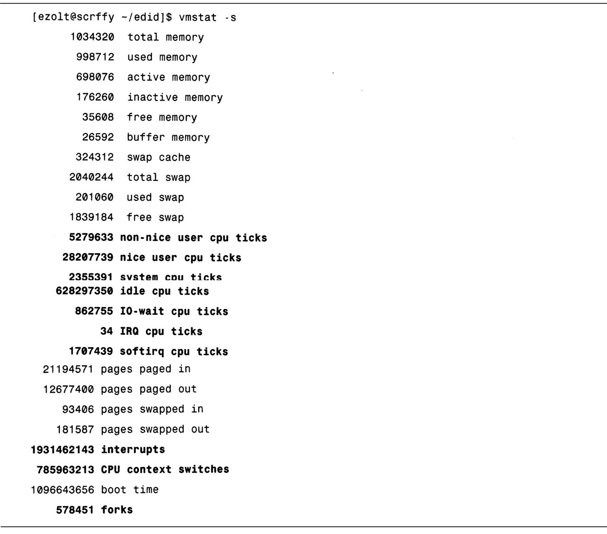

vmstat提供了关于Linux系统性能的众多信息。在调查系统问题时，它是核心工具之一。

# 2. top（2.0.x版本）

top是Linux系统监控工具中的瑞士军刀。它善于将相当多的系统整体性能信息放在一个屏幕上。显示内容还能以交互的方式进行改变，因此，在系统运行时，如果一个特定的问题不断突显，你可以修改top显示的信息。

默认情况下，top表现为一个将占用CPU最多的进程按降序排列的列表。这使得你能够迅速找出是哪个程序独占了CPU。top根据指定的延迟定期更新这个列表（其初始值为3秒）。

## 2.1. CPU性能相关的选项

top用如下命令行调用：

```
top [d delay] [C] [H] [i] [n iter] [b]
```

top实际上有两种模式的选项：命令行选项和运行时选项。命令行选项决定top如何显示其信息。表2-3给出的命令行选项会影响top显示的性能统计信息的类型和频率。

表2-3 top命令行选项:



在你运行top时，为了调查特定问题，你可能想要对你的观察略作调整。top输出的可定制性很高。表2-4给出的选项可以在top运行期间修改显示的统计信息：

表2-4 top运行时统计信息显示选项:



表2-5给出的选项打开或关闭各种系统级信息的显示。关闭不需要的统计信息有助于在屏幕上显示更多进程。

表2-5 top运行时输出切换选项:



表2-6对top支持的不同排序模式进行了说明。按内存消耗量排序尤其有用，它能找出哪个进程消耗了最多的内存。

表2-6 top输出排序/显示选项:



top除了提供特定进程的信息之外，还提供系统整体信息。表2-7给出了这些统计信息。

表2-7 top性能统计信息:

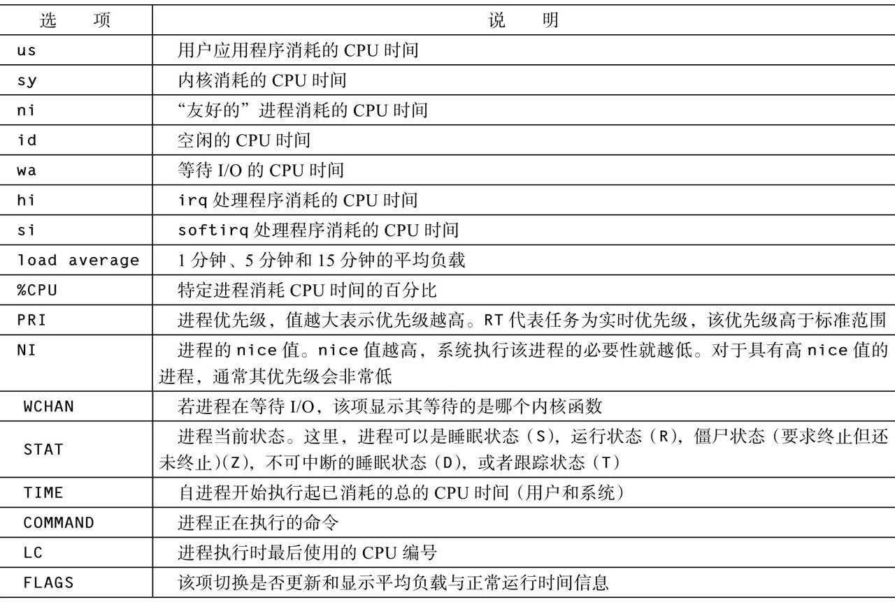

top提供了不同的正在运行进程的大量信息，是找出资源消耗大户的极好方法。

## 2.2. 用法示例

清单2.6是运行top的一个例子。当它启动后，将会周期性地更新屏幕直到退出。该例展示了top能生成的一些系统整体统计信息。首先。我们能看到1分钟、5分钟和15分钟的系统平均负载。可以看出，系统已经开始忙碌起来（因为doom-3.x86）。一个CPU在用户代码上花费了90%的时间。另一个则只在用户代码上花费了约13%的时间。最后，我们看到73个进程处于睡眠状态，只有3个进程正在运行。

清单2.6:


现在，在top运行时按下F键弹出配置界面，如清单2.7所示。当你按下代表键（A代表PID, B代表PPID，等等）时，top将切换这些统计信息在屏幕上的显示。选择好需要的全部统计信息后，按下Enter键返回top的初始界面，现在它显示的是选出的统计信息的当前值。在配置统计信息时，所有当前选择的字段将会以大写形式显示在Current Field Order行，并在其名称旁出现一个星号（\*）。

清单2.7:

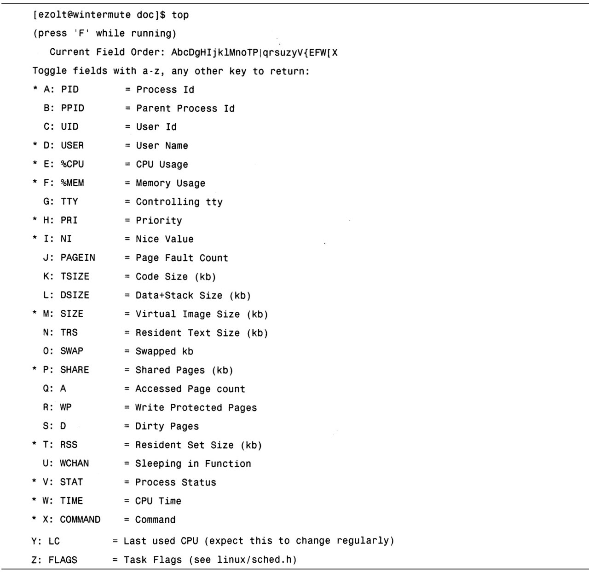

为了展示top的可定制性，清单2.8给出了一个高度配置的输出界面，其中只显示了与CPU使用率相关的top选项：

清单2.8:

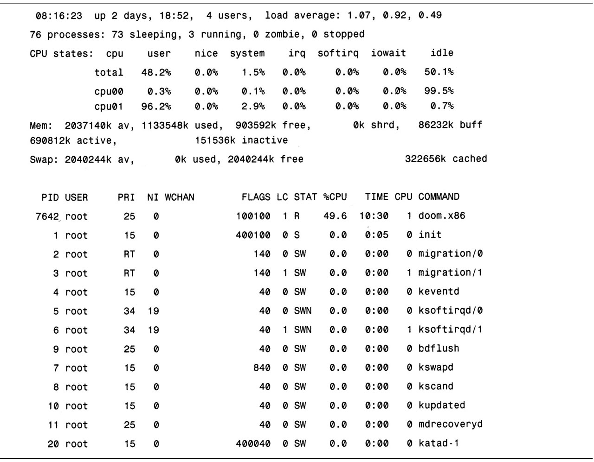

top提供了一个系统资源使用率的总览，其重点信息在于各种进程是如何消耗这些资源的。由于其输出格式对用户是友好的，而对工具是不友好的，因此最好是在与系统直接交互时使用。

# 3. top（3.x.x版本）

近来，最新版本中提供的top已经有了彻底的改变，其结果就是很多命令行和交互选项发生了变化。虽然基本思路是相似的，但对top进行了精简，并添加了几个不同的显示模式。
同样的，top呈现为一个降序列表，排在最前面的是最占用CPU的进程。

## 3.1. CPU性能相关的选项

用如下命令行调用top：

```
top [-d delay] [-n iter] [-i] [-b]
```

top实际有两种模式的选项：命令行选项和运行时选项。命令行选项决定top如何显示其信息。表2-8给出的命令行选项会影响top显示的性能统计信息的类型和频率。

表2-8 top命令行选项:



运行top时，为了调查特定问题，你可能想要对你的观察略作调整。和top 2.x版本一样，其输出的可定制性很高。表2-9给出的选项可以在top运行期间修改显示的统计信息。

表2-9 top运行时选项:



表2-10给出的选项打开或关闭各种系统级信息的显示。关闭不需要的统计信息有助于在屏幕上显示更多进程。

表2-10 top运行时输出切换选项:



与top v2.x相同，top v3.x除了提供特定进程的信息之外，还提供系统整体信息。表2-11给出了这些统计信息。

表2-11 top性能统计信息:

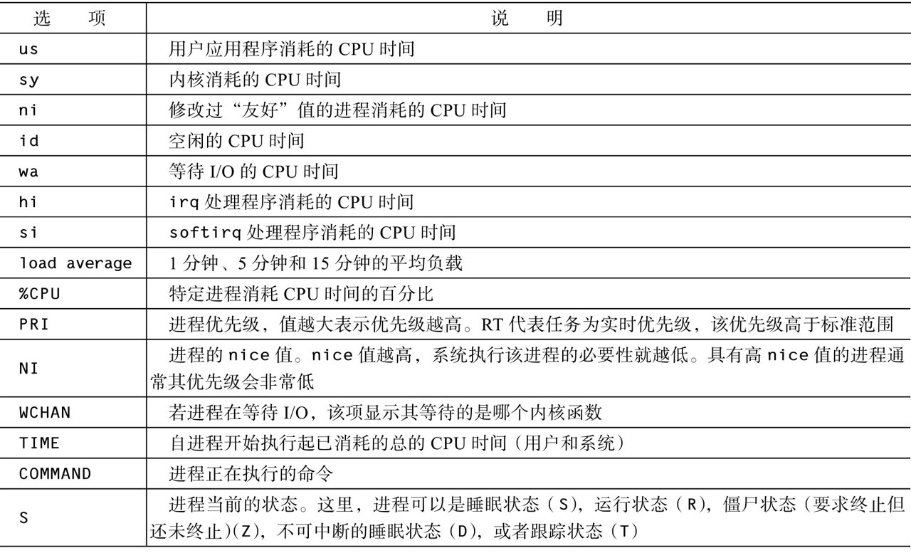

top提供了不同的正在运行进程的大量信息，是找出资源消耗大户的极好方法。top v.3版对top进行了精简，并增加了一些对相同数据的不同视图。

## 3.2. 用法示例

清单2.9是运行top v3.0的一个例子。同样的，它会周期性地更新屏幕直到退出。其统计信息与top v2.x相同，但名称略有改变。

清单2.9:




现在，在top运行时按下f键调出配置界面，如清单2.10所示。当你按下代表键（A代表PID, B代表PPID等）时，top将切换这些统计信息在屏幕上的显示。选择好需要的全部统计信息后，按下Enter键返回top的初始界面，现在它显示的是被选出的统计信息的当前值。在配置统计信息时，所有当前被选择的字段将会以大写形式显示在Current Field Order行，并在其名称旁出现一个星号（*）。请注意，大多数统计信息都是相同的，但名称略有变化。

清单2.10:



清单2.11展示了新的top输出模式，许多不同的统计信息进行了分类并显示在同一屏幕上。

清单2.11:



top v3.x为top提供了稍简洁的界面。它简化了top的某些方面，并提供了一个很好的“总结”信息屏，显示了系统中的许多资源消费者。

# 4. procinfo（从/proc文件系统显示信息）

就像vmstat一样，procinfo也为系统整体信息特性提供总览。尽管它提供的有些信息与vmstat相同，但它还会给出CPU从每个设备接收的中断数量。其输出格式的易读性比vmstat稍微强一点，但却会占用更多的屏幕空间。

## 4.1. CPU性能相关的选项

procinfo的调用命令行如下：

```
procinfo [-f] [-d] [-D] [-n sec] [-f file]
```

表2-12描述了不同的选项，用于修改procinfo显示样本的输出和频率。

表2-12 procinfo命令行选项:



表2-13给出了procinfo收集的CPU统计信息。

表2-13 procinfo CPU 统计信息:



与vmstat以及top一样，procinfo是一个低开销的命令，适合于让其自行在控制台或屏幕窗口运行。它能够很好地反映系统的健康和性能。

## 4.2. 用法示例

调用procinfo时不带任何命令选项将产生如清单2.12所示的输出。无参数，则procinfo仅显示一屏状态信息并退出。使用-n second选项让procinfo周期性地更新，其作用会更大。这能使你查看到系统性能的实时变化。

清单2.12:

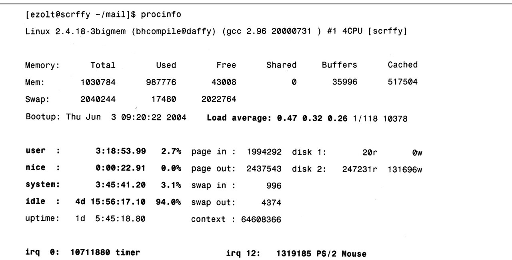



如同你在清单2.12中所见，procinfo为系统提供了不错的总览。从用户、nice、系统和空闲时间，我们再次发现，系统不是很忙。一个值得注意的有趣现象是，procinfo表明系统空闲时间比其运行时间（用uptime表示）还要多。这是因为系统实际上有4个CPU，因此，对于一天的墙钟时间而言，CPU时间已经过去了四天。平均负载证明系统近期相对没有多少工作。在过去的时间里，平均而言，系统准备运行的进程还不到一个；平均负载为0.47意味着单个进程准备运行的时间只有47%。对于有四个CPU的系统来说，将会浪费大量的CPU能力。

procinfo还给我们提供了很好的视图来说明系统中的哪个设备导致了中断。可以看到显卡（nvidia）、硬盘控制器（ide0）、以太网设备（eth0）以及声卡（es1371）的中断数量相对较高。这些情况一般出现在台式工作站上。

procinfo的优势是将许多系统级性能统计信息放在一个屏幕里，让你能了解系统整体执行情况。它缺乏网络和磁盘性能的详细信息，但能为CPU和内存性能的统计信息提供良好的细节。一个可能很重要的限制是，CPU处于iowait、irq或softirq模式时procinfo不会进行报告。

# 5. gnome-system-monitor

gnome-system-monitor在很多方面都可以说是top的图形化。它使你能以图形方式监控各个进程，并在显示图表的基础上观察系统负载。

## 5.1. CPU性能相关的选项

gnome-system-monitor可以从Gnome菜单调用。（Red Hat 9及其以上版本中，选择菜单System Tools→System Monitor。）不过，它也可以用如下命令调用：

```
gnome-system-monitor
```

gnome-system-monitor没有相关命令行选项来影响CPU性能测量。但是，有些显示的统计信息可以通过选择gnome-system-monitor的Edit→Preferences菜单项进行修改。

## 5.2. 用法示例

当你启动gnome-system-monitor时，它会创建与图2-1相似的窗口。该窗口显示了特定进程使用的CPU和内存总量信息。它还显示了进程之间父/子关系的信息。

图2-1

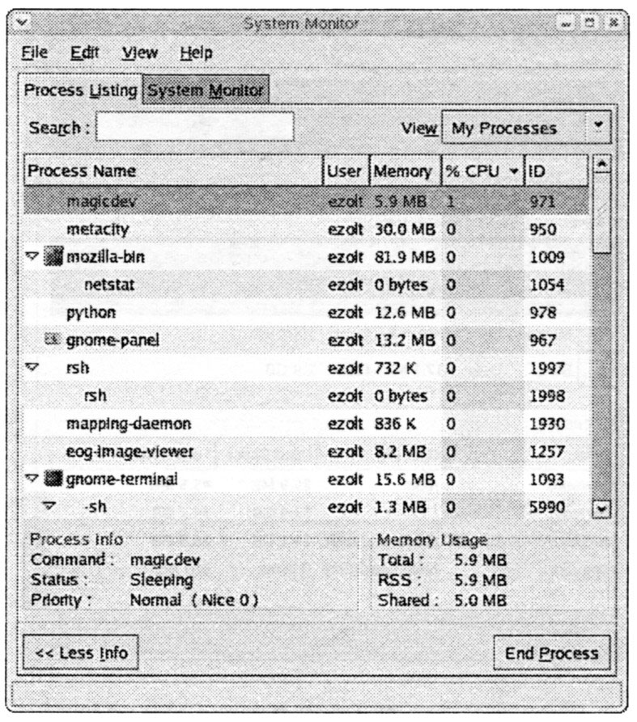

图2-2显示了系统负载和内存使用率的图形视图。从这一点可以真正区分gnome-system-monitor与top。你可以很容易地查看系统当前状态，以及与之前状态的对比。

图2-2


gnome-system-monitor提供的数据图形视图能够更容易更迅速地确定系统状态及其行为随时间的变化。它还能更轻松地浏览系统级进程信息。

# 6. mpstat（多处理器统计）

mpstat是一个相当简单的命令，向你展示随着时间变化的CPU行为。mpstat最大的优点是在统计信息的旁边显示时间，由此，你可以找出CPU使用率与时间的关系。
如果你有多个CPU或超线程CPU, mpstat还能够把CPU使用率按处理器进行区分，因此你可以发现与其他处理器相比，是否某个处理器做了更多的工作。你可以选择想要监控的单个处理器，也可以要求mpstat对所有的处理器都进行监控。

## 6.1. CPU性能相关的选项

mpstat可以用如下命令行调用：

```
mpstat [ -P { cpu | ALL } [ delay [count]] ]
```

和之前一样，delay指定了采样间隔，count指定了采样次数。表2-14解释了mpstat命令行选项的含义。

表2-14 mpstat命令行选项:



mpstat提供与其他CPU性能工具相似的信息，但是，它允许将信息按照特定系统中的单个处理器进行分类。表2-15给出了mpstat支持的选项。

表2-15 mpstat CPU统计信息:



mpstat是一种很好的工具，可以分类提供每个处理器的执行情况。由于mpstat给出了每个CPU的明细，因此你可以识别是否有哪个处理器正逐渐出现超负载情况。

## 6.2. 用法示例

首先，我们要求mpstat显示处理器编号为0的CPU的统计信息，如清单2.13所示。

清单2.13

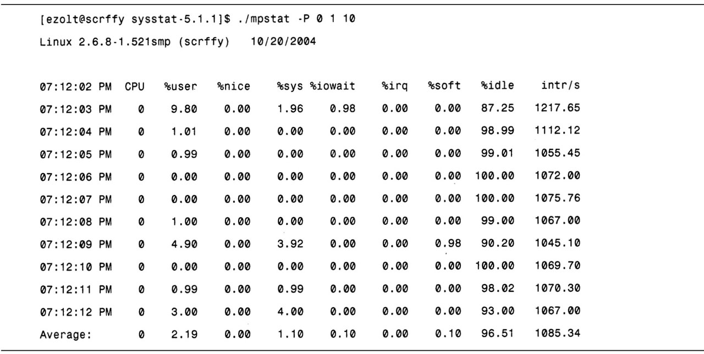

清单2.14显示了对典型无负载超线程CPU使用相同命令产生的结果。你可以看到所有显示出来的CPU统计数据。输出中有个有趣的现象，即其中一个CPU似乎处理了所有的中断。如果系统有很重的I/O负载，而全部中断又都是由一个处理器处理，那么这可能就是瓶颈，因为一个CPU超负荷，而其他CPU则在等待。如果一个CPU忙于处理所有的中断以至于没有空闲时间，而与此同时，其他处理器则处于空闲状态，那么你可以用mpstat发现这种情况。

清单2.14



mpstat可以用来确定CPU是否得到充分利用，以及使用情况是否相对均衡。通过观察每个CPU处理的中断数，有可能发现其中的不均衡。如何控制中断路由的详细信息参见`Documentation/IRQ-affinity.txt`下的内核源码。

# 7. sar（系统活动报告）

sar用另一种方法来收集系统数据。sar能有效地将收集到的系统性能数据记录到二进制文件，之后，可以重播这些文件。sar是一种低开销的、记录系统执行情况信息的方法。

sar命令可以用于记录性能信息，回放之前的记录信息，以及显示当前系统的实时信息。sar命令的输出可以进行格式化，使之易于导入数据库，或是输送给其他Linux命令进行处理。

## 7.1. CPU性能相关的选项

sar可以使用如下命令行调用：

```
sar [options] [ delay [count] ]
```

尽管sar的报告涉及Linux多个不同领域，其统计数据有两种不同的形式。一组统计数据是采样时的瞬时值。另一组则是自上一次采样后的变化值。表2-16解释了sar的命令行选项。

表2-16 sar命令行选项:

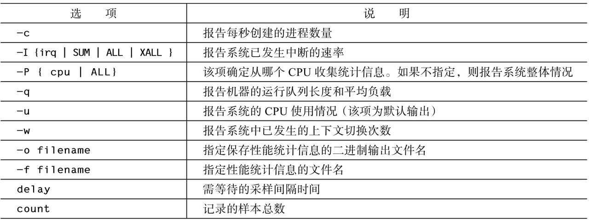

sar提供的系统级CPU性能统计数据集与我们在进程工具中看到的类似（名字不同）。如表2-17所示。

表2-17 sar CPU统计信息:

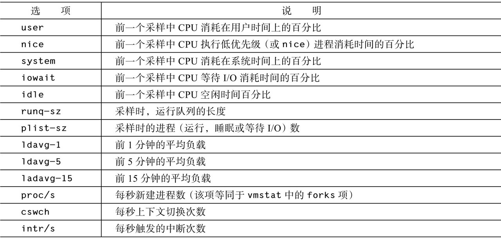

sar最显著的优势之一是，它使你能把不同类型时间戳系统数据保存到日志文件，以便日后检索和审查。当试图找出特定机器在特定时间出现故障的原因时，这个特性被证明是非常便利的。

## 7.2. 用法示例

清单2.15显示的第一个命令要求每秒有三个CPU采样，其结果保存到二进制文件/tmp/apache_test。该命令没有任何可视化输出，完成即返回。

清单2.15

```
sar -O /tmp/apache_test 1 3
```

信息保存到/tmp/apache_test文件后，我们就能以各种格式显示它。默认格式为人类可读，如清单2.16所示。该清单显示与其他系统监控命令类似的信息，我们可以看出处理器在特定时间是如何消耗其时间的。

清单2.16



不过，sar还可以将统计数据输出为一种能轻松导入关系数据库的格式，如清单2.17所示。这有助于保存大量的性能数据。一旦将其导入到关系数据库，就可以用所有的关系数据库工具对这些性能数据进行分析。

清单2.17



最后，sar还有一种易于被标准Linux工具，如awk, perl, python或grep，解析的统计数据输出格式。如清单2.18所示，这种输出可以被送入脚本，该脚本会引发有趣的事件，甚至有可能分析出数据的不同趋势。

清单2.18

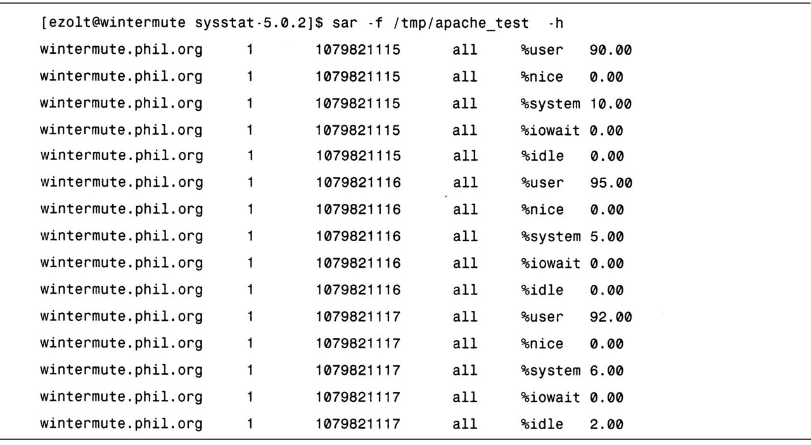

除了将信息记录到文件之外，sar还可以用于实时系统观察。在清单2.19所示的例子中，CPU状态被采样了三次，采样间隔时间为一秒。

清单2.19



默认显示的目的是展示CPU的信息，但是也可以显示其他信息。比如，sar可以显示每秒的上下文切换次数，以及交换的内存页面数。在清单2.20中，sar采样了两次信息，间隔时间为一秒。这次，我们要求sar显示每秒上下文切换的数量以及创建的进程数。我们还要求sar给出平均负载的信息。可以看出来，本例中的机器有163个进程在内存中，但都没有运行。过去的一分钟平均有1.12个进程等待运行。

清单2.20

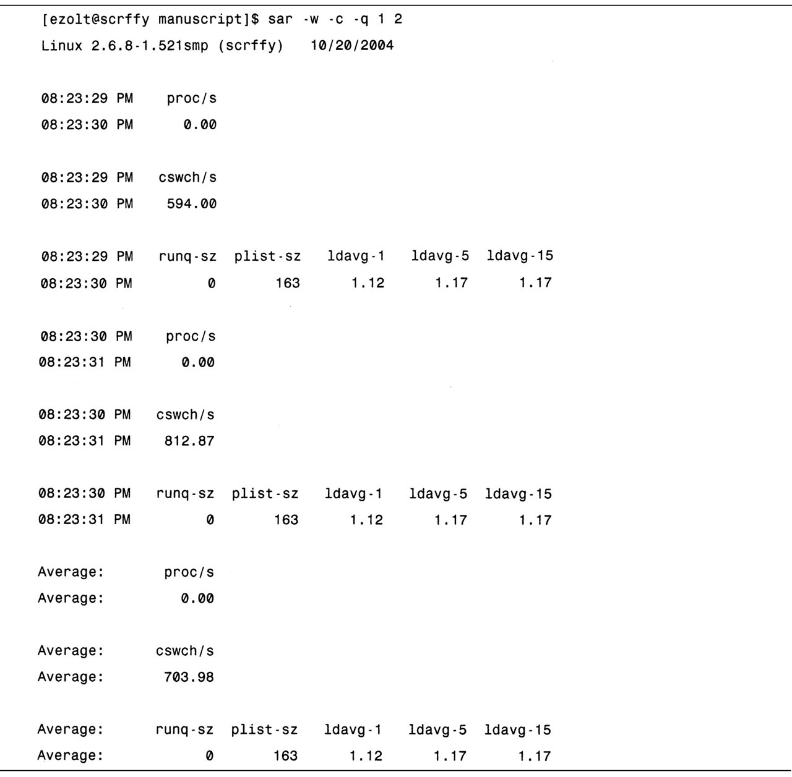

如你所见，sar是一个强大的工具，能够记录多种不同的性能统计信息。它提供了Linux友好界面，使你可以轻松地提取和分析性能数据。

# 8. oprofile

oprofile是性能工具包，它利用几乎所有现代处理器都有的性能计数器来跟踪系统整体以及单个进程中CPU时间的消耗情况。除了测量CPU周期消耗在哪里之外，oprofile还可以测量关于CPU执行的非常底层的信息。根据由底层处理器支持的事件，它可以测量的内容包括：cache缺失、分支预测错误和内存引用，以及浮点操作。

oprofile不会记录发生的每个事件，相反，它与处理器性能硬件一起工作，每count个事件采样一次，这里的count是一个数值，由用户在启动oprofile时指定。count的值越低，结果的准确度越高，而oprofile的开销越大。若count保持在一个合理的数值，那么，oprofile不仅运行开销非常低，并且还能以令人惊讶的准确性描述系统性能。

采样是非常强大的，但使用时要小心一些不明显的陷阱。首先，采样可能会显示你有90%的时间花在了一个特定的例程上，但它不会显示原因。一个特定例程消耗了大量周期有两种可能的原因。其一，该例程可能是瓶颈，其执行需要很多时间。但是，也可能例程的执行时间是合理的，而其被调用的次数非常高。通常有两种途径可以发现究竟是哪一种情况：通过查看采样找出特别热门的行，或是通过编写代码来计算例程被调用次数。

采样的第二个问题是你永远无法十分确定一个函数是从哪里被调用的。即使你已经搞明白它被调用了很多次，并且已经跟踪到了所有调用它的函数，但也不一定清楚其中哪个函数完成了绝大多数的调用。

## 8.1. CPU性能相关的选项

oprofile实际上是一组协同工作的组件，用于收集CPU性能统计信息。oprofile主要有三个部分：

* oprofile核心模块控制处理器并允许和禁止采样。
* oprofile后台模块收集采样，并将它们保存到磁盘。
* oprofile报告工具获取收集的采样，并向用户展示它们与在系统上运行的应用程序的关系。

oprofile工具包将驱动器和后台操作隐藏在opcontrol命令中。opcontrol命令用于选择处理器采样的事件并启动采样。

进行后台控制时，你可以使用如下命令行调用opcontrol：

```
opcontrol [--start] [--stop] [--dump]
```

此选项的控制（性能分析后台进程）使你能开始和停止采样，并将样本从守护进程的内存导入磁盘。采样时，oprofile后台模块将大量的采样保存在内部缓冲区。但是，它只能分析那些已经写入（或导入）磁盘的样本。写磁盘的开销可能会很大，因此，oprofile只会定期执行这个操作。其结果就是，运行测试并用oprofile分析后，可能不会马上得到结果，你需要等待，直到后台将缓冲区写入磁盘。当你想要立即开始分析时，这点是很让人挠头的，因此，opcontrol命令能让你禁止将采样从oprofile后台的内部缓冲区导入到磁盘。这将使你能在测试结束后，立刻开始性能调查。

表2-18介绍了opcontrol程序的选项，它们使你能控制后台操作。

表2-18 opcontrol后台控制:



默认情况下，oprofile按给定频率选择一个事件，这个频率对于你在运行的处理器和内核来说是合理的。但是，比起默认事件来，还有更多的事件可以监控。当你列出并选择了一个事件后，opcontrol将用如下命令行调用：

```
opcontrol [--list-events] [-event=:name:count:unitmask:kernel:user:]
```

事件说明使你可以选择采样哪个事件，该事件的采样频率，以及采样发生在内核空间、用户空间或同时在这两个空间。表2-19介绍了opcontrol的命令行选项，它们使你能选择不同的事件进行采样。

表2-19 opcontrol事件处理:



收集并保存样本后，oprofile提供另一种不同的工具opreport，该工具使你能查看已收集的样本。

opreport的调用命令行如下：

```
opcontrol [-r] [-t]
```

通常，opreport显示所有系统收集到的样本，以及哪些可执行程序引起的这些样本（包括内核）。样本数最多的可执行线程排在第一位，其后为所有有样本的可执行线程。在一个典型系统中，排在列表前面的是拥有大多数样本的少数可执行线程，而大量的可执行线程只贡献了数量很少的样本。针对这种情况，opreport允许你设置阈值，只有样本数量百分比达到或超过阈值的可执行线程才能显示。同时，opreport还可以将可执行线程的显示顺序倒过来，那些拥有最多样本数的将最后显示。这种方式下，最重要的数据显示在最后，那么它就不会滚过屏幕。

表2-20说明了opreport的命令行选项，它们使你能定制采样输出的格式。

表2-20 opreport报告格式



再次说明，oprofile是一个复杂的工具，给出的这些选项仅仅是oprofile的基础功能。在后续章节中，你将学习到oprofile更多的功能。

## 8.2. 用法示例

oprofile是非常强大的工具，但它的安装有点困难。附录B指导读者如何在几个主要的Linux发行版上安装和运行oprofile。

使用oprofile首先要按照分析对其进行设置。第一条命令如清单2.21所示，用opcontrol命令告诉oprofile工具包一个非压缩的内核映像在什么位置。oprofile需要知道这个文件的位置，以便它将样本分配给内核中的确切函数。

清单2.21



设置了当前内核的路径后，我们可以开始分析。清单2.22中的命令告诉oprofile用默认事件开始采样。这个事件根据处理器而变化，对当前处理器而言，这个事件是`CPU_CLK_UNHALTED`。只要处理器没有停止，该事件将会采样全部CPU周期。233869是指每233869个事件会采样处理器正在执行的指令。

清单2.22



现在已经开始采样后，我们想要分析采样结果。在清单2.23中，我们用报告工具来找出系统中发生了什么。opreport报告了目前为止分析的内容。

清单2.23



尽管分析已经进行了一小段时间，但当opreport表明它无法找到样本时，我们就会停止。发生这种情况的原因是：opreport命令在磁盘上查找样本，而oprofile后台程序则在内存中存储样本并定期将其转存到磁盘。当我们向opreport请求样本清单时，它无法在磁盘上找到，因此就会报告没有发现任何样本。为了缓解这一问题，我们可以通过在opcontrol中增加dump选项来强制后台程序立刻转存样本，如清单2.24所示，这条命令使我们能查看已收集的样本。

清单2.24

```
opcontrol --dump
```

将样本转存到磁盘后，我们再次尝试要求oprofile给出报告，如清单2.25所示。这一次，我们得到了结果。报告中包含了收集样本来源处理器的信息，以及其监控事件的类型信息。然后，报告按降序排列事件发生的数量，并列出它们发生在哪个可执行文件中。我们可以看到，Linux内核占据了全部时钟的50%, emacs为14%, libc为12%。可以深入挖掘可执行文件确定哪个函数占据了所有的时间，我们将在第4章讨论这个问题。

清单2.25

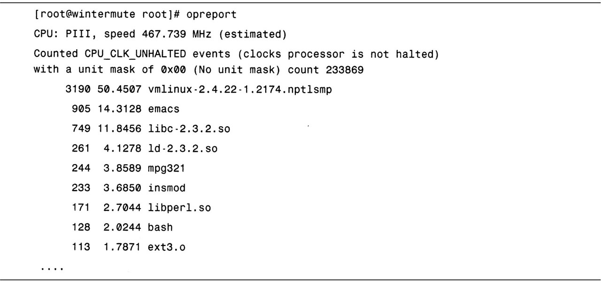

当我们启动oprofile时，我们只使用了opcontrol为我们选择的默认事件。每个处理器都有一个非常丰富的可以被监控的事件集。在清单2.26中，我们要求opcontrol列出特定CPU可以获得的全部事件。这个清单相当长，但在其中我们可以看到除了CPU_CLK_UNHALTED之外，还可以监控DATA_MEM_REFS和DCU_LINES_IN。这些是内存子系统导致的存储事件，我们将在后续章节中讨论它们。

清单2.26

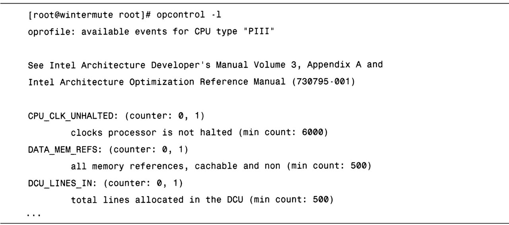

需要指明被监控事件的命令看上去有点麻烦，幸运的是，我们还可以利用oprofile的图形化命令oprof_start以图形方式启动和停止采样。这使得我们能以图形方式选择想要的事件，而没有必要搞清楚用准确的方式在命令行中明确说明想要监控的事件。

在图2-3所示的op_control例子中，我们告诉oprofile想要同时监控`DATA_MEM_REFS`和`L2_LD`事件。`DATA_MEM_REFS`事件可以告诉我们哪些应用程序使用了大量的内存子系统，哪些使用了L2 cache。具体到这个处理器，其硬件只有两个计数器可用于采样，因此能同时使用的也只有两个事件。

用oprofile的图形界面收集样本后，我们现在可以分析这些数据了。如清单2.27所示，我们要求opreport显示对其收集样本的分析，所用形式与监控周期时的类似。在本例中，我们可以发现libmad库占用了整个系统中数据内存访问的31%，成为内存子系统使用量最大的用户。

图2-3

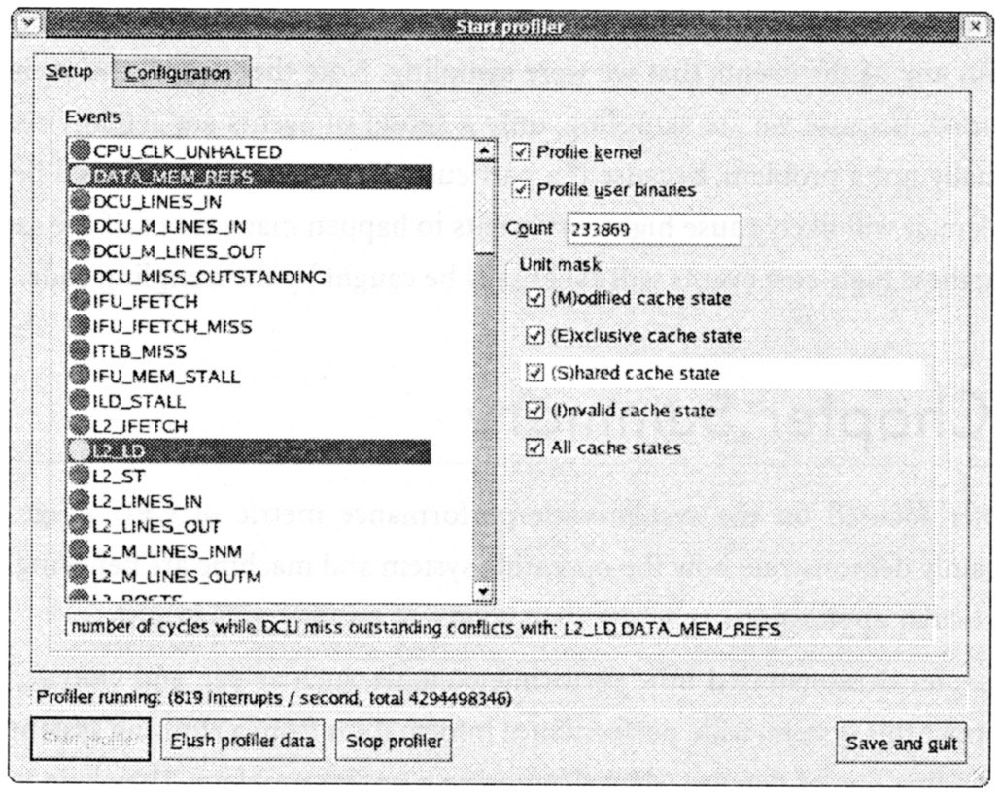

清单2.27



opreport提供的输出展示了包含任何被采样事件的所有系统库和可执行程序。请注意并非所有的事件都被记录下来，这是因为我们是在采样，实际上只会记录事件的子集。通常这不是问题，因为如果一个特定的库或可执行程序是性能问题，那么它很可能会导致高成本事件发生许多次。如果采样是随机的，这些高成本使事件最终也会被采样代码所捕获。