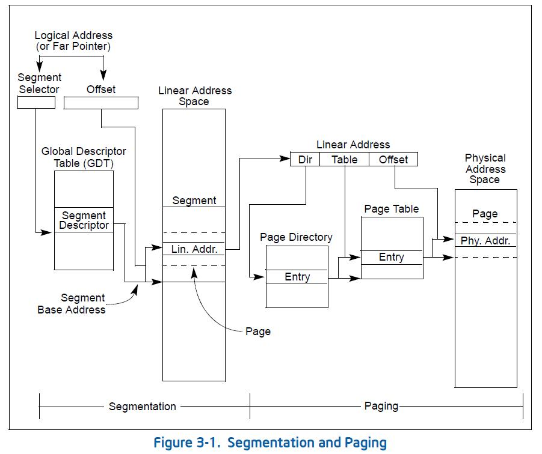
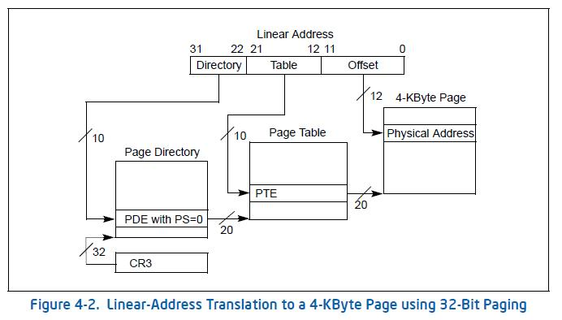
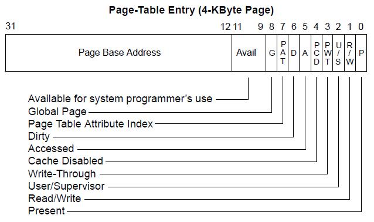

Linux是不使用段保护的, 使用的是页保护, 所以它还需要开启分页管理. 

分页说简单也简单, 就是**通过页全局目录找到页表接着通过页表找到页面**, 诸如此类的查找映射方式. 但是**Intel支持有4k、2M、4M等不同的内存页面大小**, 不同的页面大小其映射方式又各有差异, 所以又显得复杂. 复杂的东西, 以后再列举分析. 

简单起见, 下面的分析**基于x86 32位非PAE**进行分析. 前面已经了解了纯分段模式, 内存映射是通过段选择符及GDTR/LDTR查找到段描述符, 根据段描述符里的基地址加上偏移量即可得到映射后物理地址. 如果开启了分页管理, 那么段模式转换后的物理地址就不再是物理地址, 而是线性地址, 该线性地址需要对应到物理内存, 则需要经过分页映射. 所以说段页式映射, 页式映射是基于段映射基础上的, 也就是说不存在纯页式模式. 

下面是来自Intel手册的段页式映射的全景图: 



段映射就不多说了, 接下来看一下分页部分的工作: 



这是在x86 32位环境上使用4k页面大小的分页模式情况. 很明显可以看到**32bit的线性地址**被分成了三部分: **10bit、10bit、12bit**, 分别表示**页全局目录索引、页表索引、物理页面偏移**. 通过**cr3寄存器**查找到**页全局目录表**, 根据**页全局目录索引**查找到**页全局目录表项**, 继而**页表索引**结合**页全局目录表项**中记录的**页表基址**找到**页表项**, 最后**页表项记录的基址**加上**偏移量**就得到了线性地址转换后的物理地址. 

算一下, **32位系统(非PAE)环境**下, **4G内存**映射需要多大空间来存放**页表项**(**这是页表项！！！**): 

> (4G/4k)*4=(0x100000000/0x1000)*4=0x400000

**4G空间除以4k页面大小**(offset的12bit代表的空间)得到**页表项数**, 再乘以**每项页表4byte**(**32位地址大小**)的大小, 可以得到如果映射完了, 需要**4M大小的页表空间**. 

同样可以算出需要的**页全局目录空间**大小为: 

> (0x400000/4k)*4=0x1000

也就是一个页面**4k的空间大小**. 

**映射4G内存**(**！！！**)可以有下面的关系表: 


试着分析一下, 如果需要开启页映射模式, 需要做点什么？预计: 

1、 建立**页全局目录**和**页表及物理内存的关联关系**；

2、 **设置CR3寄存器**. 

那么接下来看一下相关的代码实现, **开启页式映射模式**的主要实现代码在: **/arch/x86/kernel/head_32.s**, 代码约700多行, 扣除注释后, 实际代码就更少了. 不过它做了不少工作, 粗略分析了一下其工作有: **构建了栈空间**、**建立页映射目录**、**开启分页功能**、**初始化中断描述符表**、**启动86虚拟机**、**初始化0号进程**等. 这里主要关注linux内核如何开启分页映射模式. 那就走一下偏门吧, 根据Intel手册可以知道, 分页映射模式的开关是由**CR0寄存器的PG位**控制的. 那就搜索一下CR0寄存器设置的地方. 

可以很快地搜索到head_32.s中共有三处设置了CR0. 

首先看第一处(317行): 

```
#/arch/x86/kernel/head_32.s

default_entry:
#define CR0_STATE (X86_CR0_PE | X86_CR0_MP | X86_CR0_ET | \
             X86_CR0_NE | X86_CR0_WP | X86_CR0_AM | \
             X86_CR0_PG)
    movl $(CR0_STATE & ~X86_CR0_PG),%eax
    movl %eax,%cr0
 
/*
 * We want to start out with EFLAGS unambiguously cleared. Some BIOSes leave
 * bits like NT set. This would confuse the debugger if this code is traced. So
 * initialize them properly now before switching to protected mode. That means
 * DF in particular (even though we have cleared it earlier after copying the
 * command line) because GCC expects it.
 */
    pushl $0
    popfl
```

可以看到CR0的值来自eax, 而eax的值则为$(CR0\_STATE & \~X86\_CR0\_PG), 很明显这里把CR0的PG位给过滤之后设置给CR0, PG位未置位, 这里不是开启分页模式的地方. 那么我们看看这里做了什么？是否是分页模式的某个关键点？根据代码分析, CR0\_STATE的值为0x80050033, 而这里把PG位给去掉了, 则为0x00050033二进制也就是00000000000001010000000000110011,对应到手册中CR0的位图介绍: 


可以看到被置位的功能位为: AM、WP、NE、ET、MP、PE. 其中PE还是在分段模式开启时已经启用了的. 根据手册介绍, 粗略总结了一下: 

AM——对齐功能屏蔽；

WP——写保护；

NE——数字错误标志位；

ET——扩展类型, 用于数学协处理器指令；

MP——协处理器监视标志位；

貌似和分页没什么关系. 

接着往下看第二处设置CR0的地方: 

```
#/arch/x86/kernel/head_32.s

enable_paging:
 
/*
 * Enable paging
 */
    movl $pa(initial_page_table), %eax
    movl %eax,%cr3 /* set the page table pointer.. */
    movl $CR0_STATE,%eax
    movl %eax,%cr0 /* ..and set paging (PG) bit */
    ljmp $__BOOT_CS,$1f /* Clear prefetch and normalize %eip */
```

这里开启了分页模式. 貌似错过了页全局目录和页表及物理内存的关联关系的建立了. 那就逆推吧, 就在上面的代码片段里面, 在设置CR0前, 设置了CR3, 而CR3是存放页全局目录的地址的. 那么毫无疑问的initial\_page\_table就是页全局目录. 也不绕弯了, 直接看一下页全局目录和页表的实现: 

```
#/arch/x86/kernel/head_32.s

page_pde_offset = (__PAGE_OFFSET >> 20);
 
    movl $pa(__brk_base), %edi
    movl $pa(initial_page_table), %edx
    movl $PTE_IDENT_ATTR, %eax
10:
    leal PDE_IDENT_ATTR(%edi),%ecx /* Create PDE entry */
    movl %ecx,(%edx) /* Store identity PDE entry */
    movl %ecx,page_pde_offset(%edx) /* Store kernel PDE entry */
    addl $4,%edx
    movl $1024, %ecx
11:
    stosl
    addl $0x1000,%eax
    loop 11b
    /*
     * End condition: we must map up to the end + MAPPING_BEYOND_END.
     */
    movl $pa(_end) + MAPPING_BEYOND_END + PTE_IDENT_ATTR, %ebp
    cmpl %ebp,%eax
    jb 10b
    addl $__PAGE_OFFSET, %edi
    movl %edi, pa(_brk_end)
    shrl $12, %eax
    movl %eax, pa(max_pfn_mapped)
 
    /* Do early initialization of the fixmap area */
    movl $pa(initial_pg_fixmap)+PDE_IDENT_ATTR,%eax
    movl %eax,pa(initial_page_table+0xffc)
```

首先看到的是: 

```
movl $pa(__brk_base), %edi

movl $pa(initial_page_table), %edx

movl $PTE_IDENT_ATTR, %eax
```

这是将edi、edx、eax进行设置, 紧接着: 

```
leal PDE_IDENT_ATTR(%edi),%ecx      /* Create PDE entry */

movl %ecx,(%edx)                        /* Store identity PDE entry */
```

结合数据定义: 

```
#/arch/x86/include/asm/pgtable_types.h

#define PTE_IDENT_ATTR 0x003 /* PRESENT+RW */
#define PDE_IDENT_ATTR 0x067 /* PRESENT+RW+USER+DIRTY+ACCESSED */
#define PGD_IDENT_ATTR 0x001 /* PRESENT (no other attributes) */
```

可以看到将\_\_brk\_base+3作为页全局目录项存入到initial\_page\_table里面. 为什么要加上3？分析一下页全局目录项的格式: 


3的二进制: 11, 正好对应R/W位和P位, 表示当前页全局目录项可读写且有效,很明显加上3的用意在此. 而\_\_brk\_base就是页表了. 继续往下看:

```
movl %ecx,page_pde_offset(%edx)     /* Store kernel PDE entry */
```

这里表示将同样的页全局目录项存放到了edx偏移page\_pde\_offset, 即\_\_PAGE\_OFFSET>>20. 而\_\_PAGE\_OFFSET为: 

```
#/arch/x86/include/asm/page_32_types.h

/*
 * This handles the memory map.
 *
 * A __PAGE_OFFSET of 0xC0000000 means that the kernel has
 * a virtual address space of one gigabyte, which limits the
 * amount of physical memory you can use to about 950MB.
 *
 * If you want more physical memory than this then see the CONFIG_HIGHMEM4G
 * and CONFIG_HIGHMEM64G options in the kernel configuration.
 */
#define __PAGE_OFFSET _AC(CONFIG_PAGE_OFFSET, UL)
```

它取决于CONFIG\_PAGE\_OFFSET的配置, 方便起见, 这里就以默认的\_\_PAGE\_OFFSET为0xC0000000来分析. 那么\_\_PAGE\_OFFSET>>20也就是0xC00. 这是哪一项呢？0xC00/4即为768项. 也就是说页全局目录项中, 第0项和第768项是指向了相同的页表, 意味着映射到了相同的物理内存上面. 为什么这么做呢？页全局目录项768项的16进制为0x300, 如果左移22位, 转换为虚拟地址的头则为0xC0000000, 这很明显是页式映射后内核空间的虚拟地址起始. 那么可以知道这里的目的就是使得当前内核空间0xC0000000和0x00000000映射的是同一块物理内存, 主要是为了此次临时分页映射方便访问数据. 

这也是根据Intel手册里面开启分页模式的要求.

接下来的指令是: 

```
addl $4,%edx
```

edx加上4, 也就是往后偏移了4字节, 这里是为了下一个页全局目录表项的写入做准备. 

接下来的指令是: 

```
movl $1024, %ecx

11:

stosl

addl $0x1000,%eax

loop 11b
```
先把1024赋值给ecx, 这里是为了给loop指令做准备的, 表示循环次数, 循环1024次. stosl指令的作用是将eax中的值保存到es: edi指向的地址, 然后edi自加4. stosl完了之后, eax自加0x1000, 然后loop回到stosl重复刚才的eax存储到内存的操作. 回顾前面, 首先edi是指向\_\_brk\_base的, 这是页表, 页表存储的是物理页面的基址和属性. 那么很明显eax就是页表项的内容了, 页表的第一项存储的是eax的初始值PTE\_IDENT\_ATTR, 也就是0x003, 对比下面的页表项内容格式, 也如其注释上面写的开启了RW和PRESENT属性, 而基址值就是0了. 往后加上的0x1000, 恰好就是4k物理页面的大小, 表示接着映射下一片物理页面. 



刚才的loop循环完了, 大概映射的物理内存空间为1024*0x1000, 也就是4M的内存空间, eax也就是指向0x 400000, 再接着往下看: 

```
movl $pa(_end) + MAPPING_BEYOND_END + PTE_IDENT_ATTR, %ebp

cmpl %ebp,%eax

jb 10b
```

然后上面就是将“$pa(\_end) + MAPPING\_BEYOND\_END + PTE\_IDENT\_ATTR”的计算结果和eax比较, 如果eax小于该值将会跳转回去重复执行标签10的代码指令. 除掉PTE\_IDENT\_ATTR是页表项的属性, 到这里可以看到这次内存映射的范围是从0开始一直到\_end符号往后偏移MAPPING\_BEYOND\_END的物理内存(其实不一定, 当其物理内存映射到最后不足一页时, 将会新增一页页表再映射, 确保该范围的内存都能够映射覆盖. ). 

很明显, 这里没有按照e820图来映射的, 肯定是一个临时映射, 映射内存大小是如何的呢？看一下页全局目录的大小: 

```
#/arch/x86/kernel/head_32.s

ENTRY(initial_page_table)
    .fill 1024,4,0
```

这里表示按照4byte大小, 以0为数据, 填充1024项, 也就是initial\_page\_table有4k空间, 内容为0. 前面已经算过了, 很明显页全局目录空间是足够用来映射4G的空间的. 

那么接下来看看页表空间, 页表空间是自\_\_brk\_base开始的空间. \_\_brk\_base这个符号来自/arch/x86/kernel/vmlinux.lds.s: 

```
#/arch/x86/kernel/vmlinux.lds.s

    .brk : AT(ADDR(.brk) - LOAD_OFFSET) {
        __brk_base = .;
        . += 64 * 1024; /* 64k alignment slop space */
        *(.brk_reservation) /* areas brk users have reserved */
        __brk_limit = .;
    }
 
    _end = .;
```

这里截取了代码片段, 如何理解这段代码呢, 可以看一下ld手册. 这里粗略分析一下, \_\_brk\_base后面跟随的+= 64 * 1024表示预留了64k的空间, 紧接着是brk的保留空间, 这个空间来自类似RESERVE\_BRK(pagetables, INIT\_MAP\_SIZE)定义所保留的, 最后就是符号\_end. 那么可以知道从\_\_brk\_base到\_end是明显大于64k的. 64k的页表可以映射64M的物理内存, 也就是说最终可映射的内存是超过64M的. \_end符号标志的是内核映像的结束位置, 而内核映像通常都是几M的大小, 所以可以确定是完全够的. 那么此次映射物理内存的空间大小很明显不取决于页表的空间限制了. 

于是乎就回到刚才的“$pa(\_end) + MAPPING\_BEYOND\_END + PTE\_IDENT\_ATTR”, 此次映射物理内存的空间大小就止于\_end符号往后偏移MAPPING\_BEYOND\_END的位置了. 算一下MAPPING\_BEYOND\_END的大小: 

```
LOWMEM_PAGES = (((1<<32) - __PAGE_OFFSET) >> PAGE_SHIFT)

——>((1<<32)-0xC0000000)>>12 = 0x40000

#define PAGE_TABLE_SIZE(pages) ((pages) / PTRS_PER_PGD)

——>0x40000/1024 = 0x100

MAPPING_BEYOND_END = PAGE_TABLE_SIZE(LOWMEM_PAGES) << PAGE_SHIFT

——>0x100<<12 = 0x100000
```

可以看到这里是表示新增256k的物理内存映射. 那么初次映射物理内存空间大小主要取决于内核映像的大小. 按理来说其实映射到\_end也足够了, 为什么会多映射256k呢？这是预留给后来建立内存映射页表用的, 毕竟e820图还没排上用场, 而且从\_\_brk\_base到_end这段内存在内核建立物理内存直接映射的时候是不够用的. 

至此, 可以知道页全局目录在哪里、页表在哪里、映射的内存大小等信息, 而且它们已经建立完毕. 


那么看一下剩下的那部分汇编: 

```
addl $__PAGE_OFFSET, %edi

movl %edi, pa(_brk_end)
```

这是为了将页表的边界值的虚拟地址存入到\_brk\_end里面. 

```
shrl $12, %eax

movl %eax, pa(max_pfn_mapped)
```

而这里把最大映射的页框数量写入max\_pfn\_mapped变量中. 

```
/* Do early initialization of the fixmap area */

movl $pa(initial_pg_fixmap)+PDE_IDENT_ATTR,%eax

movl %eax,pa(initial_page_table+0xffc)
```

最后把pgd中的最后一个页全局目录项设置成固定内存映射项. 

这些是做什么的呢？暂时这里不分析, 这都是为了后续全局内存初始化使用做准备的. 那么最后随着刚才查看到的CR0的设置, 分页模式开启. 

其实Linux在初始化过程中, 从开启分段模式后, 并不是立刻开启分页管理的, 而是等到内核decompress_kernel执行之后, 也就是将内核解压后. 否则也没法知道内核的符号位置. 

回到前面在head_32.s查找到的CR0设置的情况, CR0总共设置3次, 那么第2次是开启分页模式的, 那最后1次设置又做了什么呢？

```
movl $0x50022,%ecx # set AM, WP, NE and MP
movl %cr0,%eax
andl $0x80000011,%eax # Save PG,PE,ET
orl %ecx,%eax
movl %eax,%cr0
 
lgdt early_gdt_descr
lidt idt_descr
```

这里很明显看到是更新了一下CR0, 重新定位了gdt和idt表位置. CR0此次被设置为0x50022|0x80000011=0x80050033. 对比分页时, CR0设置的值(X86\_CR0\_PE|X86\_CR0\_MP|X86\_CR0\_ET|X86\_CR0\_NE|X86\_CR0\_WP|X86\_CR0\_AM|X86\_CR0\_PG), 其也是0x80050033. 这里应该是为了将后面使用的CPU环境设置正确而已. 与分页映射无关. 
    
其实开启分页模式的整个流程也是根据Intel手册里描述进入保护模式的流程来实现的