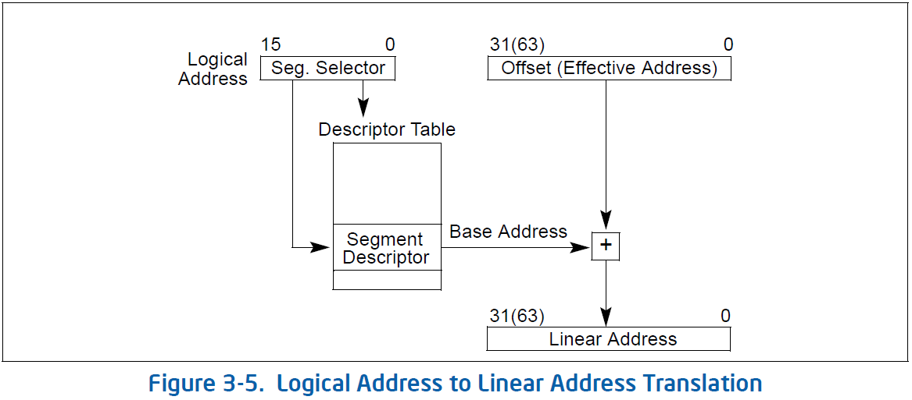
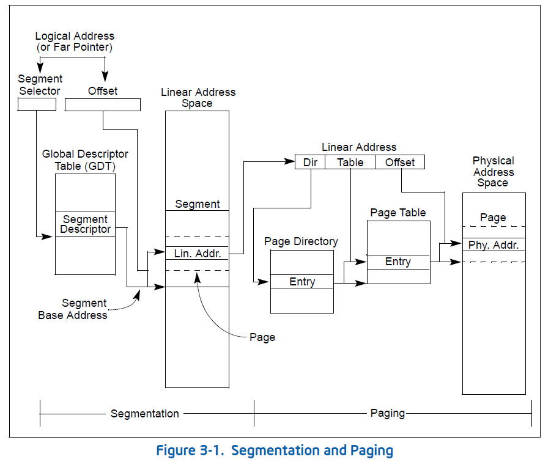
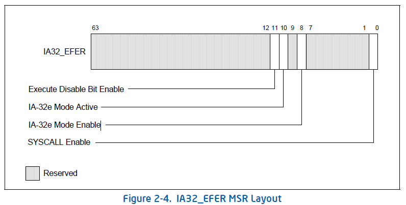
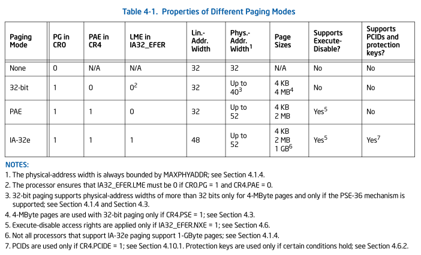
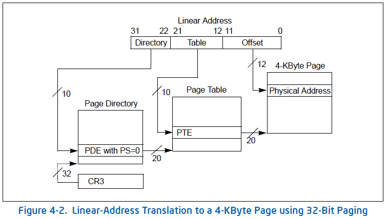
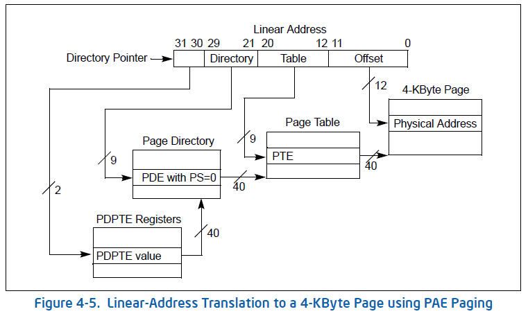
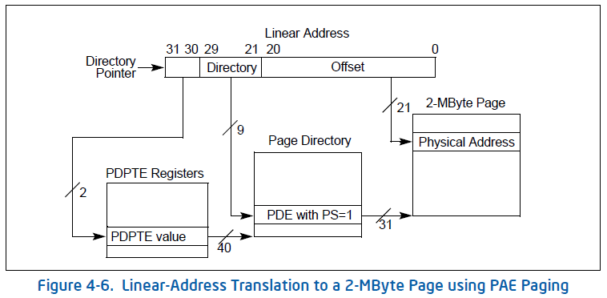
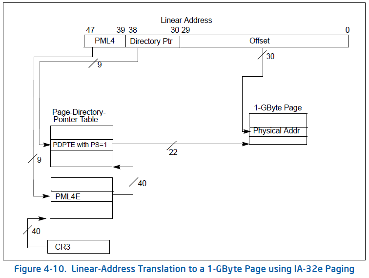

本文主要总结一下Intel的x86架构处理器所支持各式内存映射情况. 

### 实模式

实模式下, 没有什么内存映射的概念, 逻辑地址简单地转换一下就是物理地址. 

实模式下的逻辑地址表现形式为[Base: Offset](即[基地址: 偏移量], 虽然Base类似于保护模式下的段选择符, 但是实模式下, 它仅表示基地址, 无任何的段选择作用), 逻辑地址转换物理地址的方式为: 

> (Base << 4) + Offset = Linear Address = Physical Address

由于实模式下无任何分页映射, 线性地址即为物理地址. 

即如下图: 

基地址和偏移量都是16bit的数据, 按照计算公式转换, 应该可以访问内存范围为: 0x0–0x10ffef. 但是在最初的8086仅有20条地址总线, 也就是意味着寻址能力只有0x0-0xfffff(即1M地址空间). 那么0x100000-0x10ffef的内存则是被迂回到对应0x0-0xffef这段物理内存, 也有的地方称之为wrap-around. 如下图所示: 

随着处理器的更新换代地址总线早已超过了20条(其实80286就已经24条地址总线了), 如今已到了64条甚至更多. 但是在80286引入的时候, 其24条地址总线已经扩展到可以使用16M的内存了, 完全超出1M的空间范围了, 但是为了保持系统表现行为和8086一致, 于是乎引入了A20总线, 称之为A20 Gate, **通过控制A20总线来达到控制处理器兼容8086**. 当A20 Gate打开时, 操作100000H-10FFEFH之间的地址的时候, 系统将真正访问这块内存区域; 如果A20 Gate禁止时, 则操作100000H-10FFEFH之间的地址的时候, 系统仍然使用8086/8088的方式. 

这也就是实模式下在内存访问操作中仅有的差异之处. 

### 保护模式

已知x86内存映射, 分为段式映射和段页式映射. 页式映射是基于段式映射上实现的. 

#### 1)段式映射

仅使能段式映射的时候, 逻辑地址为[段选择符: 偏移量], 仅需要经过段式映射即可等到物理地址. 过程如图: 

如果开启分页机制, 那么线性地址经过页全局目录和页表成物理地址; 如果无分页机制, 那么线性地址就直接是物理地址了. 所以只需要通过段选择符查描述符表找到基地址再加上偏移量, 即可得到目标物理地址. 

使能段式映射仅需要使能保护模式即可, 即设置CR0寄存器的PE位(Protection Enable). 这也是保护模式和实模式之间切换的标志位, 进入保护模式后, 段式映射是默认使能的. 

#### 2)段页式映射

段页式映射则是段式映射转换后得到的线性地址再进行页式映射即可. 如图: 

而控制页式映射和相关特性使能都在于以下相关寄存器的相关标志位中: 

- 控制寄存器CR0的WP(bit 16)和PG(bit 31)标志位; 
- 控制寄存器CR4的PSE(bit 4)、PAE(bit 5)、PGE(bit 7)、PCIDE(bit 17)和SMEP(bit 20)标志位; 
- IA32_EFER特别模块寄存器(MSR, Model specific registers)的LME(bit 8)和NXE(bit 11)标志位; 

(以上信息是来自2014年的Intel手册)

标志位具体如下图所示: 

基于保护模式的情况下(即CR0.PE置位时), 开启页式映射, 仅需要设置CR0.PG标志位即可开启分页模式. 而一旦CR0.PG该标志位置位后, 将会启用三种分页映射模式中的一种, 具体的模式还取决于CR4.PAE 和IA32_EFER.LME的设置. 根据不同的标志位设置, 可以其中可以分为以下三种: 

- 32-bit分页模式: CR0.PG置位, CR4.PAE清零的情况; 

- PAE分页模式: CR0.PG和CR4.PAE置位, 而IA32_EFER.LME清零的情况; 

- IA-32e分页模式: CR0.PG、CR4.PAE、IA32_EFER.LME一同置位的情况. 

以上三种模式的差异具体说明如图: 

而三种分页模式的分页结构如图: 

可以看到仅IA-32e分页模式是采用了四级分页映射模型, 而32-bit和PAE均采用了三级分页映射模型. 具体模型差异, 后面再细述. 

最后附上以上三种模式相互间的转换图: 

模式间的转换细节这里就不详述了, 具体可以参考Intel手册

回顾前面归纳的分页模式相关的寄存器标志位, 除了CR0.PG、CR4.PAE、IA32\_EFER.LME之外, 其他标志位的作用如下: 

- CR0.WP: allows pages to be protected from supervisor-mode writes.写保护标志位, 允许页面从超级用户模式转为保护模式. 当CR0.WP为0时, 数据可以通过映射转换写到任何线性地址中; 当CR0.WP为1时, 数据仅可以写入标志为可读写的页面. 
- CR4.PSE: enables 4-MByte pages for 32-bit paging.页大小扩展标志位(Page Size Extension), 使能32-bit分页使用4MByte大小页面. 当CR4.PSE为0时, 32-bit分页仅能使用4Kbyte大小页面; 当CR4.PSE为1时,32-bit分页既可以使用4Kbyte大小页面, 也可以使用4MByte大小页面. (注: PAE分页模式和IA-32e分页模式无需CR4.PSE的情况下可以使用多种页面大小). 
- CR4.PGE: enables global pages.用于启用全局页面. 当CR4.PGE为0时, 功能未开启; 当CR4.PGE为1时, 功能开启, 设置在转换页表项中的全局位(G Flag), 标记也是全局的, TLB更新的时候, 将会忽略该转换项使之得到保留. 
- CR4:PCIDE: enables process-context identifiers (PCIDs) for IA-32e paging (CR4.PCIDE can be 1 only when IA-32e
paging is in use).进程上下文标识位(process-context identifiers), 用于在IA-32e分页模式下. 其允许逻辑处理器缓存多线性地址空间的的信息. 
- CR4.SMEP: allows pages to be protected from supervisor-mode instruction fetches.超级用户保护模式, 用于保护页面不被超级模式下的指令取操作. 当CR4.SMEP为1时, 超级用户模式下的软件操作不可以从用户模式可访问的线性地址空间中取指令. 
- IA32\_EFER.NXE: enables execute-disable access rights for PAE paging and IA-32e paging.用于使能PAE和IA-32e分页模式下禁止执行访问权限. 当IA32_EFER.NXE为1时, 指定的线性地址将会得到预取指令的保护, 但不影响同地址的数据读取. 该设置仅在PAE和IA-32e分页模式下有效, 对32-bit分页模式无效. 
- CR4.SMAP allows pages to be protected from supervisor-mode data accesses.
- CR4.PKE allows each linear address to be associated with a protection key.
- PAE: physical-address extension.
- PAT: page-attribute table.
- PSE-36: page-size extensions with 40-bit physical-address extension.
- PKU: protection keys.
- NX: execute disable.
- Page1GB: 1-GByte pages.
- LM: IA-32e mode support.

回归分页模式, 往下细分, 分析一下各分页模式的细节: 

#### A.  32-bit分页模式

基于CR0.PG为1, 而CR4.PAE、IA32_EFER.LME为0的情况下. 

**4-KByte**大小页面地址转换模式: 

当CR4.PSE为0或者PDE(Page Directory Entry, 页目录项中)中的PS(Page Size)标志位为0时, 则是该线性地址的映射模式了. 

**4-MByte**大小页面地址转换模式: 

该映射模式需要CR4.PSE和PDE中的PS标志位同时为1的时候. 

仔细看一下4-MByte大小页面映射模式, 其**物理地址可以达到40bit, 意味着可访问内存达到了1TByte**, 不过**其线性地址仍然是32bit**, 也就表示其在同一时刻只能最大只能够访问4GByte的内存空间. 也就是说即便内存被扩展为1TByte, 所有内存也都可以被使用, 但是某个程序其只能够使用4GByte而已(**因为进程使用的只是虚拟地址, 也就是这里的线性地址, 不直接使用物理地址！！！**), 作用很明显, 就是**为了满足IA32多进程环境, 每个进程都可以使用4GByte的内存而已**. 

附32-bit分页模式下的CR3及各级页映射结构概要图: 

#### B.  PAE分页模式

基于CR0.PG、CR4.PAE为1, 而IA32_EFER.LME为0的情况下. 

4-KByte大小页面地址转换模式: 

当PDE的PS标志位为0的时候, 为4-Kbyte大小页面. 

2-MByte大小页面地址转换模式: 

当PDE的PS标志位为1的时候, 启用2-MByte大小页面. 

**PAE分页模式下, 物理地址都为52bit, 表示可访问内存空间为4PBytes**, 但是类似32-bit分页模式, **其线性地址为32bit, 所以注定在同一时刻最大仅能够访问4GByte的内存**. 

附PAE分页模式下的CR3及各级页映射结构概要图: 

#### C.  IA-32e分页模式

基于CR0.PG、CR4.PAE、IA32_EFER.LME同时为1的情况下. 

4-KByte大小页面地址转换模式: 

当PDE的PS标志位为0时, 使用该模式. 

2-MByte大小页面地址转换模式: 

当PDE的PS标志位为1时, 则为2-MByte大小页面模式. 

1-GByte大小页面地址转换模式: 

当PDPTE的PS标志位为1时, 则采用的是1-GByte大小页面模式. 

注: **IA-32e分页模式实际上就是x86-64环境的页面线性地址映射的称呼方式. 值得注意的是x86-64的线性地址不是64bit, 而是48bit, 物理地址也不是, 物理地址是52bit. 不过由于线性地址是48bit, 也就注定该模式下, 同一时刻最大可访问内存空间是256 TBytes**. 

附IA-32e分页模式下的CR3及各级页映射结构概要图: 

更多详细信息建议阅读Intel手册. 