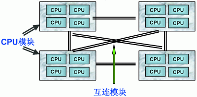

<!-- @import "[TOC]" {cmd="toc" depthFrom=1 depthTo=6 orderedList=false} -->

<!-- code_chunk_output -->

- [1. 3种系统架构与2种存储器共享方式](#1-3种系统架构与2种存储器共享方式)
  - [1.1. 架构概述](#11-架构概述)
  - [1.2. SMP(Symmetric Multi-Processor)](#12-smpsymmetric-multi-processor)
  - [1.3. NUMA(Non-Uniform Memory Access)](#13-numanon-uniform-memory-access)
    - [1.3.1. NUMA Hierarchy](#131-numa-hierarchy)
    - [1.3.2. NUMA Node内部](#132-numa-node内部)
      - [1.3.2.1. 物理CPU](#1321-物理cpu)
        - [1.3.2.1.1. Socket](#13211-socket)
        - [1.3.2.1.2. Core](#13212-core)
        - [1.3.2.1.3. Uncore](#13213-uncore)
        - [1.3.2.1.4. Threads](#13214-threads)
    - [1.3.3. 本地内存](#133-本地内存)
    - [1.3.4. 本地IO资源](#134-本地io资源)
    - [1.3.5. NUMA Node互联](#135-numa-node互联)
    - [1.3.6. NUMA Affinity](#136-numa-affinity)
    - [1.3.7. Firmware接口](#137-firmware接口)
  - [1.4. MPP(Massive Parallel Processing)](#14-mppmassive-parallel-processing)
- [2. 三种体系架构之间的差异](#2-三种体系架构之间的差异)
  - [2.1. NUMA、MPP、SMP之间性能的区别](#21-numa-mpp-smp之间性能的区别)
  - [2.2. NUMA、MPP、SMP之间扩展的区别](#22-numa-mpp-smp之间扩展的区别)
  - [2.3. MPP和SMP、NUMA应用之间的区别](#23-mpp和smp-numa应用之间的区别)
  - [2.4. 总结](#24-总结)

<!-- /code_chunk_output -->

# 1. 3种系统架构与2种存储器共享方式

## 1.1. 架构概述

从**系统架构**来看，目前的商用服务器大体可以分为三类

- 对称多处理器结构(SMP: Symmetric Multi\-Processor)

- 非一致存储访问结构(NUMA: Non\-Uniform Memory Access)

- 海量并行处理结构(MPP: Massive Parallel Processing). 

**共享存储型**多处理机有两种模型

- 均匀存储器存取(Uniform\-Memory\-Access，简称UMA)模型

- 非均匀存储器存取(Nonuniform\-Memory\-Access，简称NUMA)模型

而我们后面所提到的**COMA和ccNUMA**都是**NUMA结构的改进**

## 1.2. SMP(Symmetric Multi-Processor)

所谓对称多处理器结构，是指服务器中**多个CPU对称工作**，**无主次或从属关系**. 

各CPU共享相同的物理内存，每个CPU访问内存中的任何地址所需时间是相同的，因此SMP也被称为**一致存储器访问结构(UMA: Uniform Memory Access)**

对SMP服务器进行扩展的方式包括增加内存、使用更快的CPU、增加CPU、扩充I/O(槽口数与总线数)以及添加更多的外部设备(通常是磁盘存储). 

SMP服务器的主要特征是**共享**，系统中**所有资源**(CPU、内存、I/O等)都是**共享**的. 也正是由于这种特征，导致了SMP服务器的主要问题，那就是它的扩展能力非常有限. 

对于SMP服务器而言，每一个共享的环节都可能造成SMP服务器扩展时的瓶颈，而最受限制的则是**内存**. 由于**每个CPU**必须通过**相同的内存总线**访问**相同的内存资源**，因此随着CPU数量的增加，**内存访问冲突**(涉及**内存一致性模型**)将迅速增加，最终会造成CPU资源的浪费，使CPU性能的有效性大大降低. 实验证明，SMP服务器**CPU利用率**最好的情况是**2至4个CPU**

图中，物理存储器被所有处理机均匀共享. 所有处理机对所有存储字具有相同的存取时间，这就是为什么称它为均匀存储器存取的原因. 每台处理机可以有私用高速缓存,外围设备也以一定形式共享. 

## 1.3. NUMA(Non-Uniform Memory Access)

由于SMP在扩展能力上的限制，人们开始探究如何进行有效地扩展从而构建大型系统的技术，NUMA就是这种努力下的结果之一

利用NUMA技术，可以把几十个CPU(甚至上百个CPU)组合在一个服务器内.

NUMA多处理机模型如图所示，其访问时间随存储字的位置不同而变化. 其**共享存储器**物理上是分布在**所有处理机的本地存储器上**. **所有本地存储器**的集合组成了**全局地址空间**，可被所有的处理机访问. 处理机访问本地存储器是比较快的，但访问属于另一台处理机的远程存储器则比较慢，因为通过互连网络会产生附加时延. 

NUMA服务器的基本特征是具有**多个CPU模块**，**每个CPU模块由多个CPU(如4个)组成**，并且具有独立的**本地内存、I/O槽口等**(这些**资源都是以CPU模式划分本地的，一个CPU模块可能有多个CPU！！！**). 

由于其节点之间可以通过**互联模块**(如称为**Crossbar Switch**)进行连接和信息交互，因此**每个CPU**可以访问**整个系统的内存**(**这是NUMA系统与MPP系统的重要差别**). 显然，**访问本地内存**的速度将远远高于**访问远地内存**(系统内其它节点的内存)的速度，这也是非一致存储访问NUMA的由来. 

由于这个特点，为了更好地发挥系统性能，开发应用程序时需要**尽量减少不同CPU模块之间的信息交互**. 利用NUMA技术，可以较好地解决**原来SMP系统的扩展问题**，在一个物理服务器内**可以支持上百个CPU**. 比较典型的NUMA服务器的例子包括HP的Superdome、SUN15K、IBMp690等. 

但NUMA技术同样有一定**缺陷**，由于**访问远地内存的延时**远远超过**本地内存**，因此**当CPU数量增加**时，系统**性能无法线性增加**. 如HP公司发布Superdome服务器时，曾公布了它与HP其它UNIX服务器的相对性能值，结果发现，64路CPU的Superdome(NUMA结构)的相对性能值是20，而8路N4000(共享的SMP结构)的相对性能值是6.3. 从这个结果可以看到，8倍数量的CPU换来的只是3倍性能的提升.

### 1.3.1. NUMA Hierarchy

NUMA Hierarchy就是NUMA的层级结构. 一个Intel x86 NUMA系统就是由多个NUMA Node组成. 

### 1.3.2. NUMA Node内部

**一个NUMA Node内部**是由**一个物理CPU**和它**所有的本地内存(Local Memory**)组成的. 广义得讲，一个NUMA Node内部还包含**本地IO资源**，对**大多数Intel x86 NUMA平台**来说，主要是**PCIe总线资源**. **ACPI规范**就是这么**抽象一个NUMA Node**的. 

#### 1.3.2.1. 物理CPU

**一个CPU Socket**里可以由**多个CPU Core**和**一个Uncore部分**组成. **每个CPU Core**内部又可以由**两个CPU Thread**组成. **每个CPU thread**都是**一个操作系统可见的逻辑CPU**. 对**大多数操作系统**来说，**一个八核HT**打开的CPU会**被识别为16个CPU**. 下面就说一说这里面相关的概念，

##### 1.3.2.1.1. Socket

**一个Socket**对应**一个物理CPU**.  

这个词大概是从CPU在主板上的物理连接方式上来的. **处理器**通过**主板的Socket**来**插到主板**上. 尤其是有了**多核(Multi\-core**)系统以后，**Multi\-socket系统**被用来指明系统到底**存在多少个物理CPU**. 

##### 1.3.2.1.2. Core

**CPU的运算核心**.  **x86的核**包含了**CPU运算的基本部件**，如**逻辑运算单元(ALU**), **浮点运算单元(FPU**), **L1和L2缓存**. **一个Socket**里可以有**多个Core**. 如今的多核时代，即使是Single Socket的系统，也是逻辑上的SMP系统. 但是，**一个物理CPU**的系统不存在非本地内存，因此相当于**UMA系统**. 

##### 1.3.2.1.3. Uncore

**Intel x86物理CPU**里**没有放在Core**里的部件都被叫做**Uncore**. Uncore里集成了**过去x86 UMA**架构时代**北桥芯片的基本功能**. 在**Nehalem**时代，**内存控制器**被集成到**CPU**里，叫做**iMC(Integrated Memory Controller**). 而**PCIe Root Complex**还作为**独立部件**在**IO Hub芯片**里. 到了**SandyBridge**时代，**PCIe Root Complex**也被集成到了**CPU**里. 现今的**Uncore部分**，除了**iMC**，**PCIe Root Complex**，还有**QPI(QuickPath Interconnect)控制器**，**L3缓存**，**CBox(负责缓存一致性**)，及**其它外设控制器**. 

##### 1.3.2.1.4. Threads

这里特指**CPU的多线程技术**. 在Intel x86架构下，CPU的多线程技术被称作**超线程(Hyper\-Threading)技术**. Intel的**超线程技术**在**一个处理器Core内部**引入了**额外的硬件**设计**模拟了两个逻辑处理器(Logical Processor**)，**每个逻辑处理器**都有**独立的处理器状态**，但**共享Core内部**的**计算资源**，如**ALU**，**FPU**，**L1**，**L2缓存**. 这样在**最小的硬件投入**下提高了**CPU在多线程软件工作负载下的性能**，提高了硬件使用效率. **x86的超线程技术**出现**早于NUMA架构**. 

### 1.3.3. 本地内存

在Intel x86平台上，所谓**本地内存**，就是CPU可以经过**Uncore部件**里的**iMC(内存控制器)访问到的内存**. 而那些**非本地的**，**远程内存(Remote Memory**)，则需要**经过QPI的链路**到**该内存所在的本地CPU的iMC**来访问. 曾经在Intel IvyBridge的NUMA平台上做的内存访问性能测试显示，**远程内存访问的延时**是**本地内存的一倍**. 

可以假设，操作系统应该尽量利用本地内存的低访问延迟特性来优化应用和系统的性能. 

### 1.3.4. 本地IO资源

如前所述，Intel自从SandyBridge处理器开始，已经把**PCIe Root Complex**集成到**CPU**里了. 正因为如此，**从CPU直接引出PCIe Root Port**的**PCIe 3.0的链路**可以直接与**PCIe Switch**或者**PCIe Endpoint相连(！！！**). **一个PCIe Endpoint**就是**一个PCIe外设**. 这就意味着，对**某个PCIe外设**来说，如果它**直接与哪个CPU相连**，它就**属于哪个CPU所在的NUMA Node**. 

与本地内存一样，所谓**本地IO资源**，就是CPU可以经过**Uncore部件**里的**PCIe Root Complex直接访问到的IO资源(！！！**). 如果是**非本地IO资源**，则需要经过**QPI链路**到**该IO资源所属的CPU**，再通过**该CPU PCIe Root Complex访问(！！！**). 如果**同一个NUMA Node内**的**CPU**和**内存**和另外一个NUMA Node的IO资源发生互操作，因为要**跨越QPI链路**，会存在**额外的访问延迟问题**. 

其它体系结构里，为**降低外设访问延迟**，也有将IB(Infiniband)总线集成到CPU里的. 这样IB设备也属于NUMA Node的一部分了. 

可以假设，操作系统如果是NUMA Aware的话，应该会尽量针对本地IO资源低延迟的优点进行优化. 

### 1.3.5. NUMA Node互联

在Intel x86上，**NUMA Node之间**的互联是通过**QPI((QuickPath Interconnect) Link**的. CPU的**Uncore部分**有**QPI的控制器(！！！**)来控制**CPU到QPI的数据访问**. 

不借助第三方的Node Controller，2/4/8个NUMA Node(取决于具体架构)可以通过**QPI(QuickPath Interconnect)总线互联**起来，构成一个**NUMA系统**. 例如，SGI UV计算机系统，它就是借助自家的SGI NUMAlink®互联技术来达到4到256个CPU socket扩展的能力的. 这是一个SMP系统，所以支持运行一个Linux操作系统实例去管理系统. 在我的另一篇文章Pitfalls Of TSC Usage曾经提到过SGI UV平台上遇到的TSC同步的问题(见3.1.2小节). 

[https://blog.csdn.net/yayong/article/details/50654479]

### 1.3.6. NUMA Affinity

NUMA Affinity(亲和性)是和NUMA Hierarchy(层级结构)直接相关的. 对系统软件来说，以下两个概念至关重要，

- CPU NUMA Affinity

CPU NUMA的亲和性是指从CPU角度看，哪些内存访问更快，有更低的延迟. 如前所述，和该CPU直接相连的本地内存是更快的. 操作系统如果可以根据任务所在CPU去分配本地内存，就是基于CPU NUMA亲和性的考虑. 因此，CPU NUMA亲和性就是要尽量让任务运行在本地的NUMA Node里. 

- Device NUMA Affinity

设备NUMA亲和性是指从PCIe外设的角度看，如果和CPU和内存相关的IO活动都发生在外设所属的NUMA Node，将会有更低延迟. 这里有两种设备NUMA亲和性的问题，

1. DMA Buffer NUMA Affinity

大部分PCIe设备支持DMA功能的. 也就是说，设备可以直接把数据写入到位于内存中的DMA缓冲区. 显然，如果DMA缓冲区在PCIe外设所属的NUMA Node里分配，那么将会有最低的延迟. 否则，外设的DMA操作要跨越QPI链接去读写另外一个NUMA Node里的DMA缓冲区. 因此，操作系统如果可以根据PCIe设备所属的NUMA node分配DMA缓冲区，将会有最好的DMA操作的性能. 

2. Interrupt NUMA Affinity

设备DMA操作完成后，需要在CPU上触发中断来通知驱动程序的中断处理例程(ISR)来读写DMA缓冲区. 很多时候，ISR触发下半部机制(SoftIRQ)来进入到协议栈相关(Network，Storage)的代码路径来传送数据. 

对大部分操作系统来说，硬件中断(HardIRQ)和下半部机制的代码在同一个CPU上发生. 因此，DMA缓冲区的读写操作发生的位置和设备硬件中断(HardIRQ)密切相关. 假设操作系统可以把设备的硬件中断绑定到自己所属的NUMA node，那之后中断处理函数和协议栈代码对DMA缓冲区的读写将会有更低的延迟. 

### 1.3.7. Firmware接口

由于NUMA的亲和性对应用的性能非常重要，那么硬件平台就需要给操作系统提供接口机制来感知硬件的NUMA层级结构. 在x86平台，ACPI规范提供了以下接口来让操作系统来检测系统的NUMA层级结构. 

ACPI 5.0a规范的第17章是有关NUMA的章节. ACPI规范里，NUMA Node被第9章定义的Module Device所描述. ACPI规范里用Proximity Domain对NUMA Node做了抽象，两者的概念大多时候等同. 

- SRAT(System Resource Affinity Table)

主要描述了系统boot时的CPU和内存都属于哪个Proximity Domain(NUMA Node).  这个表格里的信息时静态的，如果是启动后热插拔，需要用OSPM的_PXM方法去获得相关信息. 

- SLIT(System Locality Information Table)

提供CPU和内存之间的位置远近信息. 在SRAT表格里，只能告诉给定的CPU和内存是否在一个NUMA Node. 对某个CPU来说，不在本NUMA Node里的内存，即远程内存们是否都是一样的访问延迟取决于NUMA的拓扑有多复杂(QPI的跳数). 总之，对于不能简单用远近来描述的NUMA系统(QPI存在0，1，2等不同跳数)，需要SLIT表格给出进一步的说明. 同样的，这个表格也是静态表格，热插拔需要使用OSPM的_SLI方法. 

- DSDT(Differentiated System Description Table)

从Device NUMA角度看，这个表格给出了系统boot时的外设都属于哪个Proximity Domain(NUMA Node). 

ACPI规范OSPM(Operating System-directed configuration and Power Management)和OSPM各种方法就是操作系统里的ACPI驱动和ACPI firmware之间的一个互动的接口. x86启动OS后，没有ACPI之前，firmware(BIOS)的代码是无法被执行了，除非通过SMI中断处理程序. 但有了ACPI，BIOS提前把ACPI的一些静态表格和AML的bytecode代码装载到内存，然后ACPI驱动就会加载AML的解释器，这样OS就可以通过ACPI驱动调用预先装载的AML代码. 

AML(ACPI Machine Language)是和Java类似的一种虚拟机解释型语言，所以不同操作系统的ACPI驱动，只要有相同的虚拟机解释器，就可以直接从操作系统调用ACPI写好的AML的代码了. 所以，前文所述的所有热插拔的OSPM方法，其实就是对应ACPI firmware的AML的一段函数代码而已. (关于ACPI的简单介绍，这里给出两篇延伸阅读: 1和2. )

至此，x86 NUMA平台所需的一些硬件知识基本就覆盖到了. 需要说明的是，虽然本文以Intel平台为例，但AMD平台的差异也只是CPU总线和内部结构的差异而已. 其它方面的NUMA概念AMD也是类似的. 所以，下一步就是看OS如何利用这些NUMA特性做各种优化了.

## 1.4. MPP(Massive Parallel Processing)

和NUMA不同，MPP提供了另外一种进行系统扩展的方式，它由**多个SMP服务器**通过一定的**节点互联网络**进行连接，协同工作，**完成相同的任务**，从用户的角度来看是一个服务器系统. 其基本特征是由多个SMP服务器(**每个SMP服务器称节点**)通过**节点互联网络**连接而成，**每个节点只访问自己的本地资源**(内存、存储等)，是一种完全**无共享(Share Nothing)结构**，因而扩展能力最好，理论上其扩展无限制，目前的技术可实现512个节点互联，数千个CPU. 目前业界对**节点互联网络暂无标准**，如NCR的Bynet，IBM的SPSwitch，它们都采用了不同的内部实现机制. 但节点互联网仅供MPP服务器内部使用，对用户而言是透明的. 

**在MPP系统中，每个SMP节点也可以运行自己的操作系统、数据库等**. 但和NUMA不同的是，它不存在异地内存访问的问题. 换言之，**每个节点内的CPU不能访问另一个节点的内存**. 节点之间的信息交互是通过节点互联网络实现的，这个过程一般称为**数据重分配**(Data Redistribution). 

但是MPP服务器需要一种复杂的机制来调度和平衡各个节点的负载和并行处理过程. 目前一些基于MPP技术的服务器往往通过系统级软件(如数据库)来屏蔽这种复杂性. 举例来说，NCR的Teradata就是基于MPP技术的一个关系数据库软件，基于此数据库来开发应用时，不管后台服务器由多少个节点组成，开发人员所面对的都是同一个数据库系统，而不需要考虑如何调度其中某几个节点的负载. 

# 2. 三种体系架构之间的差异

## 2.1. NUMA、MPP、SMP之间性能的区别

**NUMA的节点互联机制**是在**同一个物理服务器内部实现**的，当某个CPU需要进行远地内存访问时，它必须等待，这也是NUMA服务器**无法实现CPU增加时性能线性扩展**. 

**MPP的节点互联机制**是在**不同的SMP服务器外部通过I/O实现**(**所以Linux不用考虑这种！！！**)的，每个节点只访问本地内存和存储，节点之间的信息交互与节点本身的处理是并行进行的. 因此MPP在增加节点时性能**基本上可以实现线性扩展**. 

SMP所有的**CPU资源是共享的**，因此**完全实现线性扩展**. 

## 2.2. NUMA、MPP、SMP之间扩展的区别

NUMA理论上可以无限扩展，目前技术比较成熟的能够支持上百个CPU进行扩展. 如HP的SUPERDOME. 

MPP理论上也可以实现无限扩展，目前技术比较成熟的能够支持512个节点，数千个CPU进行扩展. 

**SMP扩展能力很差**，目前2个到4个CPU的利用率最好，但是IBM的BOOK技术，能够将CPU扩展到8个. 

MPP是由多个SMP构成，多个SMP服务器通过一定的节点互联网络进行连接，协同工作，完成相同的任务. 

## 2.3. MPP和SMP、NUMA应用之间的区别

**MPP的优势**

**MPP系统不共享资源**，因此对它而言，资源比SMP要多，**当需要处理的事务达到一定规模**时，**MPP的效率要比SMP好**. 由于MPP系统因为要在不同处理单元之间传送信息，在通讯时间少的时候，那MPP系统可以充分发挥资源的优势，达到高效率. 也就是说: **操作相互之间没有什么关系，处理单元之间需要进行的通信比较少，那采用MPP系统就要好**. 因此，MPP系统在决策支持和数据挖掘方面显示了优势. 

**SMP的优势**

MPP系统因为要在不同处理单元之间传送信息，所以它的效率要比SMP要差一点. **在通讯时间多的时候**，那MPP系统可以充分发挥资源的优势. 因此当前使用的OTLP程序中，用户访问一个中心数据库，如果采用SMP系统结构，它的效率要比采用MPP结构要快得多. 

**NUMA架构的优势**

NUMA架构来看，它可以在一个物理服务器内集成许多CPU，使系统具有较高的事务处理能力，由于远地内存访问时延远长于本地内存访问，因此需要**尽量减少不同CPU模块之间的数据交互**. 显然，NUMA架构更适用于OLTP事务处理环境，当用于数据仓库环境时，由于大量复杂的数据处理必然导致大量的数据交互，将使CPU的利用率大大降低. 

## 2.4. 总结

传统的多核运算是使用SMP(Symmetric Multi-Processor )模式: 将多个处理器与一个集中的存储器和I/O总线相连. 所有处理器只能访问同一个物理存储器，因此SMP系统有时也被称为一致存储器访问(UMA)结构体系，一致性意指无论在什么时候，处理器只能为内存的每个数据保持或共享唯一一个数值. 很显然，SMP的缺点是可伸缩性有限，因为在存储器和I/O接口达到饱和的时候，增加处理器并不能获得更高的性能，与之相对应的有AMP架构，不同核之间有主从关系，如一个核控制另外一个核的业务，可以理解为多核系统中控制平面和数据平面. 

NUMA模式是一种分布式存储器访问方式，处理器可以同时访问不同的存储器地址，大幅度提高并行性.  NUMA模式下，处理器被划分成多个"节点"(node)， 每个节点被分配有的本地存储器空间.  所有节点中的处理器都可以访问全部的系统物理存储器，但是访问本节点内的存储器所需要的时间，比访问某些远程节点内的存储器所花的时间要少得多. 

NUMA 的主要优点是伸缩性. NUMA 体系结构在设计上已超越了 SMP 体系结构在伸缩性上的限制. 通过 SMP，所有的内存访问都传递到相同的共享内存总线. 这种方式非常适用于 CPU 数量相对较少的情况，但不适用于具有几十个甚至几百个 CPU 的情况，因为这些 CPU 会相互竞争对共享内存总线的访问. NUMA 通过限制任何一条内存总线上的 CPU 数量并依靠高速互连来连接各个节点，从而缓解了这些瓶颈状况. 

名词解释

| 概念 | 描述 |
|:----:|:---:|
| SMP | 称为共享存储型多处理机(Shared Memory mulptiProcessors), 也称为对称型多处理机(Symmetry MultiProcessors) |
| UMA | 称为均匀存储器存取(Uniform-Memory-Access) |
| NUMA | 非均匀存储器存取(Nonuniform-Memory-Access) |
| COMA | 只用高速缓存的存储器结构(Cache-Only Memory Architecture) |
| ccNUMA | 高速缓存相关的非一致性内存访问(CacheCoherentNon-UniformMemoryAccess) |

**UMA**

物理存储器被所有处理机均匀共享. 所有处理机对所有存储字具有相同的存取时间，这就是为什么称它为均匀存储器存取的原因. 每台处理机可以有私用高速缓存,外围设备也以一定形式共享. 

**NUMA**

其访问时间随存储字的位置不同而变化. 其共享存储器物理上是分布在所有处理机的本地存储器上. 所有本地存储器的集合组成了全局地址空间，可被所有的处理机访问. 处理机访问本地存储器是比较快的，但访问属于另一台处理机的远程存储器则比较慢，因为通过互连网络会产生附加时延.  

**COMA**

一种只用高速缓存的多处理机. COMA模型是NUMA机的一种特例，只是将后者中分布主存储器换成了高速缓存, 在每个处理机结点上没有存储器层次结构,全部高速缓冲存储器组成了全局地址空间. 远程高速缓存访问则借助于分布高速缓存目录进行. 

是CC-NUMA体系结构的竞争者，两者拥有相同的目标，但实现方式不同. COMA节点不对内存部件进行分布，也不通过互连设备使整个系统保持一致性. COMA节点没有内存，只在每个Quad中配置大容量的高速缓存

**CCNUMA**

在CC-NUMA系统中，分布式内存相连接形成单一内存，内存之间没有页面复制或数据复制，也没有软件消息传送. CC-NUMA只有一个内存映象，存储部件利用铜缆和某些智能硬件进行物理连接. CacheCoherent是指不需要软件来保持多个数据拷贝的一致性，也不需要软件来实现操作系统与应用系统的数据传输. 如同在SMP模式中一样，单一操作系统和多个处理器完全在硬件级实现管理. 