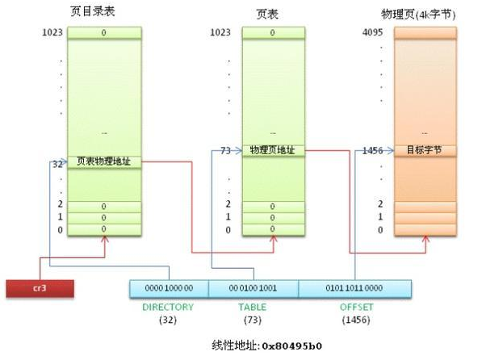
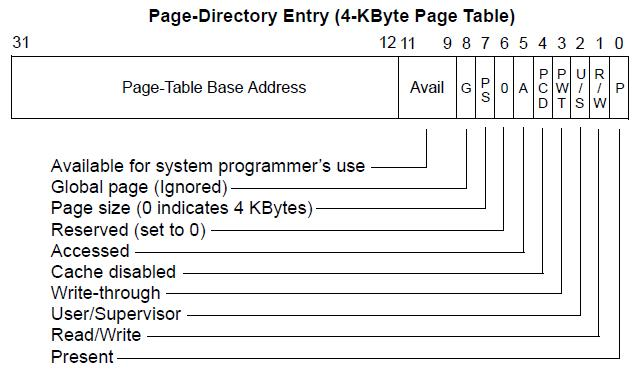
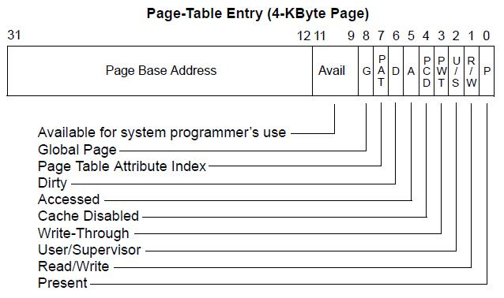
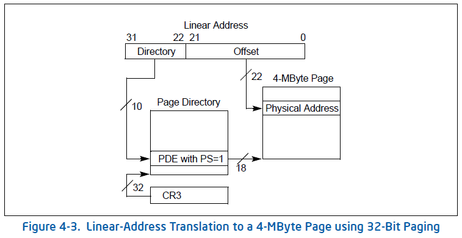
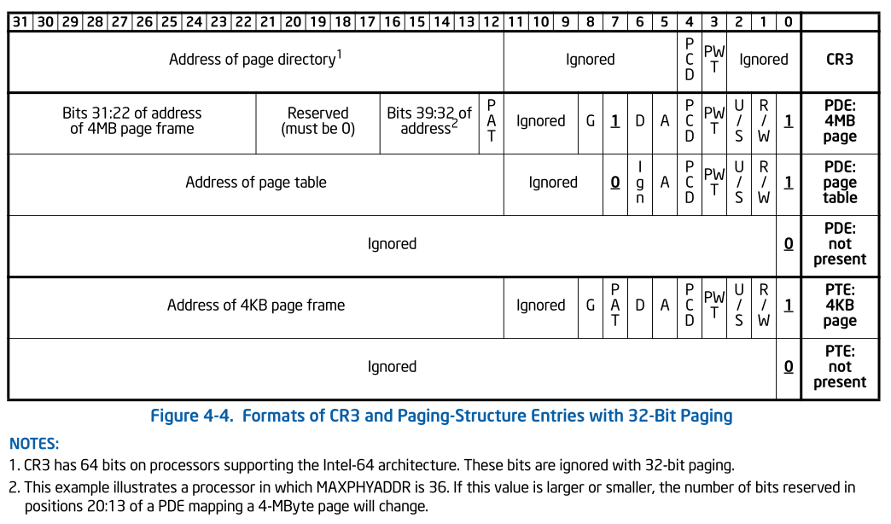
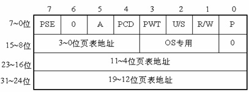

# 前景回顾

前面我们讲解了操作系统段式存储管理的主要内容. 

- 32位, 在保护方式下, 其能够访问的线性地址空间可达4GB, 而且允许几乎不受存储空间限制的虚拟存储器程序. **虚拟存储器地址空间能够可达64TB**. 它还提供了复杂的存储管理和硬件辅助的保护机构和增加了支持多任务操作系统的特别优化的指令. 实际上, 64TB的虚拟地址空间是有磁盘等外部存储器的支持下实现的. 在编写程序是可以放在磁盘存储器上, 但在执行时, 必须把程序加载到物理存储器中. 而存储器管理就是要将46位虚拟地址变换成32位物理地址. 

- 将程序分成不同的段进行管理, 我们编程访问内存地址时, 访问的其实是操作系统抽象给我们的虚拟地址, 通过段基址: 段偏移的方式访问内存虚拟地址, 极大了简化了程序员的编程结构. 

- 通过硬件和操作系统的段式管理机制, 实模式下通过段基址左移四位+段内偏移, 保护模式下通过段选择子select从段描述符GDT/LDT表中获取到段描述符, 然后对基地址和段偏移处理, 将虚拟地址转换为线性地址. 

如果没有采用存储器分页管理机制, 那么我们得到的线性地址就直接对应与物理地址, 否则, 则需要将线性地址转换为物理地址. 

从80386开始, 所有的80x86处理器都支持分页, 它通过设置**CR0寄存器**的PG标志启用分页. 当PG=0时, 线性地址就被解释成物理地址. 

>具体请参见深入[理解计算机系统-之-内存管理(三)--(分段管理机制--段描述符, 段选择子, 描述符表)](http://blog.csdn.net/gatieme/article/details/50647000)
>
>

# 2 页式管理

## 2.1 分段机制存在的问题

分段, 是指将程序所需要的内存空间大小的虚拟空间, 通过映射机制映射到某个物理地址空间(映射的操作由硬件完成). 分段映射机制解决了之前操作系统存在的两个问题: 

(1)地址空间没有隔离. 

(2)程序运行的地址不确定. 

不过分段方法存在一个严重的问题: **内存的使用效率低**. 

**分段**的**内存映射单位**是**整个程序(LDT表**); **如果内存不足**, 被换入换出到磁盘的空间都是**整个程序的所需空间**, 这会造成大量的磁盘访问操作, 并且严重降低了运行速度. 

事实上, 很多时候程序运行所需要的数据只是很小的一部分, 加入到内存的数据大小可能会很小, 并**没有必要整体的写入和写出**. 

分页机制解决了上面分段方法所存在的一个内存使用效率问题; 其核心思想是系统为程序执行文件中的**第x页**分配了**内存中的第y页**, 同时y页会添加到进程虚拟空间地址的**映射表中(页表**), 这样程序就可以通过映射访问到内存页y了. 

## 2.2 分页存储的基本内容

分页的基本方法是将**地址空间**人为地等分成**某一个固定大小的页**; 每一**页大小**由**硬件来决定**, 或者是由**操作系统来决定**(如果**硬件支持多种大小的页**). 目前, 以大小为4KB的分页是绝大多数PC操作系统的选择. 

- **逻辑空间(线性空间！！！**)等分为页; 并从0开始编号
- **内存空间(物理空间！！！**)等分为块, **与页面大小相同**; 从0开始编号
- **分配内存**时, 以块为单位将进程中的若干个页分别装入

关于进程分页. 当我们把进程的**虚拟地址空间按页**来分割, **常用的数据和代码**会被装在到**内存**; **暂时没用到的是数据和代码**则保存在**磁盘**中, 需要用到的时候, 再从磁盘中加载到内存中即可. 

这里需要了解三个概念: 

1. **虚拟页**(VP, Virtual Page),虚拟空间中的页; 

2. **物理页**(PP, Physical Page),物理内存中的页; 

3. **磁盘页**(DP, Disk Page),磁盘中的页. 

**虚拟内存**的实现需要硬件的支持, 从Virtual Address到Physical Address的映射, 通过一个叫**MMU**(**Memory Mangement Unit**)的部件来完成

# 3 分页机制支持

## 3.1 硬件分页支持

**分页单元(paging unit**)把**线性地址**转换成**物理地址**. 其中的一个关键任务就是把**所请求的访问类型**与**线性地址的访问权限相比较**, 如果这次内存访问是**无效**的, 就产生一个**缺页异常**. 
 
- **页**: 为了更高效和更经济的管理内存, **线性地址**被分为以固定长度为单位的组, 成为**页**. 页内部**连续的线性地址空间(页是连续的！！！**)被映射到**连续的物理地址**中. 这样, 内核可以指定**一个页(！！！**)的物理地址和对应的**存取权限**, 而不用指定全部线性地址的存取权限. 这里说**页**, 同时指**一组线性地址**以及这组地址**包含的数据**

- **页框**: 分页单元把所有的**RAM**分成固定长度的**页框**(page frame)(有时叫做**物理页**). 每一个页框包含一个页(page), 也就是说一个页框的长度与一个页的长度一致. 页框是主存的一部分, 因此也是一个存储区域. 区分**一页**和**一个页框**是很重要的, 前者只是**一个数据块**, 可以存放在**任何页框**或**磁盘(！！！线性空间的数据在物理页帧或磁盘可以是任何位置！！！**)中. 

- **页表**: 把**线性地址**映射到**物理地址**的数据结构称为**页表**(page table). 页表存放在**主存**中, 并在启用分页单元之前必须由内核对页表进行适当的初始化. 

# 3.2 常规的32bit分页

常规**4KB分页**, 32位的线性地址被分成3个域

| Directory(目录) | Table(页表) |  Offset(偏移量) |
| :-------------: |:-------------:| :-------------:|
| 最高10位 | 中间10位 | 最低12位 |

>线性地址的转换分为两步完成, 每一步都基于一种转换表, 第一种转换表称为**页目录表**(page directory), 第二种转换表称为**页表**(page table). 
>
>为什么需要两级呢？
>目的在于减少每个进程页表所需的 RAM 的数量. 如果使用简单的一级页表, 将需要高达2\^{20}个表项来表示每个进程的页表, 即时一个进程并不使用所有的地址, 二级模式通过只为进程**实际使用的那些虚拟内存区请求页表(根据需要请求页表项！！！**)来**减少内存容量**. 

每个**活动的进程**必须有**一个页目录**, 但是却**没有必要**马上为**所有进程**的**所有页表**都分配RAM, 只有在**实际需要一个页表时(一个页表对应一个页, 所以根据这个页的数据是不是需要才给分配物理内存！！！**)候才给该页表分配RAM. 

页目录项和页表项有同样的结构, 每项都包含下面的字段: 

| 字段 | 描述 |
|:----:|:----|
| **Present**标志 | 如果被**置为1**, 所指的页(或页表)就在**主存**中; 如果该标志为0, 则这一页不在主存中, 此时这个表项剩余的位可由操作系统用于自己的目的. 如果执行一个地址转换所需的页表项或页目录项中Present标志被清0, 那么分页单元就把该线性地址转换所需的页表项或页目录项中Present标志被清0, 那么分页单元就把该**线性地址**存放在**控制寄存器cr2**中, 并产生**14号异常: 缺页异常**.  |
| bit[31:12] | 包含**页框物理地址(！！！物理地址, 不用转换)最高20位的字段**. 由于每一个**页框有4KB**的容量, 它的**物理地址**必须是**4096的倍数**, 因此**页框物理地址的最低12位总为0(页框物理地址！！！**).如果**这个字段**指向一个**页目录**, 相应的页框就含有一个**页表**; 如果它指向一个页表, 相应的页框就含有一页数据 |
| **Accessed**标志 | 每当分页单元对相应页框进行寻址时就设置这个标志. 当选中的页被交换出去时, 这一标志就可以由操作系统使用. **分页单元(硬件**)从来**不重置这个标志**, 而是必须由**操作系统**去做 |
| **Dirty**标志 | 只应用于**页表项**中. 每当对一个页框进行写操作时就设置这个标志. 与Accessed标志一样, 当选中的页被交换出去时, 这一标志就可以由**操作系统使用**. 分页单元从来不重置这个标志, 而是必须由操作系统去做. |
| **Read/Write**标志 | 含有页或页表的**存取权限**(Read/Write或Read). |
| **User/Supervisor**标志 | 含有访问页或页表所需的**特权级**. |
| **PCD和PWT**标志 | 控制**硬件高速缓存**处理页或页表的方式. |
| **Page Size**标志 | 只应用于**页目录项**. 如果设置为1, 则页目录项指的是2MB或4MB页框. |
| **Global**标志 | 只应用于**页表项**. 这个标志是在Pentium Pro中引入的, 用来**防止常用页从TLB高速缓存中刷新**出去. 只有在**cr4寄存器**的**页全局启用**(Page Global Enable, PGE)标志置位时这个标志才起作用. |

**正在使用**的**页目录的物理地址(不是线性地址, 不用转换！！！**)存放在控制寄存器**CR3**中. 

了解了以上结构之后, 我们看看如何从线性地址转换到物理地址的 :

- 线性地址中的 Directory 字段决定页目录中的目录项, 目录项指向适当的页表

- 线性地址中的 Table 字段又决定页表的页表项, 页表项含有页所在页框的物理地址

- 线性地址中的Offset地段决定了页框内的相对位置, 由**于offset为12页**, 所以一页含有4096字节的数据

> Directory字段和Table字段都是10位长, 因此页目录和页表都可以多达1024项. 那么一个页目录可以寻址到高达1024\*1024\*4096=232个存储单元, 这和32位地址所期望的一样. 

## 3.3 物理地址扩展(PAE)分页机制和扩展分页(PSE)

参见x86内存映射小结

### 3.3.1 PAE

处理器所支持的**RAM大小**容易受到连接到**地址总线**上的**地址管脚树限制**.早期Intel处理器从80386到Pentium使用32位物理地址.

从理论上讲, 这样的系统可以使用高达2\^32=4GB的RAM,而实际上,由于用户进程现行地址空间的需要, 4GB的虚拟地址按照1:3的比例划分给内核虚拟地址空间和进程虚拟地址空间. 则内核只能直接对1GB的线性地址空间进行寻址.

然而, 大型服务器需要**大于4GB的RAM**来同时运行数以千计的进程,所以必须扩展32位80x86架构所支持的RAM容量.

Intel通过在它的处理器上把**管脚数从32增加到36**满足这样的需要, 从Pentinum Pro开始, Intel所有处理器的寻址能力可达到2\^36=64GB,但是只有**引入一种新的分页机制**才能把**32位线性地址**转换为**36位物理地址**才能使用所增加的物理地址.

从Pentinum Pro处理器开始, Intel引入一种叫做**物理地址扩展(Physical Address Extension,  PAE**)的机制. 

Intel为了**支持PAE改变了分页机制**

- **页表项**大小扩展到**64位**. **64GB的RAM(36位物理总线**)被分成了**2\^24个页框(一个页4MB**), **页表项**的**物理地址字段从20位扩展到了24位(由于页框有2\^24个！！**).因为PAE**页表项**必须包含**12个标志位**和**24个物理地址位**,总数之和为**36**,**页表项**大小从32位扩展到了**64位**,结果,**一个4KB**的页表包含512个表项而不是1024个表项. 

- 引入一个**页目录指针表**(Page Directory Pointer Table, **PDPT**)的页表新级别,它由**4个64位表项(64位！！！**)组成.

- cr3控制寄存器包含一个**27位**的**页目录指针表**(PDPT)**基地址字段**.因为PDPT存放在**RAM的前4GB**中,并在32字节(2\^5)的倍数上对齐,因此27位足以表示这种表的基地址

当把线性地址映射到**4KB的页**时(**页目录项**中的**PS标志位清0**),32位线性地址将按照如下方式解释

| 字段 | 描述 | 位数 |
|:---:|:---:|:---:|
| cr3 | 指向一个PDPT | cr3寄存器存储 |
| PGD | 指向PDPT中4个项中的一个 | 位31\~30 |
| PMD | 指向页目录中**512项**中的一个 | 位29\~21 |
| PTE | 指向页表中**512项**中的一个 | 位20\~12 |
| page offset | 4KB页中的偏移 | 位11\~0 |

`2 + 9 + 9 + 12 = 32`位线性地址空间

当把现行地址映射到**2MB的页**时(**页目录项**中的**PS标志置为1**),32位线性地址按照如下方式解释

| 字段 | 描述 | 位数 |
|:---:|:---:|:---:|
| cr3 | 指向一个PDPT | cr3寄存器存储 |
| PGD | 指向PDPT中4个项中的一个 | 位31\~30 |
| PMD | 指向页目录中512项中的一个 | 位29\~21 |
| page offset| 2MB页中的偏移 | 位20\~0 |

`2 + 9 + 21 = 32位`

总之, 一旦cr3被设置, 就可能寻址高达4GB RAM, 如果我们期望对更多的RAM进行寻址, 就必须在cr3中放置一个新值, 或改变PDPT的内容.

但是PAE的主要问题是**线性地址仍然是32位**长,　这就需要内核黑客用同一线性地址映射不同的RAM区. 很显然,PAE并没有扩大进程的线性地址空间,因为它只处理物理地址. 此外, 只有**内核能够修改进程的页表**,所以在**用户态**下运行的程序**不可能**使用**大于4GB的物理地址**空间.另一方面,PAE允许内核使用容量高达64GB的RAM,从而显著的**增加系统中的进程数目**

### 3.3.2 PSE

这儿**常规32位分页**提出的, Linux没有使用

`10 + 22`

从Pentium模型开始, 80x86微处理器引入了**扩展分页(externded paging)**, 也叫**页大小扩展[Page Size Extension]**, 它允许**页框大小为4MB而不是4KB(增加页框大小！！！**). 扩展分页用于把大段连续的线性地址转换成相应的物理地址, 在这种情况下, 内核可以不用中间页表进行地址转换, 从而节省内存并保留TLB项. 

CR4.PSE: enables 4-MByte pages for 32-bit paging.**页大小扩展**标志位(**Page Size Extension**), 使能**32-bit分页**使用**4MByte大小页面**. 当CR4.PSE为0时, 32-bit分页仅能使用4Kbyte大小页面; 当CR4.PSE为1时,32-bit分页既可以使用4Kbyte大小页面, 也可以使用4MByte大小页面. (注: PAE分页模式和IA-32e分页模式无需CR4.PSE的情况下可以使用多种页面大小). 

>但是**Linux并没有采用32\-bit的PSE这种机制, PAE的4KB、2MB<PAE的PSE>和IA-32e的4KB、2MB<IA-32e的PSE>、1GB分页都还是支持的！！！实现查看内存管理系列《Linux3.14.12内存管理》中《建立内核页表》**

正如前面所述, 通过设置页目录项的Page Size标志启用扩展分页功能. 在这种情况下, 分页单元把32位线性地址分成两个字段: 

- **Directory**: 最高**10位**. 
- **Offfset**: 其余**22位**. 

扩展分页和正常分页的页目录项基本相同, 除了

- PDE中的Page Size标志必须被设置(为1). 
- CR4.PSE必须设置为1.
- 20位物理地址字段只有最高10位是有意义的. 这是因为每一个物理地址都是在以4MB为边界的地方开始的, 故**这个地址的最低22位为0(页框地址的低22位为0**). 

通过设置**cr4处理器寄存器的PSE标志**能使**扩展分页与常规分页共存**

## 3.4 64位系统中的分页

32位处理器普遍采用两级分页. 然而两级分页并不适用于采用64位系统的计算机. 

原因如下 :

首先假设**一个大小为4KB的标准页**, 4KB覆盖**2\^12个地址**, 所以**offset字段是12位**. 如果我们现在决定仅仅使用64位中的48位来寻址(这个限制仍然能是我们自在地拥有256TB的寻址空间！), 剩下的48-12=36位被分配给Table和Directory字段. 如果我们决定为两个字段个预留18位, 那么每个进程的页目录和页表都含有2^18个项, 即超过256000个项. 

由于这个原因, 所有64位处理器的硬件分页系统都使用了额外的分页级别. 使用的级别数量取决于处理器的类型. 

| 平台名称 | 页大小 | 寻址使用位数 | 分页级别 | 线性地址分级|
| --- |:----:| :-----:|:----:|:-----:|
| alpha   |   8KB   |  43   |    3   |  10+10+10+13 | 
| ia64    |   4KB   |  39   |    3   |  9+9+9+12    | 
| ppc64   |   4KB   |  41   |    3   |  10+10+9+12  | 
| x86_64  |   4KB   |  48   |    4   |  9+9+9+9+12 | 

注: ia64是intel的一门高端技术, 不与x86_64系统兼容  
IA-32e Paging机制下线性地址映射到4KB的页

## 3.5 硬件保护方案

与页和页表相关的**特权级只有两个**, 因为特权由前面"常规分页"一节中所提到的User/Supervisor标志所控制. 若这个标志为0, 只有当CPL小于3(这意味着对于Linux而言, 处理器处于内核态)时才能对页寻址; 若该标志为1, 则总能对页寻址. 

此外, 与**段的3种存取权限**(读, 写, 执行)不同的是, **页的存取权限只有两种**(读, 写). 如果页目录项或页表项的Read/Write标志等于0, 说明相应的页表或页是只读的, 否则是可读写的. 

# 4 总结

80386 使用4K字节大小的页. 每一页都有4K字节长, 并在4K字节的边界上对齐, 即每一页的起始地址都能被4K整除. 因此, 80386把**4G字节的线性地址空间**, 划分为**1G个页面, 每页有4K字节大小**. 分页机制通过把**线性地址空间中的页**, 重新定位到**物理地址空间**来进行管理, 因为**每个页面的整个4K字节**作为一个单位进行映射, 并且**每个页面都对齐4K字节的边界**, 因此, **线性地址的低12位**经过分页机制直接地作为**物理地址的低12位使用**. 

## 4.1 为什么使用多级页表

假设每个进程都占用了4G的线性地址空间, 页表共含1M个表项, 每个表项占4个字节, 那么每个进程的页表要占据4M的内存空间. 为了节省页表占用的空间, 我们使用两级页表. **每个进程**都会被分配**一个页目录**, 但是只有被**实际使用页表**才会被**分配到内存**里面. 一级页表需要一次分配所有页表空间, 两级页表则可以在需要的时候再分配页表空间. 

## 4.2 x86_32两级页表结构

两级表结构的第一级称为**页目录**, 存储在一个4K字节的页面中. 页目录表共有1K个表项, 每个表项为**4个字节**, 并指向第二级表. 线性地址的最高10位(即位31\~位32)用来产生第一级的索引, 由索引得到的表项中, 指定并选择了1K个二级表中的一个表. 

两级表结构的第二级称为页表, 也刚好存储在一个4K字节的页面中, 包含1K个字节的表项, 每个表项包含一个页的物理基地址. 第二级页表由线性地址的中间10位(即位21\~位12)进行索引, 以获得包含页的物理地址的页表项, 这个物理地址的高20位与线性地址的低12位形成了最后的物理地址, 也就是页转化过程输出的物理地址. 

两级页表结构: 

**页目录项**结构: 

**页表项**结构: 

- 第31\~12位是20位页表地址, 由于页表地址的低12位总为0, 所以用高20位指出32位页表地址就可以了. 因此, 一个页目录最多包含1024个页表地址. 

- 第0位是存在位, 如果P=1, 表示页表地址指向的该页在内存中, 如果P=0, 表示不在内存中. 

- 第1位是读/写位, 第2位是用户/管理员位, 这两位为页目录项提供硬件保护. 当特权级为3的进程要想访问页面时, 需要通过页保护检查, 而特权级为0的进程就可以绕过页保护. 

- 第3位是PWT(Page Write-Through)位, 表示**是否采用写透方式**, 写透方式就是**既写内存(RAM)也写高速缓存**,该位为1表示采用写透方式

- 第4位是PCD(Page Cache Disable)位, 表示是否启用高速缓存,该位为1表示启用高速缓存. 

- 第5位是访问位, 当对页目录项进行访问时, A位=1. 

- 第7位是Page Size标志, **只适用于页目录项**. 如果置为1, 页目录项指的是**4MB的页面**, 请看后面的扩展分页. 

- 第9\~11位由操作系统专用, Linux也没有做特殊之用. 

80386的每个页目录项指向一个页表, 页表最多含有1024个页面项, 每项4个字节, 包含页面的起始地址和有关该页面的信息. 页面的起始地址也是4K的整数倍, 所以页面的低12位也留作它用. 

第31\~12位是20位物理页面地址, 除第6位外第0\~5位及9\~11位的用途和页目录项一样, 第6位是页面项独有的, 当对涉及的页面进行写操作时, D位被置1. 

4GB的内存只有一个页目录, 它最多有1024个页目录项, 每个页目录项又含有1024个页面项, 因此, 内存一共可以分成1024×1024=1M个页面. 由于每个页面为4K个字节, 所以, 存储器的大小正好最多为4GB. 

## 4.3 线性地址到物理地址的转换

- 第一步, CR3包含着**页目录的起始地址**, 用32位线性地址的**最高10位**A31\~A22作为页目录的页目录项的索引, 将它**乘以4**, 与CR3中的页目录的起始地址**相加**, 形成相应**页表的地址(第一个！！！**). 

- 第二步, 从指定的地址中取出32位**页目录项**, 它的低12位为0, 这32位是**页表的起始地址**. 用32位线性地址中的A21\~A12位作为页表中的**页面的索引**, 将它**乘以4**, 与页表的起始地址**相加**, 形成32位**页面地址(第二个！！！**). 

- 第三步, 将A11~A0作为相对于页面地址的**偏移量**, 与32位**页面地址相加**, 形成32位**物理地址(第三个！！！**). 

## 4.4 扩展分页

从奔腾处理器开始, Intel微处理器引进了扩展分页, 它允许**页的大小为4MB**. 

在扩展分页的情况下,分页机制把32位线性地址分成两个域: 最高10位的**目录域**和其余22位的**偏移量**. 

## 4.5 页面高速缓存

由于在分页情况下, 每次存储器访问都要存取两级页表, 这就大大降低了访问速度. 所以, 为了提高速度, 在386中设置一个**最近存取页面的高速缓存硬件机制**, 它自动保持**32项处理器最近使用的页面地址(！！！**), 因此, 可以覆盖**128K字节的存储器地址**. 当进行存储器访问时, 先检查要访问的页面是否在高速缓存中, 如果在,  就不必经过两级访问了, 如果不在, 再进行两级访问. 平均来说, 页面高速缓存大约有98%的命中率, 也就是说每次访问存储器时, 只有2%的情况必须访问两级分页机构. 这就大大加快了速度. 