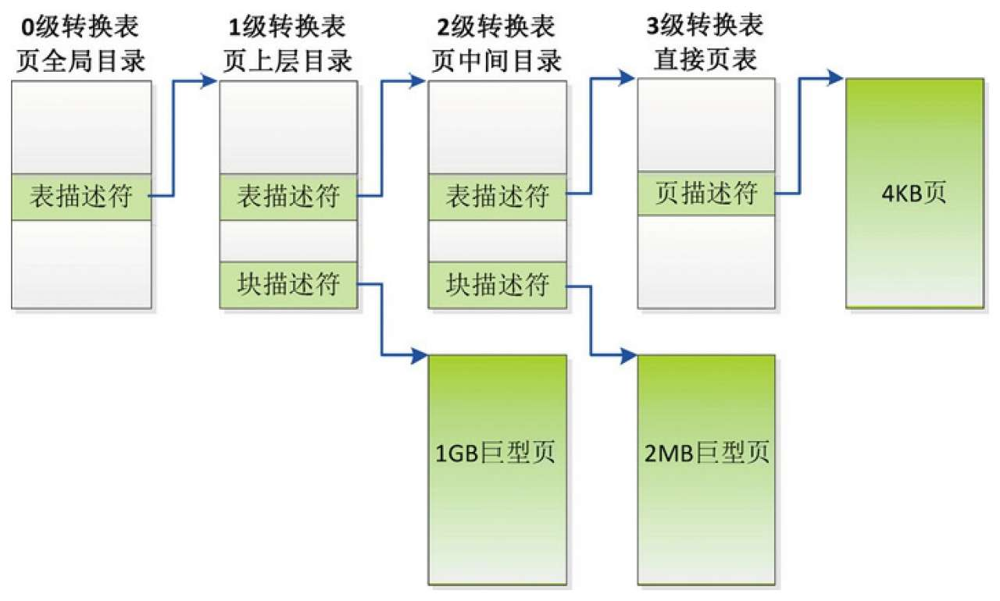
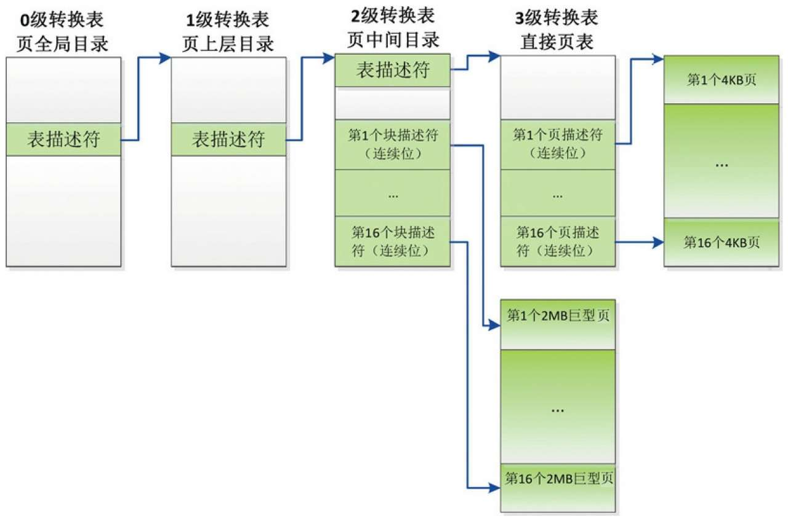

ARM64处理器支持巨型页的方式有两种. 

(1)通过**块描述符**支持. 

(2)通过**页/块描述符**的**连续位**支持. 

# 通过块描述符支持巨型页

如果**页长度**是 **4KB**, 那么使用 **4 级转换表**, **0 级转换表不能使用块描述符**, **1 级转换表**的**块描述符**指向**1GB巨型页**, **2级转换表**的**块描述符**指向**2MB巨型页**. 如 `图3.64` 所示.

图3.64 页长度为4KB时通过块描述符支持巨型页:

如果**页长度**是 **16KB**, 那么使用4级转换表, 0级转换表不能使用块描述符, 1级转换表不能使用块描述符, 2级转换表的块描述符指向32MB巨型页. 

如果**页长度**是 **64KB**, 那么使用3级转换表, 1级转换表不能使用块描述符, 2级转换表的块描述符指向512MB巨型页. 

# 通过页/块描述符的连续位支持巨型页

**页/块描述符**中的**连续位**指示**表项**是**一个连续表项集合**中的**一条表项**, 一个连续表项集合可以被缓存在一条TLB表项里面. 通俗地说, 进程申请了n页的虚拟内存区域, 然后申请了n页的物理内存区域, 使用n个连续的页表项把每个虚拟页映射到物理页, 每个页表项设置了连续标志位, 当处理器的内存管理单元遍历内存中的页表时, 访问到n个页表项中的任何一个页表项, 发现页表项设置了连续标志位, 就会把n个页表项合并以后填充到一个TLB表项. 当然, n不是随意选择的, 而且n页的虚拟内存区域的起始地址必须是n页的整数倍, n页的物理内存区域的起始地址也必须是n页的整数倍. 

如图3.65所示, 如果页长度是4KB, 那么使用4级转换表, 1级转换表的块描述符不能使用连续位；2级转换表的块描述符支持16个连续块, 即支持(16 × 2MB =32MB)巨型页；3级转换表的页描述符支持16个连续页, 即支持(16 × 4KB =64KB)巨型页. 

如果页长度是16KB, 那么使用4级转换表, 2级转换表的块描述符支持32个连续块, 即支持(32 × 32MB = 1GB)巨型页；3级转换表的页描述符支持128个连续页, 即支持(128 × 16KB = 2MB)巨型页. 

如果页长度是64KB, 那么使用3级转换表, 2级转换表的块描述符不能使用连续位；3级转换表的页描述符支持32个连续页, 即支持(32 × 64KB = 2MB)巨型页. 