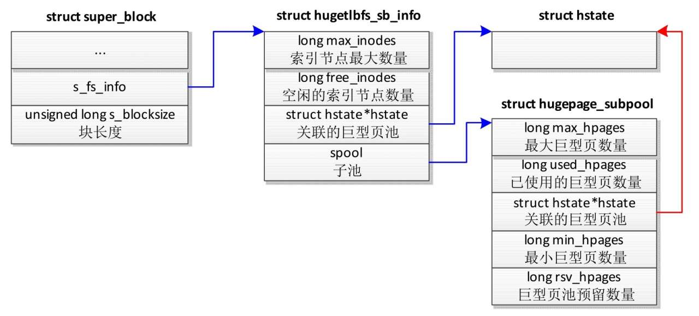

<!-- @import "[TOC]" {cmd="toc" depthFrom=1 depthTo=6 orderedList=false} -->

<!-- code_chunk_output -->

- [1. 使用方法](#1-使用方法)
  - [1.1. 内核编译](#11-内核编译)
  - [1.2. 巨型页设置](#12-巨型页设置)
    - [1.2.1. 永久巨型页](#121-永久巨型页)
    - [1.2.2. 临时巨型页](#122-临时巨型页)
    - [1.2.3. 巨型页池](#123-巨型页池)
  - [1.3. 创建内存映射](#13-创建内存映射)
    - [1.3.1. 匿名映射](#131-匿名映射)
    - [1.3.2. 基于文件的映射](#132-基于文件的映射)
  - [1.4. 巨型页信息查看](#14-巨型页信息查看)
- [2. 实现原理](#2-实现原理)
  - [2.1. 巨型页池 struct hstate](#21-巨型页池-struct-hstate)
  - [2.2. 预先分配永久巨型页](#22-预先分配永久巨型页)
    - [2.2.1. 内核参数 hugepages](#221-内核参数-hugepages)
    - [2.2.2. 写 nr_hugepages 文件](#222-写-nr_hugepages-文件)
  - [2.3. 挂载hugetlbfs文件](#23-挂载hugetlbfs文件)
  - [2.4. 创建文件](#24-创建文件)
  - [2.5. 创建内存映射](#25-创建内存映射)

<!-- /code_chunk_output -->

# 1. 使用方法

## 1.1. 内核编译

> kernel config

编译内核时需要打开配置宏 `CONFIG_HUGETLBFS` 和`CONFIG_HUGETLB_PAGE`(打开配置宏 `CONFIG_HUGETLBFS` 的时候会自动打开) .

## 1.2. 巨型页设置

### 1.2.1. 永久巨型页

> persistent hugepage

通过文件 “`/proc/sys/vm/nr_hugepages`” 指定**巨型页池**中**永久巨型页**的**数量**, 预先分配指定数量的永久巨型页到巨型页池中.

另一种方法是在**引导内核时**指定**内核参数** “`hugepages=N`” 以分配永久巨型页, 这是分配巨型页最可靠的方法, 因为**内存还没有碎片化**.

有些平台支持**多种巨型页长度**. 如果要分配特定长度的巨型页, 必须在内核参数 “`hugepages`” 前面添加选择**巨型页长度的参数** “`hugepagesz=<size>[kKmMgG]`”.

可以使用**内核参数** “`default_hugepagesz=<size>[kKmMgG]`” 选择**默认的巨型页长度**.

文件 “`/proc/sys/vm/nr_hugepages`” 表示**默认长度的永久巨型页的数量**.

### 1.2.2. 临时巨型页

> temporary hugepage

通过文件 “`/proc/sys/vm/nr_overcommit_hugepages`” 指定**巨型页池**中**临时巨型页的数量**, 当**永久巨型页用完**的时候, 可以从页分配器**申请临时巨型页**.

### 1.2.3. 巨型页池

> hugepage pool

`nr_hugepages` 是**巨型页池**的**最小数量**(大小), (`nr_hugepages + nr_overcommit_hugepages`) 是**巨型页池**的**最大数量**(大小). 这两个参数的默认值都是0, 至少要设置一个, 不然分配巨型页会失败.

## 1.3. 创建内存映射

### 1.3.1. 匿名映射

创建**匿名的巨型页映射**, 其代码如下:

```
#define MAP_LENGTH (10 * 1024 * 1024)
addr = mmap(0, MAP_LENGTH, PROT_READ | PROT_WRITE, MAP_ANONYMOUS | MAP_HUGETLB, -1, 0);
```

### 1.3.2. 基于文件的映射

创建**基于文件的巨型页映射**

1. 首先管理员需要在**某个目录**下**挂载 hugetlbfs 文件系统**:

```
mount -t hugetlbfs \
-o uid=<value>,gid=<value>,mode=<value>,pagesize=<value>,size=<value>, \
min_size=<value>,nr_inodes=<value> none <目录>
```

各选项的意思如下.

(1) 选项 uid 和 gid 指定**文件系统的根目录**的**用户**和**组**, 默认取**当前进程的用户和组**.

(2) 选项 mode 指定文件系统的根目录的模式, 默认值是0755.

(3) 如果**平台支持多种巨型页长度**, 可以使用选项 pagesize 指定巨型页长度和关联的巨型页池. 如果不使用选项 pagesize, 表示使用**默认的巨型页长度**.

(4) 选项 size 指定允许文件系统使用的**巨型页**的**最大数量**. 如果不指定选项size, 表示没有限制.

(5) 选项 `min_size` 指定允许文件系统使用的**巨型页**的**最小数量**. 挂载文件系统的时候, 申请巨型页池为这个文件系统**预留**选项 `min_size` 指定的巨型页数量. 如果不指定选项`min_size`, 表示没有限制.

(6) 选项 `nr_inodes` 指定文件系统中文件(一个文件对应一个索引节点) 的最大数量. 如果不指定选项nr_inodes, 表示没有限制.

假设在**目录** “`/mnt/huge`” 下**挂载**了 **hugetlbfs** 文件系统, **应用程序**在 hugetlbfs 文件系统中**创建文件**, 然后**创建基于文件的内存映射**, 这个内存映射就会使用巨型页.

```
#define MAP_LENGTH (10 * 1024 * 1024)
fd = open("/mnt/huge/test", O_CREAT | O_RDWR, S_IREXU);
addr = mmap(0, MAP_LENGTH, PROT_READ | PROT_WRITE, MAP_SHARED, fd, 0);
```

**应用程序**可以使用**开源**的 **hugetlbfs 库**, 这个库**对 hugetlbfs 文件系统做了封装**. 使用 hugetlbfs 库的好处如下.

(1) **启动程序**时使用**环境变量** “`LD_PRELOAD=libhugetlbfs.so`” 把 **hugetlbfs 库**设置成优先级最高的**动态库**, `malloc()` **使用巨型页**, 对应用程序完全透明, **应用程序不需要修改代码**.

(2) 可以把代码段、数据段和未初始化数据段都放在巨型页中.

## 1.4. 巨型页信息查看

执行命令 “`cat /proc/meminfo`” 可以看到巨型页的信息:

```
...
HugePages_Total:       0
HugePages_Free:        0
HugePages_Rsvd:        0
HugePages_Surp:        0
Hugepagesize:       2048 kB
```

这些字段的意思如下.

(1) `HugePages_Total`: **巨型页池**的**大小**.

(2) `HugePages_Free`: 巨型页池中**没有分配**的巨型页的**数量**.

(3) `HugePages_Rsvd`: “Rsvd”是“Reserved”的缩写, 意思是“预留的”, 是**已经承诺从巨型页池中分配**但是**还没有分配**的巨型页的**数量**. 预留的巨型页保证**应用程序**在**发生缺页异常**的时候能够从巨型页池中分配一个巨型页.

(4) `HugePages_Surp`: “Surp”是“Surplus”的缩写, 意思是“**多余的**”, 是巨型页池中**临时巨型页**的数量. 临时巨型页的最大数量由“`/proc/sys/vm/nr_overcommit_hugepages`”控制.

(5) Hugepagesize: 巨型页的大小.

# 2. 实现原理

## 2.1. 巨型页池 struct hstate

内核使用巨型页池**管理巨型页**.

有的**处理器架构**支持多种巨型页长度, **每种巨型页长度**对应一个, 有一个**默认的巨型页长度**, 默认**只创建**巨型页长度是**默认长度的巨型页池**. 例如 ARM64 架构在页长度为4KB的时候支持的巨型页长度是1GB、32MB、2MB和64KB, 默认的巨型页长度是2MB, 默认只创建巨型页长度是2MB的巨型页池.

如果需要创建巨型页长度**不是默认长度的巨型页池**, 可以在引导内核时指定内核参数 “`hugepagesz=<size>[kKmMgG]`”, 长度必须是处理器支持的长度. 可以使用内核参数 “`default_hugepagesz=<size>[kKmMgG]`” 选择默认的巨型页长度.

**巨型页池**的数据结构是结构体 `hstate`, **全局数组 hstates** 是**巨型页池数组**, **全局变量** `hugetlb_max_hstate` 是**巨型页池的数量**, 全局变量 `default_hstate_idx` 是**默认巨型页池**的**索引**.

```cpp
// mm/hugetlb.c
int hugetlb_max_hstate __read_mostly;
unsigned int default_hstate_idx;
struct hstate hstates[HUGE_MAX_HSTATE];
```

**巨型页池**中的**巨型页**分为两种.

1) **永久巨型页**: 永久巨型页是保留的, 不能有其他用途, 被预先分配到巨型页池, 当进程释放永久巨型页的时候, 永久巨型页被归还到巨型页池.

2) **临时巨型页**: 也称为**多余的**(`surplus`) 巨型页, 当永久巨型页用完的时候, 可以从**页分配器**分配**临时巨型页**；进程释放临时巨型页的时候, **直接释放到页分配器**. 当设备长时间运行后, 内存可能碎片化, 分配临时巨型页可能失败.

巨型页池的数据结构 hstate 的主要成员如下表所示.


## 2.2. 预先分配永久巨型页

预先分配指定数量的永久巨型页到巨型页池中有两种方法.

1) 最可靠的方法是在**引导内核**时指定**内核参数** “`hugepages=N`” 来分配永久巨型页, 因为内核初始化的时候**内存还没有碎片化**.

有些处理器架构支持多种巨型页长度. 如果要分配特定长度的巨型页, 必须在内核参数 “hugepages” 前面添加选择巨型页长度的参数
“`hugepagesz=<size>[kKmMgG]`”.

2) 通过文件 “`/proc/sys/vm/nr_hugepages`” 指定默认长度的永久巨型页的数量.

### 2.2.1. 内核参数 hugepages

内核参数 “`hugepages=N`” 的处理函数是 `hugetlb_nrpages_setup`, 其代码如下:

```cpp
// mm/hugetlb.c
1   static int __init hugetlb_nrpages_setup(char *s)
2   {
3    unsigned long *mhp;
4    static unsigned long *last_mhp;
5
6    if (!parsed_valid_hugepagesz) {
7         pr_warn("hugepages = %s preceded by "
8               "an unsupported hugepagesz, ignoring\n", s);
9         parsed_valid_hugepagesz = true;
10        return 1;
11   }
12   /*
13    * “! hugetlb_max_hstate”意味着没有解析一个“hugepagesz=”参数，
14    * 所以这个“hugepages=”参数对应默认的巨型页池。
15    */
16   else if (! hugetlb_max_hstate)
17        mhp = &default_hstate_max_huge_pages;
18   else
19        mhp = &parsed_hstate->max_huge_pages;
20
21   if (mhp == last_mhp) {
22        pr_warn("hugepages= specified twice without interleaving hugepagesz=,
	ignoring\n");
23        return 1;
24   }
25
26   if (sscanf(s, "%lu", mhp) <= 0)
27        *mhp = 0;
28
29   if (hugetlb_max_hstate && parsed_hstate->order >= MAX_ORDER)
30        hugetlb_hstate_alloc_pages(parsed_hstate);
31
32   last_mhp = mhp;
33
34   return 1;
35  }
36  __setup("hugepages=", hugetlb_nrpages_setup);
```

第6～10行代码, 如果内核参数 “`hugepagesz=`” 指定的**巨型页长度**是非法的, 直接返回.

第16行和第17行代码, 如果前面没有内核参数 “`hugepagesz=`”, 那么内核参数 “`hugepages=`” 指定默认巨型页池的永久巨型页的数量.

第18行和第19行代码, 如果前面有内核参数 “`hugepagesz=`” 指定巨型页长度, 那么内核参数 “`hugepages=`” 指定该巨型页长度对应的巨型页池的永久巨型页的数量.

第26行代码, 解析并保存内核参数 “`hugepagesz=`” 的值.

第29行和第30行代码, 如果前面有内核参数 “`hugepagesz=`” 指定巨型页长度, 并且**巨型页长度**超过**页分配器**支持的**最大阶数**, 那么需要从**引导内存分配器**分配巨型页. 如果**巨型页长度小于或等于页分配器支持的最大阶数**, 巨型页子系统在初始化的时候从**页分配器**分配巨型页.

> 这里并**没有**针对巨型页长度order小于等于页分配器order这种情况分配页面

函数 `hugetlb_hstate_alloc_pages` 负责**预先分配**指定数量的永久巨型页, 其代码如下:

```cpp
// mm/hugetlb.c
1   static void __init hugetlb_hstate_alloc_pages(struct hstate *h)
2   {
3    unsigned long i;
4
5    for (i = 0; i < h->max_huge_pages; ++i) {
6         if (hstate_is_gigantic(h)) {
7               if (!alloc_bootmem_huge_page(h))
8                    break;
9         } else if (!alloc_fresh_huge_page(h,
10                          &node_states[N_MEMORY]))
11              break;
12   }
13   h->max_huge_pages = i;
14  }
```

第6行和第7行代码, 如果**巨型页长度超过页分配器支持的最大阶数**, 那么从**引导内存分配器**分配巨型页.

第9行代码, 如果**巨型页长度小于或等于页分配器支持的最大阶数**, 那么从**页分配器**分配巨型页.

函数 `alloc_bootmem_huge_page` 负责从**引导内存分配器**分配巨型页, 其代码如下:

```cpp
// mm/hugetlb.c
1   int __weak alloc_bootmem_huge_page(struct hstate *h)
2   {
3    struct huge_bootmem_page *m;
4    int nr_nodes, node;
5
6    for_each_node_mask_to_alloc(h, nr_nodes, node, &node_states[N_MEMORY]) {
7         void *addr;
8
9         addr = memblock_virt_alloc_try_nid_nopanic(
10                   huge_page_size(h), huge_page_size(h),
11                   0, BOOTMEM_ALLOC_ACCESSIBLE, node);
12        if (addr) {
13              m = addr;
14              goto found;
15        }
16   }
17   return 0;
18
19   found:
20    BUG_ON(! IS_ALIGNED(virt_to_phys(m), huge_page_size(h)));
21    /* 先把它们放到私有链表中，因为 mem_map 还没准备好 */
22    list_add(&m->list, &huge_boot_pages);
23    m->hstate = h;
24    return 1;
25   }
```

第9行代码, 从内存节点分配巨型页.

第22行代码, 把巨型页添加到**链表** `huge_boot_pages` 中.

在**巨型页子系统初始化**时, 把**链表** `huge_boot_pages` 中的巨型页添加到对应的**巨型页池**中, 其代码如下:

```cpp
// hugetlb_init() -> gather_bootmem_prealloc()
// mm/hugetlb.c
1   static void __init gather_bootmem_prealloc(void)
2   {
3    struct huge_bootmem_page *m;
4
5    list_for_each_entry(m, &huge_boot_pages, list) {
6         struct hstate *h = m->hstate;
7         struct page *page;
8
9   #ifdef CONFIG_HIGHMEM
10        page = pfn_to_page(m->phys >> PAGE_SHIFT);
11        memblock_free_late(__pa(m),
12                      sizeof(struct huge_bootmem_page));
13  #else
14        page = virt_to_page(m);
15  #endif
16        WARN_ON(page_count(page) ! = 1);
17        prep_compound_huge_page(page, h->order);
18        WARN_ON(PageReserved(page));
19        prep_new_huge_page(h, page, page_to_nid(page));
20        if (hstate_is_gigantic(h))
21              adjust_managed_page_count(page, 1 << h->order);
22   }
23  }
```

第17行代码, 把**巨型页**组织成**复合页**.

第19行代码, 把**巨型页**添加到**对应的巨型页池**中.

如果巨型页长度小于或等于页分配器支持的**最大阶数**, 那么在**巨型页子系统初始化的时候**从**页分配器**预先分配永久巨型页, 其代码如下:

```cpp
// hugetlb_init() -> hugetlb_init_hstates()
// mm/hugetlb.c
static void __init hugetlb_init_hstates(void)
{
	struct hstate *h;
	for_each_hstate(h) {
	if (minimum_order > huge_page_order(h))
		minimum_order = huge_page_order(h);
	/* 长度超过页分配器支持的最大阶数的巨型页已经从引导内存分配器中分配 */
	if (!hstate_is_gigantic(h))
		hugetlb_hstate_alloc_pages(h);
	}
	VM_BUG_ON(minimum_order == UINT_MAX);
}
```

针对**每个巨型页池**, 如果巨型页长度小于或等于页分配器支持的最大阶数, 那么从**页分配器**分配永久巨型页, 添加到巨型页池中.

### 2.2.2. 写 nr_hugepages 文件

文件 “`/proc/sys/vm/nr_hugepages`” 的处理函数是 `hugetlb_sysctl_handler`, 最终调用函数 `set_max_huge_pages` 来**增加或减少永久巨型页**, 其代码如下:

```cpp
// hugetlb_sysctl_handler() -> hugetlb_sysctl_handler_common() -> __nr_hugepages_store_common() -> set_max_huge_pages()
// mm/hugetlb.c
1   static unsigned long set_max_huge_pages(struct hstate *h, unsigned long count,
2                               nodemask_t *nodes_allowed)
3   {
4    unsigned long min_count, ret;
5
6    if (hstate_is_gigantic(h) && ! gigantic_page_supported())
7         return h->max_huge_pages;
8
9    spin_lock(&hugetlb_lock);
10   while (h->surplus_huge_pages && count > persistent_huge_pages(h)) {
11        if (! adjust_pool_surplus(h, nodes_allowed, -1))
12              break;
13   }
14
15   while (count > persistent_huge_pages(h)) {
16         spin_unlock(&hugetlb_lock);
17
18         /* 让出处理器，避免死锁(soft lockup) */
19         cond_resched();
20
21         if (hstate_is_gigantic(h))
22               ret = alloc_fresh_gigantic_page(h, nodes_allowed);
23         else
24               ret = alloc_fresh_huge_page(h, nodes_allowed);
25         spin_lock(&hugetlb_lock);
26         if (! ret)
27               goto out;
28
29         /* 去处理信号，用户可能按下ctrl+c组合键 */
30         if (signal_pending(current))
31               goto out;
32   }
33
34   min_count = h->resv_huge_pages + h->nr_huge_pages - h->free_huge_pages;
35   min_count = max(count, min_count);
36   try_to_free_low(h, min_count, nodes_allowed);
37   while (min_count < persistent_huge_pages(h)) {
38         if (! free_pool_huge_page(h, nodes_allowed, 0))
39               break;
40         cond_resched_lock(&hugetlb_lock);
41   }
42   while (count < persistent_huge_pages(h)) {
43         if (! adjust_pool_surplus(h, nodes_allowed, 1))
44               break;
45   }
46  out:
47   ret = persistent_huge_pages(h);
48   spin_unlock(&hugetlb_lock);
49   return ret;
50  }
```

参数 count 指定**永久巨型页**的**最大数量**.

第10～32行代码, 如果**增加永久巨型页**的数量, 处理如下.

* 第10～13行代码, 如果有**临时巨型页**, 那么**把临时巨型页转换为永久巨型页**.

* 第15～32行代码, 如果**永久巨型页**的**数量不够**, 那么**分配巨型页**.

第34行和第45行代码, 如果减小永久巨型页的数量, 处理如下.

* 第34行代码, `min_count` 等于(**巨型页总数** − (**空闲巨型页数量** − **预留巨型页数量**) ), 即**扣除没有预留的空闲巨型页**.

> 注意**预留巨型页数量**包含在空闲巨型页数量里面, 进程创建内存映射的时候已经申请预留巨型页.

* 第35行代码, `min_count` **不能小于** `count`.

* 第36行代码, 如果支持高端内存区域, 优先把从低端内存区域分配的没有预留的空闲巨型页归还给页分配器.

* 第37～41行代码, 如果永久巨型页的数量超过 `min_count`, 那么把没有预留的空闲巨型页归还给页分配器.

* 第42～45行代码, 如果永久巨型页的数量超过指定的最大数量, 那么把**永久巨型页**转换为**临时巨型页**.

## 2.3. 挂载hugetlbfs文件

(3) 挂载hugetlbfs文件.

hugetlbfs文件系统在初始化的时候, 调用函数 `register_filesystem` 以注册 hugetlbfs 文件系统, hugetlbfs 文件系统的结构体如下:

```cpp
// fs/hugetlbfs/inode.c
static struct file_system_type hugetlbfs_fs_type = {
	.name          = "hugetlbfs",
	.mount         = hugetlbfs_mount,
	.kill_sb       = kill_litter_super,
};
```

挂载 hugetlbfs 文件系统的时候, 挂载函数调用 hugetlbfs 文件系统的挂载函数 `hugetlbfs_mount`, 创建**超级块**和**根目录**, 把**文件系统**和**巨型页池**关联起来.

如图3.66所示, 超级块的成员 `s_fs_info` 指向 hugetblfs 文件系统的**私有信息**；成员 `s_blocksize` 是**块长度**, 被设置为**巨型页的长度**.

图3.66 hugetlbfs文件系统关联巨型页池



结构体 `hugetlbfs_sb_info` 描述 hugetblfs 文件系统的**私有信息**.

1) 成员 `max_inode` 是允许的**索引节点最大数量**.

2) 成员 `free_inodes` 是**空闲的索引节点数量**.

3) 成员 `hstate` 指向**关联的巨型页池**.

4) 如果指定了**最大巨型页数量**或**最小巨型页数量**, 那么为巨型页池创建一个**子池**, 成员 spool 指向**子池**.

结构体 `hugepage_subpool` 描述**子池的信息**.

1) 成员 max_hpages 是允许的最大巨型页数量.

2) used_hpages 是已使用的巨型页数量, 包括分配的和预留的.

3) 成员 hstate 指向巨型页池.

4) 成员 min_hpages 是最小巨型页数量.

5) 成员 rsv_hpages 是子池向巨型页池申请预留的巨型页的数量.

## 2.4. 创建文件

(4) 创建文件.

调用系统调用 `open()`, 在 hugetlbfs 文件系统的一个目录下创建一个文件的时候, 系统调用 open 最终调用函数 `hugetlbfs_create()` 为文件**分配索引节点**(结构体 `inode`) 并且初始化, 索引节点的成员 `i_fop` 指向 hugetlbfs 文件系统特有的**文件操作集合** `hugetlbfs_file_operations`, 这个文件操作集合的成员 mmap 方法是函数 `hugetlbfs_file_mmap()`, 这个函数在**创建内存映射**的时候很关键.

## 2.5. 创建内存映射

(5) 创建内存映射.

在 hugetlbfs 文件系统中打开文件, 然后**基于这个文件创建内存映射**时, 系统调用 mmap 将会调用函数 `hugetlbfs_file_mmap()`.

函数 `hugetlbfs_file_mmap()` 的主要功能如下.

1) 设置**标准巨型页标志** `VM_HUGETLB` 和**不允许扩展标志** `VM_DONTEXPAND`.

2) 虚拟内存区域的成员 `vm_ops` 指向巨型页特有的**虚拟内存操作集合** `hugetlb_vm_ops`.

3) 检查文件的偏移是不是巨型页长度的整数倍.

4) 调用函数 `hugetlb_reserve_pages()`, 向巨型页池**申请预留巨型页**.

函数 `hugetlb_reserve_pages()` 的主要功能如下.

1) 如果设置标志位 `VM_NORESERVE` 指定不需要预留巨型页, 直接返回.

2) 如果是**共享映射**, 那么使用**文件的索引节点**的**预留图**(结构体 `resv_map`) , 如图3.67所示, 在预留图中查看**从文件的起始偏移**到**结束偏移**有**哪些部分**以前**没有预留**, 计算需要预留的巨型页的数量 N.

图3.67 共享映射的预留图:


3) 如果是**私有映射**, 那么**创建预留图**, 虚拟内存区域的成员 `vm_private_data` 指向**预留图**, 并且设置标志 `HPAGE_RESV_OWNER` 指明**该虚拟内存区域拥有这个预留**, 如图3.68所示. 计算**需要预留的巨型页的数量** N =(文件的结束偏移 − 起始偏移), 偏移的单位是**巨型页长度**.

图3.68 私有映射的预留图:


**虚拟内存区域**的成员 `vm_private_data` 的**最低两位**用来存储**标志位**.

* 标志位 `HPAGE_RESV_OWNER`, 值为1, 指明当前进程是**预留的拥有者**.
* 标志位 `HPAGE_RESV_UNMAPPED`, 值为2. 对于**私有映射**, 如果创建映射的进程在执行写时复制时分配巨型页失败, 那么删除所有子进程的映射, 设置该标志, 让子进程在发生页错误异常时被杀死.

4) 如果文件系统**创建**了**巨型页子池**, 计算子池需要向巨型页池申请预留的巨型页的数量, 否则需要向巨型页池申请预留的巨型页的数量是 N.

如果子池以前申请预留的巨型页数量大于或等于N, 那么子池不需要向巨型页池申请预留.

如果子池以前申请预留的巨型页数量小于N, 那么子池需要向巨型页池申请预留的数量等于(N − 子池以前申请预留的巨型页数量) .

5) 向巨型页池**申请预留**指定数量的巨型页.

6) 如果是**共享映射**, 那么在**预留图的区域链表**中增加 1 个 file_region 实例, 记录预留区域.

(6) 分配和映射到巨型页.

**第一次访问巨型页**的时候触发**缺页异常**, 函数 `handle_mm_fault` 发现**虚拟内存区域**设置了标志 `VM_HUGETLB`, 调用**巨型页的页错误处理函数** `hugetlb_fault`.

函数 `hugetlb_fault` 发现**页表项**是**空表项**, 调用函数 `hugetlb_no_page` 以分配并且映射到巨型页.

函数 `hugetlb_no_page` 的执行过程如下.

1) 在文件的页缓存中根据文件的页偏移查找页.

2) 如果在页缓存中没有找到页, 调用函数 alloc_huge_page 以分配巨型页. 如果是**共享映射**, 那么把巨型页加入文件的页缓存, 以便和其他进程共享页.

3) 设置**页表项**.

4) 如果第一步在页缓存中找到页, 映射是**私有的**, 并且执行写操作, 那么**执行写时复制**.

函数 `alloc_huge_page` 的执行过程如下.

1) 检查预留图, 确定进程是否预留过要分配的巨型页.

2) 如果进程没有预留巨型页, 检查分配是否超过子池的限制.

3) 从巨型页池中目标内存节点的空闲链表中分配永久巨型页.

4) 如果分配永久巨型页失败, 那么尝试从页分配器分配临时巨型页.

(7) 写时复制.

假设进程1创建了私有的巨型页映射, 然后进程1分叉生成进程2和进程3. 其中一个进程试图写巨型页的时候, 触发页错误异常, 巨型页的页错误处理函数 `hugetlb_fault` 调用函数 `hugetlb_cow` 以执行写时复制.

函数 `hugetlb_cow` 的执行过程如下.

1) 如果只有一个虚拟页映射到该物理页, 并且是匿名映射, 那么不需要复制, 直接修改页表项设置可写.

2) 分配巨型页.

3) 处理分配巨型页失败的情况.

如果触发页错误异常的进程是创建私有映射的进程, 那么删除所有子进程的映射, 为子进程的虚拟内存区域的成员 `vm_private_data` 设置标志 `HPAGE_RESV_UNMAPPED`, 让子进程在发生页错误异常的时候被杀死. 如果触发页错误异常的进程不是创建私有映射的进程, 返回错误.

4) 把旧页的数据复制到新页.

5) 修改页表项, 映射到新页, 并且设置可写.