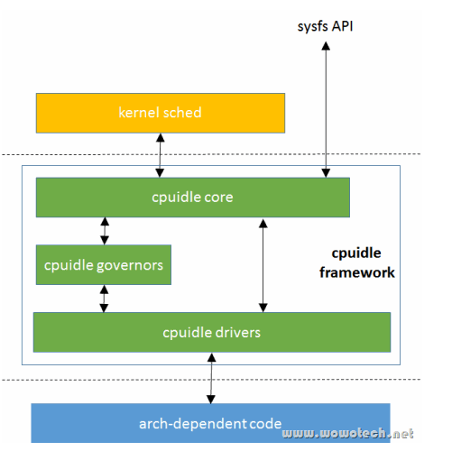

cpu idle 相关的指令有 HLT/PAUSE/MWAIT/UMWAT/TPAUSE.

Linux 内核中由 Scheduler 来判断 CPU 的工作量, 从而决定是否让 CPU idle. CPU 层面的手段很多, 但是 OS 层面只有一个抽象的概念即 idle.

那么, Scheduler 到底是如何判断当前工作量不饱满呢?

# 调度器中idle触发条件

Linux Scheduler 为每个 CPU 都维护有一个 RunQueue, 可以认为是一个任务列表, 当且仅当所有任务都不是 runnable 状态时, Scheduler 才会切换到 idle process. 同时可以通过 nohz/nohz_full 启动参数减少 tick 中断对 idle cpu 的干扰.

## idle进程

首个 idle 进程是 0 号进程转换的.

kernel 中所有进程都来自一个静态结构体 `struct task_struct init_task`, init_task 会转化成 idle 进程.

`rest_init()` -> `cpu_startup_entry()` -> `while(1) do_idle()`

在smp系统中 core0 以外的其它core 也会通过 `start_secondary` 函数最终产生0号进程且调用 `cpu_startup_entry` 来进入idle loop之中.

# CPU的各种手段

## X86

### HLT

这是初代的 idle 指令, 于 486DX 时代引入. 首先只有在 ring0 的特权级别才能执行HLT指令, 同时执行的效果是 CPU 进入了 C1/C1E state(参考ACPI标准). APIC/BUS/CACHE 都是照常运转, 只要**中断发生**, CPU 立即就要回到产线继续工作. C1E 稍微又优待 CPU, 停止内部时钟又降了压.

### PAUSE

也是非常早期的指令(Pentium 4), 让CPU 休息, 大概从几个到几十个 cycles(各代CPU有差异). 为什么要打盹呢? 其实主要是要降低 CPU 在特定情况下(spin-lock)给**内存控制器**带来的压力, 与其让 CPU 阻塞了内存控制器, 不如让它休息. 在最近的几代Xeon之上还附带了降低功耗的buff.

### MWAIT/MONITOR

新一代 CPU 架构师回顾了前辈的设计, 觉得 CPU 的权力完全没有得到充分的照顾, 应该给予更进一步的休息机会乃至真正的躺平! 而且唤醒的条件又多了一个, 除了**中断这种强唤醒模式**以外, 又加了内存的 CacheLine Invalidate 唤醒. 首先这两条指令也只能在 ring0 级别执行, 首先是调用 MONITOR 地址范围, 其次是 MWAIT 进入休眠, 一旦**该地址的内存**被任何其它的主体修改, 则唤醒 CPU 起来继续工作. 同时这次最大的改进是可以通过 MWAIT 进入各种不同的 Cstate. 其中 C6 是真正的躺平: CPU 电压可以归0同时cache 也停.

最常见的C State 状态详细描述

<table style="width:100%">
  <tr>
    <th>
    Cstate
    </th>
    <th>
    Name
    </th>
    <th>
    Description
    </th>
  </tr>
  <tr>
    <td>
    C0
    </td>
    <td>
    Operating State
    </td>
    <td>
    CPU fully turned on
    </td>
  </tr>
  <tr>
    <td>
    C1E
    </td>
    <td>
    Enhanced Halt
    </td>
    <td>
    Stops CPU main internal clocks via software and reduces CPU voltage; bus interface unit and APIC are kept running at full speed
    </td>
  </tr>
  <tr>
    <td>
    C3
    </td>
    <td>
    Deep Sleep
    </td>
    <td>
    Stops all CPU internal and external clocks
    </td>
  </tr>
  <tr>
    <td>
    C6
    </td>
    <td>
    Deep Power Down
    </td>
    <td>
    Reduces the CPU internal voltage to any value, including 0 Volts
    </td>
  </tr>
</table>

### UMWAIT/UMONITOR

MWAIT虽好, 但是奈何必须在ring0特权级下执行, 如果是一些特定的用户级应用例如DPDK, Linux的 idle driver 是很难得到执行的机会, 所以CPU架构师又生怜悯之心, 允许CPU在用户级也能进入躺平的模式, 不过作为妥协连 C1 state 都不行, 只能进入 C0.1/C0.2 等神秘模式. 效果还有待观察, 不过话说回来 SPR 这代Xeon才开始支持.

### TPAUSE

UMWAIT 指令的升级加强版, 附带了一个 timer. TPAUSE 可以让 CPU 根据规定好的时间进行休息,  时间一到, 立刻继续搬砖. 当然这也是一个簇新簇新的指令, 大家还要等待SPR.

## ARM

ARM的Idle-state 级别情况比较复杂一些, 更多的是和具体的芯片实现相关. 但是总体上也是把握几个大的类别:

* 只是停止CPU内部时钟
* CPU降频
* 停止给Cache供电
* 停止给CPU供电

和X86 相比 Arm的唤醒机制没有和MESI协议连接有些遗憾(也就是没有实现通过MEM 地址监控的方式达成唤醒).

### YEILD

这条颇为类似 PAUSE基本功能接近,使用场景也接近(spin lock).

### WFE/WFI

这两条指令顾名思义 wait for event/ wait for interrupt, 中断这条大家都可以理解类似HLT,那么event这条就值得看看了. ARM架构可以从一个CPU向所有其它CPU 发送event(sev 指令), 我的理解类似IPI广播, 收到了此event的CPU如果处于idle状态, 则需要立即唤醒. (注:和宋老师讨论以后发现 event 和IPI的一个区别是不需要ISR来响应, 同时event并不能唤醒由于WFI指令进入的idle, 这个有点囧, 反过来中断可以唤醒由于WFE进入的idle. 这两个躺平姿势水很深啊)

# 软件实现

除了硬件的各种花式躺平技术之外还有两类"伪躺平"技术.

## idle polling

通过**启动参数**, 我们可以指定 cpu的 **idle 进程**并**不调用**硬件提供的 idle 功能而仅仅是 **polling**, 这种情况主要用于需要极低的 CPU 从 idle 状态返回时延的场景. 那么如果压根没有进入实际的idle状态, 当然时延是极低的, 同时也能融入到idle整体的框架, 不至于破坏规矩开特例.

相关细节参考内核文档

Documentation/admin-guide/pm/cpuidle.rst:

## halt-polling

在打开虚拟化的场景下, 事情就变得更加有趣了. 大多数情况下, qemu 会缺省的只对guest 提供 HLT 指令作为 idle 的唯一机制, 但是 HLT 指令毫无悬念的会触发 VMEXIT. 虽然说大多数情况下 kvm 看到exit reason 是 HLT 也只是执行 poll 而已, 但是 VMEXIT/VM_RESUME 还是如此的痛, 毕竟几千个 cycles 已经无谓流逝, 追求极致的我们怎么能放任资源浪费. 于是 Redhat 在 Guest 端引入了halt poll 机制, 也就是说如果 matrix 中的 CPU 首先开始假摸鱼(poll), 如果假摸鱼时间超过了阈值才真的去触发HLT指令. 如果很快就被从假模鱼状态拉回去搬砖, 则省去了出入matrix的费用(经理得意的笑了).

相关细节参考内核文档:

Documentation/virt/guest-halt-polling.rst

Documentation/translations/zh_CN/virt/guest-halt-polling.rst

# CPU idle driver/governor

最后软件硬件各种方式很多, 内核无奈又祭出了抽象大法把 idle 的时长与返回时延的选择与具体执行 idle 的机制分离开来.

* idle governor 就负责做时长与时延的选择, 也可以称为 idle -select.

* idle driver 则是负责通过我们上面描述的各种软硬件机制来实现 governor 指定的目标. 同时向 governor menu 经理提供各种不同机制的性能参数, 以供 menu 经理选择,  就是所谓的 idle-enter.

idle governor 缺省的算法只有一个就是menu, 还有3个候选的ladder/TEO/haltpoll 算法但是一般需要重新编译内核来激活.

* ladder 算法故名意思, 是首先从能耗较高/返回时延较小的状态开始, 当系统idle超过了阈值再进入更深的节能状态, 从而逐步升级节能状态. 俗称添油战术也可以美其名曰"快速迭代".

* menu 算法单从名字看则有点让人摸不到头脑,其内部机制也确实颇为复杂, menu算法主要是要在节能状态的停留时间与系统能容忍的返回时延之间做权衡以达到最佳效果.

请原谅我非常不精确地描述一下menu. menu仿佛一个非常敬业的经理凡事都要精算做出最优选择, CPU工人一旦休息再想打起精神干活这个转换是有一个代价的, 往往需要口头鼓励(画饼)+物质鼓励(肉夹馍). 那么经理就要考虑如果工人休息时间太短,休息的好处远低于让CPU工人重新振作的代价,那么这个休息就是不合理的(无情啊). 而且休息也有好些种类, 从假休息到完全躺平, 到底哪一种休息状态才是收益比最佳的? menu会无情的选择那个休息带来好处大于重新振作代价的方案. 同时menu经理还会受到来自客户的压力, 时延也是要满足的. 客户的耐心大抵上都是不好的, menu经理会疯狂试探客户的底线. 它选择的方案是满足客户耐心上限的情况下CPU工人消耗能耗最少的方案. 同时做到以上两点 menu经理大约才能有希望完成OKR/KPI.

# 参考文献

https://www.51cto.com/article/665543.html

[1] https://www.kernel.org/doc/Documentation/devicetree/bindings/arm/idle-states.txt

[2] https://www.dell.com/support/kbdoc/en-ie/000060621/what-is-the-c-state

[3] Intel SDM latest version

[4] https://www.kernel.org/doc/html/latest/virt/guest-halt-polling.html

[5] https://www.kernel.org/doc/html/latest/admin-guide/pm/cpuidle.html

[6] https://www.programmersought.com/article/13982556297/
