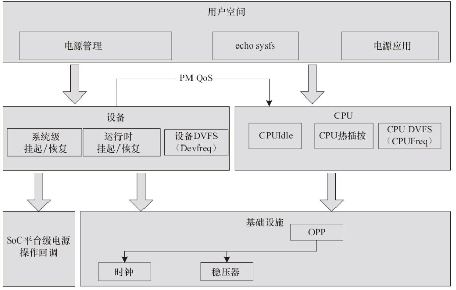

Linux 电源管理非常复杂，牵扯到系统级的待机、频率电压变换、系统空闲时的处理以及每个设备驱动对系统待机的支持和每个设备的运行时（Runtime）电源管理，可以说它和系统中的每个设备驱动都息息相关。

下图呈现了 Linux 内核电源管理的整体架构。

大体可以归纳为如下几类：

1）CPU 在运行时根据系统负载进行动态电压和频率变换的 CPUFreq。

2）CPU 在系统空闲时根据空闲的情况进行低功耗模式的 CPUIdle。

3）多核系统下 CPU 的热插拔支持。

4）系统和设备针对延迟的特别需求而提出申请的 PM QoS，它会作用于 CPUIdle 的具体策略。

5）设备驱动针对系统挂起到 RAM/硬盘 的一系列入口函数。

6）SoC 进入挂起状态、SDRAM 自刷新的入口。

7）设备的运行时动态电源管理，根据使用情况动态开关设备。

8）底层的时钟、稳压器、频率/电压表（OPP 模块完成）支撑，各驱动子系统都可能用到。

# CPUFreq 驱动

CPUFreq 子系统位于 `drivers/cpufreq` 目录下，负责进行运行过程中 CPU 频率和电压的动态调整，即 DVFS（Dynamic Voltage Frequency Scaling，动态电压频率调整）。运行时进行 CPU 电压和频率调整的原因是：CMOS 电路中的功耗与电压的平方成正比、与频率成正比，因此降低电压和频率可降低功耗。

CPUFreq 的核心层位于 `drivers/cpufreq/cpufreq.c` 下，它为各个 SoC 的 CPUFreq 驱动的实现提供了一套统一的接口，并实现了一套 notifier 机制，可以在 CPUFreq 的策略和频率改变的时候向其他模块发出通知。

