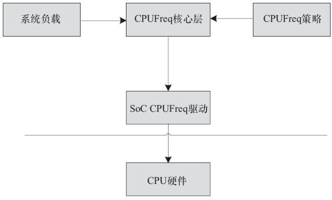

Linux 电源管理非常复杂，牵扯到系统级的待机、频率电压变换、系统空闲时的处理以及每个设备驱动对系统待机的支持和每个设备的运行时（Runtime）电源管理，可以说它和系统中的每个设备驱动都息息相关。

下图呈现了 Linux 内核电源管理的整体架构。


大体可以归纳为如下几类：

1）CPU 在运行时根据系统负载进行动态电压和频率变换的 CPUFreq。

2）CPU 在系统空闲时根据空闲的情况进行低功耗模式的 CPUIdle。

3）多核系统下 CPU 的热插拔支持。

4）系统和设备针对延迟的特别需求而提出申请的 PM QoS，它会作用于 CPUIdle 的具体策略。

5）设备驱动针对系统挂起到 RAM/硬盘 的一系列入口函数。

6）SoC 进入挂起状态、SDRAM 自刷新的入口。

7）设备的运行时动态电源管理，根据使用情况动态开关设备。

8）底层的时钟、稳压器、频率/电压表（OPP 模块完成）支撑，各驱动子系统都可能用到。

# CPUFreq 驱动

CPUFreq 子系统位于 `drivers/cpufreq` 目录下，负责进行运行过程中 **CPU 频率**和**电压**的**动态调整**，即 DVFS（`Dynamic Voltage Frequency Scaling`，**动态电压频率调整**）。运行时进行 CPU 电压和频率调整的原因是：**CMOS** 电路中的功耗与电压的平方成正比、与频率成正比，因此降低电压和频率可降低功耗。

CPUFreq 的核心层位于 `drivers/cpufreq/cpufreq.c` 下，它为各个 SoC 的 CPUFreq 驱动的实现提供了一套统一的接口，并实现了一套 **notifier** 机制，可以在 CPUFreq 的策略和频率改变的时候**向其他模块发出通知**。

# CPUFreq 的策略

SoC CPUFreq 驱动只是设定了 CPU 的频率参数，以及提供了设置频率的途径，但是它并不会管 CPU 自身究竟应该运行在哪种频率上。究竟频率依据的是哪种标准，进行何种变化，而这些完全由 CPUFreq 的策略（policy）决定，这些策略如表所示。


Android 系统中，则增加了 1 个交互策略，该策略适合于对延迟敏感的 UI 交互任务，当有 UI 交互任务的时候，该策略会更加激进并及时地调整 CPU 频率。

总而言之，系统的状态以及 CPUFreq 的策略共同决定了 CPU 频率跳变的目标，CPUFreq 核心层并将目标频率传递给底层具体 SoC 的 CPUFreq驱动，该驱动修改硬件，完成频率的变换，如图所示。



用户空间一般可通过 /sys/devices/system/cpu/cpux/cpufreq 节点来设置 CPUFreq。譬如，我们要设置 CPUFreq 到 700MHz，采用 userspace 策略，则运行如下命令：

```
# echo userspace > /sys/devices/system/cpu/cpu0/cpufreq/scaling_governor
# echo 700000 > /sys/devices/system/cpu/cpu0/cpufreq/scaling_setspeed
```
