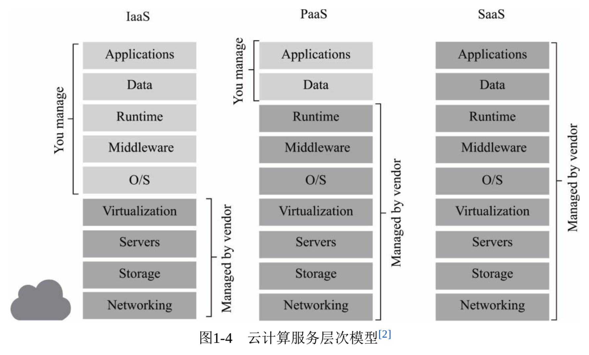

<!-- @import "[TOC]" {cmd="toc" depthFrom=1 depthTo=6 orderedList=false} -->

<!-- code_chunk_output -->

- [1 什么是云计算](#1-什么是云计算)
- [2 云计算的历史](#2-云计算的历史)
- [3 云计算的几种服务类型](#3-云计算的几种服务类型)
  - [3.1 SaaS, 软件即服务](#31-saas软件即服务)
  - [3.2 PaaS, 平台即服务](#32-paas平台即服务)
  - [3.3 IaaS, 基础设施即服务](#33-iaas基础设施即服务)

<!-- /code_chunk_output -->

# 1 什么是云计算

维基百科里是这样定义的: 是一种基于互联网的计算方式, 通过这种方式, 共享的软硬件资源和信息可以按需求提供给计算机各种终端和其他设备.

# 2 云计算的历史

正式的云计算的产品始发于2006年, 那年8月, 亚马逊(Amazon)发布了"弹性计算云"(Elastic Compute Cloud). 2008年10月, 微软宣布了名为Azure的云计算产品, 并在2010年2月正式发布Windows Azure. Google也从2008年开始进入云计算时代, 那年4月, 其发布了Google App Engine Beta, 但直到2013年12月, 其Google Compute Engine对标AWS EC2才正式可用. 

2014年3月, Windows Azure更名为Microsoft Azure.

2010年7月, NASA和Rackspace共同发布了著名的开源项目Openstack. 

从国内来看, 2009年, 阿里巴巴率先成立了阿里云部门, 一开始只对内服务于其自身的电商业务, 如淘宝、天猫. 2011年7月, 阿里云开始正式对外销售云服务. 

无论是国内还是国外, 云计算的市场都快速发展. "Amazon把云计算做成一个大生意没有花太长的时间: 不到两年时间, Amazon上的注册开发人员达44万人, 还有为数众多的企业级用户. 有第三方统计机构提供的数据显示, Amazon与云计算相关的业务收入已达1亿美元. 云计算是Amazon增长最快的业务之一. "国内的阿里云也在2013年以后快速蓬勃发展. 无论是国际巨头AWS(亚马逊)还是国内的阿里云, 这些年都是快速增长, 尤其阿里云, 虽然体量暂时还远不及AWS, 但一直都是超过100%的增长. 

# 3 云计算的几种服务类型

"**云计算**是推动**IT**转向**以业务为中心模式**的一次重大变革. 它着眼于**运营效率**、**竞争力**和**快速响应**等实际成果. 这意味着**IT的作用**正在从**提供IT服务**逐步过渡到**根据业务需求优化服务的交付和使用**. 这种全新的模式将**以前的信息孤岛**转化为**灵活高效的资源池**和具备**自我管理能力的虚拟基础架构**, 从而以**更低的成本**和**以服务的形式**提供给用户. IT即服务将提供业务所需要的一切, 并在不丧失对系统的控制力的同时, 保持系统的灵活性和敏捷性. "

云计算的模型是**以服务为导向**的, 根据提供的服务层次不同, 可分为: **IaaS(Infrastructure as a Service, 基础架构即服务**)、**PaaS(Platform as a Service, 平台即服务**)、**SaaS(Software as a Service, 软件即服务**). 它们提供的服务越来越抽象, 用户实际控制的范围也越来越小, 如图1-4所示. 

## 3.1 SaaS, 软件即服务

云服务提供商提供给客户**直接使用软件服务**, 如**Google Docs**、**Microsoft CRM**、**Salesforce.com** 等. 

用户**不必自己维护软件本身**, 只管使用**软件提供的服务**. 用户为该软件提供的**服务付费**. 

## 3.2 PaaS, 平台即服务

云服务提供商提供给客户开发、运维应用程序的**运行环境**, 用户负责**维护自己的应用程序**, 但并**不掌控操作系统**、**硬件**以及运作的**网络基础架构**. 如**Google App Engine**等. 平台是指**应用程序运行环境**(图1-4中的Runtime). 

通常, 这类用户在云环境中运维的应用程序会再提供软件服务给他的下级客户. 用户为自己的程序的运行环境付费. 

## 3.3 IaaS, 基础设施即服务

用户有更大的自主权, 能控制自己的操作系统、网络连接(虚拟的)、硬件(虚拟的)环境等, 云服务提供商提供的是一个虚拟的主机环境. 如Google Compute Engine、AWS EC2等. 用户为一个主机环境付费. 

从图1-4中可以看到, 无论是哪种云计算服务模型, 虚拟化(Virtualization)都是其基础. 

