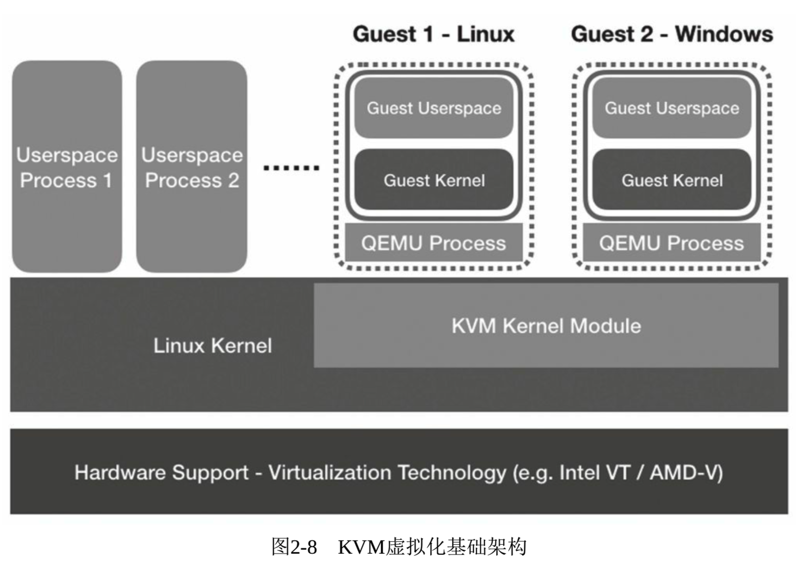

<!-- @import "[TOC]" {cmd="toc" depthFrom=1 depthTo=6 orderedList=false} -->

<!-- code_chunk_output -->

- [QEMU](#qemu)
- [QEMU支持KVM](#qemu支持kvm)
- [virtio协议](#virtio协议)
- [virtio-blk-data-plane高性能块设备I/O](#virtio-blk-data-plane高性能块设备io)

<!-- /code_chunk_output -->

# QEMU

QEMU原本就是一个著名的开源虚拟机软件项目, 而不是KVM虚拟化软件的一部分. 与KVM不同, **QEMU最初**实现的虚拟机是一个**纯软件**的实现, 通过**二进制翻译**来实现虚拟化客户机中的CPU指令模拟, 所以**性能比较低**. 

但是, 其优点是**跨平台**, QEMU支持在Linux、Windows、FreeBSD、Solaris、MacOS等多种操作系统上运行, 能支持在QEMU本身编译运行的平台上就实现虚拟机的功能, 甚至可以支持**客户机与宿主机并不是同一个架构**(比如在x86平台上运行ARM客户机). 作为一个存在已久的虚拟机监控器软件, **QEMU的代码**中有**完整的虚拟机实现**, 包括**处理器虚拟化**、**内存虚拟化**, 以及KVM也会用到的**虚拟设备模拟**(比如网卡、显卡、存储控制器和硬盘等). 

除了二进制翻译的方式, QEMU也能与**基于硬件虚拟化**的**Xen、KVM**结合, 为它们**提供客户机的设备模拟**. 通过与KVM的密切结合, 让虚拟化的性能提升得非常高, 在真实的企业级虚拟化场景中发挥重要作用, 所以我们通常提及KVM虚拟化时就会说“**QEMU/KVM**”这样的软件栈. 

# QEMU支持KVM

最早期的KVM开发者们为了简化软件架构和代码重用, **根据KVM特性**在**QEMU的基础上**进行了**修改**(当然**这部分修改**已经**合并回QEMU的主干**代码, 故**现在的QEMU已原生支持KVM虚拟化**特性). 从图2\-8可以看出, **每一个虚拟客户机**在**宿主机中**就体现为**一个QEMU进程**, 而**客户机**的**每一个虚拟CPU**就是**一个QEMU线程**. 虚拟机运行期间, **QEMU**会通过**KVM模块**提供的**系统调用进入内核**, 由**KVM模块**负责**将虚拟机置于处理器的特殊模式**下运行. 遇到**虚拟机进行I/O操作**时, **KVM模块**会从上次的**系统调用出口处返回QEMU**, 由**QEMU来负责解析和模拟这些设备**. 

**从QEMU角度**来看, 也可以说**QEMU**使用了**KVM模块的虚拟化功能**, 为自己的虚拟机提供**硬件虚拟化的加速**, 从而极大地提高了虚拟机的性能. 除此之外, **虚拟机的配置和创建**, 虚拟机运行依赖的**虚拟设备**, 虚拟机运行时的**用户操作环境和交互**, 以及一些**针对虚拟机的特殊技术**(如: **动态迁移！！！**), 都是由**QEMU自己实现！！！** 的. 

# virtio协议

QEMU除了提供**完全模拟的设备**(如: **e1000网卡**、**IDE磁盘**等)以外, 还支持**virtio协议的设备模拟**. **virtio**是一个沟通**客户机前端设备**与**宿主机上设备后端**模拟的比较高性能的协议, 在**前端客户机**中需要安装相应的**virtio\-blk**、**virtio\-scsi**、**virtio\-net**等驱动, 而**QEMU**就实现了**virtio的虚拟化后端**. 

# virtio-blk-data-plane高性能块设备I/O

QEMU还提供了叫作`virtio-blk-data-plane`的一种**高性能的块设备I/O方式**, 它最初在QEMU 1.4版本中被引入. 

`virtio-blk-data-plane`与传统`virtio-blk`相比, 它为**每个块设备**单独分配**一个线程**用于**I/O处理**, **data\-plane线程**不需要与**原QEMU**执行**线程同步和竞争锁**, 而且它使用**ioeventfd/irqfd机制**, 同时利用**宿主机Linux上的AIO(异步I/O**)来处理**客户机的I/O请求**, 使得块设备I/O效率进一步提高. 

总之, QEMU既是一个**功能完整的虚拟机监控器**, 也在**QEMU/KVM的软件栈**中承担**设备模拟**的工作. 