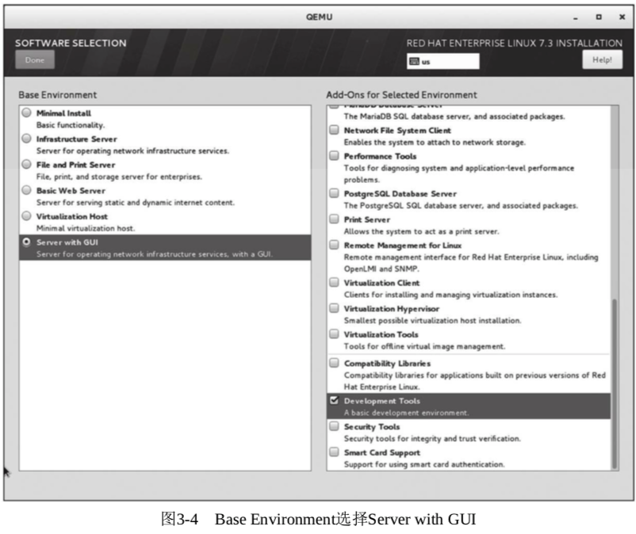

<!-- @import "[TOC]" {cmd="toc" depthFrom=1 depthTo=6 orderedList=false} -->

<!-- code_chunk_output -->

- 

<!-- /code_chunk_output -->

# 

KVM是**基于内核**的虚拟化技术的，要运行KVM虚拟化环境，安装一个Linux操作系统的宿主机(Host)是必需的。

选用RHEL来讲解Linux系统的安装步骤和过程，并且本章**后面的编译和运行**都是在这个系统上进行的。

当然，KVM作为流行的开源虚拟机之一，可以在绝大多数流行的Linux系统上编译和运行，所以依然可以选择RHEL之外的**其他Linux发行版**，如CentOS、Fedora、Ubuntu、Debian、OpenSuse等系统都是不错的选择。

这里主要说明安装过程中一些值得注意的地方。

在选择哪些安装包(**SOFTWARE SELECTION**)时，点进去选择“**Server with GUI**”，而不是默认的“Minimal Install”，如图3-4所示。

在选择了“Server with GUI”之后，右侧还有可以额外增加的组件供选择(见图3-4)，我们需要选上“**Development Tools**”，因为在本书的KVM编译过程中以及其他实验中可能会用到，其中包括一些比较重要的软件包，比如: gcc、git、make等(一般被默认选中)。

可以看到还有“**Virtualization Hypervisor**”“**Virtualization Tools**”，这里可以**暂时不选它们(选上也没有关系**)，因为在本章中会自己编译KVM和QEMU，而在附录A介绍发行版中的KVM时，我们会安装Virtualization Host环境，并使用发行版中自带的KVM Virtualization功能。

