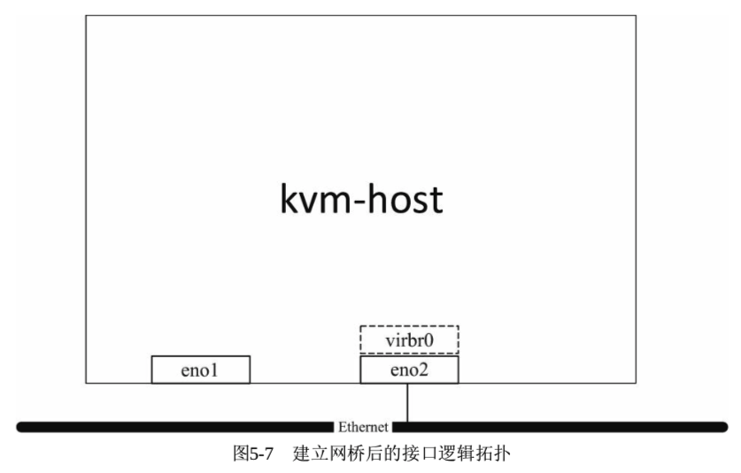
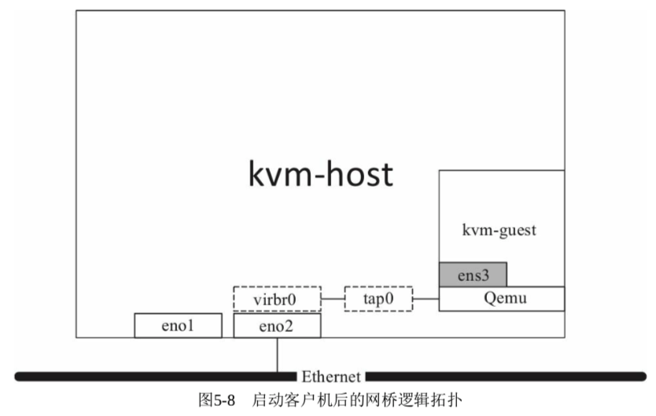
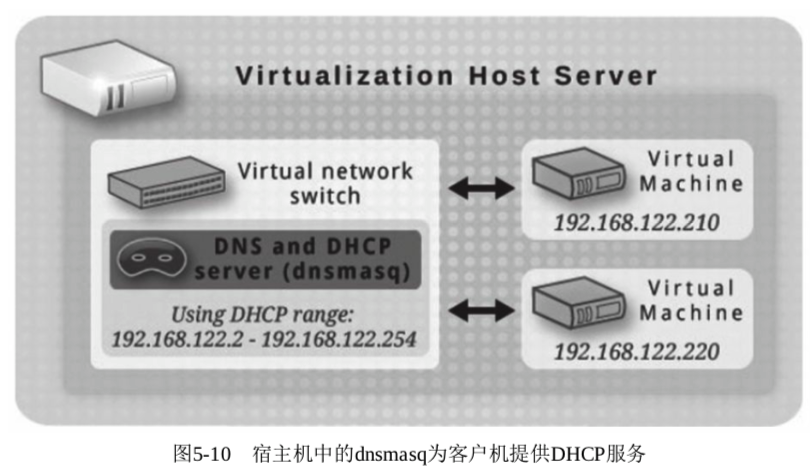

<!-- @import "[TOC]" {cmd="toc" depthFrom=1 depthTo=6 orderedList=false} -->

<!-- code_chunk_output -->

- [1. 用QEMU实现的网络模式](#1-用qemu实现的网络模式)
  - [1.1. 统一的设备模型参数](#11-统一的设备模型参数)
- [2. 使用直接的网桥模式](#2-使用直接的网桥模式)
  - [2.1. virt-manager/libvirt配置后端](#21-virt-managerlibvirt配置后端)
  - [2.2. qemu命令行配置后端参数](#22-qemu命令行配置后端参数)
  - [2.3. 网桥方式的网络配置](#23-网桥方式的网络配置)
    - [2.3.1. 配置过程](#231-配置过程)
    - [2.3.2. 状态确认](#232-状态确认)
    - [2.3.3. 新的网桥模式配置选项](#233-新的网桥模式配置选项)
- [3. 用网桥实现NAT模式](#3-用网桥实现nat模式)
  - [3.1. 网络配置](#31-网络配置)
- [4. QEMU内部的用户模式网络](#4-qemu内部的用户模式网络)
- [5. 其他网络选项](#5-其他网络选项)

<!-- /code_chunk_output -->

# 1. 用QEMU实现的网络模式

网络是现代计算机系统不可或缺的一部分, QEMU也对虚拟机提供了丰富的网络支持. 通过QEMU的支持, 常见的可以实现以下4种网络形式:

1)基于网桥(bridge)的虚拟网络.

2)基于NAT(Network Addresss Translation)的虚拟网络.

3)**QEMU内置！！！** 的**用户模式网络**(user mode networking).

4)直接分配网络设备从而直接接入物理网络(包括VT\-d和SR\-IOV).

这里主要讲述前3种模式, 第4种网络设备的直接分配将在第6章中详细讲述. 除了特别的需要iptables配置端口映射、数据包转发规则的情况, **一般默认将防火墙所有规则都关闭**, 以避免妨碍客户机中的网络畅通. 在实际生产环境中, 可根据实际系统的特点进行配置.

在qemu命令行中, 对**客户机网络**的配置(**除了网络设备直接分配**之外)都是用"\-**net**"参数进行配置的, 如果没有设置任何的"\-net"参数, 则**默认**使用"\-**net nic \-net user**"参数, 进而使用完全基于**QEMU内部实现的用户模式**下的网络协议栈(将在5.5.4节详细介绍).

## 1.1. 统一的设备模型参数

在新的QEMU中, 推荐用\-**device** \+ \-**netdev**组合的方式.

因为QEMU正逐渐**规范统一的设备模型的参数**使用:

- \-**device**囊括了**所有QEMU模拟的前端！！！** 的参数指定, 也就是**客户机**里看到的**设备**(包括本章的网卡设备);
- \-**netdev**指定的是**网卡模拟的后端方式！！！**, 也就是本节后面要讲的各种**QEMU实现网络的方式！！！**.

本书沿用上一版的用法, 依然保留**传统的\-net \+ \-net**的参数组合, 但同时也会介绍等价的新方式的参数方法.

**QEMU！！！** 提供了对一系列主流和兼容性良好的网卡的模拟, 通过"\-**net nic, model**=\?"参数可以查询到当前的QEMU工具实现了哪些网卡的模拟. 如以下实验所示:

```
[root@gerrylee ~]# qemu-system-x86_64 -net nic,model=?
Supported NIC models:
e1000
e1000-82544gc
e1000-82545em
e1000e
i82550
i82551
i82557a
i82557b
i82557c
i82558a
i82558b
i82559a
i82559b
i82559c
i82559er
i82562
i82801
ne2k_pci
pcnet
rocker
rtl8139
virtio-net-pci
virtio-net-pci-non-transitional
virtio-net-pci-transitional
vmxnet3
```

"e1000"是提供Intel e1000系列的网卡模拟, 如果不显式指定, QEMU**默认**就是模拟**Intel e1000系列**的虚拟网卡.

而**virtio类型**是QEMU对**半虚拟化I/O(virtio)驱动**的支持(将会在第6章中详细介绍virtio的基本原理、配置和使用).

qemu命令行在**不加任何网络相关的参数**启动客户机后, 在客户机中可以看到它有一个默认的e1000系列的网卡, 使用的是**用户模式的网络**, 其功能非常有限(将在5.5.4节中详述).

在**客户机**中看到的e1000系列网卡如下所示, **默认**是**Intel 82540EM系列的网卡**.

```
[root@kvm-guest ~]# lspci | grep Eth
00:03.0 Ethernet controller: Intel Corporation 82540EM Gigabit Ethernet Controller (rev 03)
```

在QEMU monitor中用"**info qtree**"可以看到它的被模拟的详细信息.

```
...
dev: e1000, id ""
     mac = "52:54:00:12:34:56"
     vlan = 0
     netdev = "hub0port0"
     autonegotiation = true
     mitigation = true
     extra_mac_registers = true
     addr = 03.0
     romfile = "efi-e1000.rom"
     rombar = 1 (0x1)
     multifunction = false
     command_serr_enable = true
     x-pcie-lnksta-dllla = true
     class Ethernet controller, addr 00:03.0, pci id 8086:100e (sub 1af4:1100)
     bar 0: mem at 0xfebc0000 [0xfebdffff]
     bar 1: i/o at 0xc000 [0xc03f]
     bar 6: mem at 0xffffffffffffffff [0x3fffe]
......
```

qemu命令行中基本的"\-**net"参数**的细节如下:

```
-net nic[,vlan=n][,macaddr=mac][,model=type][,name=name][,addr=addr][,vectors=v]
```

执行这个命令行会让QEMU模拟出一块网卡, 并将其连接到**VLAN n**上.

其中:

- "\-**net nic**"是**必需的参数**, 表明这是一个**网卡的配置**.
- **vlan=n**, 表示**将网卡连入VLAN n**, 默认为**0**(即**没有VLAN**).
- **macaddr=mac**, 设置**网卡的MAC地址**, **默认**根据**宿主机中网卡**的地址来分配. 若局域网中客户机太多, 建议自己设置MAC地址, 以防止MAC地址冲突. 请大家在实际使用中最好配置自己的MAC地址, 否则QEMU会默认分配一个相同的MAC地址(如前面info qtree代码中看到的52: 54: 00: 12: 34: 56), 几个虚拟机同时运行则可能会通过DHCP分配到相同的IP, 从而引发IP地址冲突.
- model=type, 设置**模拟的网卡的类型**, 默认为e1000.
- name=name, 为网卡设置一个易读的名称, 该名称仅在QEMU monitor中可能用到.
- addr=addr, 设置网卡在**客户机**中的**PCI设备地址为addr**.
- vectors=v, 设置该网卡设备的**MSI\-X向量的数量为v**, 该选项仅对使用**virtio驱动的网卡有效**. 设置为"vectors=0"是关闭virtio网卡的MSI\-X中断方式.

如果需要向一个客户机提供**多个网卡**, 可以**多次使用"\-net"参数**.

在宿主机中用如下命令行启动一个客户机, 并使用上面的一些网络参数.

```
[root@kvm-host ~]# qemu-system-x86_64 -m 1024 rhel7.img -net nic,vlan=0,macaddr=52:54:00:12:34:22,model=e1000,addr=08 –net user
```

在客户机中用一些工具查看网卡相关的信息如下(这里使用了用户模式的网络栈, 其详细介绍可参考5.5.4节), 由此可知上面的网络设置都已生效.

```
[root@kvm-guest ~]# lspci | grep Eth
00:08.0 Ethernet controller: Intel Corporation 82540EM Gigabit Ethernet Controller (rev 03)
[root@kvm-guest ~]# ethtool -i eth1
driver: e1000
version: 7.3.21-k8-NAPI
firmware-version:
bus-info: 0000:00:08.0
[root@kvm-guest ~]# ifconfig
eth1      Link encap:Ethernet  HWaddr 52:54:00:12:34:22
          inet addr:10.0.2.15  Bcast:10.0.2.255  Mask:255.255.255.0
          inet6 addr: fe80::5054:ff:fe12:3422/64 Scope:Link
          UP BROADCAST RUNNING MULTICAST  MTU:1500  Metric:1
          RX packets:10 errors:0 dropped:0 overruns:0 frame:0
          TX packets:47 errors:0 dropped:0 overruns:0 carrier:0
          collisions:0 txqueuelen:1000
          RX bytes:1890 (1.8 KiB)  TX bytes:6380 (6.2 KiB)

lo        Link encap:Local Loopback
          inet addr:127.0.0.1  Mask:255.0.0.0
          inet6 addr: ::1/128 Scope:Host
          UP LOOPBACK RUNNING  MTU:16436  Metric:1
          RX packets:12 errors:0 dropped:0 overruns:0 frame:0
          TX packets:12 errors:0 dropped:0 overruns:0 carrier:0
          collisions:0 txqueuelen:0
          RX bytes:720 (720.0 b)  TX bytes:720 (720.0 b)
```

在QEMU monitor中查看网络的信息, 如下:

```
(qemu) info network
VLAN 0 devices:
    user.0: type=user,net=10.0.2.0,restrict=off
   e1000.0: type=nic,model=e1000,macaddr=52:54:00:12:34:22
Devices not on any VLAN:
```

# 2. 使用直接的网桥模式

在QEMU/KVM的网络使用中, **网桥(bridge**)模式可以让**客户机**和**宿主机**共享一个**物理网络设备**连接网络, **客户机**有自己的**独立IP地址**, 可以直接连接与宿主机一模一样的网络, 客户机可以访问**外部网络**, 外部网络也可以直接访问客户机(就像访问普通物理主机一样).

即使宿主机只有一个网卡设备, 使用bridge模式也可让多个客户机与宿主机共享网络设备. bridge模式使用非常方便, 应用也非常广泛.

## 2.1. virt-manager/libvirt配置后端

**virt\-manager/libvirt创建网络时**, Network source(也就是**后端**)的"**Specify shared device name**"方式, 就是由**QEMU的bridge方式**来实现的, 如图5\-6所示.


## 2.2. qemu命令行配置后端参数

在qemu命令行中, 关于配置**bridge模式**的网络(**后端**)参数如下:

```
-netdev tap,id=id[,fd=h][,ifname=name][,script=file][,downscript=dfile][,helper=helper]
```

或者,

```
-net tap[,vlan=n][,name=name][,fd=h][,ifname=name][,script=file][,downscript=dfile][,helper=helper]
```

这两个配置方法效果等价, 但用于不同场合:

- \-**netdev** tap, id=id\[, ...]与\-**device**参数配套使用.
- \-**net** tap\[, ...]与\-**net nic**参数配套使用.

第2种方法可以认为是第一种的简化版, 因为免去了后端设备id的指定. 如果不小心搞错了, 以"\-net nic[, ...]\+\-netdev tap, id=id[, ...]"这样组合来配置网卡, QEMU会报如下错误, 以为\-netdev指定的后端设备找不到前端设备与它配对.

```
(qemu) Warning: vlan 0 is not connected to host network
Warning: netdev tapdev0 has no peer
```

无论哪种组合方式都表示创建或者使用宿主机的**TAP网络接口**与"\-**net nic**"模拟给**客户机**的**前端网卡**相连, 并将其**连接到VLAN n**中. 使用**file**和**dfile**两个脚本分别在**启动客户机时配置网络**和在**关闭客户机时取消网络配置**, 使用helper程序帮助在非root权限的情况下创建配置上述网络设备.

- tap参数, 表明**使用TAP设备**. TAP是**虚拟网络设备**, 它仿真了一个**数据链路层设备**(ISO七层网络结构的第2层), 它像一个网桥一样处理**第2层数据报**. 而TUN与TAP类似, 也是一种**虚拟网络设备**, 它是对网络层设备的仿真. TAP用于**创建一个网桥**, 而**TUN**则与**路由相关**(工作在**IP层**).
- vlan=n, 设置该设备连入VLAN n, 默认值为0(即没有VLAN).
- name=name, 设置名称, 在QEMU monior中可能用到, 一般由系统自动分配即可. 与后面"ifname=name"的name没有关系.
- fd=h, 连接到现在已经打开着的TAP接口的文件描述符. 一般不要设置该选项, 而是让QEMU自动创建一个TAP接口. 在使用了fd=h选项后, ifname、script、downscript、helper、vnet\_hdr等选项都不可用了(不能与fd选项同时出现在命令行中).
- ifname=name, 设置在宿主机中添加的TAP虚拟设备的名称(如tap1、tap5等). 当不设置这个参数时, QEMU会根据系统中目前的情况, 产生一个TAP接口的名称.
- script=file, 设置宿主机在启动客户机时自动执行的网络配置脚本. 如果不指定, 其默认值为"/etc/qemu\-ifup"这个脚本. 可指定自己的脚本路径以取代默认值; 如果不需要执行脚本, 则设置为"script=no".
- downscript=dfile, 设置宿主机在客户机关闭时自动执行的网络配置脚本. 如果不设置, 其默认值为"/etc/qemu\-ifdown"; 若客户机关闭时宿主机不需要执行脚本, 则设置为"downscript=no".
- helper=helper, 设置启动客户机时在宿主机中运行的辅助程序, 包括建立一个TAP虚拟设备, 默认值为/usr/local/libexec/qemu\-bridge\-helper. 此处一般不用定义.

## 2.3. 网桥方式的网络配置

上面介绍了使用TAP设备的一些选项, 接下来通过在宿主机中执行如下步骤来实现网桥方式的网络配置.

### 2.3.1. 配置过程

1)要采用**bridge模式**的网络配置, 首先需要安装**bridge\-utils软件包**, 它提供brctl工具, 用于配置网桥.

```
[root@kvm-host ~]# yum install bridge-utils tunctl
```

2)查看tun模块和bridge模块是否加载, 如下:

```
[root@gerrylee ~]# lsmod | grep tun
tun                    31740  1
[root@gerrylee ~]# lsmod | grep bridge
bridge                151336  0
stp                    12976  1 bridge
llc                    14552  2 stp,bridge
```

如果tun模块没有加载, 则运行"modprobe tun"命令来加载. 当然, 如果已经将tun编译到内核(可查看内核config文件中是否有"**CONFIG_TUN=y**"选项), 则**不需要加载**了. 如果内核完全没有配置TUN模块, 则需要**重新编译内核**才行.

3)检查/dev/net/tun的权限, 需要让当前用户拥有可读写的权限.

```
[root@gerrylee ~]# ll /dev/net/tun
crw-rw-rw- 1 root root 10, 200 5月  21 10:13 /dev/net/tun
```

4)**建立一个bridge**, 并将其绑定到一个可以**正常工作的网络接口**上, 同时让bridge成为连接本机与外部网络的接口. 主要的配置命令如下:

```
[root@kvm-host ~]# brctl addbr virbr0    #添加virbr0这个bridge
```

创建virbr0的接口配置文件如下(/etc/sysconfig/network\-scripts/ifcfg\-virbr0), 与其他物理的接口一样, 网桥也是一个虚拟的接口, 它也需要有自己的接口配置文件. 系统启动的时候会根据这个配置文件来配置接口. 关于更多的RHEL系统的网络接口的配置, 可以参考其官方文档:

```
https://access.redhat.com/documentation/en-US/Red_Hat_Enterprise_Linux/7/html/Networking_Guide/sec-Network_Bridging_Using_the_Command_Line_Interface.html#sec-Create_a_Network_Bridge
[root@kvm-host ~]# cat /etc/sysconfig/network-scripts/ifcfg-virbr0
DEVICE=virbr0
STP=yes      #STP需要打开, 以防止环路
TYPE=Bridge   #指定这个接口类型是bridge
BOOTPROTO=dhcp    #指定这个接口用DHCP方式启动
DEFROUTE=no       #在笔者网络环境中, 不需要网桥成为默认路由的出口
PEERDNS=yes
PEERROUTES=yes
NAME="virbr0"
ONBOOT=yes      #系统启动时候自动启动
NM_CONTROLLED=no   #不要network manager来管
```

修改需要绑定到网桥的**物理接口(eno2**)的配置文件如下(它将成为**网桥**以及**连接到网桥的Tap接口**的与外界联系的**桥梁**):

```
[root@kvm-host ~]  # cat /etc/sysconfig/network-scripts/ifcfg-eno2
TYPE=Ethernet
BOOTPROTO=none   #作为网桥的slave接口, 不需要boot protocol
DEFROUTE=no   #同网桥设置, 不需要default路由
NAME=eno2
UUID=d51cac95-203b-46c1-8c27-5fd935323c1c  #这个不是必需的
DEVICE=eno2
ONBOOT=yes
PEERDNS=yes
PEERROUTES=yes
BRIDGE=virbr0   #这个非常重要, 指定这个接口成为哪个网桥的slave
NM_CONTROLLED=no
```

此时, 我们看到网桥(virbr0)还是**没有slave接口**的.

```
[root@kvm-host ~]# brctl show
bridge name     bridge id               STP enabled     interfaces
virbr0          8000.000000000000       yes
```

我们用**brctl工具**将**eno2绑定到virbr0**上.

```
[root@kvm-host ~]# brctl addif virbr0 eno2
[root@kvm-host ~]# brctl show virbr0
bridge name     bridge id               STP enabled     interfaces
virbr0          8000.001e67afe8a4       yes             eno2
```

最后, 我们将**网桥接口up起来**, 它就获得**IP地址**并与**外部网络连通**了.

进一步地, 当有**客户机启动**, QEMU创建的**tap设备绑定到网桥上**以后, 客户机也就和外部网络连通了.

```
[root@kvm-host ~]# ifup virbr0

Determining IP information for virbr0... done.
[root@kvm-host ~]# ifconfig virbr0
virbr0: flags=4163<UP,BROADCAST,RUNNING,MULTICAST>  mtu 1500
        inet 192.168.102.168  netmask 255.255.252.0  broadcast 192.168.103.255
        inet6 fe80::21e:67ff:feaf:e8a4  prefixlen 64  scopeid 0x20<link>
        ether 00:1e:67:af:e8:a4  txqueuelen 0  (Ethernet)
        RX packets 528  bytes 40646 (39.6 KiB)
        RX errors 0  dropped 0  overruns 0  frame 0
        TX packets 29  bytes 4751 (4.6 KiB)
        TX errors 0  dropped 0 overruns 0  carrier 0  collisions 0
```

此时, 作为**网桥接口的附庸(slave**), **eno2接口**是**没有自己的IP地址**的, **网桥**寄生在**它身上(与它的MAC地址相同**), 与外界通讯.

```
[root@kvm-host ~]# ifconfig eno2
eno2: flags=4163<UP,BROADCAST,RUNNING,MULTICAST>  mtu 1500
      inet6 fe80::21e:67ff:feaf:e8a4  prefixlen 64  scopeid 0x20<link>
      ether 00:1e:67:af:e8:a4  txqueuelen 1000  (Ethernet)
      RX packets 3473864  bytes 1853969607 (1.7 GiB)
      RX errors 0  dropped 0  overruns 0  frame 0
      TX packets 69  bytes 10672 (10.4 KiB)
      TX errors 0  dropped 0 overruns 0  carrier 0  collisions 0
      device memory 0xb1100000-b117ffff
```

上述网桥创建完成后, 笔者的主机上的接口逻辑拓扑如图5\-7所示.



5)准备**qemu\-ifup**和**qemu\-ifdown脚本**.

在客户机**启动网络前执行的脚本**是由"script"选项配置的(**默认为/etc/qemu\-ifup**). 该脚本的内容就是**将QEMU自动创建的TAP设备绑定到上一步创建好的网桥**上.

如下是qemu\-ifup脚本的示例, 其中"**$1**"是QEMU调用脚本时传入的参数, 它是**QEMU**为客户机创建的**TAP设备**名称(前面提及的ifname选项的值或者系统自动选择的tap0、tap1等).

```
#!/bin/sh

switch=$(brctl show| sed -n 2p |awk '{print $1}')
/sbin/ifconfig $1 0.0.0.0 up
/usr/sbin/brctl addif ${switch} $1
```

由于**QEMU**在**客户机关闭！！！时**会**解除TAP设备的bridge绑定**, 也会**自动删除已不再使用的TAP设备**, 所以qemu\-ifdown这个**脚本不是必需**的, 最好设置为"**downscript=no**". 如下列出一个qemu\-ifdown脚本的示例, 是为了说明清理bridge模式网络环境的步骤, 在QEMU没有自动处理时可以使用.

```
#!/bin/bash
#This is a qemu-ifdown script for bridging.
#You can use it when starting a KVM guest with bridge mode network.
#Don't use this script in most cases; QEMU will handle it automatically.

switch=$(brctl show| sed -n 2p |awk '{print $1}')
if [ -n "$1" ]; then
        # Delete the specified interfacename
        tunctl -d $1
        #release TAP interface from bridge
        brctl delif ${switch} $1
        #shutdown the TAP interface
        ip link set $1 down
        exit 0
else
        echo "Error: no interface specified"
        exit 1
fi
```

6)用**qemu命令行**启动bridge模式的网络.

在宿主机中, 用命令行启动客户机并检查bridge的状态, 如下:

```
[root@kvm-host ~]# qemu-system-x86_64 rhel7.img -enable-kvm -smp 4 -m 8G -net nic -net tap,script=/etc/qemu-ifup
[root@kvm-host ~]# brctl show
bridge name     bridge id               STP enabled     interfaces
virbr0          8000.001e67afe8a4       yes             eno2
                                                        tap0
[root@kvm-host ~]# ll /sys/devices/virtual/net/
total 0
drwxr-xr-x 5 root root 0 Nov 12 09:46 lo
drwxr-xr-x 6 root root 0 Nov 17 21:38 tap0
drwxr-xr-x 7 root root 0 Nov 17 20:54 virbr0
```

由上面信息可知, 在**创建客户机**后, 添加了一个名为**tap0的TAP虚拟网络设备**, 将其**绑定在br0这个bridge上**.

查看到的**3个虚拟网络设备**依次为: **网络回路设备lo**(就是一般IP为**127.0.0.1的设备**)、前面建立好的**bridge设备vibr0**、为客户机提供网络的**TAP设备tap0**.

### 2.3.2. 状态确认

在客户机中, 如下的几个命令用于检查网络是否配置好:

```
[root@kvm-guest ~]# ifconfig
ens3: flags=4163<UP,BROADCAST,RUNNING,MULTICAST>  mtu 1500
      inet 192.168.100.153  netmask 255.255.252.0  broadcast 192.168.103.255
      inet6 fe80::5054:ff:fe12:3456  prefixlen 64  scopeid 0x20<link>
      ether 52:54:00:12:34:56  txqueuelen 1000  (Ethernet)
      RX packets 672  bytes 78889 (77.0 KiB)
      RX errors 121  dropped 0  overruns 0  frame 121
      TX packets 132  bytes 17621 (17.2 KiB)
      TX errors 0  dropped 0 overruns 0  carrier 0  collisions 0

lo: flags=73<UP,LOOPBACK,RUNNING>  mtu 65536
    inet 127.0.0.1  netmask 255.0.0.0
    inet6 ::1  prefixlen 128  scopeid 0x10<host>
        loop  txqueuelen 0  (Local Loopback)
        RX packets 76  bytes 5948 (5.8 KiB)
        RX errors 0  dropped 0  overruns 0  frame 0
        TX packets 76  bytes 5948 (5.8 KiB)
        TX errors 0  dropped 0 overruns 0  carrier 0  collisions 0

virbr0: flags=4099<UP,BROADCAST,MULTICAST>  mtu 1500
        inet 192.168.122.1  netmask 255.255.255.0  broadcast 192.168.122.255
        ether 52:54:00:48:d8:d1  txqueuelen 0  (Ethernet)
        RX packets 0  bytes 0 (0.0 B)
        RX errors 0  dropped 0  overruns 0  frame 0
        TX packets 0  bytes 0 (0.0 B)
        TX errors 0  dropped 0 overruns 0  carrier 0  collisions 0
[root@kvm-guest ~]# route -n
Kernel IP routing table
Destination     Gateway         Genmask         Flags Metric Ref    Use Iface
0.0.0.0         192.168.100.1   0.0.0.0         UG    100    0        0 ens3
192.168.100.0   0.0.0.0         255.255.252.0   U     100    0        0 ens3
192.168.122.0   0.0.0.0         255.255.255.0   U     0      0        0 virbr0
[root@kvm-guest ~]# ping 192.168.100.1
PING 192.168.100.1 (192.168.100.1) 56(84) bytes of data.
64 bytes from 192.168.100.1: icmp_seq=1 ttl=255 time=0.560 ms
64 bytes from 192.168.100.1: icmp_seq=2 ttl=255 time=0.577 ms
^C
--- 192.168.100.1 ping statistics ---
2 packets transmitted, 2 received, 0% packet loss, time 1000ms
rtt min/avg/max/mdev = 0.560/0.568/0.577/0.025 ms
```

此时我们的客户机和主机之间的网络连接如图5\-8所示.



将**客户机关机**后, 在**宿主机**中再次查看bridge状态和虚拟网络设备的状态, 如下:

```
[root@kvm-host ~]# brctl show
bridge name     bridge id               STP enabled     interfaces
virbr0          8000.001e67afe8a4       yes             eno2
```

由上面的输出信息可知, QEMU已经将tap0设备删除了.

### 2.3.3. 新的网桥模式配置选项

细心的读者会发现, 现在的QEMU已经有**更直接的网桥模式的配置选项**.

```
-netdev bridge,id=id[,br=bridge][,helper=helper]
```

或者,
```
-net bridge[,vlan=n][,name=name][,br=bridge][,helper=helper]
```

它们比上面的方式省掉了关于tap name、script等的参数指定, 而**只需要指定网桥**就可以了. 其他的都封装在**helper程序**里面**自动**帮忙做掉了, 包括自**动命名**和**创建tap设备**、**自动启动tap设备**(即原来的script脚本要完成的工作)、**绑定网桥**等. 这些本来在多数应用场景中就不需要特别指定的.

下面两条启动命令与上面的完全等价:

```
qemu-system-x86_64 rhel7.img -enable-kvm -smp 4 -m 8G -net nic -net bridge,br=virbr0
```

或者,

```
qemu-system-x86_64 rhel7.img -enable-kvm -smp 4 -m 8G -device e1000,netdev=brdev0 -netdev bridge,id=brdev0,br=virbr0
```

# 3. 用网桥实现NAT模式

**NAT**(**Network Addresss Translation**, 网络地址转换)属于**广域网接入技术**的一种, 它将**内网地址转化为外网的合法IP地址**, 它被广泛应用于各种类型的Internet接入方式和各种类型的网络之中.

NAT将来自**内网IP数据包**的**包头**中的**源IP地址**转换为一个**外网的IP地址**.

NAT有助于**节约IP地址资源**. 另外, 通过NAT访问外部网络的内部主机, 其**内部IP对外是不可见的**, 这就隐藏了NAT内部网络拓扑结构和IP信息, 也就能够避免内部主机受到**外部网络的攻击**.

客观事物总是有正反两面性的, 没有任何技术是十全十美的. NAT技术隐藏了内部主机细节, 从而提高了安全性. 但是如果NAT内的主机作为**Web或数据库服务器**需要接受来自**外部网络的主动连接**, 这时NAT就表现出了**局限性**. 不过, 可以在**拥有外网IP的主机**上使用**iptables**等工具实现**端口映射**, 从而让外网将这个外网IP的一个端口的访问被重新映射到NAT内网的**某个主机的相应端口**上去.

在**QEMU/KVM**中, **默认**使用**IP伪装的方式实现NAT**, 而不是使用**SNAT(Source\-NAT**)或**DNAT(Destination\-NAT**)的方式.

图5-9展示了KVM中的NAT模式网络的结构图, 宿主机在**外网**的IP是**10.10.10.190**, 其上运行的**各个客户机**的IP属于**内网的网络段192.168.122.0/24**.


在KVM中配置客户机的NAT网络方式, 需要在**宿主机**中运行一个**DHCP服务器**给**宿主机**分配**NAT内网的IP地址**, 可以使用**dnsmasq工具**来实现.

在**KVM**中, **DHCP服务器**为客户机提供服务的基本架构如图5\-10所示.



## 3.1. 网络配置

通过下面几步可以使客户机启动, 并以NAT方式配置好它的网络.

1)检查**宿主机内核编译的配置**, 将网络配置选项中与NAT相关的选项配置好, 否则在启动客户机使用NAT网络配置时可能会遇到类似如下错误提示, 因为无法按需加载"iptable\_nat"和"nf\_nat"等模块.

```
iptables v1.4.7: can't initialize iptables table `nat': Table does not exist (do you need to insmod?)
```

遇到这样的情况, 只能重新配置和编译内核了. 下面截取的一小段内核配置, 是一般情况下NAT的**部分相关配置**.

```
#
# IP: Netfilter Configuration
#
CONFIG_NF_DEFRAG_IPV4=m
CONFIG_NF_CONNTRACK_IPV4=m
CONFIG_NF_CONNTRACK_PROC_COMPAT=y
CONFIG_IP_NF_QUEUE=m
CONFIG_IP_NF_IPTABLES=m
CONFIG_IP_NF_MATCH_AH=m
CONFIG_IP_NF_MATCH_ECN=m
CONFIG_IP_NF_MATCH_RPFILTER=m
CONFIG_IP_NF_MATCH_TTL=m
CONFIG_IP_NF_FILTER=m
CONFIG_IP_NF_TARGET_REJECT=m
CONFIG_IP_NF_TARGET_ULOG=m
CONFIG_NF_NAT=m
CONFIG_NF_NAT_NEEDED=y
CONFIG_IP_NF_TARGET_MASQUERADE=m
CONFIG_IP_NF_TARGET_NETMAP=m
CONFIG_IP_NF_TARGET_REDIRECT=m
```

2)安装必要的软件包: **bridge\-utils**、**iptables**和**dnsmasq**等. 其中

- **bridge\-utils**包含**管理bridge的工具brctl**
- **iptables**是对**内核网络协议栈**中**IPv4包**的**过滤工具和NAT管理工具**,
- **dnsmasq**是一个**轻量级的DHCP和DNS服务器软件**.

当然, 如有其他满足类似功能的软件包, 也可以选用. 在宿主机中, 查看所需软件包的情况, 如下:

```
[root@kvm-host ~]# rpm -q bridge-utils
bridge-utils-1.5-9.el7.x86_64
[root@kvm-host ~]# rpm -q iptables
iptables-1.4.21-17.el7.x86_64
[root@kvm-host ~]# rpm -q dnsmasq
dnsmasq-2.66-21.el7.x86_64
```

3)准备一个为客户机建立NAT用的**qemu\-ifup脚本**及关闭网络用的qemu-ifdown脚本. 这两个脚本中的 **$1**(传递给它们的**第1个参数**)就是在客户机中使用的网络接口在**宿主机！！！**中的**虚拟网络名称**(如tap0、tap1等).

其中, 在**启动客户机**时**建立网络的脚本示例**(/etc/qemu\-ifup\-NAT)如下.

主要功能是: **建立bridge**, 设置**bridge**的**内网IP**(此处为192.168.122.1), 并且将**客户机**的**网络接口与其绑定**, 然后打开系统中**网络IP包转发的功能**, 设置**iptables**的**NAT规则**, 最后**启动dnsmasq**作为一个简单的DHCP服务器.

```sh
#!/bin/bash
# qemu-ifup script for QEMU/KVM with NAT netowrk mode

# set your bridge name
BRIDGE=virbr0

# Network information
NETWORK=192.168.122.0
NETMASK=255.255.255.0
# GATEWAY for internal guests is the bridge in host
GATEWAY=192.168.122.1
DHCPRANGE=192.168.122.2,192.168.122.254

# Optionally parameters to enable PXE support
TFTPROOT=
BOOTP=

function check_bridge()
{
    if brctl show | grep "^$BRIDGE" &> /dev/null; then
            return 1
    else
            return 0
    fi
}

function create_bridge()
{
        brctl addbr "$BRIDGE"
        brctl stp "$BRIDGE" on
        brctl setfd "$BRIDGE" 0
        ifconfig "$BRIDGE" "$GATEWAY" netmask "$NETMASK" up
}

function enable_ip_forward()
{
    echo 1 > /proc/sys/net/ipv4/ip_forward
}

function add_filter_rules()
{
    iptables -t nat -A POSTROUTING -s "$NETWORK"/"$NETMASK" \
            ! -d "$NETWORK"/"$NETMASK" -j MASQUERADE
}

function start_dnsmasq()
{
    # don't run dnsmasq repeatedly
    ps -ef | grep "dnsmasq" | grep -v "grep" &> /dev/null
    if [ $? -eq 0 ]; then
            echo "Warning:dnsmasq is already running."
            return 1
    fi

    dnsmasq \
            --strict-order \
            --except-interface=lo \
            --interface=$BRIDGE \
            --listen-address=$GATEWAY \
            --bind-interfaces \
            --dhcp-range=$DHCPRANGE \
            --conf-file="" \
            --pid-file=/var/run/qemu-dhcp-$BRIDGE.pid \
            --dhcp-leasefile=/var/run/qemu-dhcp-$BRIDGE.leases \
            --dhcp-no-override \
            ${TFTPROOT:+"--enable-tftp"} \
            ${TFTPROOT:+"--tftp-root=$TFTPROOT"} \
            ${BOOTP:+"--dhcp-boot=$BOOTP"}
}

function setup_bridge_nat()
{
   check_bridge "$BRIDGE"
    if [ $? -eq 0 ]; then
            create_bridge
    fi
    enable_ip_forward
    add_filter_rules "$BRIDGE"
    start_dnsmasq "$BRIDGE"
}

# need to check $1 arg before setup
if [ -n "$1" ]; then
    setup_bridge_nat
    ifconfig "$1" 0.0.0.0 up
    brctl addif "$BRIDGE" "$1"
    exit 0
else
    echo "Error: no interface specified."
    exit 1
fi
```

**关闭客户机**时调用的网络脚本示例(/etc/qemu\-ifdown\-NAT)如下.

它主要完成解除bridge绑定、删除bridge和清空iptalbes的NAT规则.

```sh
#!/bin/bash
# qemu-ifdown script for QEMU/KVM with NAT network mode

# set your bridge name
BRIDGE="virbr0"

if [ -n "$1" ]; then
    echo "Tearing down network bridge for $1"
    ip link set $1 down
    brctl delif "$BRIDGE" $1
    ip link set "$BRIDGE" down
    brctl delbr "$BRIDGE"
    iptables -t nat -F
    exit 0
else
    echo "Error: no interface specified"
    exit 1
fi
```

4)当**启动客户机**时, 使用上面提到的启动脚本(注意要事先赋予脚本可执行权限).

创建客户机的qemu命令行如下:

```
[root@kvm-host ~]# qemu-system-x86_64 -enable-kvm -smp 2 -m 4G -net nic, netdev=nic0 -netdev tap,id=nic0,script=/etc/qemu-ifup-NAT,downscript=/etc/qemu-ifdown-NAT rhel7.img
```

在启动客户机后, 检查脚本中描述的宿主机中的各种配置生效的情况, 如下:

```
[root@kvm-host ~]# brctl show
bridge name   bridge id      STP enabled   interfaces
br0      8000.92b3c4e817fb   yes      tap0
virbr0   8000.001e67edfbdd   yes      eno2
#注意区别这两个bridge的不同: virbr0是前面提到的网桥模式使用的, 它与一个物理上的网络接口eth0绑定; 而br0是这里介绍的NAT方式的bridge, 它没有绑定任何物理网络接口, 只是绑定了tap0这个客户机使用的虚拟网络接口
[root@kvm-host ~]# iptables -t nat -L
Chain PREROUTING (policy ACCEPT)
target     prot opt source               destination
Chain INPUT (policy ACCEPT)
target     prot opt source               destination
Chain OUTPUT (policy ACCEPT)
target     prot opt source               destination
Chain POSTROUTING (policy ACCEPT)
target     prot opt source               destination
MASQUERADE  all  --  192.168.122.0/24    !192.168.122.0/24
[root@kvm-host ~]# ifconfig br0
br0: flags=4163<UP,BROADCAST,RUNNING,MULTICAST>  mtu 1500
     inet 192.168.122.1  netmask 255.255.255.0  broadcast 192.168.122.255
     inet6 fe80::90b3:c4ff:fee8:17fb  prefixlen 64  scopeid 0x20<link>
     ether 92:b3:c4:e8:17:fb  txqueuelen 1000  (Ethernet)
     RX packets 167  bytes 17161 (16.7 KiB)
     RX errors 0  dropped 0  overruns 0  frame 0
     TX packets 133  bytes 17247 (16.8 KiB)
     TX errors 0  dropped 0 overruns 0  carrier 0  collisions 0
[root@kvm-host ~]# ps -eLf | grep dnsmasq | grep -v grep
nobody   176580      1 176580  0    1 19:12 ?        00:00:00 dnsmasq --strict-order --except-interface=lo --interface=br0 --listen-address=192.168.122.1 --bind-interfaces --dhcp-range=192.168.122.2,192.168.122.254 --conf-file= --pid-file=/var/run/qemu-dhcp-br0.pid --dhcp-leasefile=/var/run/qemu-dhcp-br0.leases --dhcp-no-override
```

5)在客户机中, 通过DHCP动态获得IP, 并且检查网络是否畅通, 如下:

```
[root@kvm-guest ~]# ifconfig
ens3: flags=4163<UP,BROADCAST,RUNNING,MULTICAST>  mtu 1500
      inet 192.168.122.89  netmask 255.255.255.0  broadcast 192.168.122.255
      inet6 fe80::5054:ff:fe12:3456  prefixlen 64  scopeid 0x20<link>
      ether 52:54:00:12:34:56  txqueuelen 1000  (Ethernet)
      RX packets 92  bytes 13375 (13.0 KiB)
      RX errors 133  dropped 0  overruns 0  frame 133
      TX packets 159  bytes 19513 (19.0 KiB)
      TX errors 0  dropped 0 overruns 0  carrier 0  collisions 0

lo: flags=73<UP,LOOPBACK,RUNNING>  mtu 65536
    inet 127.0.0.1  netmask 255.0.0.0
    inet6 ::1  prefixlen 128  scopeid 0x10<host>
    loop  txqueuelen 1  (Local Loopback)
    RX packets 4  bytes 340 (340.0 B)
    RX errors 0  dropped 0  overruns 0  frame 0
    TX packets 4  bytes 340 (340.0 B)
    TX errors 0  dropped 0 overruns 0  carrier 0  collisions 0

[root@kvm-guest ~]# route -n
Kernel IP routing table
Destination     Gateway         Genmask         Flags Metric Ref    Use Iface
0.0.0.0         192.168.122.1   0.0.0.0         UG    100    0        0 ens3
192.168.122.0   0.0.0.0         255.255.255.0   U     100    0        0 ens3
[root@kvm-guest ~]# ping 192.168.122.1 -c 1
PING 192.168.122.1 (192.168.122.1) 56(84) bytes of data.
64 bytes from 192.168.122.1: icmp_seq=1 ttl=64 time=0.109 ms

--- 192.168.122.1 ping statistics ---
1 packets transmitted, 1 received, 0% packet loss, time 0ms
rtt min/avg/max/mdev = 0.109/0.109/0.109/0.000 ms
[root@kvm-guest ~]# ping 192.168.199.1 -c 1
PING 192.168.199.1 (192.168.199.1) 56(84) bytes of data.
64 bytes from 192.168.199.1: icmp_seq=1 ttl=63 time=0.323 ms

--- 192.168.199.1 ping statistics ---
1 packets transmitted, 1 received, 0% packet loss, time 0ms
rtt min/avg/max/mdev = 0.323/0.323/0.323/0.000 ms
```

从上面的命令行输出可知, **客户机**可以通过**DHCP**获得网络IP(**192.168.122.0/24子网**中), 其**默认网关**是**宿主机**的**bridge的IP(192.168.122.1**), 并且可以ping通网关(192.168.122.1)和子网外的**另外一个主机(192.168.199.1**), 说明其与**外部网络**的连接正常.

另外, **客户机**中的**DNS**服务器**默认**配置为**宿主机**(**192.168.122.1**), 如果**宿主机没有启动DNS服务**, 则可能导致在客户机中无法解析域名. 这时需要将**客户机**中/**etc/resolv.conf**修改为**与宿主机中一致的可用的DNS配置**, 然后就可以正常解析外部的域名(主机名)了, 如下:

```
[root@kvm-guest ~]# vi /etc/resolv.conf
[root@kvm-guest ~]# cat /etc/resolv.conf
; generated by /sbin/dhclient-script
search tsp.org
nameserver 192.168.199.3
[root@kvm-guest ~]# nslookup vt-snb9
Server:         192.168.199.3
Address:        192.168.199.3#53

Name:   vt-snb9.tsp.org
Address: 192.168.199.99
[root@kvm-guest ~]# ping vt-snb9 -c 1
PING vt-snb9.tsp.org (192.168.199.99) 56(84) bytes of data.
64 bytes from 192.168.199.99: icmp_seq=1 ttl=63 time=0.741 ms

--- vt-snb9.tsp.org ping statistics ---
1 packets transmitted, 1 received, 0% packet loss, time 2ms
rtt min/avg/max/mdev = 0.741/0.741/0.741/0.000 ms
```

6)添加**iptables规则**进行**端口映射**, 让**外网主机**也能**访问客户机**.

到步骤5)为止, 客户机已可以正常连通外部网络, 但是外部网络(除宿主机外)无法直接连接到客户机. 其中一个解决方案是, 在**宿主机！！！** 中设置iptables的规则进行端口映射, 使外部主机**对宿主机IP的一个端口的请求**转发到客户机中的某一个端口.

在**宿主机**中, 查看网络配置情况, 然后iptables设置端口映射将如下. 将**宿主机的80端口**(常用于HTTP服务)映射到**客户机的80端口**.

```
[root@kvm-host ~]# route -n
Kernel IP routing table
Destination     Gateway         Genmask         Flags Metric Ref    Use Iface
0.0.0.0         192.168.199.1   0.0.0.0         UG    100    0        0 eno1
192.168.96.0    0.0.0.0         255.255.240.0   U     0      0        0 virbr0
192.168.122.0   0.0.0.0         255.255.255.0   U     0      0        0 br0
[root@kvm-host ~]# ifconfig eno1
eno1: flags=4163<UP,BROADCAST,RUNNING,MULTICAST>  mtu 1500
      inet 192.168.199.176  netmask 255.255.255.0  broadcast 192.168.199.255
      inet6 fe80::21e:67ff:feed:fbdc  prefixlen 64  scopeid 0x20<link>
      ether 00:1e:67:ed:fb:dc  txqueuelen 1000  (Ethernet)
      RX packets 249885  bytes 18082213 (17.2 MiB)
      RX errors 0  dropped 0  overruns 0  frame 0
      TX packets 274878  bytes 322965088 (308.0 MiB)
      TX errors 0  dropped 0 overruns 0  carrier 0  collisions 0
      device memory 0x91d20000-91d3ffff
[root@kvm-host ~]# iptables -t nat -A PREROUTING -p tcp 杁 \ 192.168.199.176 --dport 80 -j DNAT --to 192.168.122.89:80
[root@kvm-host ~]# iptables -t nat -L
Chain PREROUTING (policy ACCEPT)
target     prot opt source               destination
DNAT     tcp  --  anywhere    p-demo4.tsp.org    tcp dpt:http to:192.168.122.89:80

Chain INPUT (policy ACCEPT)
target     prot opt source               destination

Chain OUTPUT (policy ACCEPT)
target     prot opt source               destination

Chain POSTROUTING (policy ACCEPT)
target     prot opt source               destination
MASQUERADE  all  --  192.168.122.0/24    !192.168.122.0/24
```

在**客户机**中, 编辑一个在HTTP服务中被访问的示例文件(/var/www/html/index.html, **Apache默认根目录为/var/www/html**), 然后启动Apache服务.

```
[root@kvm-guest ~]# cat /var/www/html/index.html
This http index file in kvm-guest
[root@kvm-guest ~]# systemctl start httpd.service
```

在**外部网络**某主机上测试连接**宿主机(192.168.199.176)的80端口**, 就会**被映射**到**客户机(192.168.122.29**)中的**80端口**. 如图5-11所示, 外部网络已经可以正常访问在NAT内网中的那台客户机80端口上的HTTP服务了.


在上面的示例中, NAT的配置涉及的一些**iptables**配置规则**仅用于实验演示**, 在**实际生产环境**中需要根据实际情况进行**更细粒度的配置！！！**. 如果将访问规则和数据包转发规则设置得过于宽松, 可能会带来网络安全方面的隐患.

熟悉libvirt的读者会发现, 上面实现的不就是**libvirt**的**虚拟网络**的**NAT模式**吗？

是的, **libvirt**的**3种虚拟网络**的实现(**NAT、Routed、Isolated**), 在**Hypervisor**是**QEMU/KVM！！！** 的情况下, 就是**通过QEMU！！！的bridge网络模式！！！** 来**实现**的. Routed和Isolated的具体实验我们就不在这里赘述了, 感兴趣的读者可以自行探索.

# 4. QEMU内部的用户模式网络

在**没有任何"\-net"参数**时, **QEMU默认**使用的是"\-**net nic\-net user**"的参数, 提供了一种**用户模式(user\-mode**)的网络模拟.

使用**用户模式的网络！！！** 的**客户机！！！** 可以连通**宿主机！！！及外部的网络！！！**.

**用户模式**网络**完全是由QEMU自身实现！！！** 的, **不依赖**于其他的工具(如前面提到的bridge\-utils、dnsmasq、iptables等), 而且**不需要root用户权限**(前面介绍过的bridge模式和NAT模式在配置宿主机网络和设置iptables规则时一般都需要root用户权限).

QEMU使用**Slirp**实现了**一整套TCP/IP协议栈**, 并且使用这个协议栈实现了**一套虚拟的NAT网络**.

由于其使用简单、独立性好、不需root权限、客户机网络隔离性好等优势, 用户模式网络是**QEMU的默认网络配置**.

不过, 用户模式网络也有以下**3个缺点**:

1)由于其在QEMU内部实现所有网络协议栈, 因此其**性能较差**.

2)**不支持部分网络功能**(如**ICMP**), 所以**不能**在**客户机**中使用**ping命令测试外网连通性！！！**.

3)不能从**宿主机**或**外部网络直接访问客户机！！！**.

使用用户模式的网络, 其qemu命令行参数为:

```
-netdev user,id=id[,option][,option][,...]
```

或者,

```
-net user[,option][,option][,...]
```

其中常见的选项(option)及其意义如下:

- vlan=n, 将用户模式网络栈连接到编号为n的VLAN中(默认值为0).
- name=name, 分配一个在QEMU monitor中会用到的名字(如在monitor的"info network"命令中可看到这个网卡的name).
- net=addr\[\/mask], 设置客户机可以看到的网络地址(客户机所在子网), 其默认值是10.0.2.0/24. 其中, 子网掩码(mask)有两种形式可选, 一种是类似于255.255.255.0这样的地址, 另一种是32位IP地址中前面被置位为1的位数(如10.0.2.0/24).
- host=addr, 指定客户机可见宿主机的地址, 默认值为客户机所在网络的第2个IP地址(如10.0.2.2).
- ipv6-net=addr\[\/int], 设置客户机看到的IPv6网络地址, 默认是fec0: : /64.
- ipv6\-host=addr, 设置客户机的IPv6地址, 默认是第2个IP地址xxxx: : 2.
- restrict=y|yes|n|no, 如果将此选项打开(为y或yes), 则客户机将会被隔离, 客户机不能与宿主机通信, 其IP数据包也不能通过宿主机而路由到外部网络中. 这个选项不会影响"hostfwd"显式地指定的转发规则, "hostfwd"选项始终会生效. 默认值为n或no, 不会隔离客户机.
- hostname=name, 设置在内置的DHCP服务器中保存的客户机主机名.
- dhcpstart=addr, 设置能够分配给客户机的第1个IP, 在QEMU内嵌的DHCP服务器有16个IP地址可供分配. 在客户机中IP地址范围的默认值是子网中的第15～30个IP地址(如10.0.2.15～10.0.2.30).
- dns=addr, 指定虚拟DNS的地址, 这个地址必须与宿主机地址(在"host=addr"中指定的)不相同, 其默认值是网络中的第3个IP地址(如10.0.2.3).
- tftp=dir, 激活QEMU内嵌的TFTP服务器, 目录dir是TFTP服务的根目录. 不过, 在客户机使用TFTP客户端连接TFTP服务后需要使用binary模式来操作.
- bootfile=file, 与tftp=dir配合使用, 可以实现虚拟的PXE boot. 比如"\-boot n \-net user, tftp=/path/to/tftp/files, bootfile=/pxelinux.0"就指定了客户机PXE启动文件, 它位于QEMU虚拟的tftp服务器路径下.
- smb=dir\[, smbserver=addr]. QEMU可以激活(模拟)一个内置的Samba服务器, 作为连接host和Windows客户机的文件传输的纽带. "dir"指示的就是host上存放共享文件的文件夹, "smbserver"(可选)指定对客户机而言的Samba server的IP地址, 默认是net的第4个IP, 即x.x.x.4. 注意, Windows客户机需要把这个Samba server的IP地址静态解析("10.0.2.4 smbserver"这样一行)写入它的LMHOSTS文件中, 比如Windows 10系统的C: \Windows\System32\drivers\etc\lmhosts.sam文件. 这样, 在客户机中, 就可以通过\\smbserver\qemu访问宿主机的"dir"文件夹了. 注意, 宿主机要求安装好Samba服务并启动.
- ipv6\-dns=addr, 指定虚拟的IPv6 DNS的地址, 这个地址必须与宿主机地址(在"ipv6-host=addr"中指定的)不相同, 其默认值是网络中的第3个IP地址(如xxxx: : 3).
- dnssearch=domain. 内置的DHCP server在分配IP给客户机的时候, 会附带DNS域的信息. 这个参数就是指定域列表(可以是多个).
- hostfwd=\[tcp|udp]: \[hostaddr]: hostport\-\[guestaddr]: guestport, 将访问宿主机的hostpot端口的TCP/UDP连接重定向到客户机(IP为guestaddr)的guestport端口上. 如果没有设置guestaddr, 那么默认使用x.x.x.15(DHCP服务器可分配的第1个IP地址). 如果指定了hostaddr的值, 则可以根据宿主机上的一个特定网络接口的IP端口来重定向. 如果没有设置连接类型为TCP或UDP, 则默认使用TCP连接. "hostfwd=…"这个选项在一个命令行中可以多次重复使用.
- guestfwd=\[tcp]: server: port\-dev及guestfwd=\[tcp]: server: port\-cmd: command, 将客户机中访问IP地址为server的port端口的连接转发到宿主机的dev这个字符设备上. 或者每次访问这个server: port就执行一次命令(cmd: 具体命令). "guestfwd=…"这个选项也可以在一个命令行中多次重复使用.

下面用一个示例来介绍用户模式网络的使用.

1)通过如下的命令行启动了一个客户机, 为它配置**用户模式网络**, 并且开启**TFTP服务**. 还将宿主机的5022端口转发到客户机的22端口(SSH服务默认端口), 将宿主机的5080端口转发到客户机的80端口(HTTP服务默认端口).

```
qemu-system-x86_64 -smp 4 -m 4G -enable-kvm rhel7.img -device e1000,netdev=usernet0 -netdev user,id=usernet0,tftp=/root/tftp_root,hostfwd=tcp::5022-:22,hostfwd= tcp::5080-:80
```

客户机启动后, 检查其网络连接.


检查其**路由状态**和**默认网关**, 可以看到, **默认的用户模式网络**是**10.0.2.0/24**, **默认网关**是**10.0.2.2**(网络的**第2个IP**), **网关**其实就是**宿主机**(我们ssh进去就看到).


我们用**ping命令**来测试**ICMP包的对外传输**(如前面所说, ICMP在用户模式和网络中是不可用的, 192.168.199.1是宿主机的网关).


2)使用**wget**访问宿主机的外网http服务以测试其**外网网络连通性**, 并且访问宿主机中的TFTP服务(在其中测试了下载文件), 还启动了客户机中的HTTP服务器.

我在主机的http服务目录下放置了kvm-host.txt文件以供下载.


在客户机中通过http协议下载, 可以看到下载是成功的.


我们把另一个文件放在主机的tftp_root目录下, 从客户机中下载.


3)在外网中另外一台主机(kvm-host2)上测试前面配置的宿主机对客户机的端口转发. 如下命令行是在某台主机上, 通过ssh连接到宿主机的5022端口(使用\-p参数指定ssh连接的端口), 连接请求被自动转发到了客户机的22端口(ssh服务), 然后可以登录到客户机.


同样, 在外部网络的一个主机上通过Firefox浏览器对宿主机的5080端口的访问, 即被转发到了客户机的80端口. 浏览器中显示了在客户机的HTTP服务中测试网页内容, 在客户机的HTTP服务中测试网页内容, 如图5-12所示.


# 5. 其他网络选项

关于网络的设置, 还有其他几个并不太常用的选项, 下面对其进行简单介绍.

(1)使用TCP socket连接客户机的VLAN

```
-net socket[,vlan=n][,name=name][,fd=h][,listen=[host]:port][,connect=host:port]
```

使用TCP socket连接将n号VLAN连接到一个远程的QEMU虚拟机的VLAN. 如果有"listen=…"参数, 那么QEMU会等待对port端口的连接, 而host参数是可选的(默认值为本机回路IP地址127.0.0.1). 如果有"connect=…"参数, 则表示连接远端的已经使用"listen"参数的QEMU实例. 可使用"fd=h"(文件描述符h)指定一个已经存在的TCP socket.

(2)使用UDP的多播socket建立客户机间的连接

```
-net socket[,vlan=n][,name=name][,fd=h][,mcast=maddr:port]
```

建立n号VLAN, 使用UDP多播socket连接使其与另一个QEMU虚拟机共享, 用相同的多播地址(maddr)和端口(port)为每个QEMU虚拟机建立同一个总线. 多播的支持还与用户模式Linux(User-Mode Linux)兼容.

Use\-Mode Linux是一种安全地运行Linux各个版本(单独的kernel)和Linux进程的方式. 项目主页: http://user-mode-linux.sourceforge.net .

(3)使用VDE swith的网络连接

```
-net vde[,vlan=n][,name=name][,sock=socketpath][,port=n][,group=groupname][,mode= octalmode]
```

连接n号VLAN到一个VDEswitch的n号端口, 这个VDE switch运行在宿主机上并且监听着在socketpath上进来的连接. 它使用groupname和octalmode(八进制模式的权限设置)去更改通信端口的拥有组和权限. 这个选项只有在QEMU编译时有了对VDE的支持后才可用.

(4)转存(dump)出VLAN中的网络数据

```
-net dump[,vlan=n][,file=file][,len=len]
```

将编号为n的VLAN中的网络流量转存(dump)出来保存到file文件中(默认为当前目录中的qemu\-vlan0.pcap文件). 最多截取并保存每个数据包中的前len(默认值为64)个字节的内容. 保存的文件格式为libcap, 故可以使用tcpdump、Wireshark等工具来分析转存出来的文件.

(5)不分配任何网络设备

```
-net none
```

单独使用它时, 表示不给客户机配置任何网络设备, 可用于覆盖没有任何"\-net"相关参数时的默认值"\-net nic\-net user".
