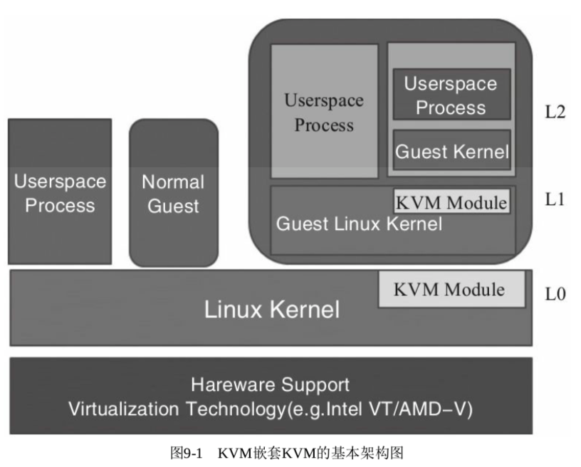
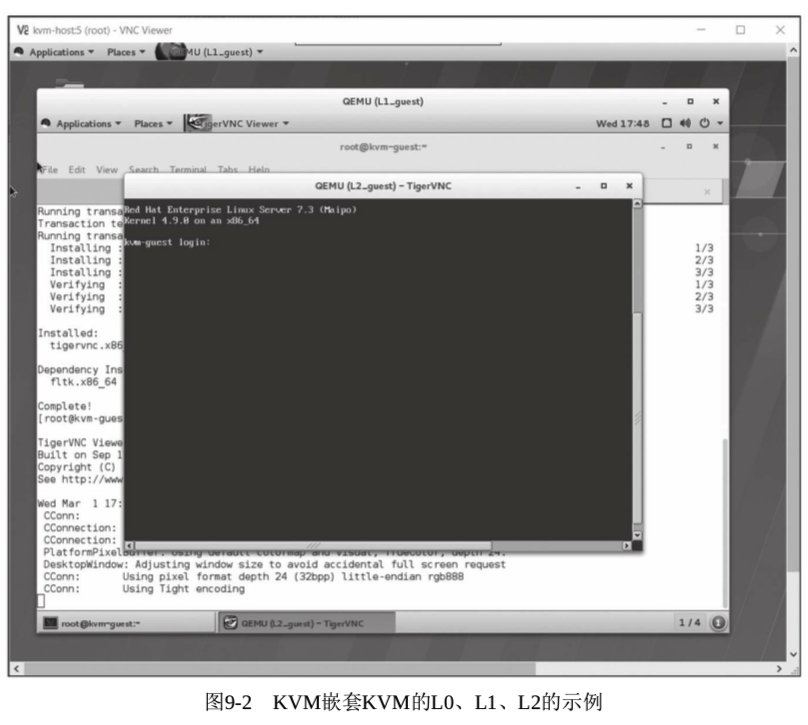

<!-- @import "[TOC]" {cmd="toc" depthFrom=1 depthTo=6 orderedList=false} -->

<!-- code_chunk_output -->

- [1 嵌套虚拟化的基本概念](#1-嵌套虚拟化的基本概念)
- [2 KVM嵌套KVM](#2-kvm嵌套kvm)

<!-- /code_chunk_output -->

# 1 嵌套虚拟化的基本概念

嵌套虚拟化(nested virtualization或recursive virtualization)是指在虚拟化的客户机中运行一个Hypervisor, 从而再虚拟化运行一个客户机. 嵌套虚拟化不仅包括相同Hypervisor的嵌套(如KVM嵌套KVM、Xen嵌套Xen、VMware嵌套VMware等), 也包括不同Hypervisor的相互嵌套(如VMware嵌套KVM、KVM嵌套Xen、Xen嵌套KVM等). 根据嵌套虚拟化这个概念可知, 不仅包括两层嵌套(如KVM嵌套KVM), 还包括多层的嵌套(如KVM嵌套KVM再嵌套KVM).

嵌套虚拟化的使用场景是非常多的, 至少包括如下**5个主要应用**:

1)**IaaS**(Infrastructure as a Service)类型的云计算提供商, 如果有了嵌套虚拟化功能的支持, 就可以为其客户提供让客户可以自己运行所需Hypervisor和客户机的能力. 对于有这类需求的客户来说, 这样的嵌套虚拟化能力会成为吸引他们购买云计算服务的因素.

2)为测试和调试Hypervisor带来了非常大的便利. 有了嵌套虚拟化功能的支持, 被调试Hypervisor运行在更底层的Hypervisor之上, 就算遇到被调试Hypervisor的系统崩溃, 也只需要在底层的Hypervisor上重启被调试系统即可, 而不需要真实地与硬件打交道.

3)在一些为了起到安全作用而带有Hypervisor的固件(firmware)上, 如果有嵌套虚拟化的支持, 则在它上面不仅可以运行一些普通的负载, 还可以运行一些Hypervisor启动另外的客户机.

4)嵌套虚拟化的支持对虚拟机系统的动态迁移也提供了新的功能, 从而可以将一个Hypervisor及其上面运行的客户机作为一个单一的节点进行动态迁移. 这对服务器的负载均衡及灾难恢复等方面也有积极意义.

5)嵌套虚拟化的支持对于系统隔离性、安全性方面也提供更多的实施方案.

对于不同的Hypervisor, 嵌套虚拟化的实现方法和难度都相差很大. 对于完全纯软件模拟CPU指令执行的模拟器(如QEMU), 实现嵌套虚拟化相对来说并不复杂; 而对于QEMU/KVM这样的必须依靠硬件虚拟化扩展的方案, 就必须在客户机中模拟硬件虚拟化特性(如vmx、svm)的支持, 还要对上层KVM hypervisor的操作指令进行模拟. 据笔者所知, 目前, Xen方面已经支持Xen on Xen和KVM on Xen, 而且在某些平台上已经可以运行KVM on Xen on Xen的多级嵌套虚拟化; VMware已经支持VMware on VMware和KVM on VMware这两类型的嵌套. KVM已经性能较好地支持KVM on KVM和Xen on KVM的情况, 但都处于技术预览(tech preview)阶段.

# 2 KVM嵌套KVM

KVM嵌套KVM, 即在KVM上面运行的**第一级客户机**中再加载**kvm**和**kvm\_intel**(或kvm\_amd)模块, 然后在第一级的客户机中用QEMU启动带有KVM加速的第二级客户机. “KVM嵌套KVM”的基本架构如图9-1所示, 其中底层是具有Intel VT或AMD-V特性的硬件系统, 硬件层之上就是底层的宿主机系统(我们称之为L0, 即Level 0), 在L0宿主机中可以运行加载有KVM模块的客户机(我们称之为L1, 即Level 1, 第一级), 在L1客户机中通过QEMU/KVM启动一个普通的客户机(我们称之为L2, 即Level 2, 第二级). 如果KVM还可以做多级的嵌套虚拟化, 各个级别的操作系统被依次称为: L0、L1、L2、L3、L4……, 其中L0向L1提供硬件虚拟化环境(Intel VT或AMD-V), L1向L2提供硬件虚拟化环境, 依此类推. 而最高级别的客户机Ln(如图9-1中的L2)可以是一个普通客户机, 不需要下面的Ln\-1级向Ln级中的CPU提供硬件虚拟化支持.

KVM对“KVM嵌套KVM”的支持从2010年就开始了, 目前已经比较成熟了. “KVM嵌套KVM”功能的配置和使用有如下几个步骤.

1)在L0中, 查看kvm\_intel模块是否已加载以及其nested参数是否为‘Y’, 如下:

```
[root@kvm-host ~]# cat /sys/module/kvm_intel/parameters/nested
N
[root@kvm-host ~]# modprobe -r kvm_intel
[root@kvm-host ~]# modprobe kvm_intel nested=Y
[root@kvm-host ~]# cat /sys/module/kvm_intel/parameters/nested
Y
```



如果kvm\_intel模块已经处于使用中, 则需要用“modprobe \-r kvm\_intel”命令移除kvm\_intel模块后重新加载, 然后再检查“/sys/module/kvm\_intel/parameters/nested”这个参数是否为“Y”. 对于AMD平台上的kvm\-amd模块的操作也是一模一样的.

2)启动L1客户机时, 在qemu命令中加上“\-**cpu host**”或“\-**cpu qemu64,\+vmx**”选项, 以便将CPU的硬件虚拟化扩展特性暴露给L1客户机, 如下:

```
[root@kvm-host ~]# qemu-system-x86_64 -enable-kvm -cpu host -smp 4 -m 8G -drive file=./rhel7.img,format=raw,if=virtio -device virtio-net-pci,netdev=nic0 -netdev bridge,id=nic0,br=virbr0 -snapshot -name L1_guest -drive file=./raw_disk.img,format=raw,if=virtio,media=disk
```

这里, “\-cpu host”参数的作用是尽可能地将宿主机L0的CPU特性暴露给L1客户机; “\-cpu qemu64, \+vmx”表示以qemu64这个CPU模型为基础, 然后加上Intel VMX特性(即CPU的VT-x支持). 当然, 以其他CPU模型为基础再加上VMX特性, 如“\-cpu SandyBridge, \+vmx”“\-cpu Westmere, \+vmx”也是可以的. 在AMD平台上, 则需要对应的CPU模型(“qemu64”是通用的), 再加上AMD\-V特性, 如“\-cpu qemu64, \+svm”.

3)在**L1客户机**中, 查看**CPU的虚拟化支持**, 查看kvm和kvm\_intel模块的加载情况(如果没有加载, 需要读者自行加载这两个模块), 启动一个L2客户机, L2的客户机镜像事先放在raw\_disk.img中, 并将其作为L1客户机的第二块硬盘, /dev/vdb. 在L1客户机中(需像L0中一样, 编译好qemu), 我们将/dev/vdb mount在/mnt目录下, 如下:

```
[root@kvm-guest ~]# cat /proc/cpuinfo | grep vmx | uniq
flags : fpu vme de pse tsc msr pae mce cx8 apic sep mtrr pge mca cmov pat pse36 clflush mmx fxsr sse sse2 ss syscall nx pdpe1gb rdtscp lm constant_tsc arch_perfmon rep_good nopl xtopology eagerfpu pni pclmulqdq vmx ssse3 fma cx16 pcid sse4_1 sse4_2 x2apic movbe popcnt tsc_deadline_timer aes xsave avx f16c rdrand hypervisor lahf_lm abm 3dnowprefetch arat tpr_shadow vnmi flexpriority ept vpid fsgsbase tsc_adjust bmi1 hle avx2 smep bmi2 erms invpcid rtm rdseed adx smap xsaveopt

[root@kvm-guest ~]# lsmod | grep kvm
kvm_intel             170181  0
kvm                   554609  1 kvm_intel
irqbypass              13503  1 kvm

[root@kvm-guest ~]# qemu-system-x86_64 -enable-kvm -cpu host -drive file=/mnt/rhel7.img,format=raw,if=virtio, -m 4G -smp 2 -snapshot -name L2_guest
VNC server running on ‘::1:5900'
```

如果L0没有向L1提供硬件虚拟化的CPU环境, 则加载kvm_intel模块时会有错误, kvm_intel模块会加载失败. 在L1中启动客户机, 就与在普通KVM环境中的操作完全一样. 不过对L1系统的内核要求并不高, 一般选取较新Linux内核即可, 如笔者选用了RHEL 7.3系统自带的内核和Linux 4.9的内核, 这都是可以的.

4)在L2客户机中查看是否正常运行. 图9\-2展示了“KVM嵌套KVM”虚拟化的运行环境, L0启动了L1, 然后在L1中启动了L2系统.



由于KVM是全虚拟化Hypervisor, 对于其他L1 Hypervisor(如Xen)嵌套运行在KVM上情况, 在L1中启动L2客户机的操作与在普通的Hypervisor中的操作步骤完全一样, 因为KVM为L1提供了有硬件辅助虚拟化特性的透明的硬件环境.
