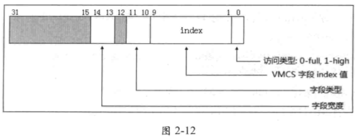

<!-- @import "[TOC]" {cmd="toc" depthFrom=1 depthTo=6 orderedList=false} -->

<!-- code_chunk_output -->

- [1. VMPTRLD 指令](#1-vmptrld-指令)
- [2. VMPTRST 指令](#2-vmptrst-指令)
- [3. VMCLEAR 指令](#3-vmclear-指令)
- [4. VMREAD 指令](#4-vmread-指令)
- [5. VMWRITE 指令](#5-vmwrite-指令)

<!-- /code_chunk_output -->

有 5 条VMX指令涉及VMCS区域的管理. 下面介绍用法.

# 1. VMPTRLD 指令

VMPTRLD 指令从**内存**中加载一个**64位物理地址**作为 `current-VMCS pointer`.

这个 `current-VMCS pointer` 由**处理器内部自动记录和维护**, 除了 **VMXON**、**VMPTRLD** 和 **VMCLEAR** 指令需要提供 **VMXON** 或 **VMCS** 指针作为**操作数**外, **其他的指令**都是在 `current-VMS` 上操作.

```
vmptrld [gs: PCB.GuestA]    ; 加载 64 位VMCS地址
```

注意: 这条指令读取的是 **64 位物理地址值**，即使在 **32 位环境**下。如上面代码所示，在 `PCB.GuestA` 里保存着一个 **VMCS 区域**的物理地址值，执行这条指令将更新 `current-VMCS pointer` 值。在指令**未执行成功**时，`current-VMCS pointer` 将维持**原有值**。

处理器会根据提供的 VMCS 指针，进行下面的检查事项: 

(1) 物理地址是否超过**物理地址宽度**，并且需要在 **4K 地址边界**上。当 `IA32_VMX_BASIC[48]` 为 1 时，**物理地址宽度**在 **32** 位内，否则为 **MAXPHYADDR** 值(参见第 2.5.4 节)。

(2) VMCS 指针是否为 **VMXON 指针**。

(3) 目标 VMCS 区域**首 DWORD 值**是否符合 `VMCS ID` 值。

当上面检查不通过时，如果原来已经存在 `current-VMCS pointer`，则会产生  **VmfailValid** 失败，`current-vmcs pointer` 将**维持不变**，并且在 current-VMCS 的**指令错误字段**里记录错误号是 **11**(如表 2-5 所示)。指示: “执行 VMPTRLD 时，VMCS 内的  VMCS ID 值不符”。否则，产生 **VmfailInvalid** 失败。

# 2. VMPTRST 指令

VMPTRST 将 **64** 位的 `current-vmcs pointer` **保存**在**提供的内存**中，如下面示例。

```
vmptrst  [gs: PCB.VmcsPhysicalPointer)     ;保存 64 位 WMCS 地址
```

VMPTRST 指令**不会**产生 `VmfailValid` 或 `VmfailInvalid` 失败，除了产生**异常**或 `VM-exit` 外，它总是成功的。

如果没有 current VMCS, 那么将存 `FFFFFFFF_FFFFFFFFH`

# 3. VMCLEAR 指令

VMCLEAR 指令根据提供的 **64** 位 **VMCS 指针**，对目标 VMCS 区域进行一些**初始化工作**，并将**目标 VMCS 的状态**设置为“`clear`”。

这个初始化工作，其中有一项是将**处理器内部维护**的关于 VMCS 的数据写入**目标 VMCS 区域**内。这部分 VMCS 数据可能与处理器相关，这是正确使用 VMCS 的前提。

在使用 `VMLAUNCH` 指令**进入 VM 时！！！**，`current-VMCS` 的 **launch** 状态**必须！！！** 为 "`clear`"。因此，当 **VMCLEAR 指令**对目标 VMCS 进行初始化后，使用 `VMPTRLD` 指令将目标 VMCS 加载为 `current-VMCS`，同时也更新 current-vmcs pointer 值。如下面代码示例。

```x86asm
vmclear  [gs: PCB.GuestA]   ;对 GuestA 进行初始化，置"clear"
jc @1
jz @1

vmptrld  [gs: PCB.GuestA]   ;将 GuestA 加载为 current-WMCS  
jc @1
jz @1
```

执行上述操作后，在**后续工作**里对 GuestA 区域进行配置，然后就可以**使用  VMLAUNCH 指令进入 VM 执行**。

VMCLEAR 指令也会对目标 VMCS 指针进行与 VMPTRLD 指令相同的检查(参见第 2.6.5.1 节)。如果在**执行 VMCLEAR 指令前已经加载过**当前 VMCS 指针，并且  VMCLEAR 指令的目标 VMCS 是 `current-VMCS`，则会设置 `current-VMCS pointer` 为 `FFFFFFFF_FFFFFFFFH` 值。

# 4. VMREAD 指令

VMREAD 指令需要提供一个 **32** 位的 **VMCS 字段 ID 值**放在寄存器里作为**源操作数**。**目标操作数**是寄存器或者内存操作数，将读取到的相应字段值放在目标寄存器或者内存地址中。

VMREAD 指令在 **32 位模式**下固定使用 **32 位的操作数**，在 **64 位**模式下固定使用 **64 位操作数**。(包括源操作数和目的操作数)

在非 `IA-32e` 模式之外，无论`CS.D`的值如何，**源操作数**都具有**32位**。在64位模式下，**源操作数**具有**64位**。

**目标操作数**的**有效大小**(可能是寄存器或内存)在非 `IA-32e` 模式始终为**32位**(相对于操作数大小，`CS.D`的设置被忽略)，在64位模式下始终为**64位**。而 **VMCS 字段**有**不同的宽度**，例如，存在 16 位字段和 natural-width 类型的字段. natural-width 类型的字段在支持 64 位架构的处理器上是 64 位，在不支持 64 位架构的处理器上是 32 位。

为了**适应不同宽度的字段**，VMREAD 指令使用下面的读取原则

* 如果 **VMCS 字段**的 **size** 小于**目标操作数** size，则 **VMCS 字段值**读入目标操作数后，目标操作数的**高位部分清 0**。

* 如果 **VMCS 字段**的 **size** 大于**目标操作数** size，则 VMCS 字段的低位部分读入目标操作数，VMCS 字段的**高位部分忽略**。

由于 **VMCS 字段 ID 值**为 **32** 位，在 **64** 位模式下源操作数的 `bits 63:32` 必须为 0。否则会因为尝试读取一个不支持的 VMCS 字段而产生 **Vmfailvalid** 失败。

```
vmread  [ebp+ EXIT_INFO. Exitreason], eax
vmread ebx. Eax
```

上面的代码中，VMCS 字段 ID 值放在源操作数 EAX 里，读到的值放在内存及 EBX 寄存器里。VMCS 的字段 ID 也被称为“**字段 encode**”，由几个部分组成，如图 2-12 所示。



在前面第 2.5.12 节所提到的 IA32 VMX VMCS ENUM 寄存器(图 2-10) 的 bis9:1 提供最大的 VMCS 区域字段 index 值。这个最大 index 值就是指图 2-12 字段编码中的  index 最大值。关于字段编码的详细说明在第 3.3.1节里描述

在 inclvmx.inc 文件里提供了两个宏，用来读取 VMCS 字段: Dovmread 宏读取 VMCS 字段放在内存 buffer 中，Getvmcsfield 宏读取 VMCS 字段值放在 EAX 寄存器中。如代码片段 2-13 所示。

......


# 5. VMWRITE 指令

VMWRITE 指令的**源操作数**是寄存器或者内存操作数，提供需要**写入 VMCS 字段的值**。**目标操作数**是寄存器，**32 位**的**字段 ID 值**提供在目标寄存器操作数里。

VMREAD 指令在 **32 位模式**下固定使用 **32 位的操作数**，在 **64 位**模式下固定使用 **64 位操作数**。(包括源操作数和目的操作数)

在非 `IA-32e` 模式之外，无论`CS.D`的值如何，**目的操作数**都具有**32位**。在64位模式下，**目的操作数**具有**64位**。

**源操作数**的**有效大小**(可能是寄存器或内存)在非 `IA-32e` 模式始终为**32位**(相对于操作数大小，`CS.D`的设置被忽略)，在64位模式下始终为**64位**。而 **VMCS 字段**有**不同的宽度**，例如，存在 16 位字段和 natural-width 类型的字段. natural-width 类型的字段在支持 64 位架构的处理器上是 64 位，在不支持 64 位架构的处理器上是 32 位。

为了适合不同宽度的字段，WMWRITE 指令使用下面的写原则

* 如果**写入值**的 size **小于** VMCS 字段的 size，则值写入 VMCS 字段后，VMCS 字段的**高位**部分**清 0**

* 如果**写人值**的 size **大于** VMCS 字段的 size，则**忽略**写入值的**高位**部分，**低位**部分写入 VMCS 字段里。

由于 VMCS 字段 ID 值为 32 位，在 64 位模式下目标操作数的 `bits 63:32` **必须为 0**。否则会因为尝试写入一个不支持的 VMCS 字段而产生 **Vmfailvalid** 失败。