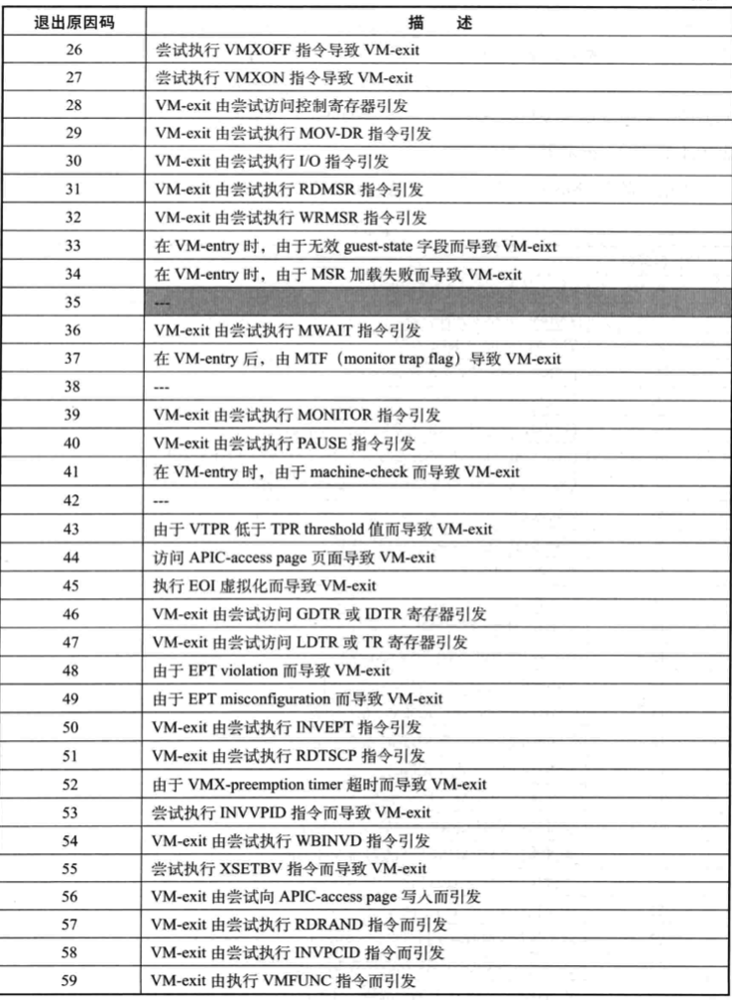

# 基本信息类字段

包括如下 4 个字段:

(1) exit reason 字段, 32位宽, 保存导致 VM-exit 的原因值.

(2) exit qualification 字段, 属于 natural-width 类型字段, 提供导致 VM-exit 的某些事件的明细信息. 

(3) 

# Exit reason 字段

# VM-exit 原因

详细见Intel手册 `APPENDIX C VMX BASIC EXIT REASONS`

AMD的见手册`Appendix C SVM Intercept Exit Codes`

当前VMX架构一共有57个退出原因码, 如表3-24所示.

# Exit qualification字段

Exit qualification 字段属于 natural-widh 类型(在 64 位架构处理器上是 64 位，否则为 32 位)。在 VM-exit 时，这个字段记录由于下面的原因导致 Vm-exit 的明细信息: 

 (1) 由某些指令而引发的 VM-exi，包括: INVEPT, INVLPG, INVPCID, INVVPID,

 LGDT, SGDT, LIDT. SIDT, LLDT. SLDT. LTR. STR. VMCLEAR. VMPTRLD

 VMPTRST, VMREAD, VMWRITE, VMXON, MWAIT 指令。

 (2) 由#DB 异常而引发的 VM-exit

 (3) 由 PF 异常而引发的 VM-exit

 (4) 由于接收到 SIPI 消息而引发的 VM-exit

 (5) 由于接收到 SMI 请求而引发的 VM-exit

 (6) 由于进行任务切换而引发的 M-exit。

 (7) 由访问控制寄存器而引发的 VM-exit。

 (8) 由于执行MOV-DR指令而引发的VM-exi

(9)由于访问 I/O 地址而引发的 VM-exi

 (10) 由于访问 APIC- access page 而引发的 VM-exit

 (11) 由于 EPT violation 而引发的 VM-exit。

 (12) 由 EOI 虚拟化而导致的 VM-exit。

 (13) 由 APIC- write VM-exit 而导致的 VM-exit

对于其他原因导致的 VM-exit, exit qualification 字段将清为 0 值。根据不同的 VM- exit 原因，exit qualification 字段记录的信息格式也不同。下面分别描述上面介绍的 13 种 VM-exit 明细信息。

## 由 I/O 指令引发的 VM-exit

I/O 指令有两类, 分为串(string)指令 INS/OUTS 系列和非串指令 IN/OUT . INS/OUTS 系列指令还可以使用REP前缀来实现重复指令 I/O 指令, 如表3-30所示.

exit qualification 字段的 `bits 2:0`记录I/O指令访问的数据大小: 
* 为 0 时，1 个字节，例如: `in al, 92h`。
* 为 1 时，2 个字节，例如: `in ax, 92h`。
* 为 3 时，4 个字节，例如: `in eax,92h`。

# guest-linear address字段

# guest-physical address字段