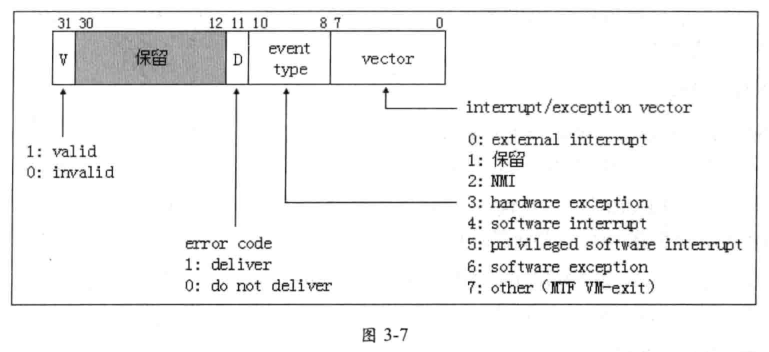
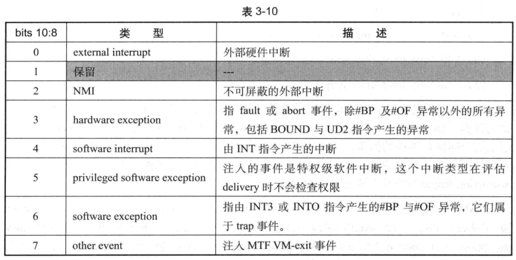

# 1. 事件注入控制字段

**事件注入**是**虚拟化平台中最关键的特性**之一, 是实现**虚拟化管理**的重要手段. 允许**在 VM\-entry 完成后**, 执行任何 **guest 指令前(！！！**), 处理器**执行由 VMM 设置的注入事件**. 这个事件可以是一个**中断(！！！**)或**异常(！！！**), 甚至 `pending MTF VM-exit` 事件, 它们被称为"**向量化事件(！！！**)", 而**含有注入事件的 VM\-entry** 被称为"**向量化的 VM-entry**".

事件注入机制由如下**三个字段**实现

(1) VM\-entry **interruption\-information**字段

(2) VM\-entry **exception error code**字段

(3) VM\-entry **instruction length**字段

VMM通过设置**这三个字段**来**配置向量化事件**.

如果**一个 VM-exit** 是**由于向量化事件而引起**的, 那么 `VM-exit interruption information` 和 `VM-exit interruption error code` 字段会记录这个向量化事件的**信息**. 如果 **INT3** 或 **INTO** 指令产生的**软件异常引发 VM\-exit**, 或者由**软件异常**, **软件中断**, **特权级软件中断 delivery期间**出错而**引发VM\-exit**, `VM-exit instruction length` 字段会记录**引发 VM-exit 指令的长度**.

**VMM**可以直接复制 `VM-exit interruption information`, `VM-exit interruption error code` 及 `VM-exit instruction length` 字段的值到 `VM-entry interruption-information`, `VM-entry exception error code` 及 `VM-entry instruction length` 字段来完成设置. VMM也可以**主动设置**这几个字段来注入一个向量化事件给guest执行.

## 1.1. VM-entry interruption-information字段

这个字段是**32位宽**, 用来设置**注入事件的明细信息**. 包括: **中断或异常的向量号**, **事件类型**, **错误码的delivery标志位**及**有效标志位**. 结构如图3\-7.

* `bit 7:0` 设置中断或异常的向量号, 当事件类型是 **NMI** 时, **向量号**必须为 2. 事件类型为 other 时, 向量号必须为0值.

* `bit 11` 为1时, 指示有错误码需要提交. 在注入事件delivery时, 错误码会被压入栈中. 这个位只有在注入硬件异常事件时才能被置为1, 否则会产生VMfailValid失败. 能**产生错误码**的**硬件异常**是: **#DF, #TS, #NP, #SS, #GP, #PF 及 #AC 这 7 类**. 注入其余异常不能将此位置1.

* `bit 31` 是有效位, 为 1 时指示 `VM\-entry interruption information` 字段有效, 为 0 时无效.

* `bits 10:8` 设置事件类型, 包括**7个事件类型**, 如表3\-10所示.

表中列出了可以注入的7种事件类型, 对应VM\-entry interruption information字段的bits 10:8位, 类型值1保留.

### 1.1.1. 外部中断(0)

**外部中断**不能使用**0\-15号**向量, 也不应该使用**16\-31**号向量, 应使用**32\~255**号向量. 这个时间类型被期望用来注入一个中断控制器(local APIC, IO APIC或者8259A)获得的中断请求.

### 1.1.2. NMI(2)

**NMI必须使用2号向量**. 当NMI成功deliver执行后, 处理器的"blocking by NMI"状态有效, 表示存在NMI阻塞状态, 直到IRET指令执行后解除这个阻塞(见3.8.6节).

当"**virtual\-NMIs"为1**时, 表示注入的是一个**virtual\-NMI事件**, virtual\-NMI delivery后, 就存在virtual\-NMI阻塞状态, 直到IRET指令执行后解除virtual\-NMI阻塞.

当**注入一个virtual\-NMI**, 而"NMI\-window exiting"为1, 并且"blocking by NMI"为0时, 则在**VM\-entry完成后直接产生VM\-exit**.

### 1.1.3. 硬件异常(3)

硬件异常是指**除了 \#BP(INT3指令**)与 \#**OF异常(INTO指令**)以外的**所有异常**, 它们属于**fault或abort类型异常**. 也包括由**BOUND指令产生的\#BR异常**及由**UD指令产生的\#UD异常**. 所有类型的\#DB异常(也包括了trap类型)也属于硬件异常. **硬件异常的向量号必须是0\~31(！！！**).

尽管在**64位模式下BOUND指令无效**, 但**允许注入\#BR异常(！！！**).

### 1.1.4. 软件异常(6)

**软件异常**指由 **NIT3 与 INTO 指令**产生的 \#BP 与 \#OF异常, 对应的向量号必须为 3 与 4. 它们属于 trap 类型. 尽管在 64 位模式下 INTO 指令无效, 但允许注入 \#OF 异常.

### 1.1.5. 软件中断(4)

软件中断指由**INT指令执行的中断**. 软件中断在delivery期间需要进行权限的检查. 对于一个non\-conforming代码段, CPL≤Gate的DPL值, 并且CPL≥Code段的DPL值. 如果在delivery期间法还是能权限不符合会产生\#GP异常. 如果exception bitmap字段的bit 13位1, \#GP异常会导致VM\-exit. 因此将在VM\-exit interruption information字段中记录中断的向量号和时间类型等. 在VM\-exit interruption error code字段记录\#GP异常错误码.

注入由INT3或INTO指令产生的软件异常和软件中断一样, 在delivery期间同样修安排进行权限的检查, 处理手法与软件中断一样.

### 1.1.6. 特权级软件中断(类型5)

这类事件**只能在注入时使用**, **不可能在执行中遇到**. 也就是说: 在**执行过程中不可能产生这类中断(！！！**), **只能通过注入事件的方式(！！！**)产生. 除了**无需进行权限检查**外, 其余的处理手法与软件中断是一致的. 这也就是这类事件的**特权**由来.

### 1.1.7. 其他事件(类型7)

这类事件目前使用在**MTF(Monitor Trap Flag)功能**上. 当**事件类型为7**时, **向量号必须为0**. 否则在VM\-entry时会产生VMfailValid失败. 注入这个类型事件时, 将**pending一个MTF VM\-exit事件**. 当VM\-entry完成后会**产生MTF VM\-exit(参见4.15.3节**).

注意: 这个MTF VM\-exit事件**不受"monitor trap flag"控制位的影响**(另见3.5.2.1节), 但必须在支持"monitor trap flag"功能时才能注入MTF VM\-exit.

## 1.2. VM-entry exception error code字段

这个32位的字段只有在**VM\-entry interruption information字段**的**bit 31**及**bit 11为1**时才有效, 提供一个**异常错误码**在注入事件delivery期间压入栈中.

只有\#**DF, \#TS, \#NP, \#SS, \#GP, \#PF及\#AC异常才会产生错误码**. 因此, 注入这几个**硬件异常**时需要**提供错误码**. 对于**其他硬件异常**或**其他类型的事件**, 这个字段会被忽略.

## 1.3. VM\-entry instruction length字段

这个字段是32位宽. 在事件注入中, 它被期望VM\-exit由下面的向量化事件引起时使用:

(1) 由于执行**INT3或INTO指令**产生的软件异常而引起VM\-exit.

(2) 在**软件异常**, **软件中断**或**特权级软件中断delivery期间**产生了异常而导致VM\-exit发生, 或者由于IDT描述符使用了task\-gate尝试任务切换而导致VM\-exit发生.

如果由这些向量化事件引起VM\-exit, 在VM\-exitinstruction length字段中会记录这些指令的长度.

当**注入事件**属于**软件异常(类型6**), **软件中断(类型4**)以及**特权级软件中断(类型5**)时, 必须在这个字段中提供指令长度. 指令长度在1\~15之间, 为0会产生VMfailValid失败.

