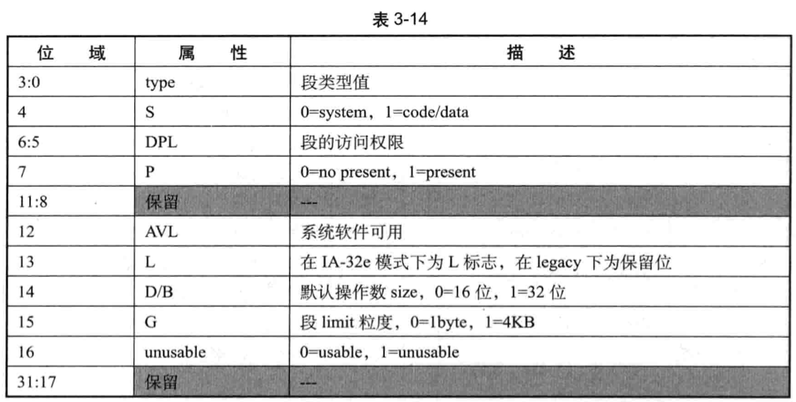
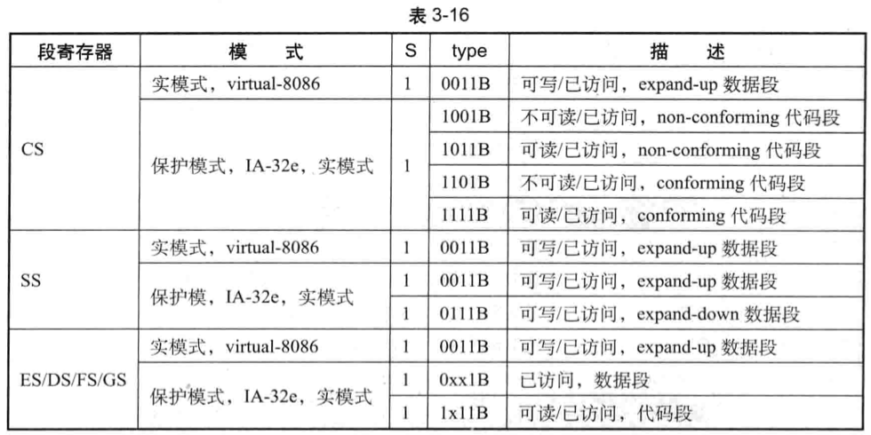
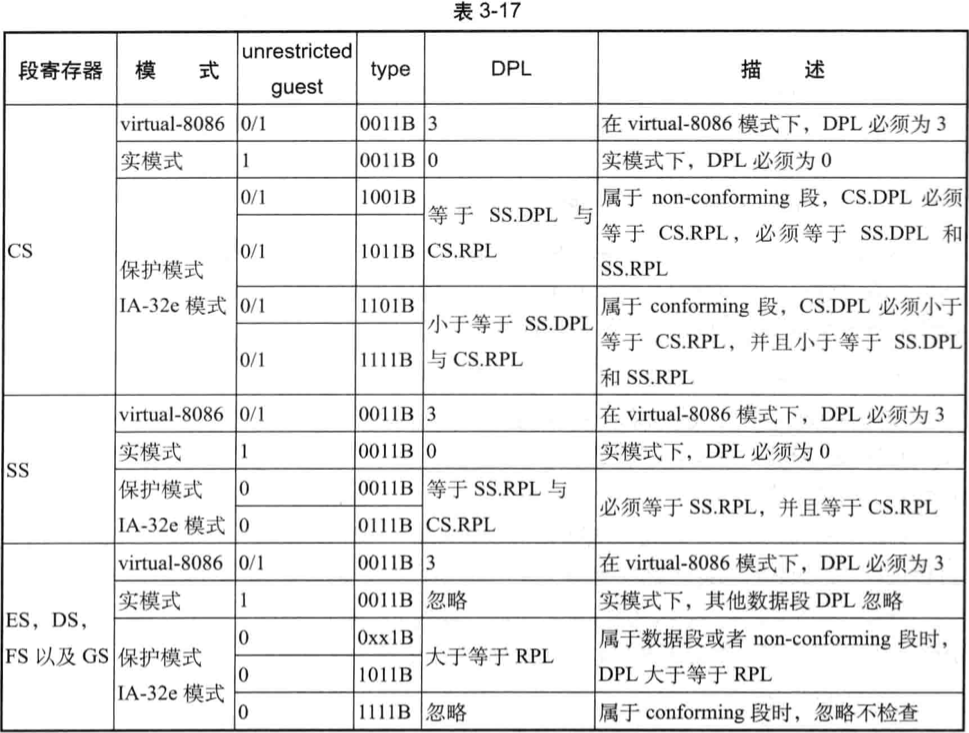

`guest-state` 区城涵盖了**全部 6 个数据代码段寄存器**字段, 分别是 `ES`, `CS`, `SS`, `DS`, `FS` 及 `GS` 寄存器; **2 个系统段寄存器**字段, 分别是 `LDTR` 与 `TR` 寄存器. 

**段寄存器**由 **selector**(**可视部分**)及 **cache**(**不可视部分**)组成. 内部的 **cache 部分**包括 **base**, **limit** 及 **access right**(又称 **attribute**)三个子域(关于段寄存器结构可参见《x86/64 体系探索及编程》10.5.3 节描述). 

因此, 在 guest-state 区城中, **每个段寄存器**有 **4 个字段**对应, 分别描述符段寄存器的各个域. 

(1) **selector**, 16 位字段. 

(2) **base**, `natural-width` 类型字段. 在 **64 位架构**处理器上是 **64 位**, 否则为 32 位宽. 

(3) **limit**, 32 位字段. 

(4) **access right**, 32 位字段. 

在**x64体系**中, `ES.base`, `CS.Base`, `SS.Base` 以及 `DS.Base` 在 **64 位模式**下是**无效的**. 并且它们**仅支持 32 位的地址值**. 

但在 **VMCS 的 guest-state 区城 base 字段**中, 由于是 `natural-width` 类型字段, 它们在**64位处理器**上是 **64** 位的. 因此, `ES.base`, `CS.base`, `SS.base` 以及 `DS.Base` 字段的 `bits 63:32` **必须为 0 值**. 否则, 在发起 Vm-entry 时会引发“由于 guest-state 无效导致 Vm-entry 失败”, 产生 VM-exit 行为. 

# access right字段

在 `guest-state` 区域中, access right 字段为 **32 位宽**. 在 `x86/x64` 平台中, **段寄存器内部 cache** 的 **attribute** 城**宽度是未知的**(或为 16 位或为 32 位). 

表 3-14 列出了 `access right` 字段的结构. 除了新了一个“**unusable**”位外, access  right 字段与段寄存器 cache 内的属性部分是一一对应的, 在 Vm-entry 时, access right 会被加载到**段寄存器 cache** 中.

## type 位域

段类型有两大类, 分别为 **system 段**与 **code/data段**, 由 access right 的 `S` 位来设置(bit 4).

* **system 段**: `bit 4` 为 **0** 时, 属于**系统段**. 包括 **LDT** 与 **TSS** 段, 分别由 **LDTR** 与 **TR** 寄存器来引用. 
* **code/data段**: `bit 4`为1时,属于代码或数据段. 包括代码段和所有数据段, 分别由 CS 与 ES, SS, DS, FS, GS 寄存器来引用. 

access right 字段的 **type 位域**(`bits 3:0`) 进一步设置**段的类型**. 对于**系统段**来说, type 的值必须是表 3-15 所列出的类型值. 

* **TR 寄存器** access right 字段的 **type 位域**在 **legacy 模式**下必须为 **3** 或 **11** 值, 在 **IA-32e** 模式下必须为 **11** 值. 
* LDTR 寄存器 access right 字段的 type 位域在所有模式下都必须为 **2** 值. 

表 3-16 列出了 code/data 段寄存器 access right 字段的 type 位域支持的所有值, 这些段**必须是已访问的**. 

* CS 寄存器

    * 在 `virtual-8086` 模式下: type 值必须为 **3**, 指示 “**可写**并且**已访问的 expand-up 数据段**”. 

    * 在**实模式**、**保护模式**或者 **IA-32e** 模式下: type 值可以为 `9`, `11`, `13` 或者 `15` 指示属于**已访问**的, **可读**或**不可读**, conforming 或 non-conforming 类型代码段. 在实模式下 type 值还可以为 3 

* SS 寄存器

    * 在 virtual-8086 模式下: type 值必须为 **3**. 

    * 在实模式、保护模式或者 IA-32e 模式下: type 值可以为 `3` 或者 `7`, 表示**可写**并且**已访问**的 `expand-up` 或 `expand-down` 数据段

* ES, DS, FS 以及 GS 寄存器

    * 在 virtual-8086 模式下: type 值必须为 3

    * 在实模式, 保护模式或者 IA-32e 模式下: type 值为 0x1B (x 为 0 或 1), 表示已访问的数据段, 或者为 1x1B (11 或 15), 表示可读已访问的代码段. 

guest 要进入**实模式**运行, 必须是处理器支持 `unrestricted guest` 功能, 并且在 `VM-entry` 时设置 `secondary processor-based VM-execution control` 字段的“unrestricted guest”位为 1. 而 virtual-8086 模式是在**保护模式基础上模拟 8086 行为**. 

## DPL 位域

access right 的 DPL 位城用来设置段的访问权限, 段在不同的 type 值下对应不同的 DPL 设置. 表 3-17 描述了 VM-entry 时需要满足的 DPL 设置要求. 

表 3-17 列出了各种模式下 VM- entry 时的检查需求. 留意观察“unrestricted guest 位与 tpe 值的影响, 表中所列的保护模式对应的“unrestricted guest”位为 0 值, 当 guest 是保护模式并且“unrestricted guest“”为 1 时(此时不能是 IA-32e 模式), 处理器的检查会有一些区别. 对 DPL 的检查, 也由于段的类型不同而有区别. 

在86/64体系中,Ss.DPL无论什么时候都代表着处理器的CPL(当前权限级 别). 关于CS.RPL,CS.DPL, SSRPL 及 SS.DPL, 有下面的描述: 

 (1) 在保护模式下,SS.DPL与 SS.RPL 必须相等. CS.RPL,SS.RPL 及 SS.DPL 都表示处理器的 CPL (当前权限级别). 在使用 non- conforming段时, CS.DPL 必须等于 CS.RPL. 并且CS.DPL 必须等于 SS.DPL 值, 进一步得出CS.RPL 也必须等于 SS.RPL 值. 

 (2) 在使用 conforming段的情况下, CS. DPL并不一定代表 CPL 值. CS. DPL 需要小于或等于 CS. RPL 值, 允许在低权限级别执行高权限的目标代码段. 

 (3) 在实模式下, 不使用 CS.RPL 与CS. RPL, 它们用来计算段基址. 而 SS. DPL 必须为0 值, 此时它表示处理器的 CPL 为 0. CS. DPL 的值同样由于 non- conforming或  conforming 类型而要求不同, 使用 non- conforming 段时, CS. DPL 必须为 0 值. 使用  conforming 段时, CS. DPL 小于等于 SS. DPL. 

在 VMX 架构中, 进行 VM- entry 时对段寄存器的加载行为, 并不能完全等效于 x86x64 体系保护模式下对段寄存器的加载. 有下面的描述: 

1) 当“unrestricted guest”为 1 时, 在 VM- entry时处理器并不检SS.DPL是否等于SS.RPL, 同样不检查CS.DPL是否等于CS.RPL, 也不检查CS.RPL是否等于SS.RPL. 

 (2) 在“unrestricted guest”为 0 的前提下, 处理器会检查 non- conforming段的 CS.DPL,CS.RPL,SS.RPL 及 SS.DPL 这四者是否相等. 

 (3) ES, DS, FS 以及 GS 寄存器在“unrestricted guest”为 1 时, 也不检 RPL 与 DPL. 在“unrestricted guest”为 0 时, DPL 需要大于或等于 RPL 值. 但如果使用  conforming 段作为数据段, 这个检查也将忽略. 

 (4) 在 virtual-8086 模式下, 所有段的 DPL 都必须为 3. 

 (5) VM-enty 时, 处理器并不检查是否有权限加载 ES, DS, FS 及GS 寄存器. 即使在 CPL=3 (SS.DPL=3) 时, 也可以加载 DPL=0 的 ES, DS, FS 及 GS 寄存器. 在保护模式下这是不允许的. 

 Vm-entry 时, DPL 位域是处理器对 access right 字段的检查之一. access right 字段通

过检查后, 会加载到段寄存器的 cache 中. 但并不代表这就是正确的 guest 运行环境设置. 

例如, 当 CS.DPL 与 SS. DPL 都为 3 时,DS. DPL却为 0值. 这符合 M- entry时对 DPL的检查, 它们分别被加载到CS, SS及DS 的 cache 中

## D/B 位与L 位

D/B 位对 CS 和 SS 有意义, 使用在 CS 上被作为 D 位, 使用在 SS 上被作为 B 位: 

 (1) CS. D 指示默认的操作宽度(default operation size). CS. D=1 时, 指示 32 位  address-size 及 32 位的 operand-size. CS. D=0 时, 指示 16 位的 address-size 以及 operand

 (2) SSB 指示栈指针宽度. SB=1 时是 32 位, 栈指针为 ESP. SSB=0 时是 16 位, 栈指针为 SP. 

L 位使用在 CS 上, 仅在 1A-32e 模式下有效. CS. L 为 1 时 CS. D 必须为 0, 表示  guest 进入 64-bit 模式. 当 CS. L=0 时, 表示 guest 进人 compatibility 模式, 此时由 CS. D 决定默认的操作宽度. 

## G 位

G 位指示段限的粒度, G=1 时粒度为 4KB, G=0 时粒度为 1B. 所以, 在段限大于  OFFFH E 时, G 必须为 1. 段限在 0 至 OFFFH 之间时, G 必须为 0 值. 

在 x64 体系的 64bit 模式下, 除了 FS 与 GS 段外, 其余段的 limit 都是无效的. 但在 VMX 架构下, 即使 guest 是 64-bit 模式, 在 VM- entry 时对 G 位的设置还是必须符合上述的要求.

## unusable 位

access right 新增了一个 unusable 位(bit16). 为 1 时指示 access right 字段不可用, 它的所有信息被忽略. 处理器对 access right 字段有效性的检查建立在 unusable 位为 0 的前提下. 

TR 段对应的 access right 字段必须是有效的(unusable 为 0). 如果 guest 是 virtual 8086 模式, 那么所有的段都必须是有效的(unusable 为 0). 