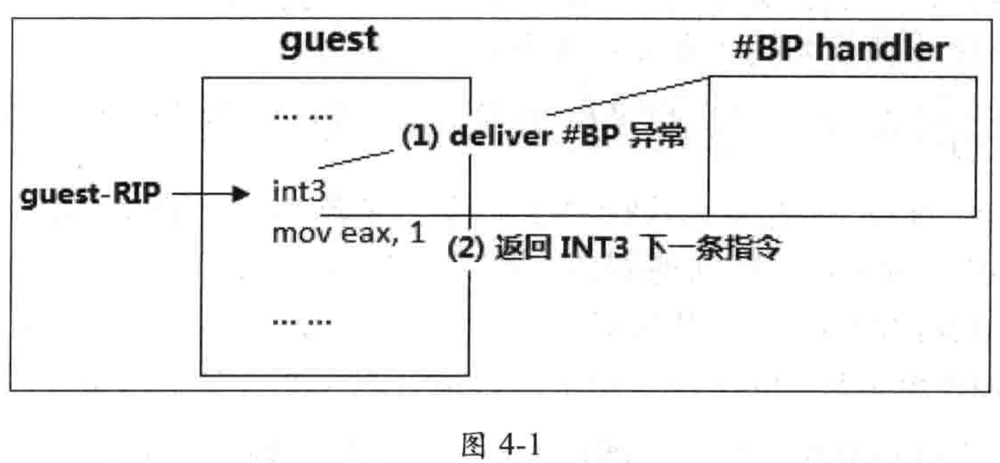

<!-- @import "[TOC]" {cmd="toc" depthFrom=1 depthTo=6 orderedList=false} -->

<!-- code_chunk_output -->

- [概要](#概要)
- [pending MTF VM-exit事件](#pending-mtf-vm-exit事件)
- [向量事件的注入点](#向量事件的注入点)
- [fault与trap类型事件](#fault与trap类型事件)

<!-- /code_chunk_output -->

# 概要

MSR-load 列表成功加载完毕(如果需要加载), 代表在整个 VM-entry 操作流程里, 处理器在 host 端的工作已经完成, **当前处理器**已经成功转入**guest端的运行环境**.

如果存在"**事件注入**"或"**pending debug exception**", 它们将是 **VM-entry 完成后**处理器在guest环境里的**第1个需要执行的任务**.

多数情况下, **事件注入**或**pending debug exception**是虚拟化 **guest 端产生事件的一种手段**, 但也可以是 **host 主动让 guest 执行额外的工作**.

**VM-entry interruption information字段**的 `bit 31` 为 1 时, 取决于该字段的设置(见 3.6.3 节与 4.4.3.3 节), 有下面的事件注入:

- **外部中断(类型为0**), **NMI(类型为2**), **硬件异常(类型为3**), **软件中断(类型为4**), **特权级软件中断(类型为5**)以及**软件异常(类型为6**);

- **pending MTF VM-exit 事件**: 中断**类型为 7**, 并且**向量号为 0**.

这些注入的事件属于"**向量事件**", 当 VM-entry 伴随着一个事件注入时, 这样的 VM-entry 被称为"**向量化的 VM-entry**".

由于事件注入是 **VM\-entry 完成**后 **guest 第 1 个需要执行的任务**, 所有有很高的优先级.

**guest环境**下**当前的 IDTR 寄存器**已经被加载(见 `4.7.5.2` 节), 表示 **guest 端的 IDT 已经建立**. 这个向量事件将**通过 guest IDT 进行 deliver 执行(！！！**).

# pending MTF VM-exit事件

VMX架构允许注入一个**不执行任何代码的事件**. 中断**类型为7**并且**向量号为0**时, 注入一个**MTF VM\-exit事件**pending在guest的第1条指令前, VM\-entry操作完切换到guest环境后**立即产生VM\-exit**. 注入的pending MTF VM\-exit事件不受processor\-based VM\-execution control字段的"monitor tap flag"位影响, 即使"monitor trap flag"为0.

# 向量事件的注入点

在 guest 执行注入的事件前 guest 的**运行环境已经被建立**. **当前的 CS:RIP(指令指针**), **SS:RSP(栈指针**)以及 **RFLAGS 值已经从 guest-state 区域(！！！**)相应的字段里加载.

**RIP** 指向 VM-entry 后 **guest 端第 1 条指令**的位置, **向量事件**被 **pending 在 guest 的第 1 条指令前(！！！**). 因此, 注入事件在 guest 第 1 条指令之前被 deliver 执行.

如图, guest 执行 **INT3 指令**由于 **exception bitmap 字段 bit 3 为1**而**产生VM-exit(！！！**), **VMM 注入 #BP 异常**恢复 **guest 执行**(必须在 VM-entry instruction length 字段里提供**指令长度！！！**). \#BP异常在**guest 第 1 条指令(即 INT3)前被 deliver 执行(！！！**). 处理器在 **deliver #BP 异常期间压入的返回值**等于 **guest-RIP 加上指令长度**(也就是 #BP handler 返回**会跳过 INT3 指令**)

假如**开启分支记录功能**来**监控注入事件的 delivery 情况**, 可以看到**事件 delivery 源地址**是 **guest 第 1 条指令**,**目标地址**是**注入事件的服务例程入口地址**. **IRET 指令**返回的**目标地址**是 **guest 第 1 条指令地址**(图中就是**INT3 的下一条指令**).

从guest执行流程看, **注入的事件本质**上相当于"**VM\-entry**后**guest第1条指令前**产生一个**向量事件**". 取决于事件的类型, 有下面几种情况:

- 注入**硬件异常事件(0\~31之间的**)时, 相当于**引发一个异常**.
- 注入**外部中断或NMI**时, 相当于遇到了一个**外部中断或NMI请求**.
- 注入**软件中断**或特权级软件中断时, 相当于插入了一条INT指令.
- 注入软件异常时, 相当于插入了一条INT3或INTO指令.

# fault与trap类型事件

在 guest 里, 一个向量事件直接或间接引发 VM\-exit后, VMM需要在 VM-entry 时通过注入事件的方式让guest完成向量事件的处理.

引用对异常的分类方法, 按照事件处理后恢复的执行点不同, 可以将向量事件分为以下两大类:

- fault 类型: 指硬件异常(不包括由单步调试产生的\#DB异常), 外部中断和 NMI.
- trap类型: 指软件异常(\#BP与\#OF, 执行INT3与INTO指令产生), 软件中断(执行INT指令)和特权级软件中断(事件注入方式)

