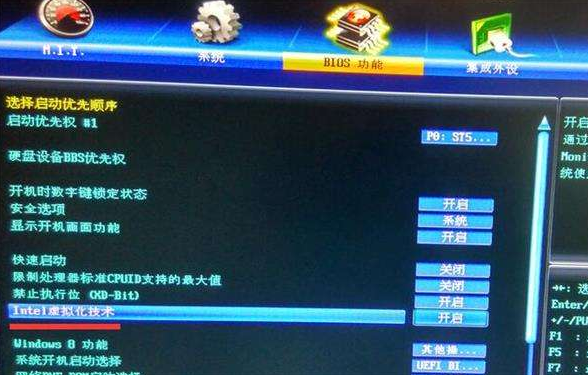
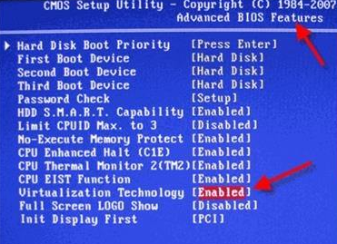
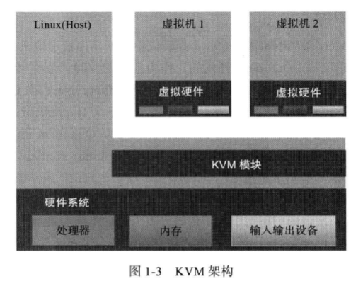
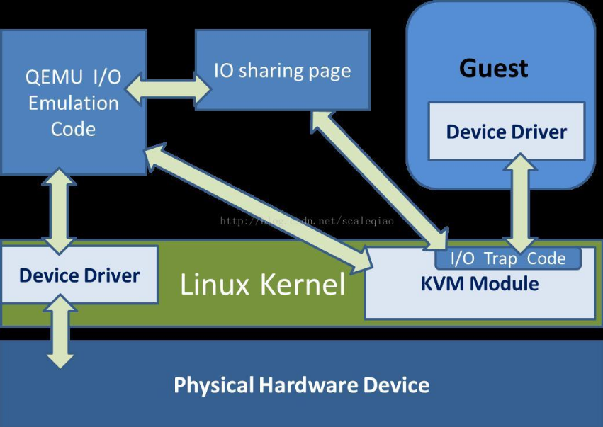
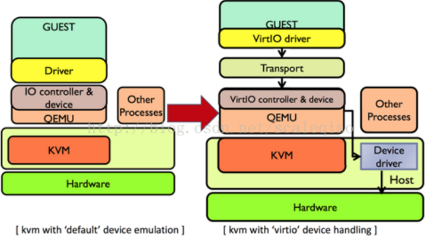

<!-- TOC depthFrom:1 depthTo:6 withLinks:1 updateOnSave:1 orderedList:0 -->

- [KVM简介](#kvm简介)
	- [KVM历史](#kvm历史)
	- [KVM功能特性](#kvm功能特性)
		- [KVM内存管理](#kvm内存管理)
		- [KVM存储](#kvm存储)
		- [KVM设备驱动](#kvm设备驱动)
		- [KVM性能和伸缩性](#kvm性能和伸缩性)
	- [KVM辅助](#kvm辅助)
		- [Qemu-kvm](#qemu-kvm)
		- [libvirt](#libvirt)
		- [virt-manager](#virt-manager)
	- [KVM前景](#kvm前景)
	- [参考文章](#参考文章)
	- [END](#end)

<!-- /TOC -->
# KVM简介

## KVM历史

* KVM全称Kernel Virtual Machine,内核虚拟机
* KVM虚拟机最初是由一个以色列的创业公司Qumranet开发的, 作为他们的VDI产品的虚拟机. 为了简化开发, KVM的开发人员并没有选择从底层开始新写一个Hypervisor, 而是选择了基于Linux kernel, 通过加载新的模块从而使Linux Kernel本身变成一个Hypervisor. 
* 2006年8月, 在先后完成了基本功能、动态迁移以及主要的性能优化之后, Qumranet正式对外宣布了KVM的诞生并推向Linux内核社区. 同年10月, KVM模块的源代码被正式接纳进入Linux Kernel, 成为内核源代码的一部分. 
* 2007年2月发布的Linux 2.6.20是第一个带有KVM模块的Linux内核正式发布版本. 
* 2008年9月4日, 同内核社区保持着很深渊源的著名Linux发行版提供商—Redhat公司出人意料地出资1亿700百万美金, 收购了Qumranet, 从而成为了KVM开源项目的新东家, 投入较多资源在KVM虚拟化开发中. 
* 2010年11月, Redhat公司推出了新的企业版Linux—RHEL 6, 在这个发行版中集成了最新的KVM虚拟机, 而去掉了在RHEL 5.x系列中集成的Xen. KVM成为RHEL默认的虚拟化方案

## KVM功能特性

* KVM基于硬件辅助虚拟化技术实现的完全虚拟化方案, Linux原生全虚拟化方案. 
* KVM可通过加载内核模块实现, 前提, BIOS中支持并且开启硬件虚拟化Intel-VT

* KVM架构中, 虚拟机实现为常规的Linux进程, 由标准Linux调度程序进行调度. 
* 本质上, 每个CPU显示为一个常规的Linux进程, 是的KVM能够享受Linux内核的所有功能. 
* **KVM本身不执行任何模拟**, 需要用户空间通过/dev/kvm接口设置一个客户机虚拟服务器的地址空间, 向它提供模拟的I/O, 并将它的视频显示映射到宿主的显示屏. 

### KVM内存管理

* 完全采用Linux强大的内存管理. 
* 支持大页面交换
* 支持硬件内存虚拟化技术, 支持Intel的扩展页表EPT
* 支持内核同页合并KSM, KSM扫描虚拟机的内存, 如果多个虚拟机拥有相同的内存页面, KSM将这些页面合并到一个虚拟机之间共享的页面, 进存储一个副本. 直到COW, 写时复制. 

### KVM存储

* KVM支持所有Linux支持的存储
* KVM支持全局文件系统GFS2共享文件系统上的虚拟机镜像, 以允许虚拟机镜像在宿主之间共享或者使用逻辑卷共享. 
* KVM原生磁盘格式位QCOW2, 支持快照, 允许多级快照, 压缩和加密. 

### KVM设备驱动

* KVM支持混合虚拟化. 允许转虚拟化的驱动安装于客户机, 允许虚拟机直接使用I/O接口而不是用模拟设备, 从而提高网络和块设备高性能I/O. 
* VirtIO 是半虚拟化 hypervisor 中位于设备之上的抽象层. virtio 由 Rusty Russell 开发, 他当时的目的是支持自己的虚拟化解决方案 lguest. 
* **一开始, 尽管KVM能够借助于物理硬件提供的CPU、内存等的虚拟化支持来提升效率, 但KVM本身不提供IO设备以及虚拟机管理方面的支持, 而是借助于Qemu来提供这些功能. **KVM加上Qemu的组合可以为用户提供全虚拟化的解决方案, 但QEMU通过纯软件的方式模拟得到的IO设备在性能上有明显问题. 

* 在使用QEMU模拟I/O的情况下, 当客户机中的设备驱动程序(Device Driver)发起I/O操作请求时, KVM模块(Module)中的I/O操作捕获代码会拦截此次I/O, 然后经过加工处理后, 将本次I/O处理请求放入I/O共享页中(sharing page), 并通知用户空间的QEMU程序来模拟出本次的I/O操作. 
* QEMU通过Linux宿主机中真正的设备驱动完成此次操作, 并将操作结果放回到I/O共享页, 然后通知KVM模块中的I/O操作捕获代码. 当然, 这一操作过程中, 客户机作为QEMU的一个进程在等待I/O时可能被阻塞. 另外, 当客户机通过DMA访问大块内存时, QEMU模拟程序不会把操作结果放到I/O共享页中, 而是通过内存映射的方式将结果直接写到客户机的内存中去, 然后通过KVM模块告诉客户DMA操作完成. 
* 每次I/O操作的路径比较长, 而且需要依赖KVM和Qemu这两个类似于中介角色的参与. 这其中会涉及虚拟机和宿主机之间的切换(也就是VMEntry和VMExit), 这种上下文切换, 需要耗费一定量的CPU时钟周期, 而且很容易引起CPU之间的xcall, 性能较差, 而Virtio就是因为解决了这个性能问题而被人熟知的. 
* VirtIO 是对准虚拟化 hypervisor 中的一组通用模拟设备IO的抽象. 它是一种框架, 通过它hypervisor 导出一组通用的模拟设备, 并通过一个通用的应用编程接口(API)让它们在虚拟机中变得可用. **它构造了一种虚拟化环境所独有的存储设备, 因此需要在虚拟机内部安装特定的驱动程序才能正常驱使该设备进行工作**. 通常我们称虚拟机内部的驱动为前端驱动, 称负责实现其功能模拟的程序(KVM平台下即为qemu程序)为后端程序, 半模拟技术也常常被叫做前后端技术. 采用半摸拟技术后, 配合前端驱动, 虚拟化设备完全可以采用全新的事件通知和数据传递机制进而大幅提升性能, 例如在virtio-blk磁盘中, 采用io_event_fd进行前端到后端通知, 采用中断注入方式实现后端到前端的通知, 并通过IO环(vring)进行数据的共享, IO模型也随之发生变化. 
* 很明显VirtIO需要客户机安装额外的驱动支持. 
* 当KVM＋Qemu有了Virtio的支持之后, 虚拟机中的IO请求就不会在有虚拟机和host之间的切换, 而是直接由QEMU中的后端驱动程序直接和host机器中真实的设备驱动通信, 完成IO. 

### KVM性能和伸缩性

* RHEL 6.x 系统一个KVM客户机可支持160个虚拟CPU和多达2T的内存, KVM宿主机支持4096个CPU核心和多达64TB的内存. 

## KVM辅助

### Qemu-kvm

* 开源社区协作, kvm实现不了的功能通过Qemu模拟

### libvirt

* libvirt是一套提供了多种语言接口的API, 为各种虚拟化工具提供一套方便、可靠地编程接口, 不仅支持KVM、Xen等其他其他虚拟化方案. 
* libvirt不仅提供API, 还自带一套基于文本的管理虚拟机命令-virsh, 可以通过virsh使用libvirt全部功能. 

### virt-manager

* 用Python编写的虚拟机管理图形界面, 直观操作虚拟机. 
* virt-manager也是利用了libvirt API编写的哦. 

## KVM前景

* 几年前, KVM缺少成熟的工具用于管理KVM服务器和客户机, 随着libvirt、virt-manager等工具和OpenStack等云计算平台的逐渐完善, KVM易用性方面有所逐渐被克服. 
* KVM在与Linux整合中优于Xen, KVM是Linux内核的一部分, 但是Xen是安装在Linux内核下层的产品而已. 但是Xen历史更长久, 相对更成熟

## 参考文章

https://blog.csdn.net/scaleqiao/article/details/45938369

## END
