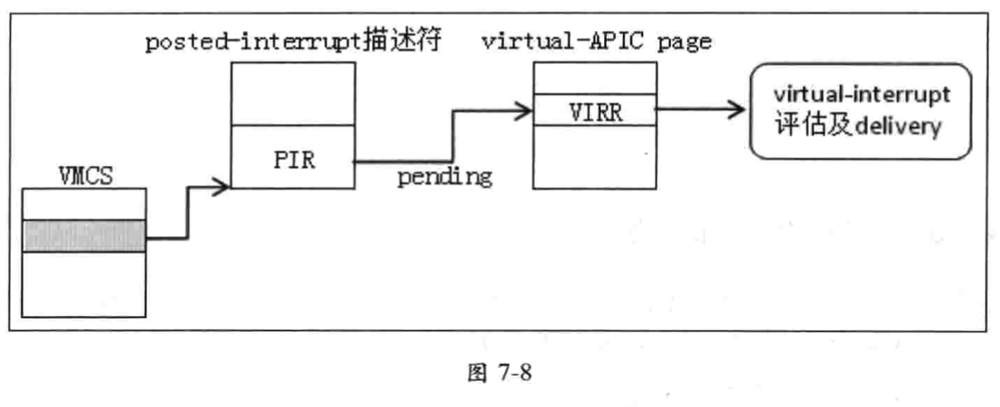

<!-- @import "[TOC]" {cmd="toc" depthFrom=1 depthTo=6 orderedList=false} -->

<!-- code_chunk_output -->

- [1. 基本原理](#1-基本原理)
- [2. 启用posted-interrupt处理机制](#2-启用posted-interrupt处理机制)
- [3. posted-interrupt的通知向量号](#3-posted-interrupt的通知向量号)
- [4. posted-interrupt描述符](#4-posted-interrupt描述符)
- [5. Posted-interrupt处理流程](#5-posted-interrupt处理流程)
- [6. posted-interrupt的使用](#6-posted-interrupt的使用)

<!-- /code_chunk_output -->

# 1. 基本原理

`posted-interrupt`(直译为"**通告中断**")是指**VMM**张贴出来给guest进行处理的**虚拟中断**. `posted-interrupt processing` 就是这个虚拟中断的处理机制.

posted-interrupt processing(通告中断处理)机制在较早处理器并不支持. VMM通过**检查**`Pin-based VM-execution control`字段的"`process posted interrupts`"位(bit 7)**是否允许设为1**来检查处理器**是否支持**(见2.5.6.1).

**guest**收到一个**中断通知**(**向量号**为`posted-interrupt notification vector`的**外部中断！！！**)后, 将张贴的**通告中断请求列表！！！** 复制到`virtual-APIC page`页面的**VIRR**里, 从而**更新虚拟中断请求列表**, 然后进行**虚拟中断的评估与delivery**.

# 2. 启用posted-interrupt处理机制

`posted-interrupt processing` 机制用来处理 **VMM 预先！！！为 guest 设置的 virtual-interrupt**(虚拟中断).

VMM 将`Pin-based VM-execution control`字段的`"process posted interrupts"`位 **置1** 开启 `posted-interrupt processing` 机制, 同时也需要满足下面的设置(参见 4.4.1.1 节).

* `pin-based VM-execution control` 字段的`"external-interrupt exiting"`位必须为 1.

* `VM-exit control` 字段的"`acknowledge interrupt on exit`"位必须为 1.

由此可见, 当 local APIC 收到外部中断请求时, 要么产生 `VM-exit`, 要么就执行**虚拟中断的评估与 delivery 操作**.

"`acknowledge interrupt on exit`"位为 1, 表明当由于外部中断而产生`VM-exit`时(它不控制这个行为), **处理器**将**响应**中断控制器(local APIC)的中断请求, 清除外部中断对应的**Requst位**. 从中断控制器**取得中断向量信息**(包括向量号等), 保存在VM-exit interrupt information字段中.

处理器响应 local APIC 得到的中断向量被称为"physical vector"(**物理向量号**), 处理器将使用这个 **physical vector** 与"**notification vector**"(通知向量)进行对比.

# 3. posted-interrupt的通知向量号

VMM需要在`posted-interrupt notification vector`字段里提供一个**通知向量号**(属于**VM-execution控制类**字段, 见3.5.13). 那么(当外部中断向量号等于通知向量号), local APIC接收到的这个**外部中断**可被成为"通知中断", 其作用是**通知guest进行posted-interrupt的处理**.

在**guest！！！** 中, 当**local APIC**(物理的)收到**外部中断请求**时, 处理器
1. 检查这个外部中断请求的向量号与`notification vector`(通知向量号)是否相等(即检查**是否为通知中断**).
2. 相等则将posted-interrupt描述符(`posted-interrupt descriptor`)内的**PIR请求列表**复制到**VIRR**, 形成**新的虚拟中断请求列表**, 然后执行`virtual-interrupt`的评估与delivery操作.

注: 没有发生`vm-exit`

如图7-8.



3. 当外部中断向量号**不等于notification vector**时, 则产生VM-exit. 由于"acknowledge interrupt on exit"位为 1, 在 VM-exit 时处理器从 local APIC 里获取外部中断的信息, 保存在 `VM-exit interruption information` 字段里(参见 3.7.1 节).

# 4. posted-interrupt描述符

VMM 需要在 `posted-interrupt descriptor address` 字段里提供一个 **64 位物理地址**(必须是 64 字节边界对齐, 参见 4.4.1.1 节), **指向**一个被称为"`posted-interrupt descriptor`(通告中断描述符)的数据结构(参见 3.5.14 节). posted-interrupt 描述符结构为 512 位宽, 如表 7-3 所示.

表 7-3:

<table>
    <tr>
        <th>位域</th>
        <th>名字</th>
        <th>描述</th>
    </tr>
    <tr>
        <td>255:0</td>
        <td width="235">PIR(Posted-interrupt requests)</td>
        <td>每一位表示一个中断向量. 某一位为1时表明存在相应的posted-interrupt请求</td>
    </tr>
    <tr>
        <td>256</td>
        <td>ON(outstanding notification, 待处理通知位)</td>
        <td>为1时表明有一个或多个posted-interrupt请求需要处理</td>
    </tr>
    <tr>
        <td>511:257</td>
        <td>AVL(software available, 软件可用位)</td>
        <td>此部分保留给软件使用, 处理器不会修改此域</td>
    </tr>
</table>

* 描述符的 `bis 255:0` 是 PIR (posted-interrupt request)域, 每一位对应一个中断向量号, (譬如 bit60 对应中断向量号 60). 某位为 1 时表明出现了该位对应的中断请求(中断向量号对应为该位).
* `bit 256` 是 ON (outstanding notification)位, 为 1 时表明 PIR 中有一个或多个 posted-interrupt 需要处理.
* 处理器不使用以及修改 `bits 511:257` 位域部分, 保留给软件使用.

注意: posted-interrupt 描述与 VMCS 使用的其他数据结不同(如 exception  bitmap、I/O bitmap、MSR bitmap等). 当 VMCS 所对应的 VM 正在运行时(进入 VMX  non-root operation 模式), VMM 不能修改这些数据结构.

而 posted-interrupt 描述符允许在 **VM 运行**时被 VMM 修改(修改**其他逻辑处理器**的  posted-interrupt 描述符), 但必须使用 locked 的 `"read-modify-write"` 操作. 如下面的代码所示:

```
lock or DWORD  [rbx + VMB.PostedInterruptDesc + (61h / 8)], (1 << (61h & 7))
```

上面的代码中, VMM 将 61h 号中断向量在 posted-interrupt 描述符 PIR 对应的位置 1, 使用了**加 lock 前缀的 OR 指令**完成. 这个操作允许在目标 VMCS 对应的 guest 正在运行时设置.

# 5. Posted-interrupt处理流程

在**启用 posted-interrupt processing 机制**后, 处理器对外部中断的处理将有很大的不同.
* 在一般情况下, 当"external-interrupt exiting"为 1, 处理器接收到外部中断则产生 VM-exit. "external-interrupt exiting"为 0, 则通过 guest-IDT 进行 deliver 执行.
* 在 posted-interrupt processing 机制下, `"external-interrupt exiting"`与`"acknowledge  interrupt on exit"`位必须为 1. 当**处理器**接收到的**外部中断向量号**是**通知向量号**(notification vector)时**不会产生 VM-exit！！！**,  否则将产生 Vm-exit.

当接收到的外部中断向量号等于通知向量号时不会产生 VM-exit, 而是进行 PIR(posted-interrupt request) 的 pending 处理(如图 7-8 所示).

处理器执行的 posted-interrupt 处理流程如下面的伪码所示.

```cpp

```

当 local APIC 接收或产生**外部中断**时, 处理器执行下面的 posted-interrupt 处理流程:

(1) **处理器**响应 local APIC 后, 读取外部中断向量号(即前面所说的 **physical vector**).

(2) 检查外部中断的向量号是否等于 notification vector(通知向量号), **不等于则产生 VM-exit**, 相等则继续下面的处理. 在这个步骤里检查这个外部中断是否为通知中断

(3) 处理器清 posted-interrupt 描述符内的 ON 位(outstanding notification, bit 256), 这个动作类似于执行一条 locked 的 AND 指令(AND 指令清位操作). 清 ON 位的作用是锁上 posted-interrupt 描述符不允许修改.

(4) 处理器**自动**向 local APIC 发送一条 **EOI 命令**(清 EOI 寄存器), 这个操作将**驱散通知中断**. 因此, **通知中断不会被 deliver 执行**.

(5) 处理器从 posted-interrupt 描述符里读取 **PIR** (bis25:0), 将 PIR 执行"**逻辑或**"在 **VIRR** 上(也就是将 PIR 的中断请求列表 pending 在 VIRR 里, 形成**新的虚拟中断请求**), 并且**将 PIR 列表清空**. 在这一步操作里, 没有其他的访问者(譬如处理器、芯片组等)可以访问 PIR 位城.

(6) 处理器**更新 RVI 值**. 从 PIR 请求列表里取出**优先级别最高的中断请求**, 与原 RVI 值进行比较. 取两者最高的值作为新的 RVI 值. 显然, 当 PIR 中断请求列表为空时, RV 值维护不变.

(7) 处理器最后执行虚拟中断的评估与 delivery 操作(参见 7.2.13 节). 虚拟中断是否能被组织 pending 取决于评估的结果.

在上面的 1 到 7 步骤里**不允许被其他事件中断**. 在第 7 步里, 虚拟中断一旦被组织就会立即执行虚拟中断的 delivery(参见 7.2.13.2). 如前面 7.2.13.1 节所述, 未被屏蔽的虚拟中断 delivery 可以唤醒处理器的 HLT状态, 但在 shutdown或 wait-for-SIPI状态下被阻塞.

# 6. posted-interrupt的使用

guest 收到的**通知中断**可以是来自中断控制器(譬如 8259、I/OAPIC、local APIC), 可以是处理器发出的 IPl. posted-interrupt processing 机制的典型用法是: 在**多处理器平台**里, 一个**逻辑处理器**正处于 VMX non-root operation 模式里运行(**guest**), 而另一个逻辑处理器以 **IPI** 的形式发送**一个通知中断**给这个 guest. 如图 7-9 所示


VMM 分配一个具有**高优先级别的向量号**作为 **notification vector**(通知向量)保存在 `posted-interrupt notification vector` 字段里, 以便在虚拟中断的评估环节里可以**获得评估通过**(参见 7.2.13.1 节).

VMM 也要为目标 guest 分配虚拟中断向量号, 通过 guest-IDT 进行 deliver 执行. VMM 使用通知向量号发送 IPI 给目标处理器(正在运行 guest), 目标处理器接收到 IP 后进行 posted-interrupt 处理.

另外, VMM 可以在 posted-interrupt 描述符内的 PIR 里张贴多个虚拟中断请求, 那么 uest 根据仲裁情况可以执行多个虚拟中断处理.


