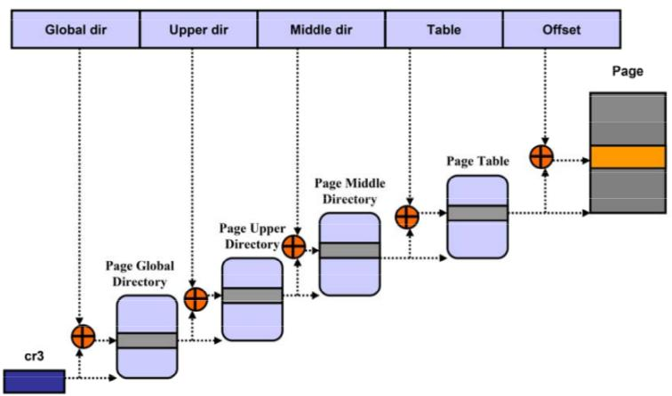
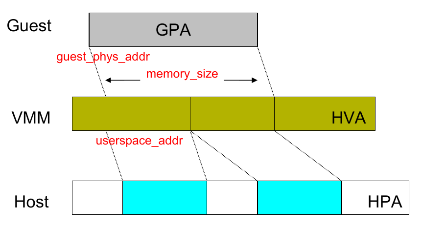
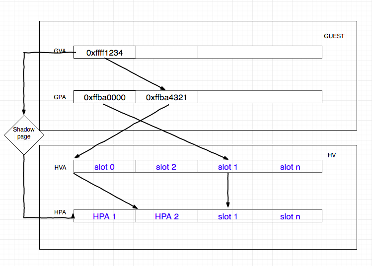

<!-- @import "[TOC]" {cmd="toc" depthFrom=1 depthTo=6 orderedList=false} -->

<!-- code_chunk_output -->

- [1. 客户机物理地址空间](#1-客户机物理地址空间)
- [2. 内存虚拟化的主要功能](#2-内存虚拟化的主要功能)
- [3. 传统的地址转换](#3-传统的地址转换)
- [4. 虚拟机的内存结构](#4-虚拟机的内存结构)
- [5. 四种地址以及转换关系](#5-四种地址以及转换关系)
  - [5.1. 客户机虚拟地址到客户机物理地址: GVA -> GPA](#51-客户机虚拟地址到客户机物理地址-gva---gpa)
  - [5.2. 客户机物理地址到主机虚拟地址: GPA -> HVA](#52-客户机物理地址到主机虚拟地址-gpa---hva)
  - [5.3. 主机虚拟地址到主机物理地址: HVA -> HPA](#53-主机虚拟地址到主机物理地址-hva---hpa)
- [6. 地址转换过程总结](#6-地址转换过程总结)
  - [6.1. 两种内存虚拟化方案](#61-两种内存虚拟化方案)
- [7. 影子页表(Shadow Page Table, SPT)](#7-影子页表shadow-page-table-spt)
  - [7.1. 影子映射关系](#71-影子映射关系)
  - [7.2. 影子页表的建立](#72-影子页表的建立)
  - [7.3. 影子页表的填充](#73-影子页表的填充)
  - [7.4. 影子页表的缓存](#74-影子页表的缓存)
  - [7.5. 影子页表异常处理机制](#75-影子页表异常处理机制)
  - [7.6. 影子页表方案总结](#76-影子页表方案总结)
- [8. EPT 页表](#8-ept-页表)
  - [8.1. 地址转换流程](#81-地址转换流程)
  - [8.2. EPT 页表的建立流程](#82-ept-页表的建立流程)
- [9. 参考](#9-参考)

<!-- /code_chunk_output -->

# 1. 客户机物理地址空间

为了实现内存虚拟化, 让**客户机**使用一个**隔离的**、**从零开始**且具有**连续的内存空间**, KVM 引入一层**新的地址空间**, 即**客户机物理地址空间 (Guest Physical Address, GPA**), 这个地址空间并**不是真正的物理地址空间**, 它只是**宿主机虚拟地址空间**在**客户机地址空间**的一个映射.

对**客户机**来说, **客户机物理地址空间**都是**从零开始的连续地址空间**, 但对于**宿主机**来说, **客户机的物理地址空间**并**不一定是连续的**, 客户机物理地址空间有可能映射在若干个不连续的宿主机地址区间, 如下图 1 所示:


# 2. 内存虚拟化的主要功能

QEMU-KVM 的内存虚拟化是由 QEMU 和 KVM 二者共同实现的, 其本质上是一个将 **Guest 虚拟内存**转换成 **Host 物理内存**的过程.

概括来看, 主要有以下几点:

* Guest 启动时, 由 **QEMU** 从它的**进程地址空间**申请**内存**并分配给 Guest 使用, 即**内存的申请**是在**用户空间 QEMU**完成的
* 通过 KVM 提供的 API, **QEMU** 将 **Guest 内存的地址信息**传递并**注册**到 KVM 中维护, 即**内存的管理**是由**内核空间**的 **KVM** 实现的
* 整个**转换过程**涉及 GVA、GPA、HVA、HPA **四种地址**, **Guest 的物理地址空间**从 **QEMU 的虚拟地址空间**中分配
* 内存虚拟化的关键在于维护 **GPA 到 HVA** 的**映射关系**, Guest 使用的依然是 Host 的物理内存

# 3. 传统的地址转换

**64 位 CPU** 上支持 **48 位的虚拟地址**寻址空间, 和 **52 位的物理地址**寻址空间.

Linux 采用 **4 级页表**机制将虚拟地址(VA)转换成物理地址(PA), 先从页表的基地址寄存器 CR3 中读取页表的起始地址, 然后加上页号得到对应的页表项, 从中取出页的物理地址, 加上偏移量就得到 PA.



# 4. 虚拟机的内存结构

QEMU 利用`mmap`系统调用, 在进程的虚拟地址空间中申请连续大小的空间, 作为 Guest 的物理内存.

QEMU 作为 Host 上的一个进程运行, Guest 的**每个 vCPU** 都是 QEMU 进程的一个**子线程**. 而 Guest 实际使用的仍是 Host 上的物理内存, 因此对于 Guest 而言, 在进行内存寻址时需要完成以下地址转换过程:

```cpp
  Guest 虚拟内存地址(GVA)
          |
    Guest 线性地址
          |
   Guest 物理地址(GPA)
          |             Guest
   ------------------
          |             Host
    Host 虚拟地址(HVA)
          |
      Host 线性地址
          |
    Host 物理地址(HPA)
```

其中, 虚拟地址到线性地址的转换过程可以省略, 因此 KVM 的内存寻址主要涉及以下四种地址的转换:

```
  Guest 虚拟内存地址(GVA)
          |
   Guest 物理地址(GPA)
          |             Guest
  ------------------
          |             Host
    Host 虚拟地址(HVA)
          |
    Host 物理地址(HPA)
```

其中, GVA->GPA 的映射由 Guest OS 维护, HVA->HPA 的映射由 Host OS 维护, 因此需要一种机制, 来维护 GPA->HVA 之间的映射关系.



常用的实现有 SPT(Shadow Page Table)和 EPT/NPT, 前者通过软件维护影子页表, 后者通过硬件特性实现二级映射.

# 5. 四种地址以及转换关系

1. GVA - Guest 虚拟地址

2. GPA - Guest 物理地址

3. HVA - Host 虚拟地址

4. HPA - Host 物理地址

## 5.1. 客户机虚拟地址到客户机物理地址: GVA -> GPA

Guest OS 维护的页表进行传统的操作, 客户机页表

## 5.2. 客户机物理地址到主机虚拟地址: GPA -> HVA

由于**客户机物理地址**不能直接用于**宿主机物理 MMU**进行寻址, 所以需要把**客户机物理地址**转换成**宿主机虚拟地址 (Host Virtual Address, HVA**).

**KVM 的虚拟机**实际上运行在**Qemu 的进程上下文**中. 于是, **虚拟机的物理内存**实际上是**Qemu 进程的虚拟地址**.

Kvm 要把**虚拟机的物理内存**分成**几个 slot**. 这是因为, 对计算机系统来说, **物理地址**是**不连续**的, 除了**bios**和**显存**要编入内存地址, **设备的内存**也可能**映射到内存**了, 所以内存实际上是分为一段段的.


为此, KVM 用一个`kvm_memory_slot`数据结构来记录**每一个地址区间**的**映射关系**, 此数据结构包含了对应此映射区间的**起始客户机页帧号 (Guest Frame Number, GFN**), 映射的**内存页数目**以及**起始宿主机虚拟地址**.

于是 KVM 就可以实现对**客户机物理地址**到**宿主机虚拟地址**之间的转换, 也即

- 首先根据**客户机物理地址**找到**对应的映射区间**,
- 然后根据此**客户机物理地址**在**此映射区间**的**偏移量**就可以得到其**对应的宿主机虚拟地址**.

## 5.3. 主机虚拟地址到主机物理地址: HVA -> HPA

通过**宿主机的页表**

# 6. 地址转换过程总结

**Guest OS**所维护的**页表**负责传统的从**guest 虚拟地址 GVA**到**guest 物理地址 GPA**的转换. 如果**MMU**直接装载 guest OS 所维护的页表来进行内存访问, 那么由于页表中每项所记录的都是**GPA**, **MMU 无法实现地址翻译**.

由于**宿主机 MMU 不能直接装载客户机的页表！！！** 来进行**内存访问**, 所以当**客户机**访问**宿主机物理内存**时, 需要经过**多次地址转换**. 即:

- **首先**根据**客户机页表**把**客户机虚拟地址**转换成**客户机物理地址**,
- 然后再通过**客户机物理地址**到**宿主机虚拟地址**之间的映射转换成**宿主机虚拟地址**,
- 最后再根据**宿主机页表**把宿主机虚拟地址转换成宿主机物理地址.

注意: **客户机页表基地址(即客户机 CR3**)是**客户机物理地址**, 当加载 CR3 时可以直接通过`kvm_memory_slot`进行转换成**宿主机虚拟地址**, 然后**在宿主机进行页表转换**, 得到**客户机页表基地**址的**真实物理地址**.

## 6.1. 两种内存虚拟化方案

显然通过这种映射方式, **客户机**的**每次内存访问**都需要 **KVM 介入！！！**, 并由**软件进行多次地址转换**, 其**效率是非常低**的.

因此, 为了**提高 GVA 到 HPA 转换的效率**, KVM 提供了**两种实现方式**来进行客户机虚拟地址到宿主机物理地址之间的直接转换.

其一是基于**纯软件**的实现方式, 也即通过**影子页表 (Shadow Page Table**) 来实现**客户虚拟地址**到**宿主机物理地址**之间的直接转换.

其二是基于**硬件对虚拟化**的支持, 来实现两者之间的转换. 下面就详细阐述两种方法在 KVM 上的具体实现.

# 7. 影子页表(Shadow Page Table, SPT)

作用: **GVA**直接到**HPA**的地址翻译, 真正被 VMM 载入到**物理 MMU**中的**页表**是**影子页表**;

而通过影子页表, 则可以实现客户机虚拟地址到宿主机物理地址的直接转换. 如下图所示:


KVM 通过维护记录`GVA->HPA`的影子页表 SPT, 减少了地址转换带来的开销, 可以**直接**将 **GVA 转换为 HPA**.

在软件虚拟化的内存转换中, GVA 到 GPA 的转换通过查询 CR3 寄存器来完成, CR3 中保存了 Guest 的页表基地址, 然后载入 MMU 中进行地址转换.

在加入了 **SPT** 技术后, 当 **Guest 访问 CR3** 时, KVM 会捕获到这个操作`EXIT_REASON_CR_ACCESS`, 之后 **KVM** 会载入**特殊的 CR3** 和**影子页表**, 欺骗 Guest 这就是真实的 CR3. 之后就和传统的访问内存方式一致, 当需要**访问物理内存**的时候, 只会经过一层影子页表的转换.



影子页表由 KVM 维护, 实际上就是一个 Guest 页表到 Host 页表的映射. KVM 会将 Guest 的页表设置为只读, 当 Guest OS 对页表进行修改时就会触发 Page Fault, VM-EXIT 到 KVM, 之后 KVM 会对 GVA 对应的页表项进行访问权限检查, 结合**错误码**进行判断:

- 如果是 Guest OS 引起的, 则**将该异常注入回去**, Guest OS 将调用**自己的缺页处理函数**, 申请一个 Page, 并将 Page 的 GPA 填充到上级页表项中
- 如果是 Guest OS 的页表和 SPT 不一致引起的, 则同步 SPT, 根据 Guest 页表和 mmap 映射找到 GPA 到 HVA 的映射关系, 然后在 SPT 中增加/更新 GVA-HPA 表项

当 Guest 切换进程时, 会把带切换进程的页表基址载入到 Guest 的 CR3 中, 导致 VM-EXIT 到 KVM 中. KVM 再通过哈希表找到对应的 SPT, 然后加载到机器的 CR3 中.

影子页表的引入, 减少了 GVA->HPA 的转换开销, 但是缺点在于需要为 Guest 的每个进程都维护一个影子页表, 这将带来很大的内存开销. 同时影子页表的建立是很耗时的, 如果 Guest 的进程过多, 将导致影子页表频繁切换. 因此 Intel 和 AMD 在此基础上提供了基于硬件的虚拟化技术.

**影子页表**简化了地址转换过程, 实现了**客户机虚拟地址空间**到**宿主机物理地址空间**的**直接映射**. 但是由于**客户机**中**每个进程**都有**自己的虚拟地址空间**, 所以**KVM**需要为**客户机**中的**每个进程页表**都要**维护一套相应的影子页表**.

在**客户机**访问**内存**时, 真正被装入**宿主机 MMU**的是**客户机当前页表**所对应的**影子页表**, 从而实现了从客户机虚拟地址到宿主机物理地址的直接转换. 而且, 在 **TLB 和 CPU 缓存**上缓存的是来自**影子页表**中**客户机虚拟地址**和**宿主机物理地址**之间的映射, 也因此提高了缓存的效率.

在**影子页表**中, **每个页表项**指向的都是**宿主机的物理地址**. 这些**表项**是随着**客户机操作系统**对**客户机页表**的**修改**而**相应地建立**的. 客户机中的**每一个页表项**都有**一个影子页表项**与之相对应. 如下图 3 所示:


为了**快速检索**客户机页表所对应的的**影子页表**, KVM 为**每个客户机**都维护了一个**哈希表**, **影子页表**和**客户机页表**通过此**哈希表**进行**映射**.

对于**每一个客户机**来说, **客户机的页目录**和**页表**都有**唯一**的**客户机物理地址**, 通过**页目录 / 页表的客户机物理地址**就可以在**哈希链表**中快速地找到**对应的影子页目录 / 页表**.

在**检索哈希表**时, **KVM** 把**客户机页目录** / **页表**的**客户机物理地址低 10 位作为键值**进行**索引**, 根据其**键值**定位到**对应的链表**, 然后**遍历此链表**找到**对应的影子页目录/页表**. 当然, 如果**不能发现对应的影子页目录 / 页表**, 说明 **KVM** 还**没有为其建立**, 于是 KVM 就为其**分配新的物理页**并加入此**链表**, 从而建立起客户机页目录 / 页表和对应的影子页目录 / 页表之间的映射.

当**客户机切换进程**时, **客户机操作系统**会把**待切换进程的页表基址载入 CR3**, 而 KVM 将会**截获这一特权指令**, 进行新的处理, 也即在**哈希表**中找到与**此页表基址**对应的**影子页表基址**, 载入**客户机 CR3**, 使**客户机在恢复运行**时 CR3 实际指向的是**新切换进程对应的影子页表**.

## 7.1. 影子映射关系

SPD 是 PD 的影子页表, SPT1/SPT2 是 PT1/PT2 的影子页表. 由于客户 PDE 和 PTE 给出的页表基址和页基址并不是真正的物理地址, 所以我们采用虚线表示 PDE 到 GUEST 页表以及 PTE 到普通 GUEST 页的映射关系.


## 7.2. 影子页表的建立

- 开始时, VMM 中的与 guest OS 所拥有的页表相对应的影子页表是空的;
- 而影子页表又是载入到 CR3 中真正为物理 MMU 所利用进行寻址的页表, 因此开始时任何的内存访问操作都会引起缺页异常; 导致 vm 发生 VM Exit; 进入 `handle_exception()`;

```cpp
if (is_page_fault(intr_info)) {
		/* EPT won't cause page fault directly */
		BUG_ON(enable_ept);
		cr2 = vmcs_readl(EXIT_QUALIFICATION);
		trace_kvm_page_fault(cr2, error_code);

		if (kvm_event_needs_reinjection(vcpu))
			kvm_mmu_unprotect_page_virt(vcpu, cr2);
		return kvm_mmu_page_fault(vcpu, cr2, error_code, NULL, 0);
	}
```

获得缺页异常发生时的 CR2,及当时访问的虚拟地址;
进入 kvm_mmu_page_fault()(vmx.c)->
r = vcpu->arch.mmu.page_fault(vcpu, cr2, error_code);(mmu.c)->
FNAME(page_fault)(struct kvm_vcpu *vcpu, gva_t addr, u32 error_code)(paging_tmpl.h)->
FNAME(walk_addr)() 查 guest 页表, 物理地址是否存在,  这时肯定是不存在的
The page is not mapped by the guest. Let the guest handle it.
inject_page_fault()->kvm_inject_page_fault() 异常注入流程;

Guest OS 修改从 GVA->GPA 的映射关系填入页表;
继续访问, 由于影子页表仍是空, 再次发生缺页异常;
FNAME(page_fault)->
FNAME(walk_addr)() 查 guest 页表, 物理地址映射均是存在->
FNAME(fetch):
遍历影子页表, 完成创建影子页表(填充影子页表);
在填充过程中, 将客户机页目录结构页对应影子页表页表项标记为写保护, 目的截获对于页目录的修改(页目录也是内存页的一部分, 在页表中也是有映射的, guest 对页目录有写权限, 那么在影子页表的页目录也是可写的, 这样对页目录的修改导致 VMM 失去截获的机会)


## 7.3. 影子页表的填充

```cpp
shadow_page = kvm_mmu_get_page(vcpu, table_gfn, addr, level-1, direct, access, sptep);
index = kvm_page_table_hashfn(gfn);
hlist_for_each_entry_safe
if (sp->gfn == gfn)
{……}
else
{sp = kvm_mmu_alloc_page(vcpu, parent_pte);}
```

为了快速检索 GUEST 页表所对应的的影子页表, KVM 为每个 GUEST 都维护了一个哈希
表, 影子页表和 GUEST 页表通过此哈希表进行映射. 对于每一个 GUEST 来说, GUEST
的页目录和页表都有唯一的 GUEST 物理地址, 通过页目录/页表的客户机物理地址就
可以在哈希链表中快速地找到对应的影子页目录/页表.

## 7.4. 影子页表的缓存

* Guest OS 修改从 GVA->GPA 的映射关系, 为保证一致性, VMM 必须对影子页表也做相应的维护, 这样, VMM 必须截获这样的内存访问操作;
* 导致 VM Exit 的机会
  * INVLPG
  * MOV TO CR3
  * TASK SWITCH(发生 MOV TO CR3 )
* 以 INVLPG 触发 VM Exit 为例:
* static void FNAME(invlpg)(struct kvm_vcpu *vcpu, gva_t gva)
  * Paging_tmpl.h
  * 影子页表项的内容无效
* GUEST 在切换 CR3 时, VMM 需要清空整个 TLB, 使所有影子页表的内容无效. 在多进程 GUEST 操作系统中, CR3 将被频繁地切换, 某些影子页表的内容可能很快就会被再次用到, 而重建影子页表是一项十分耗时的工作, 这里需要缓存影子页表, 即 GUEST 切换 CR3 时不清空影子页表.


## 7.5. 影子页表异常处理机制

在通过**影子页表**进行**寻址**的过程中, 有**两种原因**会引起**影子页表的缺页异常**, 一种是由**客户机本身所引起的缺页异常**, 具体来说就是客户机所访问的**客户机页表项存在位 (Present Bit) 为 0**, 或者写一个**只读的客户机物理页**, 再者所访问的**客户机虚拟地址无效**等. 另一种异常是由**客户机页表**和**影子页表不一致**引起的异常.

当**缺页异常发生**时, **KVM** 首先**截获该异常**, 然后对发生异常的**客户机虚拟地址**在**客户机页表**中所对应**页表项**的访问权限进行检查, 并根据**引起异常的错误码**, 确定出此**异常的原因**, 进行相应的处理.

如果该异常是由**客户机本身引起**的, KVM 则直接把该**异常**交由**客户机的缺页异常处理机制**来进行处理.

如果该异常是由**客户机页表**和**影子页表不一致**引起的, KVM 则根据**客户机页表同步影子页表**. 为此, KVM 要建立起**相应的影子页表数据结构**, 填充**宿主机物理地址**到**影子页表的页表项**, 还要根据客户机页表项的访问权限修改影子页表对应页表项的访问权限.

由于**影子页表**可被载入**物理 MMU** 为**客户机直接寻址**使用,  所以客户机的**大多数内存访问**都可以在**没有 KVM 介入**的情况下正常执行, **没有额外的地址转换开销**, 也就大大提高了客户机运行的效率. 但是影子页表的引入也意味着 KVM 需要为**每个客户机**的**每个进程的页表**都要维护一套**相应的影子页表**, 这会带来**较大内存上的额外开销**, 此外, **客户机页表**和和**影子页表的同步**也比较复杂.

因此, Intel 的 EPT(Extent Page Table) 技术和 AMD 的 NPT(Nest Page Table) 技术都对内存虚拟化提供了硬件支持. 这两种技术原理类似, 都是在**硬件层面**上实现客户机虚拟地址到宿主机物理地址之间的转换. 下面就以 EPT 为例分析一下 KVM 基于硬件辅助的内存虚拟化实现.

## 7.6. 影子页表方案总结

内存虚拟化的两次转换:
- GVA->GPA (GUEST 的页表实现)
- GPA->HPA (VMM 进行转换)

影子页表将两次转换合一:

根据`GVA->GPA->HPA`计算出`GVA->HPA`,填入影子页表

优点:

由于影子页表可被载入物理 MMU 为客户机直接寻址使用, 所以客户机的大多数内存访问都可以在没有 KVM 介入的情况下正常执行, 没有额外的地址转换开销, 也就大大提高了客户机运行的效率.

缺点:

1、KVM 需要为每个客户机的每个进程的页表都要维护一套相应的影子页表, 这会带来较大内存上的额外开销;

2、客户在读写 CR3、执行 INVLPG 指令或客户页表不完整等情况下均会导致 VM exit, 这导致了内存虚拟化效率很低

3、客户机页表和和影子页表的同步也比较复杂.

因此, Intel 的 EPT(Extent Page Table) 技术和 AMD 的 NPT(Nest Page Table) 技术都对内存虚拟化提供了硬件支持. 这两种技术原理类似, 都是在硬件层面上实现客户机虚拟地址到宿主机物理地址之间的转换.

# 8. EPT 页表


Intel EPT 技术引入了 EPT(Extended Page Table)和 EPTP(EPT base pointer)的概念. EPT 中维护着 GPA 到 HPA 的映射, 而 EPTP 负责指向 EPT.

EPT 技术在**原有客户机页表**对**客户机虚拟地址**到**客户机物理地址映射**的基础上, 又引入了 **EPT 页表**来实现**客户机物理地址**到**宿主机物理地址**的另一次映射.

这**两次地址映射**都是由**硬件自动完成**, 二维地址翻译结构:

- **Guest**维护自身的客户页表: `GVA->GPA`
- **EPT**维护 `GPA->HPA` 的映射

**客户机运行**时, **客户机页表**被载入 **物理 CR3**, 而 **EPT 页表**被载入专门的 **EPT 页表指针寄存器 EPTP**. 于是在进行地址转换时, 首先通过 CR3 指向的页表实现 GVA 到 GPA 的转换, 再通过 EPTP 指向的 EPT 完成 GPA 到 HPA 的转换. 当发生 EPT Page Fault 时, 需要 VM-EXIT 到 KVM, 更新 EPT.

- 优点: Guest 的缺页在 Guest OS 内部处理, 不会 VM-EXIT 到 KVM 中. 地址转化基本由硬件(MMU)查页表来完成, 大大提升了效率, 且只需为 Guest 维护一份 EPT 页表, 减少内存的开销
- 缺点: 两级页表查询, 只能寄望于 TLB 命中

**EPT 页表对地址的映射机理**与**客户机页表对地址的映射机理相同**, 下图 4 出示了一个页面大小为 4K 的映射过程:


## 8.1. 地址转换流程

1. 处于`non-root`**模式**的**CPU**加载**guest 进程的 gCR3**;
2. gCR3 是**GPA**,cpu 需要通过**查询 EPT 页表**来实现`GPA->HPA`;
3. 如果没有, CPU 触发**EPT Violation**, 由**VMM 截获处理**;
4. 假设**客户机**有**m 级页表**, **宿主机 EPT**有**n 级**, 在 TLB 均 miss 的最坏情况下, 会产生**m*n 次内存访问**, 完成**一次客户机的地址翻译**;


## 8.2. EPT 页表的建立流程

1. 初始情况下: **Guest CR3**指向的**Guest 物理页面**为**空页面**;

2. **Guest 页表缺页异常**, KVM 采用**不处理 Guest 页表缺页**的机制, **不会导致 VM Exit**, 由**Guest 的缺页异常处理函数**负责分配**一个 Guest 物理页面(GPA**), 将该页面物理地址回填, 建立**Guest 页表结构**;

3. 完成该映射的过程需要将**GPA 翻译到 HPA**, 此时**该进程**相应的**EPT 页表为空**, 产生`EPT_VIOLATION`, 虚拟机退出到**根模式**下执行, 由 KVM 捕获该异常, 建立**该 GPA 到 HOST 物理地址 HPA 的映射**, 完成一套 EPT 页表的建立, **中断返回**, 切换到**非根模式**继续运行.

4. **VCPU 的 mmu**查询下一级**Guest 页表**, 根据 GVA 的偏移产生一条**新的 GPA**, Guest 寻址该 GPA 对应页面, 产生**Guest 缺页**, **不发生 VM_Exit**, 由 Guest 系统的缺页处理函数捕获该异常, 从 Guest 物理内存中选择一个空闲页, 将该 Guest 物理地址 GPA 回填给 Guest 页表;

5. 此时该**GPA**对应的**EPT 页表项不存在**, 发生`EPT_VIOLATION`, 切换到**根模式**下, 由 KVM 负责建立该`GPA->HPA`映射, 再切换回非根模式;

6. 如此往复, 直到**非根模式下 GVA**最后的偏移建立**最后一级 Guest 页表**, 分配 GPA, 缺页异常退出到根模式建立最后一套 EPT 页表.

7. 至此, **一条 GVA**对应在真实物理内存单元中的内容, 便可通过这**一套二维页表结构**获得.

在**客户机物理地址**到**宿主机物理地址转换**的过程中, 由于**缺页、写权限不足等原因**也会**导致客户机退出**, 产生 **EPT 异常**.

对于 **EPT 缺页异常**, KVM 首先根据**引起异常的客户机物理地址**, 映射到**对应的宿主机虚拟地址！！！**, 然后**为此虚拟地址分配新的物理页**, 最后 **KVM 再更新 EPT 页表**, 建立起引起**异常的客户机物理地址**到**宿主机物理地址**之间的映射. 对 **EPT 写权限**引起的异常, KVM 则通过**更新相应的 EPT 页表**来解决.

由此可以看出, **EPT 页表**相对于前述的影子页表, 其实现方式大大简化. 而且, 由于**客户机内部的缺页异常**也**不会致使客户机退出**, 因此**提高了客户机运行的性能**. 此外, KVM 只需为**每个客户机**维护**一套 EPT 页表**, 也大大**减少了内存的额外开销**.

# 9. 参考

https://my.oschina.net/liyufeng0803/blog/715989