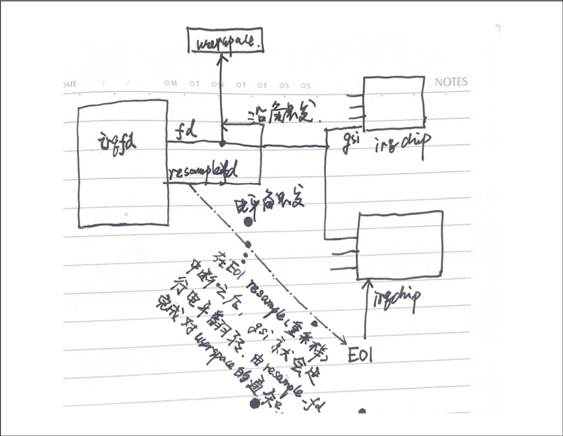
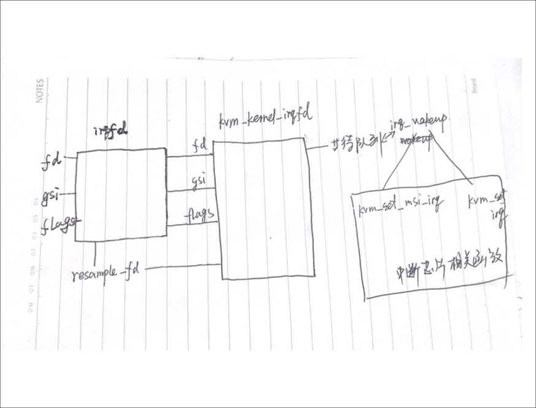

# 介绍

irqfd 机制与 ioeventfd 机制类似, 其基本原理都是基于eventfd. 

> Linux\Eventfd\Linux的eventfd机制.md

ioeventfd 机制为 Guest 提供了向 qemu-kvm 发送通知的快捷通道, 对应地, irqfd 机制提供了 qemu-kvm 向 Guest 发送通知的快捷通道. 

irqfd 机制将一个 eventfd 与一个全局中断号联系起来, 当向这个 eventfd 发送信号时, 就会导致对应的中断注入到虚拟机中. 

# QEMU注册irqfd

与 ioeventfd 类似, irqfd 在使用前必须先初始化一个 EventNotifier 对象(利用 `event_notifier_init` 函数初始化), 初始化 EventNotifier 对象完成之后获得了一个 eventfd. 

# 向kvm发送注册中断irqfd请求

获得一个 eventfd 之后, QEMU 通过 `kvm_irqchip_add_irqfd_notifier_gsi=>kvm_irqchip_assign_irqfd` 构造 `kvm_irqchip` 结构, 并向 kvm 发送 `ioctl(KVM_IRQFD)`.

```cpp
static int kvm_irqchip_assign_irqfd(KVMState *s, int fd, int rfd, int virq,
                                    bool assign)
{
    struct kvm_irqfd irqfd = {
        .fd = fd,
        .gsi = virq,
        .flags = assign ? 0 : KVM_IRQFD_FLAG_DEASSIGN,
    };

    if (rfd != -1) {
        irqfd.flags |= KVM_IRQFD_FLAG_RESAMPLE;
        irqfd.resamplefd = rfd;
    }

    if (!kvm_irqfds_enabled()) {
        return -ENOSYS;
    }

    return kvm_vm_ioctl(s, KVM_IRQFD, &irqfd);
}
```

在kvm_irqchip_assign_irqfd中, 首先构造了一个kvm_irqfd结构的变量irqfd, 其中fd为之前初始化的eventfd, gsi是全局系统中断, flags中定义了是向kvm注册irqfd(flags==0)还是解除注册irqfd(KVM_IRQFD_FLAG_DEASSIGN,也就是flags==1). flags的bit1(KVM_IRQFD_FLAG_RESAMPLE)表明该中断是否为电平触发. 

KVM_IRQFD_FLAG_RESAMPLE 相关信息



当中断处于沿触发模式时, irqfd->fd连接kvm中中断芯片(irqchip)的gsi管脚, 也由irqfd->fd负责中断的toggle, 以及对用户空间的handler的触发. 

当中断处于电平触发模式时, 同样irqfd->fd连接kvm中中断芯片的gsi管脚, 当中断芯片收到一个EOI(end of interrupt)重采样信号时, gsi进行电平翻转, 对用户空间的通知由irqfd->resample_fd完成(resample_fd也是一个eventfd). 

kvm_irqchip_assign_irqfd最后调用kvm_vm_ioctl(s, KVM_IRQFD, &irqfd), 向kvm请求注册包含上面构造的kvm_irqfd信息的irqfd. 

# kvm注册irqfd

收到ioctl(KVM_IRQFD)之后, kvm首先获取传入的数据结构kvm_irqfd的信息, 然后调用kvm_irqfd函数. 

```cpp
	case KVM_IRQFD: {
		struct kvm_irqfd data;

		r = -EFAULT;
		if (copy_from_user(&data, argp, sizeof(data)))
			goto out;
		r = kvm_irqfd(kvm, &data);
		break;
	}
```

在kvm_irqfd中, 首先分辨传入的kvm_irqfd结构中的flags的bit0要求的是进行irqfd注册还是解除irqfd的注册. 如果是前者, 则调用kvm_irqfd_assign. 

```cpp
kvm_irqfd(struct kvm *kvm, struct kvm_irqfd *args)
{
	if (args->flags & ~(KVM_IRQFD_FLAG_DEASSIGN | KVM_IRQFD_FLAG_RESAMPLE))
		return -EINVAL;

	if (args->flags & KVM_IRQFD_FLAG_DEASSIGN)
		return kvm_irqfd_deassign(kvm, args);

	return kvm_irqfd_assign(kvm, args);
}
```

> kvm_irqfd_assign 的分析中省略定义了CONFIG_HAVE_KVM_IRQ_BYPASS和水平中断的注册情况. 这样分析便于理清irqfd的注册框架. 

在kvm_irqfd_assign中, 首先申请了一个kvm_kernel_irqfd结构类型的变量irqfd, 并为之分配空间, 之后对irqfd的各子域进行赋值. 

```cpp
irqfd = kzalloc(sizeof(*irqfd), GFP_KERNEL_ACCOUNT);
if (!irqfd)
    return -ENOMEM;

irqfd->kvm = kvm;
irqfd->gsi = args->gsi;
INIT_LIST_HEAD(&irqfd->list);
INIT_WORK(&irqfd->inject, irqfd_inject);
INIT_WORK(&irqfd->shutdown, irqfd_shutdown);
seqcount_init(&irqfd->irq_entry_sc);
```

kvm_kernel_irqfd结构中有2个work_struct, inject和shutdown, 分别负责触发中断和关闭中断, 这两个work_struct各自对应的操作函数分别为irqfd_inject和irqfd_shutdown. 

kvm_irq_assign调用init_waitqueue_func_entry将irqfd_wakeup函数注册为irqfd中等待队列entry激活时的处理函数. 这样任何写入该irqfd对应的eventfd的行为都将导致触发这个函数. 

然后kvm_irq_assign利用init_poll_funcptr将irqfd_ptable_queue_proc函数注册为irqfd中的poll table的处理函数. irqfd_ptable_queue_proc会将poll table中对应的wait queue entry加入到waitqueue中去. 

```cpp
/*
	 * Install our own custom wake-up handling so we are notified via
	 * a callback whenever someone signals the underlying eventfd
	 */
init_waitqueue_func_entry(&irqfd->wait, irqfd_wakeup);
init_poll_funcptr(&irqfd->pt, irqfd_ptable_queue_proc);
```

kvm_irq_assign 接着判断该 eventfd 是否已经被其它中断使用. 

```cpp
list_for_each_entry(tmp, &kvm->irqfds.items, list) {
    if (irqfd->eventfd != tmp->eventfd)
        continue;
    /* This fd is used for another irq already. */
    ret = -EBUSY;
    spin_unlock_irq(&kvm->irqfds.lock);
    goto fail;
}
```

kvm_irq_assign以irqfd->pt为参数, 调用eventfd的poll函数, 也就是eventfd_poll,后者会调用poll_wait函数, 也就是之前为poll table注册的irqfd_ptable_queue_proc函数. irqfd_ptable_queue_proc将irqfd->wait加入到了eventfd的wqh等待队列中. 这样, 当有其它进程或者内核对eventfd进行write时, 就会导致eventfd的wqh等待队列上的对象函数得到执行, 也就是irqfd_wakeup函数. 

这里只讨论有数据, 即flgas中的EPOLLIN置位时, 会调用kvm_arch_set_irq_inatomic进行中断注入. 

```cpp
kvm_arch_set_irq_inatomic
=> kvm_set_msi_irq
=> kvm_irq_delivery_to_apic_fast
```

如果kvm_arch_set_irq_inatomic无法注入中断(即非MSI中断或非HV_SINT中断), 那么就调用irqfd->inject,即调用irqfd_inject函数. 

```cpp
static void irqfd_inject(struct work_struct *work)
{
    struct kvm_kernel_irqfd *irqfd =
        container_of(work, struct kvm_kernel_irqfd, inject);
    struct kvm *kvm = irqfd->kvm;

    if (!irqfd->resampler) {
        kvm_set_irq(kvm, KVM_USERSPACE_IRQ_SOURCE_ID, irqfd->gsi, 1,
                    false);
        kvm_set_irq(kvm, KVM_USERSPACE_IRQ_SOURCE_ID, irqfd->gsi, 0,
                    false);
    } else
        kvm_set_irq(kvm, KVM_IRQFD_RESAMPLE_IRQ_SOURCE_ID,
                    irqfd->gsi, 1, false);
}
```

在irqfd_inject函数中, 如果该irqfd配置的中断为边沿触发, 则调用2次kvm_set_irq, 形成一个中断脉冲, 以便kvm中的中断芯片(irqchip)能够感知到这个中断. 如果该irqfd配置的中断为电平触发, 则调用一次kvm_set_irq, 将中断拉至高电平, 使irqchip感知到, 电平触发的中断信号拉低动作会由后续的irqchip的EOI触发. 

# 总结



irqfd基于eventfd机制, qemu中将一个gsi(全局系统中断号)与eventfd捆绑后, 向kvm发送注册irqfd请求, kvm收到请求后将带有gsi信息的eventfd加入到与irqfd有关的等待队列中, 一旦有进程向该eventfd写入, 等待队列中的元素就会唤醒, 并调用相应唤醒函数(irqfd_wakeup)向Guest注入中断, 而注入中断这一步骤相关知识与特定的中断芯片如PIC、APIC有关. 

# reference

https://www.cnblogs.com/haiyonghao/p/14440723.html
