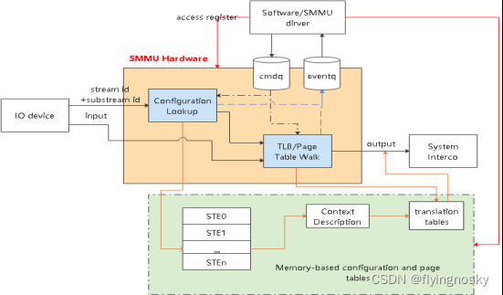
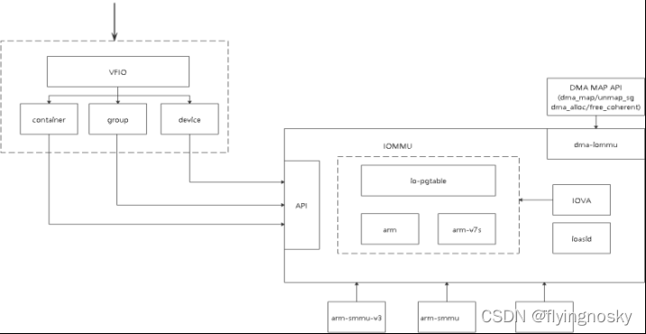

结合SMMU架构手册,计划分多次对IOMMU/SMMUV3代码进行简要的分析.

在分析代码之前,仍需要对IOMMU及SMMUV3软硬件架构作简要介绍,其实在之前的博文中有作介绍,在这里重新梳理一下.

# 1. SMMU的作用和位置

SMMU为System Memory Management Unit,它的功能与MMU功能类似,将IO设备的DMA地址请求(IOVA)转化为系统总线地址(PA),实现地址映射,属性转换,权限检查等功能,实现不同设备的DMA地址空间隔离.

如果不使能SMMU,IOVA=PA,对于PA是由伙伴系统分配,最大连续地址为4M(4K系统上),但使能SMMU后分配的是IOVA,完全可以分配.

# 2. SMMU软硬件交互介绍

1. SMMU处于IO设备和总线之间,负责将设备的输入IOVA转化为系统总线的物理地址PA;
2. SMMU硬件包含configuration lookup/TLB/Page Table Walk以及cmdq/eventq等部分,其中configuration lookup部分查找stream id所对应的配置(ste/cd), 最终指向page table基地址等;
3. SMMU通过configuration lookup找到设备的配置及页表基地址等,然后查询TLB中是否存在输入地址input的映射,如果TLB命中,直接返回输出PA;若TLB没有命中,PTW模块逐级查询页表,找到页表中的映射,输出PA;
4. 软件/SMMU驱动通过CMDQ/EVENTQ进行交互,驱动通过CMDQ发送命令给SMMU硬件(如TLBI/SYNC等);SMMU硬件通过EVENTQ通知驱动有事件需要处理(如设备缺页等)
5. 软件/驱动建立和维护内存中的配置和页表

# 3. IOMMU软件架构介绍

IOMMU软件框架如下图所示:

IOMMU框架可分为如下层次:

1. DMA-MAP层:提供对其他驱动DMA MAP/UNMAP的API接口;
2. IOVA层:提供IOVA的分配与释放,并提供RCACHE缓存机制;
3. IO页表层:提供对IO设备页表的操作;
4. SMMU驱动层:提供SMMU驱动初始化,提供IOMMU对应的回调函数;
5. 其它API接口:可提供对VFIO等API接口; 

本节中基本为原来介绍过的内容,但是理解后续代码的基础,因此在这里作简要的介绍.

https://blog.csdn.net/flyingnosky/article/details/122420548