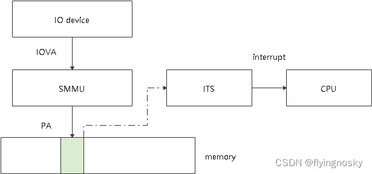

对于 MSI 或 `MSI-X` 中断, 通过**外设访问某个特定内存**, 从而**触发对应的中断**的产生.

在没有 SMMU 时, 外设直接访问该内存对应的物理地址即可.但在使能 SMMU 时, **外设**在**访问某个物理内存前**需要建立起 **IOVA 到该物理地址的映射**,然后发起对 IOVA 访问即可访问该物理地址,此过程称为 MSI/MSI-X 中断重定向.



该过程在 linux 内核中是由函数 iommu_dma_prepare_msi()实现.

```cpp
int iommu_dma_prepare_msi(struct msi_desc *desc, phys_addr_t msi_addr)
```

参数 desc 为该中断对应的描述符,参数 msi_addr 为产生该中断的物理地址;


过程如下:

检查触发本中断对应的物理地址是否已经在 domain 范围内存在映射关系,若存在,返回 msi_page(描述 msi 物理地址以及 IOVA 的映射);否则执行步骤(2);
分配新的 msi_page,分配对应长度的 IOA,调用 API iommu_map()建立映射;
添加到 domain 范围内的 cookie->msi_page_list 中;
将表示中断的 msi_desc 与 msi_page 关联起来.

函数 `iommu_dma_compose_msi_msg()` 负责获取产生该中断所对应的 IOVA 地址, 并填入到 `msi_msg` 中.

https://blog.csdn.net/flyingnosky/article/details/121876818