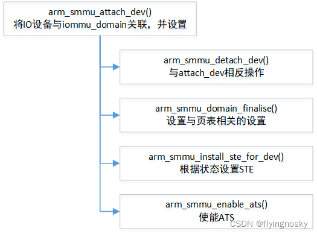

前面介绍了SMMU设备的生成和识别,但IO设备是如何与SMMU设备关联的呢?一个SMMU设备下面可能有多个IO设备,但每个IO设备只在一个SMMU设备下.

根据驱动设备模型,当IO设备与IO驱动匹配时,会触发IO驱动的probe函数,在其实在调用驱动probe()之前,会调用与IOMMU相关的函数.其过程如下:

整个匹配的probe过程中执行的内容较多,这里仅介绍红色部分,即我们关心的DMA相关的设置和设备驱动的probe()(对于IO设备来説,它为IO设备驱动的probe()函数,注意并不是SMMU设备驱动的probe()).

其中dev->bus->dma_configure()则是本节的重点,它负责将IO设备与SMMU设备关联起来,可见该操作在IO设备的probe()函数之前完成.

对于platform device,dma_configure的回调函数为platform_dma_configure();对于PCIE设备,dma_configure的回调函数为pci_dma_configure().但两者最终都调用都一样.

暂只介绍ACPI方式的DMA配置acpi_dma_confiugre().

这里主要作如下三个操作:

1. 函数acpi_arch_dma_setup()返回设备支持DMA大小,对于ARM64上来説,默认为48bit大小;
2. 函数acpi_iommu_configure_id()获取设备以及对应的SMMU相关的配置如iommu_ops,并probe设备建立dma_domain;后面重点讲解函数iommu_probe_device();
3. 函数arch_setup_dma_ops()主要对dma_domain分配并初始化IOVA domain;

其中函数iommu_probe_device()是关联IO设备和SMMU设备的关键函数,它为IO设备分配iommu_device,同时为IO设备分配iommu_group,将IO设备对应在iommu_device加入到iommu_group中.

在介绍该函数前简单介绍下重要的结构体iommu_ops和几个概念.

# 1. 结构体iommu_ops

结构体iommu_ops定义了底层硬件对应的回调函数,对于SMMU或INTEL IOMMU都会基于硬件定义自己的iommu_ops.结构体iommu_ops各成员函数定义和描述如下所示,这里仅作简单介绍:

<table border="1" cellspacing="0"><tbody><tr><td> 
成员函数
 </td><td> 
作用
 </td></tr><tr><td> 
capable
 </td><td> 
检查能力
 </td></tr><tr><td> 
domain_alloc
 </td><td> 
分配iommu domain
 </td></tr><tr><td> 
domain_free
 </td><td> 
释放iommu domain
 </td></tr><tr><td> 
attach_dev
 </td><td> 
将设备连接到iommu domain
 </td></tr><tr><td> 
detach_dev
 </td><td> 
取消设备到iommu domain的连接
 </td></tr><tr><td> 
map
 </td><td> 
映射物理连续的内存区域到iommu domain
 </td></tr><tr><td> 
map_pages
 </td><td> 
映射一组物理连续的内存区域到iommu domain
 </td></tr><tr><td> 
unmap
 </td><td> 
取消物理连续的内存区域到iommu domain的映射
 </td></tr><tr><td> 
unmap_pages
 </td><td> 
取消一组物理连续的内存区域到iommu domain的映射
 </td></tr><tr><td> 
flush_iotlb_all
 </td><td> 
同步刷新某个domain的所有硬件TLB
 </td></tr><tr><td> 
iotlb_sync_map
 </td><td> 
SMMUV3没有定义
 </td></tr><tr><td> 
iotlb_sync
 </td><td> 
刷新某个domain的某个范围的TLB
 </td></tr><tr><td> 
iova_to_phys
 </td><td> 
将iova转化为物理地址
 </td></tr><tr><td> 
probe_device
 </td><td> 
将设备放入到iommu驱动处理
 </td></tr><tr><td> 
release_device
 </td><td> 
将设备从iommu驱动处理中释放
 </td></tr><tr><td> 
Probe_finalize
 </td><td> 
在设备添加到iommu group并关联到group domain后的最后一步
 </td></tr><tr><td> 
Device_group
 </td><td> 
对某个设备找到或分配iommu group
 </td></tr><tr><td> 
Enable_nesting
 </td><td> 
使能2个stage
 </td></tr><tr><td> 
Set_pgtable_quirks
 </td><td> 
设置页表相关的workaround
 </td></tr><tr><td> 
Get_resv_regions
 </td><td> 
获取一个设备保留的区域
 </td></tr><tr><td> 
Put_resv_regions
 </td><td> 
释放一个设备保留的区域
 </td></tr><tr><td> 
Apply_resv_regions
 </td><td> 
SMMUV3没有定义
 </td></tr><tr><td> 
Of_xlate
 </td><td> 
增加master ID到iommu group转换
 </td></tr><tr><td> 
Is_attach_deferred
 </td><td> 
ARM没有使用
 </td></tr><tr><td> 
dev_has/enable/disable_feat
 </td><td> 
检查/使能/禁用iommu某些特性
 </td></tr><tr><td> 
Dev_feat_enabled
 </td><td> 
判断是否使能特性
 </td></tr><tr><td> 
Aux_attach/detach_dev
 </td><td> 
Aux-domain的链接或取消链接到设备
 </td></tr><tr><td> 
Aux_get_pasid
 </td><td> 
对给定的aux-domain获取pasid
 </td></tr><tr><td> 
sva_bind
 </td><td> 
将进程地址空间绑定到设备
 </td></tr><tr><td> 
Sva_unbind
 </td><td> 
取消绑定进程地址空间到设备
 </td></tr><tr><td> 
Sva_get_pasid
 </td><td> 
获取共SVA相关的PASID
 </td></tr><tr><td> 
Page_response
 </td><td> 
处理页请求回复
 </td></tr><tr><td> 
Cache_invalidate
 </td><td> 
无效化转换缓存
 </td></tr><tr><td> 
Sva_bind_gpasid
 </td><td> 
将guest pasid与mm绑定
 </td></tr><tr><td> 
sva_unbind_gpasid
 </td><td> 
将guest pasid与mm取消绑定
 </td></tr><tr><td> 
Def_domain_type
 </td><td> 
设备默认的domain类型(SMMUV3没有定义)
 </td></tr><tr><td> 
Pgsize_bitmap
 </td><td> 
所有支持的页大小的bitmap
 </td></tr></tbody></table>

# 2. IOMMU相关的结构体关系

Iommu_device对应一个IO设备(或PCIE概念中的Function);

Iommu_group为共享相同IO地址空间的设备的集合(可能一个或多个);

Iommu_domain的范围和iommu_group一样,但它定义的是group范围内对应的操作的集合;

函数Iommu_probe_device()是通过如下图所示建立起IO设备与SMMU的关联:

其中红色部分会调用SMMUV3驱动中定义的iommu_ops,后面在被调用时再对涉及的回调作介绍.这里分成以下几个部分进行讲解:

# 3. 为IO设备分配iommu_device

在上述函数中,通过ops->probe_device()为IO设备分配对应SMMU的iommu_device.对于SMMUV3驱动,ops->probe_device = arm_smmu_probe_device.

在SMMUV3驱动中先简单介绍涉及的几个结构体:

(1)结构体arm_smmu_device对应于SMMU设备;

(2)结构体arm_smmu_master对应于IO设备;

(3)结构体arm_smmu_stream对应于IO设备中的FUNCTION(若仅一个FUNCTION,也对应IO设备);

函数定义如下:

函数执行操作如下:

(1)根据IO设备找到所对应的SMMU设备(结构体arm_smmu_device);

(2)根据IO设备分配所对应在结构体arm_smmu_master;

(3)根据IORT表中定义的IO设备的stream情况分配arm_smmu_stream,若支持二级STE,对STE的第二级STE进行初始化(前面SMMU设备初始化已介绍),并将arm_smmu_stream插入到arm_smmu_device中;

(4)使能PASID;

# 4. 分配iommu_group并添加IO设备

函数iommu_group_get_for_dev()首先查找设备是否存在对应的iommu_group,第一次时设备不存在对应的iommu_group,调用ops->device_group()分配或查找iommu_group;调用函数iommu_group_add_device()将IO设备添加到iommu_group.

## 4.1. 分配iommu_group

(1)判断当前设备是否为PCI设备,若为PCI设备,PCIE设备存在alias,尝试使用alias对应的iommu_group;若PCIE设备到root bus之间存在没有使能ACS特性的设备,那么此部分为同一个group,使用对应的group(后续再讲解ACS特性);若PCIE设备对应的function存在alias,尝试使用alias对应的iommu_group;最后调用iommu_group_alloc()分配iommu_group,此函数生成iommu_group,且生成SYSFS属性reserved_regions和type.

(2)若为其他设备如platform设备,同样调用iommu_group_alloc().

## 4.2. 将IO设备添加到iommu_group

通过函数iommu_group_add_device()将设备添加到iommu_group.这里通过函数sysfs_create_link()建立起IO设备的device与iommu_group的device相互Link,即从IO设备的device目录可以到达iommu_group对应在device目录,也可从iommu_group的device目录到达IO设备的目录.

其中对于group->domain且!iommu_is_attach_deferred()情况,将设备与group->domain关联,在第一次时group->domain为空,这里暂且不分析.

# 5. 为IO设备分配iommu_domain

对于iommu_group,存在两个iommu_domain: iommu_group->domain(作用?)和iommu_group->default_domain.函数iommu_alloc_default_domain()为iommu_group分配default_domain.

(1)设置DMA类型.若命令行中定义DMA类型,使用命令行中DMA类型;否则使用默认类型;IOMMU_DOMAIN_DMA表示进行DMA转换; IOMMU_DOMAIN_IDENTIFY表示PASSTHROUGH,不经过SMMU;

(2)分配iommu_group->default_domain,这是调用SMMUV3回调函数实现的;

(3)填充iommu_domain对应的成员域;

# 6. 将IO设备连接到iommu_domain

通过函数 `__iommu_attach_device()` 将IO设备连接到iommu_domain,最后调用SMMUV3驱动回调函数arm_smmu_attach_dev(),它的执行流程如下:

(1)调用arm_smmu_detach_dev(),作attach_dev相反的操作;

(2)调用arm_smmu_domain_finalise()作与页表相关的设置,后面单独分析;

(3)调用arm_smmu_install_ste_for_dev()设置STE,后面单独介绍;

# 7. 建立直接映射

所谓直接映射为IOVA=PA.在某些场景如驱动希望保留部分IOVA区域,或虚拟机中MSI的方案等,都会使用直接映射.调用如下:

(1)获取设备所对应的保留区域;

(2)对每个保留区域,使用iommu_map()建立起IOVA=PA的映射,后面对iommu_map()等 map/unmap API操作讲解;

(3)刷新domain中所有TLB项;

# 8. 小结

函数iommu_probe_device()实现IO设备与对应SMMU的关联.在此过程中为IO设备和SMMU设备分配IOMMU框架层和SMMUV3驱动对应的结构体.

<table border="1" cellspacing="0"><tbody><tr><td> 
IOMMU框架的结构体
 </td><td> 
SMMUV3驱动对应的结构
 </td><td> 
含义
 </td></tr><tr><td> 
Iommu_device
 </td><td> 
arm_smmu_device
 </td><td> 
SMMU设备
 </td></tr><tr><td> 
group_device
 </td><td> 
arm_smmu_master
 </td><td> 
IO设备
 </td></tr><tr><td> 
Iommu_group
 </td><td> 
arm_smmu_group
 </td><td> 
IO设备所对应的group
 </td></tr><tr><td> 
Iommu_domain
 </td><td> 
arm_smmu_domain
 </td><td> 
IO设备所对应的domain
 </td></tr></tbody></table>

https://blog.csdn.net/flyingnosky/article/details/122569224

https://blog.csdn.net/flyingnosky/article/details/122569919

