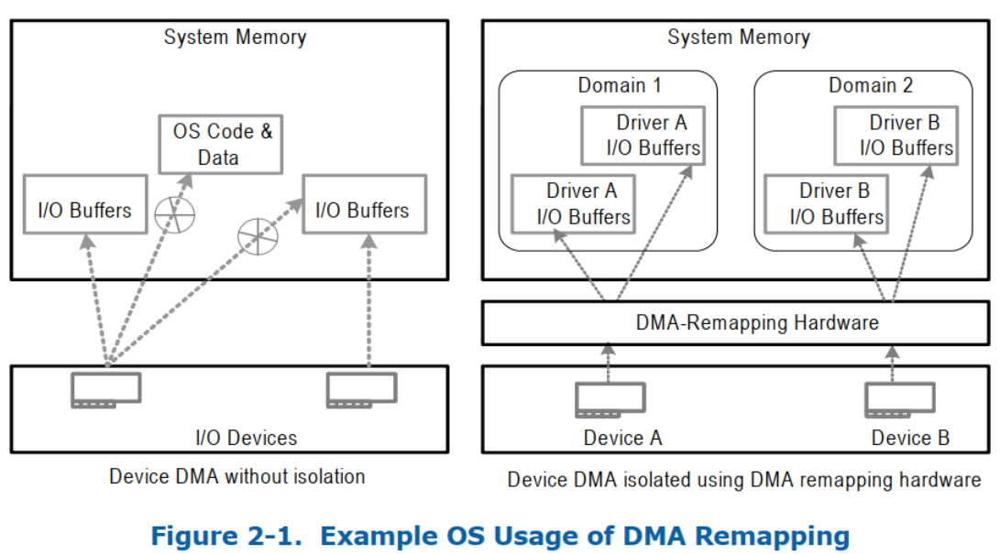

# Intel虚拟化技术

Intel® VT 由支持基于 Intel® 处理器的平台虚拟化的技术组件组成.

# VMM和VM

Intel VT 对虚拟机架构的支持主要包括两类软件:

* Virtual-Machine Monitor(VMM): VMM 充当主机，并完全控制处理器和其他平台硬件。VMM 为来宾软件（见下文）提供了虚拟处理器的抽象，并允许它直接在逻辑处理器上执行。VMM 能够保留对处理器资源、物理内存、中断管理和 I/O 的选择性控制。
* Guest Software: 虚拟机中运行的软件(Guest OS + APP)

# 处理器虚拟化的硬件支持

VMX

# I/O虚拟化

VMM 必须支持来自 guest software 的 I/O requests. VMM可以通过下面几种模型来支持 I/O 虚拟化:

* Emulation - 纯粹软件模拟， 比如e1000模拟的网卡. VMM 可以通过模拟现有（传统）I/O 设备将虚拟设备公开给来​​宾软件。 VMM 在物理平台上可用的任何物理设备上以软件模拟 I/O 设备的功能。通过仿真实现的 I/O 虚拟化提供了良好的兼容性（通过允许现有设备驱动进程在来宾中运行），但对性能和功能造成了限制。

* New Software Interfaces -  比如 SRIOV

* Assignment - 直接物理IO 设备分给VM

* I/O Device Sharing - IO设备共享，SRIOV/SIOV

# 虚拟化技术for Directed I/O

上述所有 I/O 虚拟化模型的一般要求是能够**隔离和限制设备对资源的访问**。

用于 Directed I/O 的英特尔® VT 为 VMM 软件提供以下功能：

* I/O device assignment - 用于灵活地将 I/O 设备分配给虚拟机，并扩展虚拟机的保护和隔离属性以进行 I/O 操作。

* DMA remapping - 来自设备的 DMA 地址转换

* Interrupt remapping: - 隔离并路由中断(来自设备和外部中断控制器)到相应的 VM.

* Interrupt posting - 将虚拟中断(来自设备和外部中断控制器)**直接投递**到**虚拟处理器**。

* Reliability - 用于记录和报告 DMA 和中断的错误给系统软件，否则可能会损坏(corrupt)内存或影响(impact)虚拟机隔离

## Hardware Support for DMA Remapping

为了概括 I/O 虚拟化并使其适用于不同的处理器体系结构和操作系统，本文档将 domain 称为平台中分配主机物理内存子集的抽象隔离环境。

DMA-remapping 硬件截获系统内存访问，利用页表，决定访问是不是不允许，以及访问的实际位置。

常用的分页结构可以缓存在硬件中。 DMA重新映射可以为每个设备独立配置，也可以跨多个设备共同配置。

### OS Usages of DMA Remapping

操作系统可以通过多种方式使用 DMA 重新映射:

* 操作系统保护：操作系统可以定义一个包含其关键代码和数据结构的 domain，并限制系统中所有 I/O 设备对该 domain 的访问。 这允许操作系统通过设备驱动程序对设备进行不正确的编程来限制其数据和代码的错误或意外损坏，从而提高了操作系统的健壮性和可靠性。

* 功能支持：操作系统可以使用domain来更好地管理从旧版设备到高内存的DMA（例如，访问4GB以上内存的32位PCI设备）。 这是通过对I / O页表进行编程以将DMA从这些设备重新映射到高内存来实现的。 没有这样的支持，软件就必须通过OS的“反弹缓冲区（bounce buffers）”来复制数据。

* DMA隔离：OS可以通过创建多个domain并将一个或多个 I/O 设备分配给每个域来管理 I/O。每个设备驱动程序都会在操作系统中显式注册其I / O缓冲区，然后操作系统会使用硬件实施DMA域保护，从而将这些I / O缓冲区分配给特定的domain。请参见图2-2。

* 共享虚拟内存：对于支持适当PCI Express1功能（PCI Express *基本规范中的进程地址空间ID - PASID功能）的设备，操作系统可以使用DMA重映射硬件​​功能与I / O设备共享应用程序进程的虚拟地址空间。共享的虚拟内存以及对I / O页面故障的支持，使应用程序可以将任意数据结构自由地传递到图形处理器或加速器等设备，而无需进行数据固定和编组的开销。

