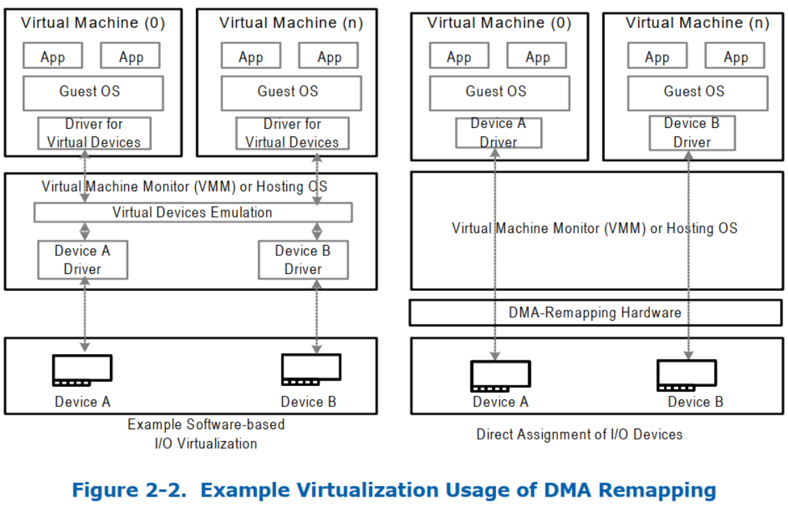
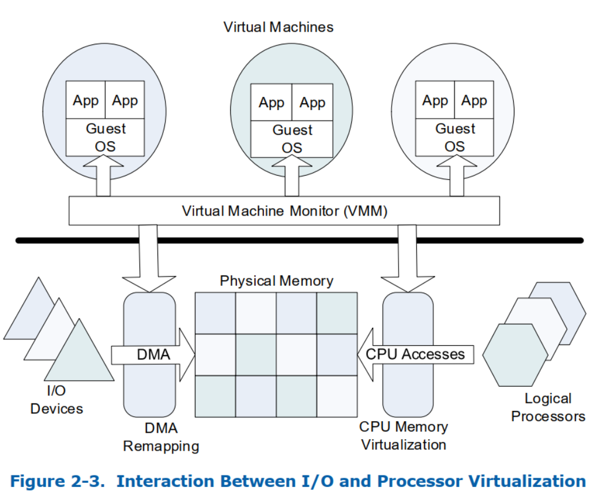

# Intel虚拟化技术

Intel® VT 由支持基于 Intel® 处理器的平台虚拟化的技术组件组成.

# VMM和VM

Intel VT 对虚拟机架构的支持主要包括两类软件:

* Virtual-Machine Monitor(VMM): VMM 充当主机，并完全控制处理器和其他平台硬件。VMM 为来宾软件（见下文）提供了虚拟处理器的抽象，并允许它直接在逻辑处理器上执行。VMM 能够保留对处理器资源、物理内存、中断管理和 I/O 的选择性控制。
* Guest Software: 虚拟机中运行的软件(Guest OS + APP)

# 处理器虚拟化的硬件支持

VMX

# I/O虚拟化

VMM 必须支持来自 guest software 的 I/O requests.

VMM可以通过下面几种模型来支持 I/O 虚拟化:

* Emulation(I/O 仿真模型): 纯粹软件模拟， 比如e1000模拟的网卡. VMM 可以通过模拟现有（传统）I/O 设备将虚拟设备公开给来​​宾软件。 VMM 在物理平台上可用的任何物理设备上以软件模拟 I/O 设备的功能。通过仿真实现的 I/O 虚拟化提供了良好的兼容性（通过允许现有设备驱动进程在来宾中运行），但对性能和功能造成了限制。

* New Software Interfaces:  比如 SRIOV

* Assignment(直接分配模型): 直接物理IO 设备分给VM. VMM 可以直接将物理 I/O 设备分配给 VM。在此模型中，分配的 I/O 设备的驱动进程在分配给它的 VM 中运行，并允许直接与设备硬件交互，而 VMM 参与最少或没有。可靠的 I/O 分配需要额外的硬件支持，以确保分配的设备访问是隔离的，并限制为分配的分区拥有的资源。I/O 分配模型还可用于创建一个或多个 I/O 容器分区，这些分区支持仿真或软件接口，用于虚拟化来自其他来宾的 I/O 请求。基于 I/O 容器的方法消除了将物理设备驱动进程作为 VMM 特权软件的一部分运行的需要。

* I/O Device Sharing(I/O 设备共享模型): IO设备共享，SRIOV/SIOV. 在此模型（对直接分配模型的扩展）中，I/O 设备支持多个 function 接口，每个 function 接口都可以独立分配给 VM。设备硬件本身能够通过这些功能接口接受多个 I/O 请求，并利用设备的硬件资源处理它们。

根据使用要求，VMM 可能支持 I/O 虚拟化的任何上述模型。例如，I/O 仿真可能最适合虚拟化旧设备。在 Guest 中托管 I/O 密集型工作负载时，I/O 分配可以提供最佳性能。 使用新的软件接口需要在兼容性和性能之间进行权衡，并且设备 I/O 共享提供的虚拟设备数量多于平台中的物理设备数量。

# 虚拟化技术for Directed I/O

上述所有 I/O 虚拟化模型的一般要求是能够**隔离和限制设备对资源的访问**。

用于 Directed I/O 的英特尔® VT 为 VMM 软件提供以下功能：

* I/O device assignment: 用于灵活地将 I/O 设备分配给虚拟机，并扩展虚拟机的保护和隔离属性以进行 I/O 操作。

* DMA remapping: 来自设备的 DMA 地址转换

* Interrupt remapping: 隔离并路由中断(来自设备和外部中断控制器)到相应的 VM.

* Interrupt posting: 将虚拟中断(来自设备和外部中断控制器)**直接投递**到**虚拟处理器**。

* Reliability: 用于记录和报告 DMA 和中断的错误给系统软件，否则可能会损坏(corrupt)内存或影响(impact)虚拟机隔离

## Hardware Support for DMA Remapping

> DMA Remapping的硬件支持

处于通用性考虑, 将平台上隔离环境(host物理内存的子集)的抽象称为 domain.

DMA-remapping 硬件会截获设备对系统内存的访问，利用页表，决定访问是不是不允许，以及访问的实际位置。

常用的分页结构可以缓存在硬件中。 DMA重新映射可以为每个设备独立配置，也可以跨多个设备共同配置。

### OS Usages of DMA Remapping

> 操作系统用法

操作系统可以通过多种方式使用 DMA 重新映射:

* **操作系统保护**：操作系统可以定义一个 **domain**, 包含**关键代码**和**数据结构**，并**限制**系统中**所有 I/O 设备**对该 domain 的访问。如果**设备驱动**程序**对设备进行不正确的编程**, 这个 domain 允许**操作系统限制**其数据和代码的错误或意外损坏，从而提高了操作系统的健壮性和可靠性。

* **功能支持**：操作系统可以使用 domain 来更好地管理从**旧版设备**对**高地址内存的 DMA**（例如，32位PCI设备要访问4GB以上内存）。 这是通过对 I/O 页表进行编程以将DMA从这些设备重新映射到高内存来实现的。 没有这样的支持，软件就必须通过OS的“反弹缓冲区（bounce buffers）”来复制数据。

* **DMA隔离**(DMA Isolation)：OS 可以通过创建**多个 domain** 来管理 I/O, 并**将一个或多个 I/O 设备分配给每个域**。每个设备驱动程序都会在 OS 中显式注册其 I/O buffers，然后 OS 会借用硬件实行 DMA 域的保护，从而将这些 I/O buffers 分配给特定的domain。请参见图2-1。

* **共享虚拟内存**(Shared Virtual Memory, SVM)：对于支持 PCIe PASID(Process Address Space ID, 进程地址空间ID)功能的设备，操作系统可以使用DMA重映射硬件​​功能让 **I/O 设备共享应用程序进程的虚拟地址空间**。SVM 以及对 I/O page-faults 的支持，使**应用程序**可以将**任意数据结构**自由地传递到 GPU 或 accelerators 等**设备**，从而减少数据 pinning 和 marshalling 的开销。

### VMM Usages of DMA Remapping

> VMM用法

DMA Remapping 的硬件支持可实现设备直接分配, 而无需在 VMM 中知道设备的相关信息. I/O 设备的驱动进程仅仅在分配给它的 partition 中运行, 并且可以直接和设备交互, 而无需或者 VMM 的最少参与（配置空间和中断管理）。

在此模型中，VMM 将直通设备限制为特定分区。仅当 **guest** 软件**访问影响系统功能和隔离的受保护资源**（例如**配置访问**、**中断管理**等）时才调用 **VMM**，而不是为来自分区的所有 I/O 请求调用 VMM。

为了支持直接分配 I/O 设备，VMM 必须强制隔离 DMA 请求。可以将 I/O 设备分配给 domain，并且可以使用重映射硬件​​将 DMA 从 I/O 设备限制到其域当前拥有的物理内存。对于可能在物理内存中重新定位的域，可以对 Remapping 硬件进行编程以执行必要的转换。 

IO设备分配，可以IO共享。一个IO分区的设备，可以给其他分区提供分享。

I/O 设备分配允许其他 I/O 共享使用——例如，将 **I/O 设备**分配给**一个 I/O 分区**，该 I/O 分区**为其他用户分区**提供 I/O **服务**。Remapping 硬件使虚拟化软件能够选择**设备分配和基于软件的 I/O 虚拟化方法的正确组合**。

DMA Remapping 还支持基于硬件的 I/O 虚拟化技术，如 Single Root I/O
虚拟化(SR-IOV) 和 Intel Scalable I/O 虚拟化（Intel Scalable IOV, 可扩展 IOV）1。

* 借助 SR-IOV 功能，可以将设备物理功能配置为支持多个虚拟功能 （VF）可以分配给不同的分区。
* 与 Intel Scalable IOV 功能类似，设备物理功能可以配置为支持多个轻量级 Assignable Device Interfaces(可分配设备接口, ADI)，这些接口同样可以作为虚拟设备分配给不同的分区。

> SIOV, 有 Intel® Scalable I/O Virtualization architecture specification

### DMA Remapping Usages by Guests

>Guest用法

Guest OS 可能会受益于 Remapping 硬件的可用性，以支持上面 "`OS Usages of DMA Remapping`" 中所述的用法。为支持这种用法, VMM 可以**将 remapping hardware 虚拟化给 guest**。比如, VMM 可以**拦截** guest 对**虚拟 remapping 硬件​​寄存器的访问**，并管理 guest 的 remapping structures 的 shadow copy。guest 更新 I/O 页表时，**guest** 软件执行适当的 **virtual invalidation 操作**。virtual invalidation requests 可以**被 VMM 拦截**，以**更新相应的影子页表**并**在 remmapping 硬件上执行 invalidation 操作**。

由于 faulting DMA transaction 的不可重启性（non-restartability, 与CPU内存管理虚拟化不同），VMM无法对其影子重映射结构执行延迟更新。

为了使影子结构与 guest 结构保持一致，VMM可能会以急切的预取行为（包括缓存不存在的条目）暴露虚拟重映射硬件​​，或使用处理器内存管理机制对guest重映射结构进行写保护。

在支持**两级地址转换**（第一级转换将虚拟地址重新映射成 guest 物理地址，以及第二级转换将 guest 物理地址重新映射到 host 物理地址）的**硬件实现**上，VMM 可以通过配置硬件以完成第一级和第二级的嵌套地址转换，而不需要影子页表来虚拟化 guest OS 的第一级转换。

### Interaction with Processor Virtualization

> 与处理器虚拟化的交互

VMM 通过 **cpu 的内存管理硬件**管理**访问物理内存的 cpu 请求**。**访问物理内存**的 **DMA 请求**使用 **remapping 硬件**。**cpu 内存管理**和 **DMA 内存管理**都在 **VMM** 的控制之下。

## Hardware Support for Interrupt Remapping

> 中断重映射的硬件支持

中断重映射为来自 **I/O 设备的中断请求**（直接或通过 I/O 中断控制器生成）提供**重新映射**和**路由**的**硬件支持**。通过重新映射实现的间接寻址可以不同分区隔离中断。 

为中断重新映射硬件设想了以下用法。

### Interrupt Isolation

> 中断隔离

在 Intel 平台, **中断请求**被 **RC**(Root-Complex) 标识为**对地址范围**（`0xFEEx_xxxxh`）进行 **DWORD 大小的写事务**。中断请求是自描述的（中断请求的属性被编码在请求的地址和数据中）， 允许任何 **DMA 启动器**来生成具有任何属性的**中断消息**。

VMM 利用中断重映射硬件实现**外部中断请求**在**不同 domain** 之间的**隔离**。比如, 利用中断重映射硬件，VMM 区分来自特定设备的中断，并将其路由到该设备分配的 VM 上。VMM还可以利用中断重映射硬件来控制这些中断请求的属性(例如目标CPU，中断向量，传送模式等)。

VMM 还可以使用**中断重映射硬件**​​来**区分外部中断**与 **VMM 拥有的处理器间中断**（IPI）。软件可以 通过 **任何外部重映射中断的属性**（例如向量号）都**不匹配VMM IPI的属性** 来达到这个目的。

### Interrupt Migration

> 中断迁移

中断重映射体系结构通过**中断的动态重定向**，来实现中断请求目的从一个逻辑处理器**迁移**到另一个上。

如果**没有中断重映射硬件支持**，中断的**重新平衡**需要软件对**中断源**进行**重新编程**。但是，这些资源的重新编程是非原子性的（要求要重新编程多个寄存器），通常很复杂（可能需要临时屏蔽中断源），并且取决于中断源的特性（例如，某些中断源没有屏蔽能力；在某些源上被屏蔽时，升降沿中断可能会丢失）。

中断重新映射使软件能够有效地重定向中断，而无需在中断源上重新编程配置。

OS软件可以使用**中断迁移**来**平衡处理器之间的负载**（例如，在运行 I/O 密集型工作负载时）。

通过中断迁移，VMM可以实现将带有设备分区的**虚拟CPU**在**物理CPU**之间进行**迁移**，以提高CPU利用率。

### x2APIC Support

> x2APIC支持

Intel® 64 x2APIC 架构将 APIC 寻址能力从 8 位扩展到32位。

中断重新映射使 x2APIC 能支持外部中断扩展 APIC 的可寻址性，而无需对中断源（例如 I/O xAPIC 和 MSI/MSI-X 设备）进行硬件更改。

## Hardware Support for Interrupt Posting

> 中断投递的硬件支持

通过硬件支持，**优化处理**直接**分配给虚拟机的 I/O 设备**（PF，SR-IOV 的VF 或 Intel® SIOV 的可分配设备接口 ADIs，Assignable Device Interfaces）的**中断请求**。

为中断投递硬件设想了以下用法。

### Interrupt Vector Scalability

支持 I/O 虚拟化功能（如 SR-IOV 和/或 Intel Scalable IOV）的设备允许为物理功能 （PF） 启用**多个虚拟功能**（VF） 或**可分配设备接口**（ADI），从而几乎增加了平台的 I/O 扇出(fan-out)。这些 **PF**、**VF** 或 **ADI** 中的**任何一个**都可以**分配给虚拟机**。

来自分配给虚拟机的PF，VF 或 ADI 设备/资源的中断请求被称为虚拟中断，因为它们针对已分配VM的虚拟处理器。

每个VF或ADI都需要其自己的独立中断资源，这比没有I / O虚拟化的情况，需要更多的中断向量。

没有中断投递硬件支持，平台中的所有中断源都映射到相同的物理中断向量空间（Intel®64处理器上,每个逻辑CPU 8位向量空间）。

对于虚拟化用途，当虚拟进程与逻辑处理器之间没有静态亲和时，在动态环境中跨虚拟处理器划分物理向量空间是一项挑战。

对支持中断投递的硬件，通过允许来自分配给虚拟机的设备中断请求在虚拟矢量空间中处理，从而自然地可随虚拟机或虚拟处理器的数量进行中断向量伸缩。