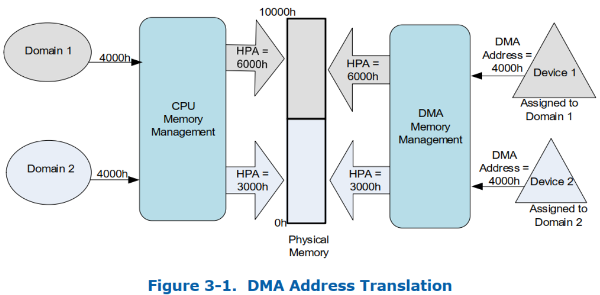
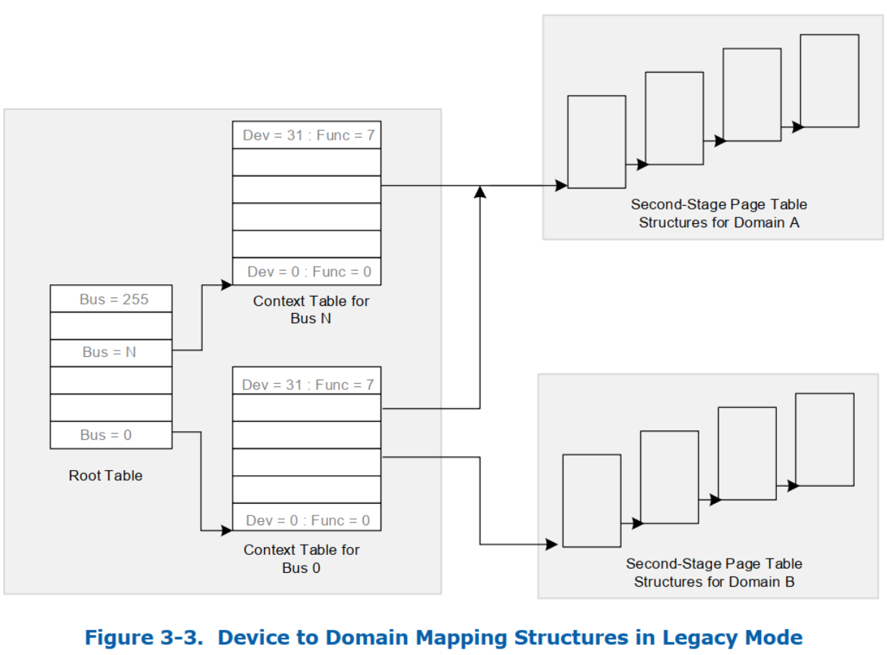

介绍用于 DMA 重映射的硬件体系结构. 该硬件在**集成到处理器组合**(Complex)中的 **Root-Complex**(RC)或**核心逻辑芯片组**组件中.

# 1. Types of DMA Requests

> DMA 请求的类型

**DMA Remapping 硬件**将来自 **RC 的集成设备**和 **PCI Express 连接的离散设备**的 DMA 内存请求分为两类：

* `Requests without address-space-identifier`: **不含地址空间描述标志**的 DMA Request. 这是 endpoint devices 的**普通请求**, 请求内容仅包含**请求的类型** (`read`/`write`/`atomics`), DMA 请求的目标 **address/size** 以及请求**设备的标志符**(BDF)等.

* `Requests with address-space-identifier`: **包含地址空间描述标志的 DMA Request**. 除了通用属性, 还需要包含**额外信息**以提供**目标进程**的**地址空间标志符** (`PASID`), 以及一些可选属性, 比如 `Execute-Requested`(ER, 表明是指令提取) flag 和 `Privileged-mode-Requested` 等细节信息. 更多细节可以看 PCIe Spec 的 Process Address Space ID (PASID) Capability.

为了简单, 通常称上面两类 DMA 请求简称为: `Requests-without-PASID` 和 `Requests-with-PASID`. 使用**唯一的 PASID 标记** DMA 流的请求, 可以实现 I/O 设备的可扩展和细粒度共享, 以及使用主机应用进程的虚拟内存操作设备.  **没有 IOMMU 的 RC** 或**未启用 DMA 重映射的具有 IOMMU 的 RC** 必须**忽略 PASID TLP 前缀**. 后面将介绍 `Requests-with-PASID` 的请求的用法.

此规范在修订版 2.0 之前的版本仅支持重新映射 `Requests-without-PASID` 的请求.

# 2. Domains and Address Translation

> domain 和地址转换

处于通用性考虑, 将平台上隔离环境(host物理内存的子集)的抽象称为 domain.

domain 抽象地定义为平台中的隔离环境, host 物理内存的子集会被分配到该环境中. **允许直接访问物理内存的 I/O 设备**分配给域, 称为**域的已分配设备**. 对于虚拟化用途, 软件可以将**每个虚拟机**视为**一个 domain**.

**domain** 的**隔离特性**是通过**阻止未分配给它的资源对其物理内存的访问**来实现的. **系统中支持多个隔离 domain**. DMA 重新映射架构有助于将 I/O 设备灵活分配到任意数量的域. 每个 domain 都有可能有**不同**于**主机物理地址空间**的**物理地址空间视图**

**重映射硬件**​​将入站(inbound)请求中的**地址**视为 **DMA 地址**. 根据软件使用模型, **设备**(无论是 PF、SR-IOV VF 还是 SIOV 可分配设备接口 (ADI))**的 DMA 地址空间**可能是该设备所属 guest 的物理地址(**GPA**)空间, 执行 DMA 请求的 host 应用进程的虚拟地址(**HVA**)空间, 虚拟机内运行的应用进程的客户虚拟地址(**GVA**)空间. IOVA 空间由主机软件管理, guest GIOVA 空间由 guest 软件管理.

在所有情况下, **DMA 重映射**都会将 **I/O 设备**发出的 **DMA 请求**中的**地址**转换为其相应的主机物理地址(**HPA**).

图 3-1 说明了 DMA 地址转换. I/O 设备 1 和 2 分别分配给 domain 1 和 2. 负责创建和管理域的软件为两个域分配系统物理内存并设置 DMA 地址转换功能. 由设备 1 和 2 发起的请求中的 DMA 地址由重新映射硬件转换为适当的 HPA.

主机平台可以支持**一个或多个重映射硬件单元**. **每个硬件单元**都支持**其硬件范围内**的 DMA requests remapping. 例如,

* 桌面平台可能会在其处理器 RC 中公开**一个重映射硬件单元**, 用于**转换所有 DMA 事务**.

* 具有**一个或多个核心组件**的服务器平台**每个核心组件**都可以有**独立转换硬件单元**, **每个单元**都转换**来自其 I/O 层次结构的 DMA 请求**(例如 PCI Express root port). 在该架构中, 取决于软件编程, 这些硬件单元可以**共享相同**的**转换数据结构**(在系统内存中)或使用独立结构.

在进一步的硬件处理(例如地址解码、处理器高速缓存的窥探, 和/或转发到内存控制器)之前, 重映射硬件​​将请求中的地址转换为**主机物理地址** (HPA).

# 3. Remapping Hardware - Software View

> 软件视角的重定向硬件

**重映射体系结构**允许**硬件实现**将**单个 PCI 段组**:

* 作为单个硬件单元, 将重映射功能 expose 给软件, 从而覆盖**整个 PCI 段组**;

* 作为多个硬件单元, 每个单元都支持这个 PCI 段组中互斥的**设备子集**.

例如一种实现, 可以 expose 一个重映射硬件, 从而支持 root bus(根总线)上的一个或多个集成设备, 以及其他的重映射硬件用来支持一个或一组 PCIe root port 后面的集成设备. 平台固件(BIOS)将平台中的每个重映射硬件单元报告给软件. 第8章描述了通过 ACPI 结构的报告结构.

对于支持**多个 PCI 段组**的硬件, 重映射架构要求硬件 expose 出**独立的重映射硬件单元**(**每个 PCI 段组至少一个**), 以处理源自每个段组的 I/O 层次结构内的请求.

# 4. Mapping Devices to Domains

> 将设备映射到 domain

介绍 DMA 重映射架构和相关数据结构, 用来将 I/O 设备映射到 domain.

## 4.1. Source Identifier

> 源标识符

**地址转换硬件**上的**每个**入站(inbound)**请求**都需要**标识发起请求的设备**。标识 I/O 事务发起方的属性称为 "source ID"。

**重映射硬件**可以通过**特定于实现的方式**确定事务的 source ID。例如，**某些 I/O 总线协议**可能会在**每个 I/O 事务**中提供**源设备标识**。在其他情况下（例如，对于 **RC 集成设备**），**source id** 可以基于 **RC 内部实现派生**。

对于 **PCIe** 设备，**source ID** 是 **PCIe 事务层 header** 中的**请求标识符**。**设备的请求标识符**由其 **PCI 总线/设备/功能编号** 组成，**由配置软件分配**，并唯一标识发起请求的硬件功能。图 3-2 说明了由 PCIe Spece 中定义的请求 id。

以下部分描述了将 I/O 设备映射到域的数据结构

## Legacy Mode Address Translation

> 传统模式的地址转换

Root Table 在内存中的地址通过 Root Table Address Register （`RTADDR_REG`）描述. 详细见 11.4.5

当 `RTADDR_REG` 寄存器中的**转换表模式字段**(`Translation Table Mode`)被设置为**传统模式**（`RTADDR_REG.TTM = 00b`）时，`RTADDR_REG` 指向 root table。

root table 的大小为 4 KB，包含 256 个 root entry 以覆盖 PCI bus number 空间(0-255)。请求的 source ID 字段中的 bus number（高 8 位）用于索引 root entry 结构。 root entry 包含引用该 bus 上所有设备的 context table 的指针。

context entry 将总线上的一个特定 I/O 设备映射到分配给它的域，进而映射到该 domain 的地址转换结构。每个 context table 包含 256 个条目，**每个条目**对应于总线上的**一个 PCI device function**。对于 PCI 设备，source-id 的 device 和 function number（低 8 位）用于索引 context table。

通过对设备的 **context entry** 进行编程以**引用相同的翻译结构**，并使用**相同的域标识符**对它们进行编程，可以将**多个设备分配给相同的域**。

root entry 格式在第 9.1 节中描述，context entry 格式在第 9.3 节中描述。

## Scalable Mode Address Translation

> 可扩展模式地址转换

对于**支持可扩展模式转换**（**Extended Capability Register** 中的 `SMTS=1`）的硬件，当 `RTADDR_REG` 寄存器中的**转换表模式字段**设置为**可扩展模式**（`RTADDR_REG.TTM = 01b`）时，`RTADDR_REG` 指向**可扩展模式根表**(`scalable-mode root-table`)。

`scalable-mode root-table` 类似于 root-table（大小为 4KB，包含 256 个**可扩展模式根条目**以覆盖 0-255 PCI bus number space），但**引用可扩展模式上下文条目的格式不同**。每个 `scalable-mode root-entry` 都会引用一个**低可扩展模式上下文表**(`lower scalable-mode context-table`)和一个**高可扩展模式上下文表**(`upper scalable-mode context-table`)。

`lower scalable-mode context-table` 的大小为 **4 KB**，包含 **128 个可扩展模式上下文条目**，对应于相应总线上 **device number 范围 0-15** 中的 PCI 功能。上部可扩展模式上下文表的大小也是 4 KB，包含 128 个可扩展模式上下文条目，对应于总线上设备范围 16-31 中的 PCI 功能。可扩展模式上下文条目支持不带 PASID 的请求和带 PASID 的请求。但是，与传统模式不同的是，在可扩展模式下，不带 PASID 的请求从可缩放模式上下文条目的RID_PASID字段中获取 PASID 值，并且处理方式与使用 PASID 的请求类似。不支持RID_PASID功能的实现 （ECAP_REG.RPS 为 0b），使用 PASID 值 0 对没有 PASID 的请求执行地址转换。

