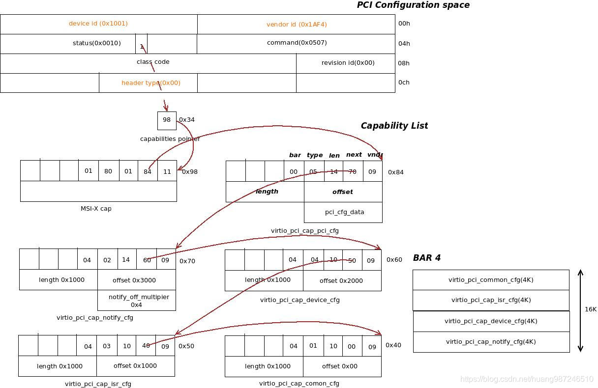

# 流程介绍

虚机向virtio磁盘写入数据后，走到块设备层提交bio，最终会往virtio-blk队列的环上添加写入数据的物理地址，整个流程如下：

```cpp
submit_bio
	generic_make_request						/* 将bio提交到块设备的工作队列上去 */
		blk_mq_dispatch_rq_list					/* 工作队列处理函数 */
			q->mq_ops->queue_rq()				/* 调用多队列入队请求的具体实现 */
				virtio_queue_rq					/* virtio磁盘的入队请求实现 */
					__virtblk_add_req			/* 将IO数据地址添加到virtio的队列上 */
						virtqueue_kick_prepare	/* 判断是否要通知后端 */
						virtqueue_notify		/* 通知 */
							vq->notify()		/* virtio队列的通知实现 */
								vp_notify()		/* 对于基于pci的virtio设备，最终调用该函数实现通知 */
```

vp_notify的具体实现如下：

```cpp
// drivers/virtio/virtio_pci_common.c
/* the notify function used when creating a virt queue */
bool vp_notify(struct virtqueue *vq)
{                
    /* we write the queue's selector into the notification register to
     * signal the other end */
    iowrite16(vq->index, (void __iomem *)vq->priv);
    return true; 
}
```

从这里看，notify 的动作就是往队列的一个 priv 成员中写入队列的 idx。这个priv成员在哪儿初始化的？看下面：

```cpp
// drivers/virtio/virtio_pci_modern.c
static struct virtqueue *setup_vq(struct virtio_pci_device *vp_dev,
				  struct virtio_pci_vq_info *info,
				  unsigned index,
				  void (*callback)(struct virtqueue *vq),
				  const char *name,
				  bool ctx,
				  u16 msix_vec)
{
    ......
	/* create the vring */
	vq = vring_create_virtqueue(index, num, /* 1 */
				    SMP_CACHE_BYTES, &vp_dev->vdev,
				    true, true, ctx,
				    vp_notify, callback, name);
    vq->priv = (void __force *)vp_modern_map_vq_notify(mdev, index, NULL); /* 2 */
    ......
}
```

* 1: 创建 virtio 磁盘列队，为 vring 分配空间，并将其挂载到队列上。函数传入了一个 vp_notify 回调函数，这个函数就是在 Guest 添加buffer后要调用的通知后端的 notify 函数
* 2: 设置 notify 函数中要写入的 pci 地址，这个地址的计算依据是 virtio 规范

# 硬件基础

virtio 设备的PCI空间中，`virtio_pci_cap_notify_cfg` 是专门用作**前端通知**的 cap，通过**读取**这个配置空间的信息，可以计算出通知后端时前端**写入的地址**，整个 virtio-pci 的配置空间如下：




