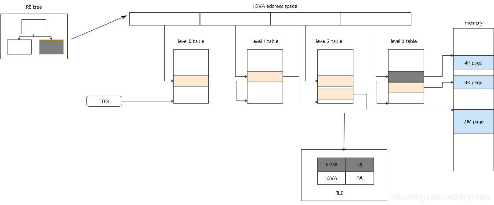

在使能SMMU情况下:

* 设备通过SMMU访问内存，在访问之前，须建立起设备访问地址即IOVA到物理内存地址PA之间的映射（保存在内存中）, 此过程称为DMA MAP过程;

* 后续设备需要访问时SMMU自动将设备发送的IOVA转化为PA，当不需要再访问时取消之前建立的映射，此过程称为DMA UNMAP过程。若在没有建立映射前对物理内存进行访问，产生缺页中断。

# DMA MAP过程

DMA MAP 过程基本上分为如下过程：

1. 分配需要映射的物理内存；
2. 根据RCACE缓存机制分配IOVA；
3. 根据TTBR及IOVA，建立页表项，建立IOVA与PA之间的映射；
4. 默认在SMMU硬件内部TLB中会缓存IOVA到PA的映射，设备访问对应IOVA时首先从TLB缓存中取，若失败，根据IOVA一级一级查找页表（内存），若没有找到，产生缺页中断；

对于不同的DMA MAP接口，物理内存的组织方式不一样（PA与VA之间映射不同），但整体映射过程基本类似。

# DMA UNMAP过程

DMA UNMAP过程如下：

对于DMA UNMAP过程，根据是否立即刷TLB和释放IOVA，分为strict模式和non-strict模式。对于strict模式，DMA UNMAP过程如下所示：

1. 销毁页表；
2. 刷TLB无效化TLB中缓存的映射；
3. 释放IOVA；

对于non-strict模式，DMA UNMAP过程如下所示：

1. 销毁页表；
2. 并不立即无效化TLB中缓存的映射和释放IOVA，在每个CPU上设置一个定时器，每10ms发送一次TLBI ALL无效化所有的TLB缓存并释放IOVA;

可以看出，non-strict模式可以减少大大减少刷TLB时间（从当前测试测试数据来看， non-strict模式发TLB的次数为strict模式的1/1000），可以提升性能，但过时的IOVA和映射可能仍保留在内存中，给系统安全性留下隐患。

https://blog.csdn.net/flyingnosky/article/details/116770780