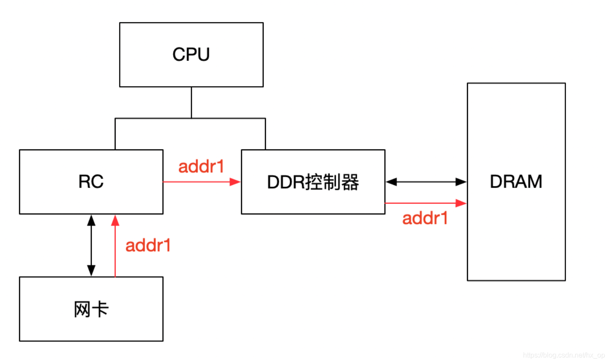
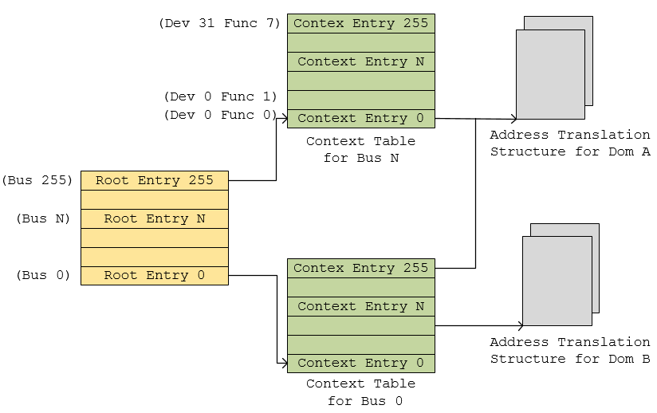

<!-- @import "[TOC]" {cmd="toc" depthFrom=1 depthTo=6 orderedList=false} -->

<!-- code_chunk_output -->

- [1. DMA](#1-dma)
  - [1.1. passthrough 下的 DMA](#11-passthrough-下的-dma)
- [2. DMA Remapping功能简介](#2-dma-remapping功能简介)
  - [2.1. 没有 IOMMU](#21-没有-iommu)
  - [2.2. 有 IOMMU](#22-有-iommu)
  - [2.3. passthrough对比](#23-passthrough对比)
- [3. IOMMU的作用](#3-iommu的作用)
- [4. 工作原理](#4-工作原理)
  - [4.1. 两种DMA request](#41-两种dma-request)
  - [4.2. DMA Domain和Address Space](#42-dma-domain和address-space)
  - [4.3. DMA Translation](#43-dma-translation)
    - [4.3.1. Request ID](#431-request-id)
    - [4.3.2. 两个表](#432-两个表)
      - [4.3.2.1. root table](#4321-root-table)
      - [4.3.2.2. context table](#4322-context-table)
- [5. 直通设备的隔离](#5-直通设备的隔离)
- [6. 直通设备的地址翻译](#6-直通设备的地址翻译)
- [7. reference](#7-reference)

<!-- /code_chunk_output -->

# 1. DMA

DMA 是指在**不经过 CPU 干预**的情况下**外设直接访问** (Read/Write) **主存** (System Memroy) 的能力.

DMA 带来的最大好处是: CPU 不再需要干预外设对内存的访问过程, 而是可以去做其他的事情, 这样就大大**提高**了 **CPU 的利用率**.

## 1.1. passthrough 下的 DMA

在**设备直通** (Device Passthough) 的虚拟化场景下, 直通设备在工作的时候同样要使用 DMA 技术来**访问虚拟机的主存**以提升 IO 性能.

那么问题来了, 直接分配给某个特定的虚拟机的, 我们**必须要保证直通设备 DMA 的安全性**, 一个 VM 的直通设备**不能**通过 DMA 访问到**其他 VM 的内存**, 同时也**不能**直接访问 **Host 的内存**, 否则会造成极其严重的后果.

因此, 必须对直通设备进行 "**DMA 隔离**" 和 "**DMA 地址翻译**":

* **隔离**将直通设备的 DMA 访问限制在其**所在 VM 的物理地址空间**内保证不发生访问越界;
* **地址翻译**则保证了直通设备的 DMA 能够被正确重定向到**虚拟机的物理地址空间**内.

为什么**直通设备**会存在 DMA 访问的**安全性问题**呢?

原因也很简单: 由于直通设备进行 **DMA 操作**的时候 **guest 驱动**直接使用 **gpa** 来**访问内存**的, 这就导致如果不加以隔离和地址翻译必然会访问到**其他 VM 的物理内存**或者**破坏 Host 内存**, 因此必须有一套机制能够将 **gpa** 转换为**对应的 hpa**, 这样直通设备的 DMA 操作才能够顺利完成.

VT-d DMA Remapping 的引入就是为了**解决直通设备 DMA 隔离和 DMA 地址翻译**的问题, 下面我们将对其原理进行分析, 主要参考资料是 Intel VT-d SPEC Chapter 3.

# 2. DMA Remapping功能简介

VT-d DMA Remapping 的硬件能力主要是由 **IOMMU** 来提供, 对于DMA Remapping, IOMMU与MMU类似. IOMMU 可以将一个设备访问**地址转换为存储器地址**.

**DMA Remapping** 通过 **IOMMU 页表** 方式将 **直通设备对内存的访问** 限制到特定的 **domain** 中, 在提高 IO 性能的同时完成了**pass-through直通设备**的 **隔离**, 保证了直通设备 **DMA 的安全性**.

## 2.1. 没有 IOMMU

在没有 IOMMU 的情况下, 网卡接收数据时地址转换流程, **RC** 会将**网卡请求写入地址 addr1** 直接发送到 **DDR 控制器**, 然后访问 DRAM 上的 addr1 地址, 这里的 RC 对网卡请求地址不做任何转换, 网卡访问的地址必须是物理地址.

## 2.2. 有 IOMMU

对于有IOMMU的情况, 网卡**请求写入地址 addr1** 会**被 IOMMU 转换为 addr2**, 然后发送到 DDR 控制器, 最终访问的是 DRAM 上 addr2 地址, 网卡访问的地址 addr1 会被 IOMMU 转换成**真正的物理地址 addr2**, 这里可以将 addr1 理解为虚机地址.

## 2.3. passthrough对比

左图是**没有 IOMMU** 的情况, 对于虚机无法实现设备的透传, 原因主要有两个: 一是因为在没有 IOMMU 的情况下, 设备必须访问真实的物理地址HPA, 而虚机可见的是GPA；二是如果让虚机填入真正的HPA, 那样的话相当于虚机可以直接访问物理地址, 会有安全隐患. 所以针对**没有 IOMMU** 的情况, **不能用透传的方式**, 对于设备的直接访问都会有VMM接管, 这样就不会对虚机暴露HPA.

右图是**有 IOMMU** 的情况, 虚机可以将GPA直接写入到设备, 当设备进行DMA传输时, 设备请求地址GPA由IOMMU转换为HPA（硬件自动完成）, 进而DMA操作真实的物理空间. IOMMU的映射关系是由VMM维护的, HPA对虚机不可见, 保障了安全问题, 利用IOMMU可实现设备的透传. 这里先留一个问题, 既然IOMMU可以将设备访问地址映射成真实的物理地址, 那么对于右图中的Device A和Device B, IOMMU必须保证两个设备映射后的物理空间不能存在交集, 否则两个虚机可以相互干扰, 这和IOMMU的映射原理有关, 后面会详细介绍.

# 3. IOMMU的作用

总结IOMMU主要作用如下:

* **屏蔽物理地址**, 起到保护作用. **典型应用**包括两个:
  * 一是**实现用户态驱动**, 由于IOMMU的映射功能, 使HPA对用户空间不可见, 在vfio部分还会举例.
  * 二是将**设备透传给虚机**, 使HPA对虚机不可见, 并将GPA映射为HPA
* IOMMU 可以将**连续的虚拟地址**映射到**不连续的多个物理内存**片段, 这部分功能于MMU类似, 对于没有IOMMU的情况, 设备访问的物理空间必须是连续的, IOMMU可有效的解决这个问题

# 4. 工作原理

通过引入**根 Context Entry** 和 **IOMMU Domain Page Table** 等机制来实现直通设备隔离和 DMA 地址转换的目的.

## 4.1. 两种DMA request

根据 **DMA Request** 是否包含**地址空间标志** (`address-space-identifier`) 我们将 DMA Request 分为 2 类:

* `Requests without address-space-identifier`: **不含地址空间描述标志**的 DMA Request, 这种一般是 endpoint devices 的**普通请求**, 请求内容仅包含**请求的类型** (`read`/`write`/`atomics`), DMA 请求的 **address/size** 以及请求**设备的标志符**等.

* `Requests with address-space-identifier`: **包含地址空间描述标志的 DMA Request**, 此类请求需要包含**额外信息**以提供**目标进程**的**地址空间标志符** (`PASID`), 以及 `Execute-Requested` (ER) flag 和 `Privileged-mode-Requested` 等细节信息.

为了简单, 通常称上面两类 DMA 请求简称为: `Requests-without-PASID` 和 `Requests-with-PASID`.

本节我们只讨论 Requests-without-PASID, 后面我们会在讨论 Shared Virtual Memory 的文中单独讨论 Requests-with-PASID.

## 4.2. DMA Domain和Address Space

> 这两个意思相等?

首先要明确的是 **DMA Isolation** 是**以 Domain 为单位**进行隔离的, 在**虚拟化环境**下可以认为**每个 VM 的地址空间**为**一个 Domain**, 直通给这个 VM 的设备只能访问这个 VM 的地址空间这就称之为 "**隔离**".

根据**软件的使用模型**不同, **直通设备**的 **DMA Address Space** 可能是:

* **某个 VM** 的 **Guest Physical Address Space**;
* **某个进程的虚拟地址空间** (由分配给进程的 **PASID** 定义);
* 由软件定义的一段抽象的 **IO Virtual Address space** (`IOVA`).

## 4.3. DMA Translation

DMA Remapping 就是要能够将设备发起的 **DMA Request** 进行 DMA Translation **重映射**到对应的 **HPA** 上.

下面的图描述了 DMA Translation 的原理, 这和 MMU 将虚拟地址翻译成物理地址的过程非常的类似.

值得一提的是, **Host 平台**上可能会存在一个或者**多个 DMA Remapping 硬件单元**, 而**每个硬件单元**支持在它管理的**设备范围内**的**所有设备**的 DMA Remapping. 例如, 你的台式机 CPU Core i7 7700k 在 MCH 中只集成一个 DMA Remapping 硬件单元 (IOMMU), 但在**多路服务器**上可能集成有**多个 DMA Remapping 硬件单元**. 每个硬件单元**负责管理**挂载到它**所在**的 **PCIe Root Port** 下所有设备的 DMA 请求. **BIOS** 会将平台上的 DMA Remapping **硬件信息**通过 **ACPI** 协议报告给操作系统, 再由**操作系统**来初始化和管理这些硬件设备.

### 4.3.1. Request ID

为了实现 DMA 隔离, 我们需要**对直通设备进行标志**, 而这是通过 PCIe 的 **Request ID** 来完成的. 根据 PCIe 的 SPEC, **每个 PCIe 设备的请求**都包含了 `PCI Bus/Device/Function` 信息, 通过 BDF 号我们可以**唯一确定一个 PCIe 设备**.

特殊情况:

* 对于由 **PCIe switch** 扩展出的 **PCI 桥及桥下设备**, 在发送 DMA 请求时, Source Identifier 是 PCIe switch 的, 这样的话该 PCI 桥及桥下所有设备都会**使用 PCIe switch 的 Source Identifier** 去定位Context Entry, 找到的**页表也是同一个**, 如果将这个PCI桥下的不同设备分给不同虚机, 由于会使用同一份页表, 这样会产生问题, 针对这种情况, **当前PCI 桥及桥下的所有设备必须！！！分配给同一个虚机**, 这就是 VFIO 中 group 的概念, 下面会再讲到.

### 4.3.2. 两个表

同时为了能够**记录直通设备和每个 Domain 的关系**, VT-d 引入了 `root-entry/context-entry` 的概念, 通过查询 **root-entry/context-entry 表**就可以获得直通设备和 Domain 之间的**映射关系**.

#### 4.3.2.1. root table

`Root-table` 是一个 **4K 页**, 共包含了 **256** 项 `root-entry`, 分别覆盖了 PCI 的 `Bus 0-255`.

Root-table 的**基地址**存放在 `Root Table Address Register`(`RTADDR_REG`) 当中.

**每个 root-entry** 占 `16-Byte`, 记录了当前 PCI Bus 上的**设备映射关系**, 通过 **PCI Bus Number** 进行**索引**.

Root-entry 中记录的关键信息有:

* **Present Flag**: 代表着该 Bus 号对应的 Root-Entry 是否呈现, CTP 域是否初始化;
* **Context-table pointer**(CTP): CTP 记录了当前 Bus 号对应点 Context Table 的**地址**.

#### 4.3.2.2. context table

> 一个 context table 仅仅是一个 device 的

**每个** `context-table` 也是一个 **4K 页**, 记录**一个特定的 PCI 设备**和它**被分配的 Domain** 的映射关系, 即**对应 Domain** 的 DMA 地址翻译结构信息的地址.

每个 root-entry 包含了该 Bus 号对应的 context-table 指针, 指向一个 context-table, 而每张 context-table 包又含 256 个 `context-entry`, 其中每个 entry 对应了一个 **Device Function 号**所确认的**设备的信息**. 通过 2 级表项的查询我们就能够获得指定 PCI 被分配的 Domain 的地址翻译结构信息.

Context-entry 中记录的信息有:

* **Present Flag**: 表示该设备对应的 context-entry 是否被初始化, 如果当前平台上没有该设备 Preset 域为 0, 索引到该设备的请求也会被 block 掉.
* **Translation Type**: 表示哪种请求将被允许;
* **Address Width**: 表示该设备被分配的 Domain 的地址宽度;
* **Second-level Page-table Pointer**: 二阶页表指针提供了 **DMA 地址翻译结构**的 **HPA 地址** (这里仅针对 `Requests-without-PASID` 而言);
* **Domain Identifier**: Domain 标志符表示当前设备的**被分配到的 Domain** 的标志, 硬件会利用此域来标记 context-entry cache, 这里有点**类似 VPID** 的意思;
* **Fault Processing Disable Flag**: 此域表示是否需要选择性的 disable 此 entry 相关的 remapping faults reporting.

因为**多个设备**有可能被分配到**同一个 Domain**, 这时只需要将其中**每个设备 context-entry 项**的 `Second-level Page-table Pointer` 设置为**对同一个 Domain 的引用**, 并将 `Domain ID` 赋值为**同一个 Domian** 的就行了.

# 5. 直通设备的隔离

VT-d 中引入 root-table 和 context-table 的目的比较明显, 这些额外的 table 的存在就是为了记录**每个直通设备和其被分配的 Domain 之间的映射关系**.

有了这个映射关系后, DMA 隔离的实现就变得非常简单.

**IOMMU 硬件**会**截获直通设备发出的请求**, 然后根据其 **Request ID** 查表找到对应的 Address Translation Structure 即**该 Domain 的 IOMMU 页表基地址**, 这样一来该设备的 DMA 地址翻译就只会按这个 Domain 的 IOMMU 页表的方式进行翻译, 翻译后的 HPA 必然落在此 Domain 的地址空间内 (这个过程**由 IOMMU 硬件中自动完成**), 而不会访问到其他 Domain 的地址空间, 这样就达到了 DMA 隔离的目的.

# 6. 直通设备的地址翻译

DMA 地址翻译的过程和虚拟地址翻译的过程是完全一致的, 唯一不同的地方在于 **MMU 地址翻译**是将**进程的虚拟地址** (HVA) 翻译成**物理地址** (HPA), 而 **IOMMU 地址翻译**则是将**虚拟机物理地址空间**内的 **GPA** 翻译成 **HPA**.

IOMMU 页表和 MMU 页表一样, 都采用了多级页表的方式来进行翻译. 例如, 对于一个 48bit 的 GPA 地址空间的 Domain 而言, 其 IOMMU Page Table 共分 4 级, 每一级都是一个 4KB 页含有 512 个 8-Byte 的目录项. 和 MMU 页表一样, IOMMU 页表页支持 2M/1G 大页内存, 同时硬件上还提供了 IO-TLB 来缓存最近翻译过的地址来提升地址翻译的速度.

在设备发起 DMA 请求时, 会将自己的 **Source Identifier**(包含 Bus、Device、Func)包含在请求中, IOMMU根据这个标识, 以 `RTADDR_REG` 指向空间为**基地址**, 然后利用 `Bus、Device、Func` 在 Context Table 中**找到对应的Context Entry**, 即**页表首地址**, 然后利用页表即可将设备请求的虚拟地址翻译成物理地址. 这里做以下说明:

* 图中**红线**的部分, 是**两个 Context Entry 指向了同一个页表**. 这种情况在**虚拟化场景**中的**典型用法**就是这两个 Context Entry 对应的**不同PCIe设备属于同一个虚机**, 那样IOMMU在将 GPA->HPA 过程中要遵循同一规则
* 由图中可知, **每个**具有Source Identifier(包含Bus、Device、Func)的**设备**都会**具有一个Context Entry**. 如果不这样做, 所有设备共用同一个页表, 隶属于不同虚机的不同GPA就会翻译成相同HPA, 会产生问题,

有了页表之后, 就可以按照MMU那样进行地址映射工作了, 这里也支持不同页大小的映射, 包括4KB、2MB、1GB, 不同页大小对应的级数也不同, 下图以4KB页大小为例说明, 映射过程和MMU类似, 不再详细阐述.

# 7. reference

https://luohao-brian.gitbooks.io/interrupt-virtualization/content/vt-d-dma-remapping-fen-xi.html

http://element-ui.cn/news/show-44900.html
