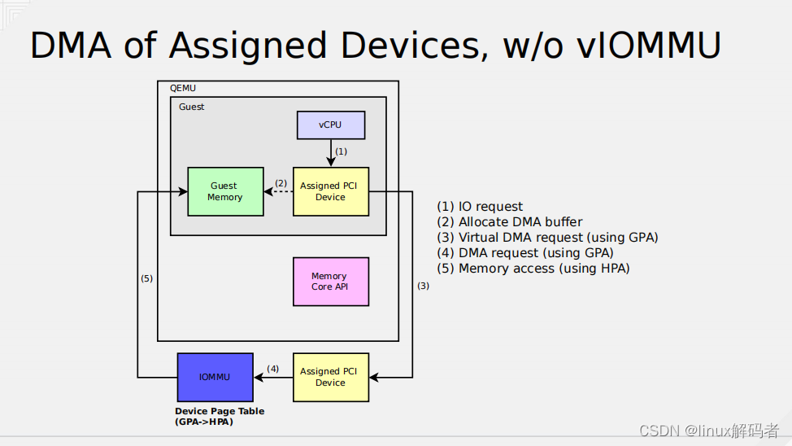

# 没有vIOMMU时

在没有使能vIOMMU时,在Guest中设备使用的是GPA(Guest物理地址),通过VFIO在物理IOMMU中建立起GPA到HPA(Host物理地址)的映射,当设备访问GPA时IOMMU将GPA转换成对HPA的访问.

更详细的例子可以看如下所示:

这里更详细描述步骤:

(1)在Guest中vCPU进行IO请求;

(2)分配DMA buffer,建立DMA映射(GPA->HPA);

(3)设备使用GPA进行虚拟DMA请求;

(4)最终设备使用GPA访问到IOMMU;

(5)IOMMU将GPA转化为HPA,并最终通过HPA访问到内存

# 存在vIOMMU时

在使能vIOMMU时,在Guest中设备使用IOVA通过vIOMMU转化到GPA,此为stage1转换,虽然由vIOMMU实现,但其实还是在物理IOMMU中;GPA由VFIO转化为HPA,此为stage2转换,这也是在物理IOMMU中.

https://blog.csdn.net/flyingnosky/article/details/123831955