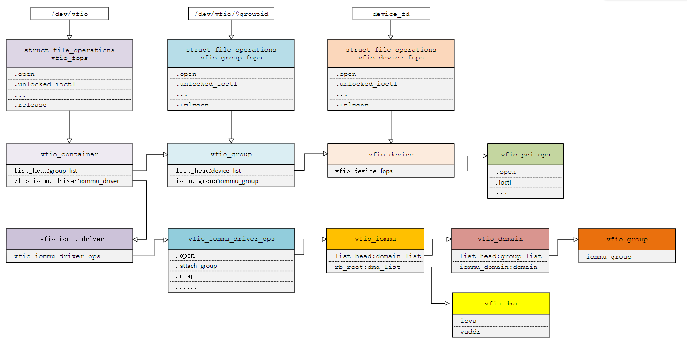

Linux 内核设备驱动充分利用了 "一切皆文件" 的思想, VFIO 驱动也不例外, VFIO 中为了方便操作 **device**, **group**, **container** 等对象, 将它们和对应的设备文件进行绑定.

# 1. vfio_container

VFIO Container 和 VFIO Group 不同.

**VFIO Group** 和 `/dev/vfio/$GROUP` **设备文件**绑定, 每个设备文件唯一对应**一个VFIO Group**, 且**只能打开一次**, 试图第二次打开会返回 `-EBUSY`.

**VFIO Container** 只有一个入口点即`/dev/vfio/vfio`, 每次打开该设备文件, 都将获得一个新的VFIO Container实例.

> **VFIO 驱动**在加载的时候会创建这个名为 `/dev/vfio/vfio` 的文件.

```cpp
// drivers/vfio/vfio.c
static const struct file_operations vfio_fops = {
        ......
        .open           = vfio_fops_open,
        ......
}

static int vfio_fops_open(struct inode *inode, struct file *filep)
{
        struct vfio_container *container;

        container = kzalloc(sizeof(*container), GFP_KERNEL);
        if (!container)
                return -ENOMEM;

        INIT_LIST_HEAD(&container->group_list);
        init_rwsem(&container->group_lock);
        kref_init(&container->kref);

        filep->private_data = container;

        return 0;
}
```

```cpp
// qemu
s->container = open("/dev/vfio/vfio", O_RDWR);
```

VFIO Container 本身具备的功能微乎其微, 只有三个ioctl:

* `VFIO_GET_API_VERSION`, 返回VFIO_API_VERSION(目前版本号为0)
* `VFIO_CHECK_EXTENSION`, ext, 返回1表示支持该extension(ext), 返回0表示不支持
* `VFIO_SET_IOMMU`, type, 设置 **IOMMU Driver** 为 type 类型, 在调用该 ioctl 前**必须至少挂载一个 VFIO Group**
  * 本质上只有**两种类型**, 即 **Type1 IOMMU** 和 **sPAPR IOMMU**, 前者代表 x86,ARM 等架构上的 IOMMU, 后者代表 POWER 架构上的 IOMMU
  * 我们只关心 **Type1 IOMMU**, 它又细分为 `VFIO_TYPE1_IOMMU`,`VFIO_TYPE1v2_IOMMU` 和 `VFIO_TYPE1_NESTING_IOMMU`, 一般来说用 `VFIO_TYPE1v2_IOMMU` 即可
  * 所有的 type 都可以作为 VFIO_CHECK_EXTENSION 的参数, 检查内核是否支持该类型, 用户应该先检查是否支持该类型再设置 IOMMU Driver

https://tcbbd.moe/linux/qemu-kvm/vfio/#Overview

# 2. vfio_group

当我们把一个设备直通给虚拟机时, 首先要做的就是将这个设备从 host 上进行解绑, 即**解除 host 上此设备的驱动**, 然后**将设备驱动绑定**为 "`vfio-pci`", 在完成绑定后会新增一个 `/dev/vfio/$groupid` 的文件, 其中 `$groupid` 为此 PCI 设备的 **iommu group id**, 这个 id 号是在操作系统加载 iommu driver 遍历扫描 host 上的 PCI 设备的时候就已经分配好的, 可以使用 `readlink -f /sys/bus/pci/devices/$bdf/iommu_group` 来查询.

类似的, `/dev/vfio/$groupid` 这个文件的句柄被关联到 **vfio_group** 上, **用户态进程**打开这个文件就可以**管理这个 iommu group 里的设备**.

```
# ll /dev/vfio/
total 0
drwxr-xr-x  2 root root       80 9月   8 02: 47 ./
drwxr-xr-x 18 root root     4580 9月   8 02: 47 ../
crw-------  1 root root 244,   0 9月   8 02: 47 21
crw-rw-rw-  1 root root  10, 196 9月   8 02: 37 vfio

# ll /sys/bus/pci/devices/0000\: 01\: 00.0/iommu_group
lrwxrwxrwx 1 root root 0 9月   8 02: 37 /sys/bus/pci/devices/0000: 01: 00.0/iommu_group -> ../. ./. ./. ./kernel/iommu_groups/21/
# readlink -f /sys/bus/pci/devices/0000\: 01\: 00.0/iommu_group
/sys/kernel/iommu_groups/21
```

# 3. device

然而 VFIO 中并**没有**为**每个 device** 单独创建一个文件, 而是通过 `VFIO_GROUP_GET_DEVICE_FD` 来调用这个 group ioctl 来**获取 device 的句柄**, 然后再通过这个句柄来管理设备.

> VFIO_GROUP_GET_DEVICE_FD: vfio 从 group->device_list 中查找device, 并通过匿名node和fd建立关系

# 4. vfio_iommu_driver

VFIO 框架中很重要的一部分是要完成 **DMA Remapping**, 即为 **Domain** 创建对应的 **IOMMU 页表**, 这个部分是由 `vfio_iommu_driver` 来完成的.

**vfio_container** 包含一个指针记录 **vfio_iommu_driver** 的信息, 在 x86 上 `vfio_iommu_driver` 的具体实现是由 **vfio_iommu_type1** 模块来完成的.

```cpp
struct vfio_container {
        struct kref                     kref;
        struct list_head                group_list;
        struct rw_semaphore             group_lock;
        struct vfio_iommu_driver        *iommu_driver;
        void                            *iommu_data;
        bool                            noiommu;
};
```

```
│ Symbol: VFIO_IOMMU_TYPE1 [=y]
│ Type  : tristate
│ Defined at drivers/vfio/Kconfig:2
│   Depends on: VFIO [=y]
│ Selected by [y]:
│   - VFIO [=y] && MMU [=y] && (X86 [=y] || S390 || ARM || ARM64)
```

**vfio_iommu_type1** 模块包含了 `vfio_iommu`, `vfio_domain`, `vfio_group`, `vfio_dma` 等关键数据结构.

```
// drivers/vfio/vfio_iommu_type1.c
vfio_iommu : struct
vfio_domain : struct
vfio_dma : struct
vfio_batch : struct
vfio_iommu_group : struct
vfio_iova : struct
vfio_pfn : struct
vfio_regions : struct
```

* **vfio_iommu** 可以认为是和 **container** 概念相对应的 iommu 数据结构, 在虚拟化场景下**每个虚拟机的物理地址空间**映射到一个 `vfio_iommu` 上.

* **vfio_group** 可以认为是和 **group** 概念对应的 iommu 数据结构, 它指向一个 `iommu_group` 对象, 记录了着 `iommu_group` 的信息.

* **vfio_domain** 这个概念尤其需要注意, 这里绝**不能**把它理解成**一个虚拟机 domain**, 它是一个与 **DRHD**(即 IOMMU 硬件)相关的概念, 它的出现就是**为了应对多 IOMMU 硬件的场景**, 我们知道在大规格服务器上可能会有**多个 IOMMU 硬件**, 不同的 IOMMU **硬件有可能存在差异**, 例如 IOMMU 0 支持 `IOMMU_CACHE`, 而 IOMMU 1 不支持 IOMMU_CACHE(当然这种情况少见, 大部分平台上硬件功能是具备一致性的), 这时候我们**不能**直接将分别**属于不同 IOMMU 硬件管理的设备**直接加入到**一个 container** 中, 因为它们的 IOMMU 页表 SNP bit 是不一致的. 因此, 一种合理的解决办法就是把**一个 container** 划分**多个 vfio_domain**, 当然在大多数情况下我们只需要一个 vfio_domain 就足够了. 处在**同一个 vfio_domain 中的设备共享 IOMMU 页表区域**, 不同的 vfio_domain 的页表属性又可以不一致, 这样我们就可以支持跨 IOMMU 硬件的设备直通的混合场景.

```
# ll /sys/class/iommu/
total 0
drwxr-xr-x  2 root root 0 Sep 19 09: 09 ./
drwxr-xr-x 76 root root 0 Sep 19 09: 09 ../
lrwxrwxrwx  1 root root 0 Sep 19 09: 09 dmar0 -> ../. ./devices/virtual/iommu/dmar0/
lrwxrwxrwx  1 root root 0 Sep 19 09: 09 dmar1 -> ../. ./devices/virtual/iommu/dmar1/
```

# 5. 小结

经过上面的介绍和分析, 我们可以把 VFIO 各个组件直接的关系用下图表示.




对这些的用户态代码可以看 qemu 或 kvmtool(更简单)


