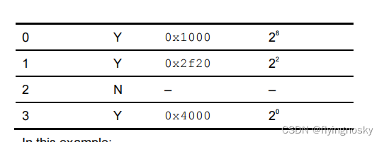

SMMU使用内存中一组数据结构来放置转换数据.寄存器指向初始根结构STE的基地址.STE包含stage2转换表基地址指针,同时也指向stage1的配置结构,该配置结构包含转换表基指针.CD表示stage1转换,STE表示stage2转换.

因此SMMU使用两组明确的结构:

1. 配置结构,用来将事务的streamID映射到转换表的基地址,配置以及转换表访问的上下文;
2. 转换表的结构,用来表示stage1和stage2的VA到IPA和IPA到PA的转换;

对于即将到来的事务的转换,首先找到事务的配置(通过StreamID来区分,可选择性的使用SubstreamID),然后使用配置来找到转换的地址.

处理即将到来的事务的第一步是找到STE,它告诉SMMU它需要的其他配置.

概念上,STE描述一个client设备是在stage1或stage2或两个阶段.多个设备可以关联到一个虚拟机里,所以多个STE可以共享stage2的转换表.类似的,多个设备可能共享stage1配置,因此多个STE可以共享CD.

1. Stream表的查找

即将到来的事务的StreamID可以定位到STE.Stream表支持两种形式.形式是有Stream表的基地址寄存器设置的.StreamID需要被检查,如果StreamID选择的entry超过配置表的内容或范围,事务会被终止,可以看SMMU_STRTAB_BASE_CFG和C_BAD_STREAMID.当两个安全状态都支持时(SMMU_S_ID R1.SECURE_IMPL=1),事务使用SEC_SID标识事务,共安全和非安全的SMMU编程接口,看3.10.1 章节.这决定了是安全或非安全stream表被使用.

1.1 线性stream表

线性stream表示一组连续的StreamID从0开始标识的STE.大小可配置为2~n.多个STE size可以达到SMMU硬件支持的最大StreamID bit.所有的SMMU实现都支持线性stream表格式.

1.2 两级stream表

一个两级stream表结构提包括一个指向多个二级表的一级表,二级表包含一组线性的STE.整个结构体的覆盖StreamID的范围可配置为SMMU支持的最大,但二级表不必全部填充,每个大小可能不一样.这样可以节约内存和避免要求为大的streamID空间分配大的连续物理内存.

第一级表由`StreamID[n:x]`标识,其中n表示StreamID最高bit位,x表示SMMU_STRTAB_BASE_CFG.SPLIT指示的配置split指针.第二级表由`streamID[x-1:0]`标识,依赖于每个表的范围.

可通过SMMU_IDR0.ST_LEVEL域来决定第二级Stream表的格式.当支持第二级Stream表时,split可取6,8,10bit.实现可以只支持线性Stream表格式,或线性以及二级格式都支持.

支持超过64StreamID的SMMU必须支持二级stream表.

NOTE: 支持少于64 StreamID的实现也可以支持二级stream表,但通常不这样用因为用一个二级表就可以满足这种情况的所有streams.

NOTE:规则意味着当线性STREAM表的最大size过大而不能放置入4K页时,实现需要支持二级表.

第一级描述符包含共StreamID相关的第二级表,每个描述符可以标识为无效.

图3.2描述了第一级表,split设置为8:

在这个例子中:

1. 表示了StreamID 0~1023,虽然并不是所有的都有效;
2. 一组在0x1000的STE(0~255)被配置(每个可单独使能相关的StreamID);
3. 一组在0x2f20的STE(256~259)被配置;
4. StreamID 512~767无效;
5. StreamID 768在0X4000;

Split=8 的二级表可以减少连续内存的使用.若完全的256个PCIE bus都支持时,RID或SID为16位.但是,通常每个物理链路有一个PCIE bus,每个PCIE bus可能存在一个设备,在最坏的情况下有效的StreamID为256 StreamID.

或者,split=6提供了64个二级STE,使每个二级表使用4K页.

https://blog.csdn.net/flyingnosky/article/details/122051399