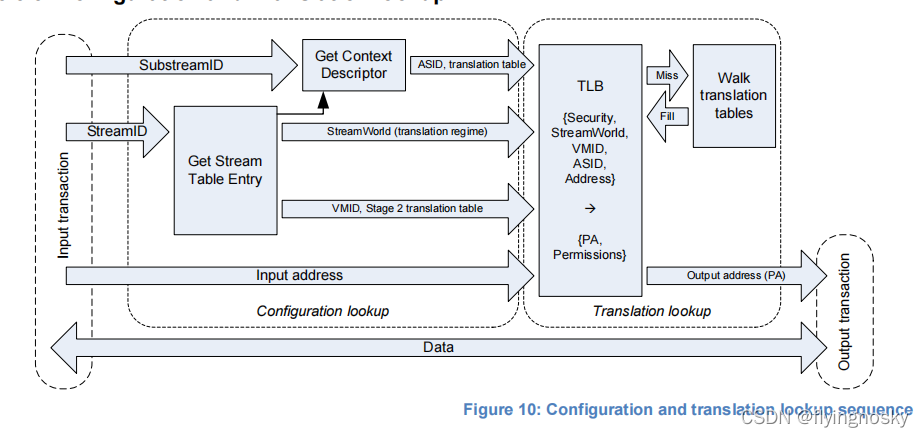

SMMU使用内存中一组数据结构来放置转换数据.寄存器指向初始根结构STE的基地址.STE包含stage2转换表基地址指针,同时也指向stage1的配置结构,该配置结构包含转换表基指针.CD表示stage1转换,STE表示stage2转换.

因此SMMU使用两组明确的结构:

1. 配置结构,用来将事务的streamID映射到转换表的基地址,配置以及转换表访问的上下文;
2. 转换表的结构,用来表示stage1和stage2的VA到IPA和IPA到PA的转换;

对于即将到来的事务的转换,首先找到事务的配置(通过StreamID来区分,可选择性的使用SubstreamID),然后使用配置来找到转换的地址.

处理即将到来的事务的第一步是找到STE,它告诉SMMU它需要的其他配置.

概念上,STE描述一个client设备是在stage1或stage2或两个阶段.多个设备可以关联到一个虚拟机里,所以多个STE可以共享stage2的转换表.类似的,多个设备可能共享stage1配置,因此多个STE可以共享CD.

1. Stream表的查找

即将到来的事务的StreamID可以定位到STE.Stream表支持两种形式.形式是有Stream表的基地址寄存器设置的.StreamID需要被检查,如果StreamID选择的entry超过配置表的内容或范围,事务会被终止,可以看SMMU_STRTAB_BASE_CFG和C_BAD_STREAMID.当两个安全状态都支持时(SMMU_S_ID R1.SECURE_IMPL=1),事务使用SEC_SID标识事务,共安全和非安全的SMMU编程接口,看3.10.1 章节.这决定了是安全或非安全stream表被使用.

1.1 线性stream表

线性stream表示一组连续的StreamID从0开始标识的STE.大小可配置为2~n.多个STE size可以达到SMMU硬件支持的最大StreamID bit.所有的SMMU实现都支持线性stream表格式.

1.2 两级stream表

一个两级stream表结构提包括一个指向多个二级表的一级表,二级表包含一组线性的STE.整个结构体的覆盖StreamID的范围可配置为SMMU支持的最大,但二级表不必全部填充,每个大小可能不一样.这样可以节约内存和避免要求为大的streamID空间分配大的连续物理内存.

第一级表由`StreamID[n:x]`标识,其中n表示StreamID最高bit位,x表示SMMU_STRTAB_BASE_CFG.SPLIT指示的配置split指针.第二级表由`streamID[x-1:0]`标识,依赖于每个表的范围.

可通过SMMU_IDR0.ST_LEVEL域来决定第二级Stream表的格式.当支持第二级Stream表时,split可取6,8,10bit.实现可以只支持线性Stream表格式,或线性以及二级格式都支持.

支持超过64StreamID的SMMU必须支持二级stream表.

NOTE: 支持少于64 StreamID的实现也可以支持二级stream表,但通常不这样用因为用一个二级表就可以满足这种情况的所有streams.

NOTE:规则意味着当线性STREAM表的最大size过大而不能放置入4K页时,实现需要支持二级表.

第一级描述符包含共StreamID相关的第二级表,每个描述符可以标识为无效.

图3.2描述了第一级表,split设置为8:

在这个例子中:

1. 表示了StreamID 0~1023,虽然并不是所有的都有效;
2. 一组在0x1000的STE(0~255)被配置(每个可单独使能相关的StreamID);
3. 一组在0x2f20的STE(256~259)被配置;
4. StreamID 512~767无效;
5. StreamID 768在0X4000;

Split=8 的二级表可以减少连续内存的使用.若完全的256个PCIE bus都支持时,RID或SID为16位.但是,通常每个物理链路有一个PCIE bus,每个PCIE bus可能存在一个设备,在最坏的情况下有效的StreamID为256 StreamID.

或者,split=6提供了64个二级STE,使每个二级表使用4K页.

STE包含每个stream的配置:

1. 是否使能来之设备的流量;
2. 是否是stage1转换;
3. 是否是stage2转换
4. 哪个数据结构定位到stage1的转换表
若使用stage1,STE使用域STE.S1ContextPtr来指示内存中的一个或多个CD的地址.

CD关联起streamID和stage1转换表基指针(转换VA到IPA),基于stream的配置以及ASID.若使用SubStreamID,多个CD表示多个stage1的转换,每个SubstreamID指向一个.当stage1转换没有使能时SubStreamID指向的事务会被终止.

如果使用stage2,STE包含stage2转换表基指针(将IPA转换为PA)和VMID.如果多个设备都与某个特定的虚拟机相关,这意味着他们共享stage2转换表.多个STE可能都映射到同一个stage2转换表.

NOTE: ARM期望当hypervisor软件存在时,hypervisor管理stream表和stage2转换表.CD和stage1的转换表由guest OS来管理.另外,hypervisor可以充分使用stage1转换来实现自己的内部目的.当不使用hypervisor时,单个OS管理stream表和CD.要了解更多,可查章节3.6.

当事务带SubstreamID时,配置使能substreams,SubstreamID标识了选择stage1转换上下文的CD.在这个配置中,若substreamID没有使用时,行为依赖于STE.S1DSS标志:

1. 当STE.S1DISS=0b00,所有在事务需要携带SubstreamID,缺少SubstreamID意味着错误.当事务不带SubstreamID会被abort并event会被记录.
2. 当STE.S1DISS==0b01时,事务不带SubstreamID可被接受且被看作它的配置是stage1 bypass.仅当事务携带SubstreamID时才会使能stage1转换.
3. 当STE.S1DISS=0B10时,事务不带SubstreamID被接受且使用substream=0的CD.在这个配置下,带SubstreamID=0的事务被abort且event被记录.

CD和STE结构中的ASID和VMID用来tag TLB条目(这些条目是由CD和STE的配置来创建的).这些tag用来查找和区分不同stream的地址空间的转换,或匹配接收到broadcast TLB操作的无效化项.实现可能使用这些tag来有效的允许不同的stream共享不同的转换表.

图6给出了一个例子,配置中StreamID用来选择线性Stream表中的STE.STE指向stage2的转换表和一个stage1配置的单个CD.然后CD指向stage1的转换表.

图7给出了一个配置中STE指向多个CD.SubstreamID用来选择CD中的一个并且SubstreamID决定一个事务使用哪个stage1转换.

图8给出了一个更复杂的情况,使用多级stream表.两个STE分别指向单个CD,第三个CD指向多级CD表.使用多级,在不需要很大的连续物理表的情况下可以支持多个streams和substream.

即将来的事务处理如下步骤:

(1)如果SMMU全局disable(比如SMMU_CR0.SMMUEN=0),事务会pass through SMMU且无任何地址修改.全局属性,如内存类型或共享型,被应用到SMMU的SMMU_GBPA寄存器.或者SMMU_GBPA寄存器可以被配置为abort所有的事务.

(2)若步骤(1)中的全局bypass没有使用时,

a. STE被定位到;

b. STE使能stage2事务,STE包含stage2的转换表基地址;

c. STE使能stage1事务,CD被定位到.若STE使能stage2转换,从使用stage2转换表中的IPA空间取出CD.否则从PA空间取出CD.

(3)若配置有效,发起转换:

a. 若stage1被配置为转换,CD包含转换表基地址.若STE的stage2被使能时要求进行stage2转换.否则stage1跳过转换,输入地址直接到stage2;

b. 若stage2被配置为转换,STE包含发起nested walked的stage1转换表(若使能),或IPA的正常walk.否则,stage2跳过转换,stage2的输入地址被作为输出地址.

(4)具有有效的配置的事务在转换过程中没有fault时,会有输出的地址(内存属性).

NOTE: 上述时序描述了非安全stream的路径.若支持两个安全状态时,安全状态的事务也类似,除了SMMU_S_CR0.SMMUEN和SMMU_S_GBPA控制bypass,stage2不支持.

这些步骤要求实现能够缓存数据.章节16.2描述了配置和转换结构的缓存.

此外,event可能发生在处理过程中的多个阶段,以此来阻止进一步处理.若事务不能找到有效的配置或者遇到不支持的类型,它将以abort终止,并event被记录.如果事务进展到转换阶段,fault可能在转换的任一阶段产生.CD和STE特有的配置用来决定事务是否终止或是否stall,暂缓软件fault解决,看章节3.12.

使用VA到IPA或IPA到PA来描述两个阶段转换.

NOTE: 一些涉及到SMMU输入的系统使用BA.术语VA重点表示SMMU的输入,也可能与PE进程的虚拟地址空间一样.

若没有特别说明,转换表和他们的配置域与ARMV80A PE的转换系统一样.

若SMMU没有实现两个阶段的任一阶段,它会配置为固定bypass转换.还有其他的限制,比如,配置一个不存在的stage是无效的.SMMU至少支持一个转换stage.

3. 配置和转换的查找

图中 描述了配置查找和转换查找所涉及的相关概念。

        正如3.3.2中所描述的，传入的事务首先受配置查找的约束，而SMMU决定怎样开始进行事务的转换。这涉及到找到合适的STE，如果有必要也需要CD。

        配置的查找不依赖于输入的地址，它取决于：

SMMU全局寄存器的配置；
传入事务的StreamID;
传入事务的SubstreamID（如果有应用）
        配置查找的结果是找到转换的stream或substream相关的配置，包括：

stage1 转换表的基指针，ASID，以及用于修改的转换表解析或walk的属性（比如转换粒度）；
Stage2转换表的基指针，VMID，以及用于修改的转换表解析或walk的属性；
stream相关的属性，如stream相关的streamworld（异常级别，转换区域）。
        转换查找过程逻辑上与PE侧内存地址转换系统工作一样。输出给系统的是物理地址，它取决于：

输入地址；
StreamWorld（安全状态和异常级别），ASID和VMID（由前一级来提供）
        上图呈现在转换查找中被用到的TLB。ARM希望SMMU使用TLB来缓存转换而不是对每个事务都进行TTW，但不是强制的。

        NOTE：为了清楚起见，图3.7没有呈现错误上报路径或从stage2转换获取CD（这也需要访问TLB或TTW）。实现可以选择上述一些步骤的flatten或组合，但需要保持相同行为。

        缓存的事务与标明转换区域的streamworld相关联。Streamworld相当于PE中的异常级别。

        事务的streamworld是由插入转换的配置决定的。缓存的转换的streamworld由STE的安全状态决定，STE.Config域/STE.STEW域/SMMU_CR2.E2H或SMMU_S_CR2.E2H配置。可以查看章节 5.2 stream table entry中的STE.STRW域。

        除了插入到TLB外，Streamworld影响TLB的查找，TLB无效化的不同类型的范围。SMMU的实现不要求区分EL2和EL2-E2H的缓存转换。

        对于TLB无效化行为，查看章节3.17 TLB tagging, VMIDs, ASIDs and participation in broadcast TLB maintenance。

每个转换与以下streamworld相关：

NS-EL1 在PE侧，等同于非安全的EL1

NS-EL2 等同于非安全的EL2（当E2H没有使用时，不带ASID）

NS-EL2-E2H 等同于非安全的EL2（当E2H使用时，带ASID）

EL2 等同于非安全的EL2（(当E2H没有使用时，不带ASID）
EL2-E2H 等同于安全的EL2（当E2H使用时，带ASID）
        Secure 等同于以下其一：1. 当运行在AArch32 EL3时，单个转换区域被安全EL1和安全EL3使用；2. 当运行在AArch64 EL3时，安全EL1；区域要求AISD，若支持安全stage2，需要VMID.

EL3 等同于AArch64 EL1和EL3

        NOTE：在SMMU中Streamworld能够区分不同的转换区域，不同的转换区域与在不同异常级别的不同软件相关。比如，在安全EL3下对地址0X1000的转换与在非安全EL2下对地址0x1000的转化是不同的。通常，ARM期望为stream配置的streamworld，能够匹配软件控制stream或device的异常级别。

        术语“any-EL2”用来描述NS-EL2和S-EL2的共同行为。术语“any-EL2-E2H”用来描述NS-EL2-E2H和S-EL2-E2H的共同行为。

   在ARMV8-A 的MMU也同样，若定义了独一无二的输入参数{streamworld, VMID,ASID,Address}，那么转换也是唯一的。

比如，下列是唯一的且可以在转换缓存中存在：

带相同的地址，但不同的ASID的条目；
带相同的地址和ASID，但不同的VMID；
带相同的地址和ASID，但不同的streamworld；
架构上，由streamID和substreamID来区分，转换时不唯一的。这会引起两个结果？：

一组事务的输入参数{streamID, substreamID}的转换时不唯一的。两个stream可以被配置为相同的转换配置，从配置查找中生成的ASID/VMID可以区分一组共享的转换缓存条目；
多个streamID/substreamID配置可能导致相同的ASID/VMID/streamworld配置，这时它必须维护能够影响TLB查找的相同配置。比如，两个stream，都配置为stage1，NS-EL1且AISD=3，这两stream必须使用相同转换表基地址和转换粒度。
在本文档中，术语TLB用来表示转换缓存的概念，由streamworld/VMID/ASID/VA来标识。

SMMU缓存维护命令分为两组：

配置缓存的维护，依赖于streamID和substreamID;
转换缓存的维护，依赖于地址/ASID/VMID/streamworld;
第二组命令直接匹配可能在PE侧有效的广播TLB维护操作。

4 事务的属性：incoming，两阶段转换和overrides

除了地址，size和读写属性，传入的事务还可能带有其他属性，如访问类型（例如对于设备，WB-cached普通内存），共性性（如outer shareable），缓存分配提示，和权限相关的属性，指令/数据，特权和非特权，安全和非安全。部分属性用来检查访问决定转换表的页权限。在通过SMMU，面对系统的一个事务也可能有一组属性，这些属性可能被SMMU影响。

输入属性如何影响系统中的输出属性（与转换表属性和其他配置），这在章节13中描述。

在概念上系统提供输入属性，或者以设备特定的方式定义事务的属性，或在事务输入到SMMU之前由互联以系统特有的方式设置。

作为概述：

（1）权限相关的属性（指令/数据，特权/非特权）和读写属性用来检查转换表的权限，也可能拒绝访问。输入到SMMU的权限相关的属性可能在执行权限检查之前被per-device的基础上覆盖，这通过INSTCG，PRIVCFG和NSCFG STE域。SMMU输出这些属性。

NOTE： 若一个设备不能支持某种类型的traffic，覆盖可能非常有用。

（2）其他属性（内存类型，共享性，缓存hint）旨在对内存系统而不是对SMMU有效，比如，控制事务的缓存查找。输出到内存系统的属性是由用来转换输入地址的转换表描述符制定的属性的function。SMMU通过这个过程传输一个设备输入属性，因此设备可能影响最后的事务访问，且输入属性可能被设备的基础属性如MTCFG/MEMATTR，SHCFG，ALLOCCFG STE域覆盖。当stage1和stage2转换bypass时，被这些域修改的输入属性对输出的访问属性有用，但也可用与stage2的配置，设备sttream可能需要更精细的要求的访问行为，而不是虚拟的全局的stage2的转换表。

STE属性和权限覆盖域（MTCFG/MEMATTR，ALLOCCFG，INSTCFG，PRIVCFG和NSCFG）允许传入的值被使用，对每个域，可选择特定被覆盖的值。如INSTCFG可以配置stream为Always Data，而取代传入的INST属性。但在与设备紧密耦合或嵌入设备的SMMU实现中，传入的属性始终被认为是最合适的。当SMMU和设备保证传入的属性是正确的时，允许SMMU使用传入的值作为属性值。查看SMMU_IDR1.ATTR_TYPES_OVR和SMMU_IDR1.ATTR_PERMS_OVR。对于SMMU，它无法保证从client设备提供的属性一直正确，比如分离式SMMU设计，ARM强烈建议支持传入属性的覆盖。

5 转换表描述符

ARMv8-A VMSA定义stage2 block和页表描述符的 `bits[63:60]` 被SMMU保留使用。在SMMUV3.1和后面的版本，这些bits都被保留。

NOTE：当PBHA bit使能时，`bits[62:60]` 被PBHA机制影响。当PBHA不使能时，之前的定义被使用

https://blog.csdn.net/flyingnosky/article/details/122051399

https://blog.csdn.net/flyingnosky/article/details/122074660

https://blog.csdn.net/flyingnosky/article/details/122095697

https://blog.csdn.net/flyingnosky/article/details/122117310
