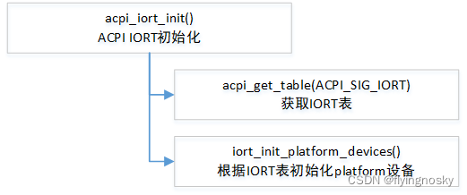

对于SMMUV3驱动,它以platform device驱动加载,而SMMU设备为platform device,根据platform设备驱动模型,当两者匹配时,会触发SMMUV3驱动的probe函数.

本节将介绍SMMU如何作为platform device被分配以及识别.

# IORT中SMMUV3结点

SMMU设备在IORT表中被定义,它定义了SMMU设备的资源,特性以及SPI中断等.IORT描述了用ACPI描述IO设备拓扑,其中SMMUV3结点定义如下所示:

上面表示SMMUV3结点格式,定义了NODE长度,ID映射的数目等.SMMUV3相关的内容如下所示:

其中:(1)Base Address定义了SMMU在基地址;

(2)SMMU相关的标志,定义如下:COHACC Override可以覆盖掉SMMU_IDR0.COHACC;HTTU Override可以覆盖掉SMMU_IDR0.HTTU;Proximity Domain Valid设置为1时Proximity Domain有效.

(3)VATOS address: VATOS基地址,若为0表示不支持;

(4)Model:目前定义的值为各厂商workaround用,保留部分作将来使用;

(5)Event/PRI/Gerr/Sync:分别为支持SPI时的GSIV中断号;

(6)Proximity Domain: SMMUV3设备所在的NUMA NODE;

(7)DeviceID Mapping index: 指向ITS group;

# SMMU设备的分配和识别

对于SMMUV3设备,在ACPI初始化时会遍历IORT结点,并将SMMUV3结点生成platform设备,对该platform设备作相关设置,并最终将其加入到系统中.

## 函数acpi_iort_init()

函数acpi_iort_init()获取IORT表,并根据IORT表初始化SMMUV3所对应的platform device.

## 函数iort_init_platform_devices()

其中函数iort_init_platform_devices()执行如下:

1. 对每个IORT结点进行处理,若IORT结点为RC结点且父结点为SMMUV3时,使能AC
2. 获取dev cfg,当前仅SMMUV3/SMMU/PMCG结点存在设备配置,分别定义在iort_arm_smmu_v3_cfg/iort_arm_smmu_cfg/iort_arm_pmcg_v3_cfg.
3. 分配fwnode_handle,并设置;
4. 分配platform device,作设置,并将加入到系统中;

## 函数iort_add_platform_device()

对于函数iort_add_platform_device(),作如下详细分析:

对于SMMUV3结点,其定义iommu_arm_smmu_v3_cfg,其中:

(1)dev_set_proximity = arm_smmu_v3_set_proximity

根据IORT表SMMUV3结点中proximity domain域设置设备所对应的node;

(2)dev_count_resources = arm_smmu_v3_count_resources

根据IORT表SMMUV3结点中的event_gsiv/pri_gsiv/gerr_gsiv/sync_gsiv域(SPI中断)确定资源的数目.

(3)dev_init_resources = arm_smmu_v3_init_resources

添加MEMORY资源,同时根据定义SPI中断情况申请中断.

(4)dev_dma_configure = arm_smmu_v3_dma_configure

获取DMA范围和大小.

对于该函数用的其他的函数调用,为对platform device的操作:

(1)platform_device_alloc()分配platform device;

(2)Platform_device_add_resources()为platform device增加资源(内存,以及可能SPI中断);

(3)Platform_device_add_data()为platform device添加数据;

(4)Platform_device_add()将platform device添加到系统中;

至此SMMU结点作为platform device被分配和识别,并添加到系统中.

https://blog.csdn.net/flyingnosky/article/details/122442735
