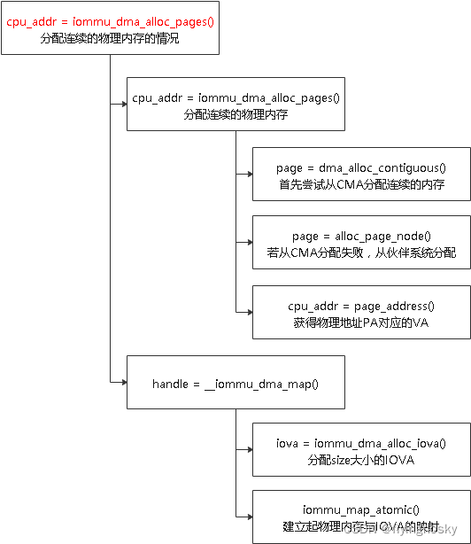

一致性映射也称为静态映射,它与dma_map_*()相关函数另外一个差异为在调用函数dma_map_*()之前已经提前分配好物理内存,只需要建立映射即可;但dma_alloc_coherent()需要分配物理内存并建立映射.由于分配物理内存比较耗时,因此通常需要长期存在的一般用dma_alloc_coherent(),对于需要不停的动态映射和取消映射,一般使用dma_map_*().

与dma_alloc_coherent()相对应的取消静态映射函数为dma_free_coherent().

作用描述:分配size大小的一致性映射,且dma_handle为IOVA地址(IO设备使用),返回地址为VA(CPU使用).

函数执行如下三个路径:

1. 从设备coherent池中分配IOVA和PA,并建立映射;
2. 若没有定义dma_map_ops或dev->dma_ops_bypass = 1,绕过SMMU,分配page,并建立直接映射;
3. 否则经过SMMU,分配page或物理地址PA,分配IOVA,建立起PA和IOVA的映射;

这里暂不对设备coherent池分配IOVA和PA的过程作介绍,我们介绍两个常用的情况:绕过SMMU情况和使能SMMU的情况.

# DMA直接分配的情况

当没有定义dma_map_ops或dev->dma_ops_bypass=1时,表明绕过SMMU,而物理地址PA的分配根据不同的情况也分为如下几种情况:

1. 使能SWIOTLB即软件IOMMU时,分配page,若没有使能REMAP情况时,建立IOVA=PA的映射;否则调用dma_common_contiguous_remap()对非连续的page分配连接的VA;
2. 分配连续page情况,分配page,若没有使能REMAP情况时,建立IOVA=PA的映射;否则调用dma_common_contiguous_remap()对非连续的page分配连接的VA;
3. 通过架构DMA分配情况,根据不同的分配器,进行不同的分配;
4. 通过函数dma_alloc_from_global_coherent()从全局coherent池分配;
5. 通过函数 dma_alloc_from_pool()从coherent pool分配;

# 使能SMMU情况

对于使能SMMU情况时,dma_map_ops被赋予iommu_dma_ops,该结构体成员定义了绝大多数DMA MAP/UNMAP API所对应的回调.这里暂时不全部介绍,仅在使用时再介绍.

对于dma_alloc_coherent()函数,在这种情况下最终调用ops->alloc即iommu_dma_alloc().

整个过程如上所示:

(1)若在定义CONFIG_DMA_REMAP且允许blocking情况下,其实对应的是函数iommu_dma_alloc_remap(),它可以分配多个离散的物理内存的情况,分配连续的IOVA,将多个离散的物理内存与连续的IOVA建立映射;

其中sg_alloc_table_from_pages()将多个离散的物理页组建成sg;

(2)若在定义CONFIG_DMA_REMAP且不允许blocking及设备不coherent情况,其实对应的是函数dma_alloc_from_pool(),从内存池分配物理内存的情况,这里暂不做分析;

(3)其他情况(默认情况),调用iommu_dma_alloc_pages(),分配连续的物理内存,分配连续的IOVA,将连续的物理内存和连续的IOVA建立映射;

这里分配连续物理内存方式有两种,一个是从CMA分配,若失败才从伙伴系统分配.

从上可知,使能SMMU情况基本过程为:分配物理内存(或离散或连续,对应不同的处理方式),分配连续IOVA(在之前的章节中 IOVA框架 中已经介绍),建立物理地址与IOVA之间的映射(后面章节再介绍).不要的差异在于物理内存的分配方式,如下图所示.

https://blog.csdn.net/flyingnosky/article/details/122736189

