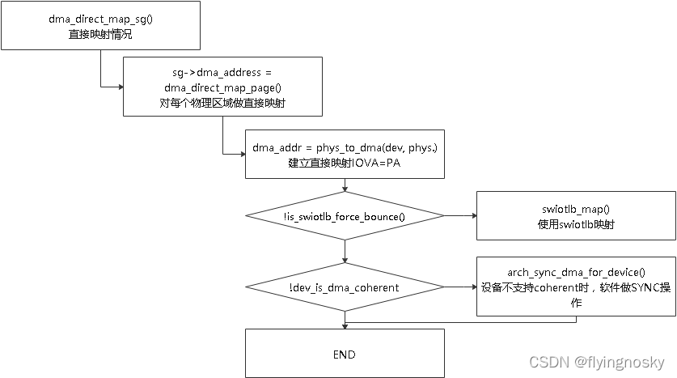
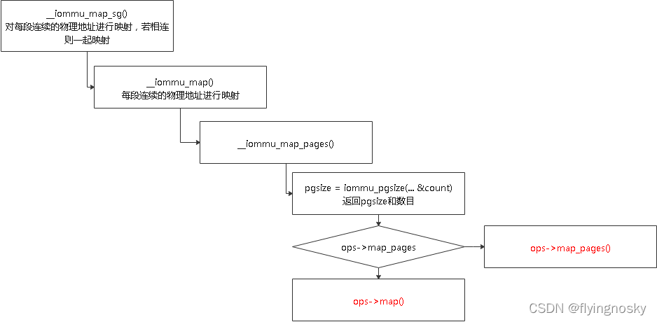

函数dma_map_sg()为流式DMA MAP函数，它将包含多个物理内存区域的SGL映射到连续的IOVA上。与dma_alloc_coherent()相比，它将要映射的物理内存已经分配好，不需要像dma_alloc_coherent()那样在函数中分配，因此速度比dma_alloc_coherent()快，适用于动态分配的场景；另外dma_alloc_coherent()的设备一致性通常通过硬件保证（关CACHE或硬件自动回写/无效化来实现），而dma_map_sg()的设备一致性可以通过硬件保证（硬件自动会写/无效化来实现），在设备不支持一致性时可以通过软件SYNC来保证（代码包含）。

作用：将包含nents个物理内存区域的sgl进行映射，其中dir为方向。

与dma_alloc_coherent()类似，它包含DMA直接映射情况和使能SMMU情况。

在介绍两种情况具体的实现前，对SGL结构体做介绍。

# SGL聚散列表

之前在BLOCK层代码分析（6）IO下发之SGL聚散列表中做过介绍，这里对dma_map_sg()关心的部分再次做介绍。

结构体scatterlist包含从CPU和IO设备角度看到的一块连续的物理内存区域的地址和长度。其中dma_addrss为设备看到的虚拟地址即IOVA，page_link为CPU看到的虚拟地址即VA，length为数据长度，offset为数据在页中的偏移。（当前单个scattherlist表示最多为一页）

而通常使用时会将多个scatterlist链接起来表示多个物理内存区域，分为non-chained SGL和chained SGL，如下图（图中描述正好反了，暂时不改了）。

这里以non-chained SGL来看其物理内存区域：

其实在dma_alloc_coherent()使能SMMU时情况1（定义CONFIG_DMA_REMAP且允许blocking情况）最终将分配SGL来讲多个物理内存区域链接，就是如上情况

# DMA直接映射情况

linux内存页表创建.docx

对每个scattlerlist所对应的区域（这里已分配物理内存）做直接映射：

1. 将物理内存区域的物理地址转化为IOVA，其中IOVA=PA；
2. 若强制支持swiotlb，使用swiotlb进行映射；
3. 若设备不支持coherent，软件通过arch_sync_dma_for_device()做SYNC操作；

# 使能SMMU情况

当使能SMMU时，最终调用iommu_dma_map_sg。流程如下：

操作过程如下：

1. 如果是使用swiotlb情况（后续专门分析该特性），使用函数iommu_dma_map_sg_swiotlb()做映射；
2. 调用函数iommu_dma_sync_sg_for_device()进行软件来SYNC操作，若硬件支持cocherent，不做任何操作，否则调用arch_sync_dma_for_device()进行软件SYNC；
3. 调用函数iommu_dma_alloc_iova()分配IOVA；
4. 调用函数iommu_map_sg_atomic()将sg进行映射，下面在进一步分析该函数；
5. 调用 __finialise_sg() 完成及调整nents数目；

函数iommu_map_sg_atomic()做真正的sg的映射，流程如下：

它会将多个物理内存区域映射到一个连续的IOVA上，若多段物理内存地址相连，一起进行映射。在映射时首先通过pgsize=iommu_pgsize(...&count)获取可以使用的页表大小以及数目，然后根据是否支持映射多页（ops->map_pages），是进行多页映射还是单页映射。

举个例子，假如4K系统，默认支持的页表为4K/2M/1G三种，当要映射3M大小连续物理地址，这时映射过程如下：第一次通过iommu_pgsize()获得pgsize=2M,count=1，传递给ops->map_pages(假如支持)映射；第二次通过iommu_pgsize()获得pgsize=4K, count=256，传递给ops->map_pages(假如支持)映射。

页表的map和map_pages操作后续专门提供章节介绍。

https://blog.csdn.net/flyingnosky/article/details/122744582