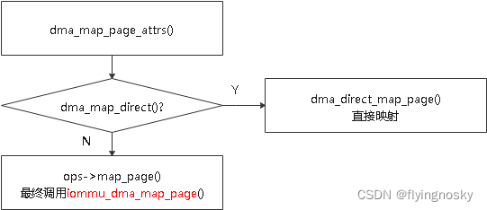
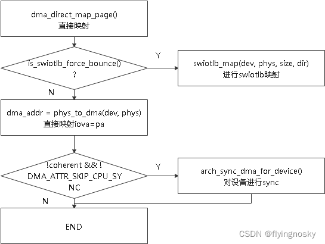
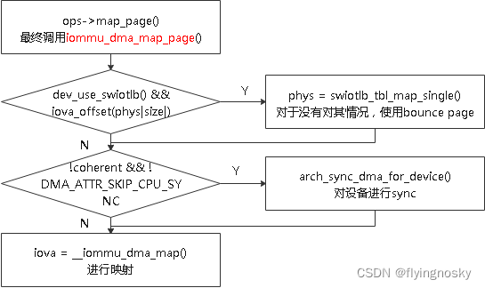

对于函数dma_map_single()和函数dma_map_page(),它们的操作类似,对一块物理内存进行映射,且最终会调用dma_map_page_attrs().它们的差别为,dma_map_single()将一块物理连续内存进行映射,而dma_map_page()将一页物理内存进行映射.

与之前dma_map_sg()类似,同样分为直接映射和使能SMMU情况.

# 1. DMA直接映射情况

与dma_map_sg()类似,dma_map_page_attrs()操作如下:

操作过程如下:

1. 当使用SWIOTLB时,调用swiotlb_map()进行映射;否则执行操作(2);
2. 进行直接映射,调用函数phys_to_dma()让iova=pa;
3. 若设备不支持coherent且没有标记DMA_ATTR_SKIP_CPU_SYNC时,软件进行设备的SYNC;

# 2. SMMU使能情况

对于使能SMMU情况,需要进行DMA映射,如下图所示:

操作过程如下:

对于使用swiotlb情况且物理页没有对齐时,使用bounce_page,并进行初始化;
当设备不支持coherent且没有标记DMA_ATTR_SKIP_CPU_SYNC时,软件进行设备的SYNC;
调用__iommu_dma_map()进行DMA MAP映射.

# 3. DMA MAP API总结

这里介绍三个DMA MAP函数:dma_alloc_coherent() / dma_map_sg() / dma_map_single() / dma_map_page().它们的差异如下:

(1)函数dma_alloc_coherent()为静态DMA,其他三个函数为动态DMA,dma_alloc_coherent()除了进行映射外,该函数还需要分配物理内存,其他三个函数则在函数被调用前已经分配好物理内存.因此通常在数据动态传输时通常使用dma_map_*函数,而dma_alloc_coherent()通常用于系统中长期使用的DMA.

(2)对于dma_map_*这三个函数,区别主要表现在物理内存组织方式上:dma_map_sg()将多个连续物理内存进行映射;dma_map_single()将一块连续的物理内存进行映射;dma_map_page()将一个物理页进行映射;

从前面讲述的DMA MAP API可以看出,DMA MAP基本过程为:分配物理内存,分配连续的IOVA,对物理内存和IOVA进行映射.其中分配物理内存后续可以在内存管理模块做讲解,IOVA的分配在前面的章节已经介绍,对于物理内存和IOVA的映射将在后续的页表的操作进行介绍.

https://blog.csdn.net/flyingnosky/article/details/122849093