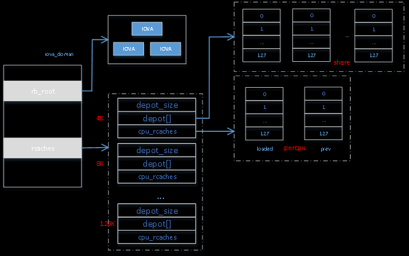

# RCACHE框架介绍

对于**设备**, 其访问的地址称为 **IOVA**(也称 **DMA 地址**), 经过 **SMMU 转换**才是物理地址 PA.

IOVA 的生成和释放是影响性能的重要一环. 在进行一次转换时, 首先会**分配 IOVA**, 然后将 IOVA 及对应的 PA 进行映射, 这样 **CPU 侧**想要操作 PA 对应的数据时使用 **VA**, 而**设备**若访问对应的 PA 的数据时使用 **IOVA**; 在设备不需要使用数据时, 取消 IOVA 和 PA 对应的映射.

* IOVA 的真正**分配**是通过在 **SLAB** 中**分配结构体** `[]`, 并在 IOVA 所在范围里找到一个对齐于 `2^n * 4K` 大小的范围, 并**加入**到 IOVA 的**红黑树** RB TREE 中; 

* IOVA 的真正**释放**是将该 IOVA 从 IOVA 的红黑树 RB TREE 中取出, 并释放对应的结构体.

可以看到, 既需要在红黑树中频繁的查找/添加/删除, 又需要不断的进行SLAB分配和释放. 为了提升性能, 采用 **RCACHE 机制**进行 IOVA 的分配和释放.

RCACHE 机制如下:

* 在申请**分配 IOVA** 时, 首先从 RCACHE 中查找对应的大小的 IOVA, 若存在, 直接返回使用; 若不存在, 才真正去分配IOVA, 并将其放入RB TREE中;

* 在**释放 IOVA** 时, 首先尝试在RCACHE中查找是否存在对应大小IOVA的空闲位置, 若存在, 将要释放的IOVA放于RCACHE中缓存, 若不存在, 才去真正释放, 同时将 IOVA 从RB TREE中删除.

IOVA 的范围由函数 `iommu_dma_init_domain()`(`"drivers/iommu/dma-iommu.c"`) 决定, 可通过 **ACPI 指定**, 但不能为0, 默认在 48 BIT系统中为 `[1 2^48-1]`.

intel, amd 和 virtio iommu 都是 `[0 ~ U64_MAX]`.

# RCACHE相关的结构体

与 RCACHE 相关的结构体如下图所示:

# IOVA分配和释放

IOVA 的分配如下所示:

1. 若 IOVA 的大小超过128K, 需要真正分配IOVA, 走步骤(3), 否则走步骤 (2);
2. 根据 IOVA 的大小找到对应的 RCACHE 结点, 首先检查 **percpu** 中 loaded 链是否存在可用的 IOVA 缓存,若存在返回使用,否则检查prev链是否存在可用的IOVA缓存,若存在返回使用,并交换loaded链和prev链,否则(loaded链和prev链都为空)检查 `depot[]` 是否存在空闲,若存在,将`depot[]`与loaded交换,并从中取空闲IOVA项,否则(loaded/prev/depot都为空)走步骤(3)真正分配IOVA;
3. 从SLAB中分配IOVA,在RB TREE中查找合适的位置,赋值给IOVA,并将其插入到RB TREE中;

IOVA的释放如下所示:

1. 若需要释放的IOVA超过128K,需要真正释放IOVA,走步骤(3),否则走步骤(2);
2. 根据IOVA的大小找到对应的RCACHE结点,首先检查percpu中loaded链是否已满,若未满则将其放对应的缓存中,否则检查percpu中的prev链是否已满,若未满则放到对应链中缓存中,否则(loaded和prev链已满)检查共享缓存 `depot[]`是否已满,若未满则放到`depot[]`中, 否则(loaded/prev/depot都满)分配新的 iova magazine, 将原来的loaded释放,将新的 iova magazine 赋给loaded,从loaded找到空闲位置放置缓存;
3. 在RB TREE中找到对应的IOVA,将其从RB TREE中删除,并释放IOVA;

# IOVA框架存在问题

当前IOVA框架存在问题如下:

1. 最大 IOVA 大小为 128K,超过此大小就会真正分配和释放;
2. 在缓存满时, 会持续分配/释放IOVA,刷新缓存机制不完善;
3. 当缓存满时, RB TREE过大,导致对RB TREE的操作比较花时间;

https://blog.csdn.net/flyingnosky/article/details/116771018