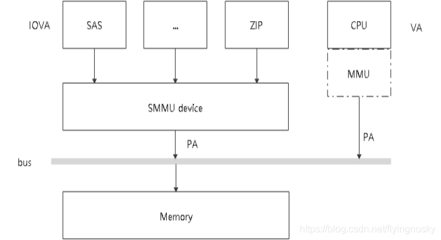
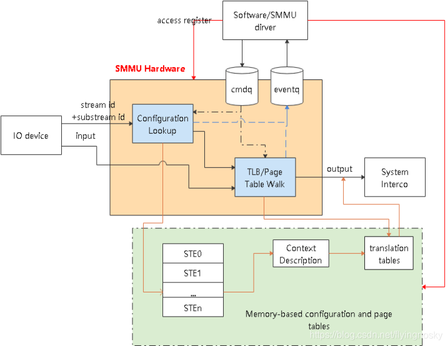

# SMMU在系统中位置和作用

SMMU功能与MMU功能类似,将IO设备的DMA地址请求(IOVA)转化为系统总线地址(PA),实现地址映射,属性转换,权限检查等功能,实现不同设备的DMA地址空间隔离.

# SMMU软硬件交互过程

硬件结构如下图所示:

SMMU处于IO设备和总线之间,负责将设备的输入IOVA转化为系统总线的物理地址PA; SMMU硬件包含configuration lookup/TLB/Page Table Walk以及cmdq/eventq等部分,其中configuration lookup部分查找stream id所对应的配置(ste/cd), 最终指向page table基地址等;

SMMU通过configuration lookup找到设备的配置及页表基地址等,然后查询TLB中是否存在输入地址input的映射,如果TLB命中,直接返回输出PA;若TLB没有命中,PTW模块逐级查询页表,找到页表中的映射,输出PA;

软件/SMMU驱动通过CMDQ/EVENTQ进行交互,驱动通过CMDQ发送命令给SMMU硬件(如TLBI/SYNC等);SMMU硬件通过EVENTQ通知驱动有事件需要处理(如设备缺页等) 软件/驱动建立和维护内存中的配置和页表;

https://blog.csdn.net/flyingnosky/article/details/119390849