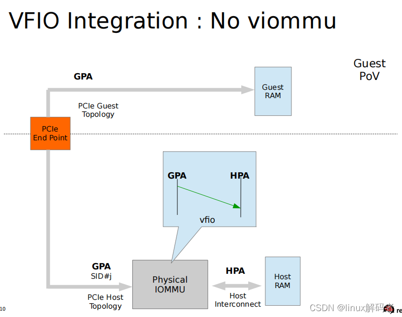
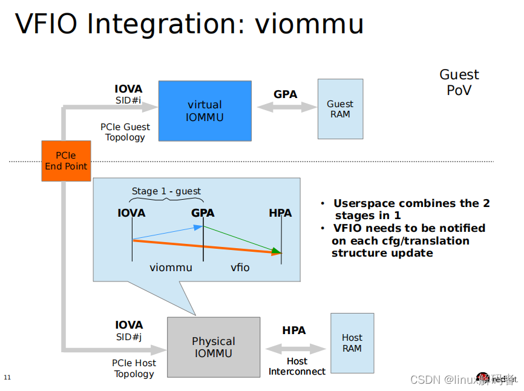

# 没有vIOMMU时

在没有使能 vIOMMU 时, 在 Guest 中**设备**使用的是 **GPA**(Guest物理地址), 通过 **VFIO** 在**物理 IOMMU** 中建立起 **GPA 到 HPA 的映射**, 当设备访问 GPA 时 IOMMU 将 GPA 转换成对 HPA 的访问.

更详细的例子可以看如下所示:

这里更详细描述步骤:

(1) 在 Guest 中 **vCPU** 进行 IO 请求;

(2) **分配 DMA buffer**, 建立 DMA 映射(`GPA -> HPA`);

(3) **设备**使用 **GPA** 进行**虚拟 DMA 请求**;

(4) 最终设备使用 GPA 访问到 IOMMU;

(5) IOMMU 将 GPA 转化为 HPA, 并最终通过HPA访问到内存

# 存在vIOMMU时

在使能 vIOMMU 时, 在 Guest 中**设备**使用 **IOVA** 通过 **vIOMMU** 转化到 **GPA**, 此为 stage1 转换, 虽然由 vIOMMU 实现, 但其实还是在物理IOMMU中; GPA由VFIO转化为HPA, 此为stage2转换,这也是在物理IOMMU中.

https://blog.csdn.net/flyingnosky/article/details/123831955