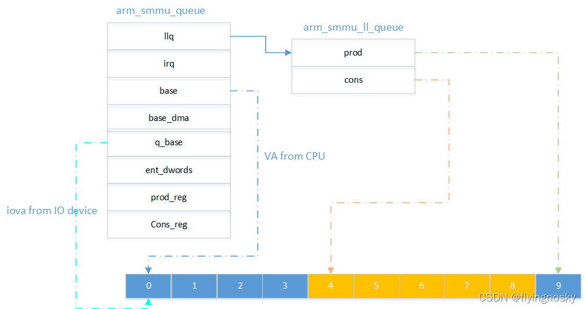
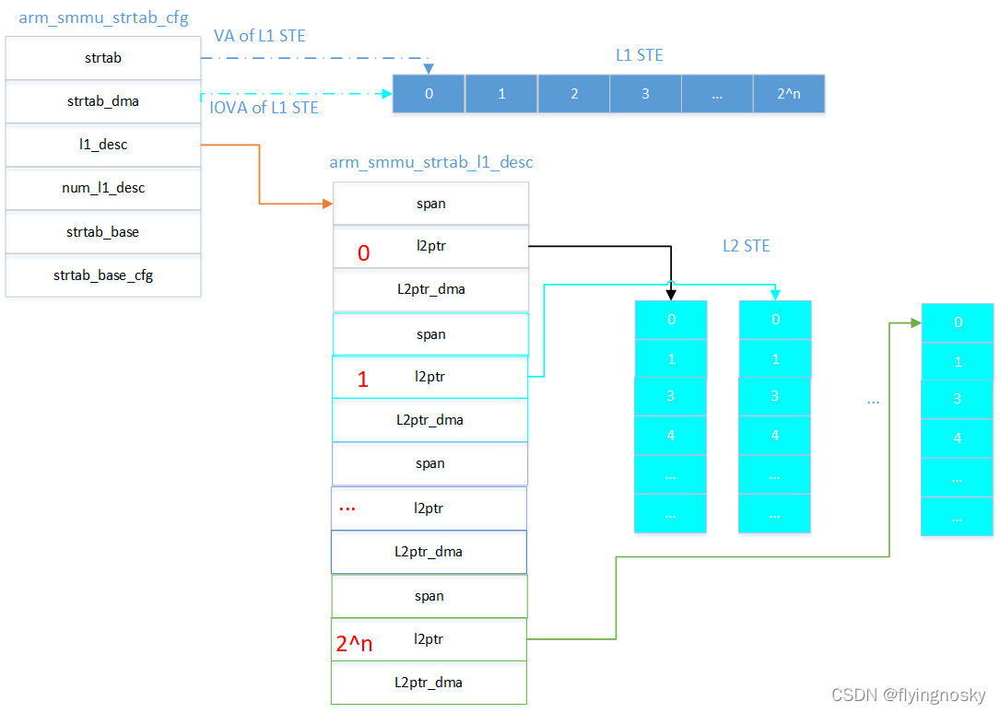

当SMMU设备生成platform device后,加载SMMUV3驱动会触发SMMUV3驱动的probe函数arm_smmu_device_probe(),该函数进行SMMUV3驱动初始化.

总体上SMMUV3驱动初始化流程如下图所示:

它总体上分为以下几个部分:

# 1. 从ACPI或DT表中获取SMMU硬件的信息

使用函数arm_smmu_device_acpi_probe()从ACPI表中(SMMUV3 IORT)获取SMMUV3结点信息;使用函数arm_smmu_device_dt_probe()从DT表中获取SMMUV3结点信息.

这里仅对ACPI方式作介绍.

结构体acpi_iort_smmu_v3获得到的内容即为SMMUV3 IORT表的内容.这里不作重复介绍.

其中arm_smmu_get_option()对CAVIUM_CN99XX和HISILICON_HI161X作workaround.同时检查IORT表中是否设置COHACC_OVERRIDE标志,若设置则使能COHERENCY特性.

这里简单对硬件SMMU的COHERENCY特性作介绍.

借用网上的一张图作描述:CPU与内存交互数据时,为提高性能,一般会有CACHE作缓存,当对内存进行写时,会先写到CACHE中,再根据CACHE类型作WRITE THROUGH或WRITEBACK;当对内存进行读时,会先从CACHE中读取;而IO设备与内存中,是通过DMA进行交互,没有类似CACHE的东西.

这样就存在问题:当对内存进行读时,可能内存中的数据并不是最新的,这时需要软件或硬件将CACHE中的数据同步到内存中;当对内存进行写时,可能内存中的数据与CACHE中数据不一致,这时需要软件或硬件将CACHE中的数据无效化,这样才能保证数据的一致性.而在这个过程中在读时将CACHE数据同步到内存中,在写时将CACHE中的数据无效化的操作由硬件来做,即硬件支持COHERENCY即一致性,否则需要软件来做.

# 2. SMMUV3硬件资源的获取

这里SMMUV3驱动获取SMMU的硬件资源,包括内存资源,中断资源.

驱动获取内存资源,并对内存资源作IO映射,获取到SMMU的寄存器,驱动与SMMU可以通过寄存器进行软硬件交互.

这里中断资源为IORT表中的SPI中断,这里是可选的,若支持MSI,不需要在IORT表中指定SPI中断,若不支持MSI,从IORT表中获取SPI中断号.

# 3. SMMUV3硬件及软件能力的获取

在函数arm_smmu_device_hw_probe()通过读取SMMU寄存器获取SMMU的硬件能力和软件能力.这里列出特性以及简单描述.

<table style="width:100%">
<caption>Description</caption>
  <tr>
    <th>
    特性
    </th>
    <th>
    描述
    </th>
  </tr>
  <tr>
    <td>
    ARM_SMMU_FEAT_2_LVL_STRTAB
    </td>
    <td>
    支持二级STE
    </td>
  </tr>
  <tr>
    <td>
    ARM_SMMU_FEAT_2_LVL_CDTAB
    </td>
    <td>
    支持二级CD
    </td>
  </tr>
  <tr>
    <td>
    ARM_SMMU_FEAT_TT_LE
    </td>
    <td>
    支持转换表小端
    </td>
  </tr>
  <tr>
    <td>
    ARM_SMMU_FEAT_TT_BE
    </td>
    <td>
    支持转换表大端
    </td>
  </tr>
  <tr>
    <td>
    ARM_SMMU_FEAT_PRI
    </td>
    <td>
    支持PRI页请求(PCIE)
    </td>
  </tr>
  <tr>
    <td>
    ARM_SMMU_FEAT_ATS
    </td>
    <td>
    支持ATS地址转换服务(PCIE)
    </td>
  </tr>
  <tr>
    <td>
    ARM_SMMU_FEAT_MSI
    </td>
    <td>
    支持MSI中断
    </td>
  </tr>
  <tr>
    <td>
    ARM_SMMU_FEAT_SEV
    </td>
    <td>
    当队列由满到非满时触发WFE唤醒事件
    </td>
  </tr>
  <tr>
    <td>
    ARM_SMMU_FEAT_HYP
    </td>
    <td>
    支持hypervisor stage1
    </td>
  </tr>
  <tr>
    <td>
    ARM_SMMU_FEAT_E2H
    </td>
    <td>
    支持host OS运行在EL2
    </td>
  </tr>
  <tr>
    <td>
    ARM_SMMU_FEAT_STALLS
    </td>
    <td>
    支持STALL模式
    </td>
  </tr>
  <tr>
    <td>
    ARM_SMMU_FEAT_STALL_FORCE
    </td>
    <td>
    强制支持STALL模式
    </td>
  </tr>
  <tr>
    <td>
    ARM_SMMU_FEAT_TRANS_S1
    </td>
    <td>
    支持stage1转换
    </td>
  </tr>
  <tr>
    <td>
    ARM_SMMU_FEAT_TRANS_S2
    </td>
    <td>
    支持stage2转换
    </td>
  </tr>
  <tr>
    <td>
    ARM_SMMU_FEAT_RANGE_INV
    </td>
    <td>
    支持范围的无效化
    </td>
  </tr>
  <tr>
    <td>
    ARM_SMMU_FEAT_VAX
    </td>
    <td>
    支持虚拟地址扩展
    </td>
  </tr>
  <tr>
    <td>
    ARM_SMMU_FEAT_SVA
    </td>
    <td>
    支持SVA,软件特性
    </td>
  </tr>
</table>

除了上述SMMU软硬件能力外,还会根据寄存器的内容设置SMMU输入地址大小ias,asid/vmid/sid/ssid的位数,command队列/event队列的大小,支持的页表大小,输出地址大小oas.这里不对特性展开介绍,待后面讲到此特性在做详细介绍.

# 4. 建立并初始化内存中SMMU相关的结构体

函数arm_smmu_init_structure()对内存中的结构包括command队列/event队列/PRI队列和STE结构建立并初始化.若不支持,就没必要做初始化.

## 4.1. SMMU环形队列

SMMU的command队列作为输入队列,软件填写命令到command队列,SMMU从环形队列中读取命令并执行命令.Command队列主要用于TLB无效化命令,预取命令以及ATS和PRI相关命令的发送.

SMMU的event队列作为输出队列,SMMU填写event到event队列,软件从event队列中读取event并作响应.Event队列主要用于转换过程中的error和fault的上报.

SMMU的PRI队列暂不介绍

SMMU环形队列的初始化由函数arm_smmu_init_structure()完成.

其中,结构体arm_smmu_queue中irq为若支持SPI中断时命令完成的SPI中断号;base为队列所对应entry的基地址的虚拟地址;base_dma为队列所对应entry的基地址的IOVA地址;q_base为队列的基地址的IOVA地址(最终赋值给SMMU寄存器);ent_dwords为每个entry的大小; prod_reg为PROD寄存器地址;cons_reg为CONS寄存器地址.结构体arm_smmu_ll_queue表示当前队列中的指向的prod和cons index.

如上例中,分配了10个项的队列,其中项4~8表示在使用的,其中cons表示消费者在项4,而prod表示生产者在项9.

函数arm_smmu_init_one_queue()用于建立如上结构,并将llq.prod和llq.cons为0.

## 4.2. STE

STE为Stream Table Entry,用于描述stream(设备)的配置信息.它分为线性STE和二级STE.

### 4.2.1. 线性STE
线性STE为一组连续的STE,由StreamID=0开始,大小2^n大小.但每个STE大小为60byte,当STE数目比较多时,需要分配的连续内存比较大,对于连续内存不够的系统,可能分配比较困难,因此又定义了二级STE,可以节省分配连续内存的大小.

线性STE的初始化由函数arm_smmu_init_strtab_linear()完成.它通过dmam_alloc_coherent()分配包含多个STE的连续内存,返回的VA地址(cfg->strtab)给CPU使用,返回的IOVA地址(cfg->strtab_base)给SMMU使用.对每个STE通过函数arm_smmu_write_strtab_ent()进行STE初始化,这里暂不介绍,在IO设备识别时再对其作详细介绍,这里仅作少许域的介绍.

### 4.2.2. 二级STE

二级STE如下图所示,第一级STE并不指向真实的STE,而是指向第二级STE,第二级STE指向真实的STE且为线性的STE.第一级STE的索引由StreamID[n: SPT]决定,其中SPT由SMMU_STRTAB_BASE_CFG.SPLIT决定.第二级STE的最大数目由 `StreamID[SPT:0]` 决定.

二级STE的初始化由函数arm_smmu_init_strtab_2lvl()执行,但并不会作二级STE全作初始化,该函数仅对二级STE的第一级STE的初始化,其第二级STE的初始化在IO设备被加入时由函数arm_smmu_init_l2_strtab()完成.

# 复位SMMU设备

通过函数arm_smmu_device_reset()复位SMMU设备, 此过程主要是设置SMMU相关寄存器, 对SMMU初始化操作. 在进行寄存器描述之前, 对SMMU相关的寄存器布局做简单介绍. 

## SMMU相关寄存器布局
SMMU相关寄存器布局如下图所示: 

(1) SMMU寄存器分为三部分: page0, page1, pmcg寄存器；

page0寄存器定义基本功能相关；page1定义可选功能VATOS/ECMDQ等；pmcg寄存器定义PMCG模块寄存器；

(2)page0和page1也分为非安全和安全部分, 各32K大小；

其中是否定义page1是由page0中的寄存器决定的；

(3)PMCG寄存器是放在page0中的实现自定义的区域, 还是如上图中放其他位置, 是实现定义的；

## 复位相关的操作

复位过程其实就是根据支持的特性, 进行寄存器的配置, 配置过程如下: 

(1)检查ARM_SMMU_CR0是否设置SMMUEN, 让设置表明已经使能过SMMU, 设置GBPA_ABORT复位, 否则下一步；

(2)清ARM_SMMU_CR0ACK寄存器disable SMMU设备；

(3)设置队列和表内存的属性ARM_SMMU_CR1(设置为inner shareablity 和writeback)

(4)设置ARM_SMMU_CR2, 使能PTM和E2H；

(5) 将STE相关的cfg.strtab_base和cfg.strtab_base_cfg赋值给寄存器(告诉SMMU设备STE表地址和配置)；

(6)使能SMMUEN；

(7)发送CMDQ_P_CFGI_ALL命令无效化缓存中的配置(无效化操作后续专门章节介绍)；

(8)发送CMDQ_OP_TLBI_EL2_ALL&CMDQ_OP_TLBI_NSNH_ALL无效化TLB项；

(9)设置event队列的内存地址/PROD/CONS, 并使能CR0_EVTQEN;

(10)设置PRI队列的内存地址/PROD/CONS, 并使能CR0_PRIQEN;

(11)根据ATS支持情况, 设置CR0_ATSCHK;

(12)通过函数arm_smmu_setup_irqs()设置中断相关: 

disable IRQs；若支持SPI, 注册中断处理函数, 否则支持MSI, 分配MSI中断, 并注册写message函数；注册evtq的中断处理函数, 注册gerror的中断处理函数；ARM_SMMU_IRQ_CTLRACK使能中断；

(13)根据bypass和disable_bypass设置, 设置GBPA_ABORT;

# 注册IOMMU设备

函数iommu_device_sysfs_add()将smmu->iommu注册到sysfs文件系统中；

函数iommu_device_register()将iommu设备添加到iommu_device_list链表中, 并将iommu->ops = arm_smmu_ops;

函数arm_smmu_set_bus_ops()将arm_smmu_ops设置                      pci_bus_type / amba_bustype / platform_bus_type；

其中arm_smmu_ops是IOMMU框架调用底层SMMU的接口, 在后续代码讲解中会对各接口做介绍. 

至此SMMU设备的初始化过程完成, 后面会讲解IO设备是如何跟SMMU设备关联起来的. 

https://blog.csdn.net/flyingnosky/article/details/122463386

https://blog.csdn.net/flyingnosky/article/details/122481517