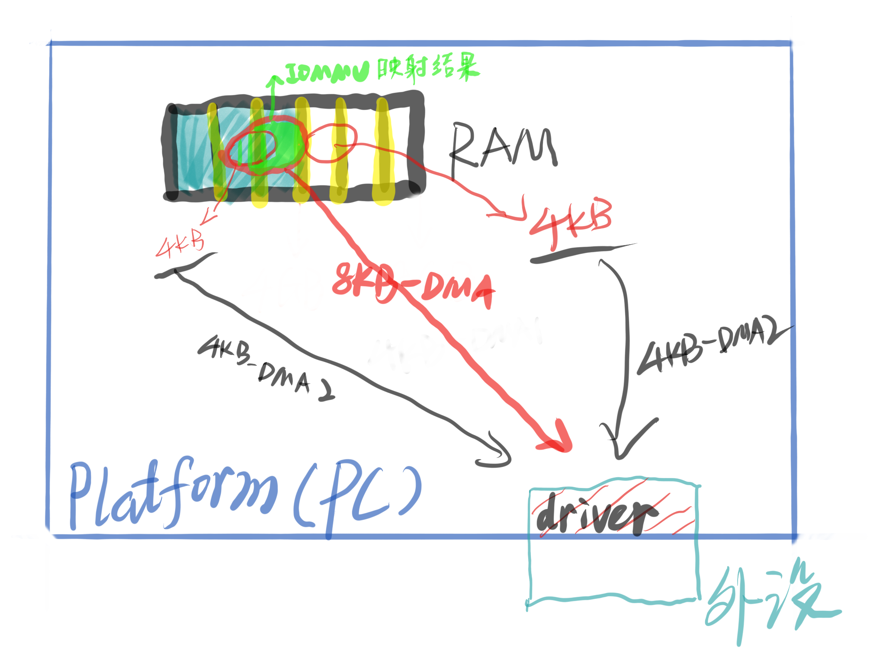

# 虚拟化之前

在虚拟化普及之前, IOMMU 主要提供 2 种功能:
* **避免** `bounce buffers`的功能;
* 创建**连续 DMA 操作**功能.

## Bounce Buffers

如果**外设**的**寻址空间小于平台**(如PC)的寻址空间, 例如外设只支持寻址 4GB 空间, 但是 PC 支持寻址 8GB, 如果 PC 中的**驱动程序**分配了 4GB 以上的空间给设备, 那么设备将无法对该空间执行 DMA 操作.

解决该问题的一种思路就是利用 bounce buffers. Bounce buffers 是**处于较低内存**中的**缓冲区空间**, **外设**可以在其中进行**临时的 DMA 操作**, 操作完成后, 将**结果复制**到驱动程序分配的高地址内存缓冲区中.

但是这种方法会导致效率降低, 因为多了一步复制操作, 当数据量比较大时, 会明显降低数据处理效率.

**IOMMU 为外设提供 IOVA 空间**, **驱动程序**可以通过访问 **IOVA** 来**访问设备空间**, **避免**了 `bounce buffers` 的使用, 提高了数据处理效率.

## Creating contiguous DMA operations

当**驱动**程序使用**多个 buffers** 时, **IOMMU** 可以将这**多个 buffer** 映射成**连续的地址**, 这样方便操作. 例如之前需要对 2 个 4KB 大小的 buffer 进行 2 个 4KB 大小的 DMA 操作, 现在只需要进行 1 个 8KB 大小的 DMA 操作, 提高了效率.

# 虚拟化

这两个功能对于 host 上的高性能 I/O 仍然很重要, 但是从**虚拟化角度**来看, 主要是现代 IOMMU 的隔离功能.

* 在 `PCI-Express` 之前, **不可能**进行**大规模的隔离**, 因为**常规 PCI 不会使用请求设备的 ID**(请求者ID)来**标记 transaction**.  `PCI-X` 包含某种程度的请求者 ID, 但是互连规则使支持的隔离性不完整.

* 使用 **PCIe**, **每个设备**都使用该设备唯一的请求者ID(PCI总线/设备/功能编号, **BDF**)来标记事务, 该**请求者 ID** 用于引用该设备的**唯一IOVA表**.

从“从共享的 IOVA 空间卸载无法访问的内存并整合内存”, 到“每个设备都拥有一个 IOVA 空间”, 我们不仅可以将其用于这些功能(卸载无法访问的内存并整合内存), 还可以限制来自设备的 DMA 访问. 为了**分配给虚拟机**, 现在**只需要**将 **IOVA** 放在 Host 分配给VM使用的**物理空间**内, 该设备就可以在 Guest 地址空间中透明地执行 DMA.

`IOMMU_GROUP`: IOMMU group 是用来描述**从 IOMMU 的角度**来看**可以隔离的最小设备集**. 这样做的**第一步**是**每个设备**必须关联到**唯一的IOVA空间**. 也就是说, 如果**多个设备**使用**相同的IOVA空间**作为别名, 则 **IOMMU** **无法区分**它们. 这就是典型的 x86 PC 将**所有常规PCI设备分组在一起**的原因, 所有这些设备的别名为同一 PCIe 至 PCI 桥接器. 旧式 KVM 设备分配将允许用户独立分配这些设备给 guest, 但是肯定会配置失败. VFIO 由 IOMMU 组控制, 因此可以防止违反 IOMMU 粒度这一最基本要求的配置.

# reference

https://www.cnblogs.com/haiyonghao/p/14440760.html